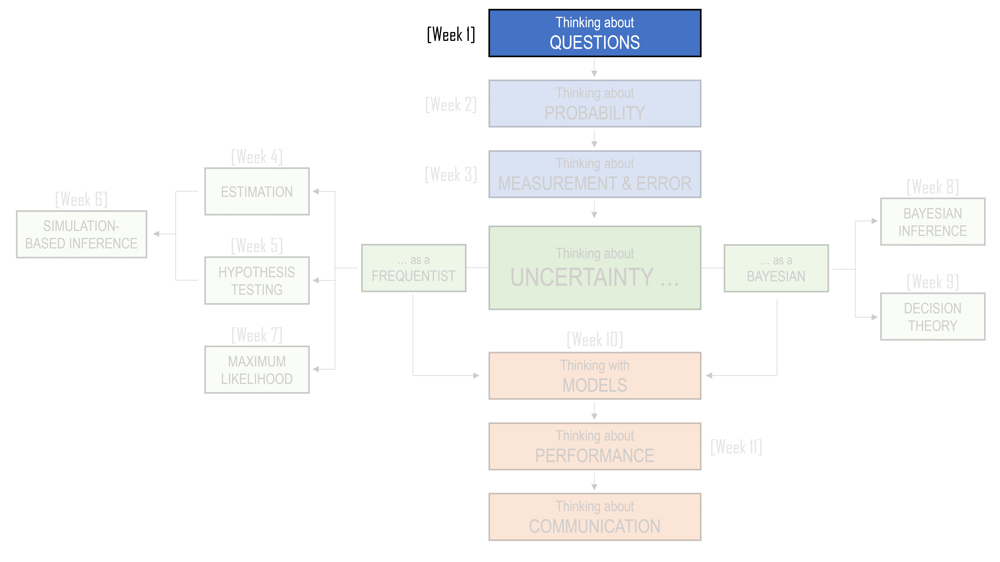
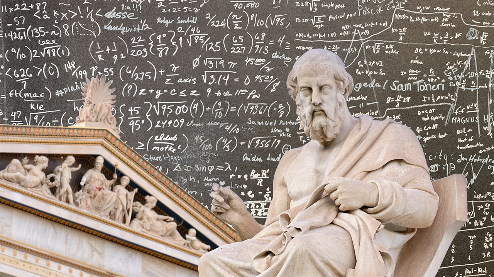
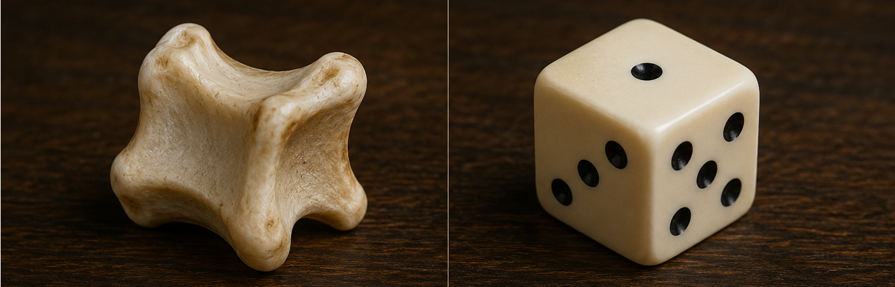
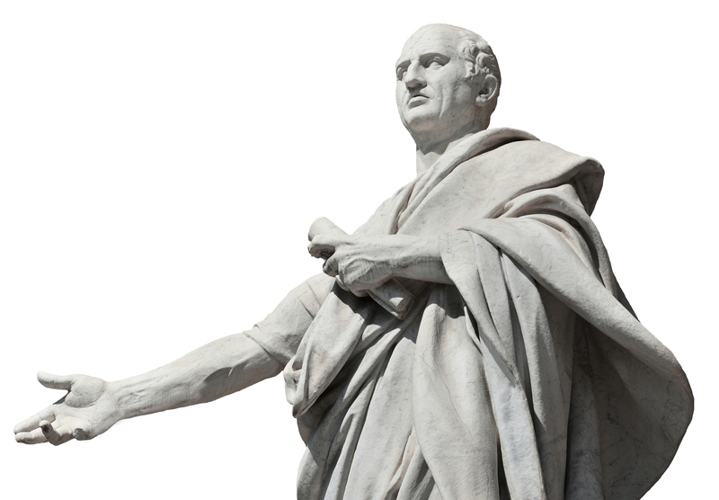
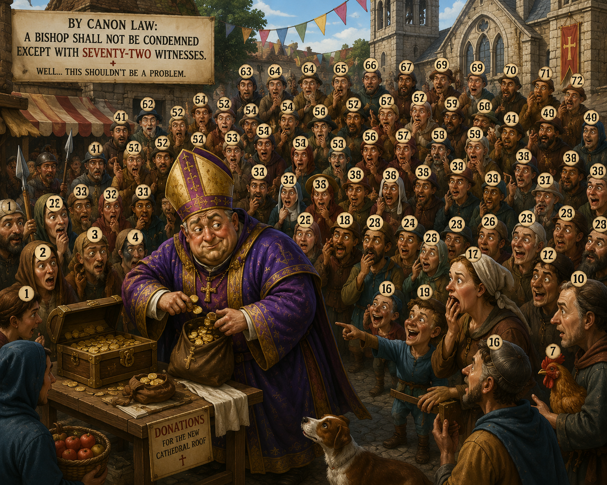

```{r, include=FALSE}
library(tidyverse)
library(flextable)
library(webexercises)
library(gt)
```

::: callout-note
## Learning Objectives

By the end of this chapter, you should be able to:

1.  Explain why statistical thinking begins with asking clear and useful questions.
2.  Distinguish between reasoning before an outcome is known and reasoning after an outcome has occurred.
3.  Describe the relationship between what could have happened and what did happen.
4.  Explain why probability provides a language for uncertainty, rather than a guarantee of certainty.
5.  Recognise how vague expressions of uncertainty, such as “unlikely” or “a fair chance”, can lead to misunderstanding.
6.  Explain why rare events are not impossible, and why rare descriptions are not necessarily unique.
7.  Use simple probability rules to reason about uncertain events, including addition, multiplication, overlap, and independence.
8.  Explain why pieces of evidence should not be combined without considering whether they are independent.
9.  Identify when a probability calculation answers the wrong question.
10. Reframe intuitive questions into better statistical questions involving uncertainty, evidence, comparison, assumptions, and process.
:::

<center>

```{r, echo=FALSE}
#| classes: .enlarge-image

```

</center>

<br>

## Three Boats, Many Possible Futures

After the Vietnam War (1975), millions of Vietnamese people left the country, many as refugees. A large number fled by sea and became known as the Vietnamese boat people. They travelled in crowded and often fragile boats, hoping to reach refugee camps in places such as Hong Kong, Malaysia, Indonesia, Thailand, or the Philippines. From there, some were resettled in countries such as Australia, the United States, Canada, and France.

The journeys were dangerous. Boats faced storms, hunger, dehydration, mechanical failure, piracy, and the possibility of being turned away before reaching land.

<center>

```{r}
#| fig-cap: "Image Source: PH2 Phil Eggman"
#| echo: false


```

</center>

This history is also part of my own family history, even though it happened before I was born.

More than 70 members of my extended family attempted to flee Vietnam by boat. They did not all travel together. Instead, the family split into three groups, across three different boats, each heading toward a different destination. This decision was not accidental. The reasoning was painfully simple: if the whole family travelled on one boat, then everyone would share the same fate. If that boat reached safety, everyone survived. If that boat was lost, everyone was lost.

During a family dinner, one of my uncles was recalling the events of that day and gave me a simple explanation for the decision to split across three boats:

> "This way, we have a higher chance of at least some family members surviving."

That sentence is about probability, although nobody needed a formula to understand it. It is about uncertainty, risk, and the terrible logic of making decisions when every option is dangerous.

So how did this strategy work out for my family?

- Two boats made it safely to different refugee camps. From there, one side of the family was eventually sent to America, and the other to Australia.
- To this day, we have no information about those on the third boat. No one knows what happened: whether they sank at sea, were attacked by pirates, or met some other fate that was never recorded and never returned to us as an answer.

My grandmother once told me that:

> "The decision about who went on which boat had nothing to do with you. After all, you did not exist yet. But if that decision had gone differently, you would may have been born."

After the fact, the story sounds fixed: two boats made it, one did not. But before the journey, nothing was fixed. All three boats might have made it. None might have made it. The boat carrying the people who would later become my parents might not have made it. Another branch of the story might have led to a world in which I was never born.

This is a painful way to begin a statistics chapter. But it is also an honest one. Statistics is not only about games of chance or classroom examples. It is about how we think when outcomes are uncertain and the stakes are real.

The decision to split across three boats shows one of the deepest ideas in statistical thinking: uncertainty is not just something we calculate after the fact. It shapes decisions before we know the outcome. Splitting the family across three boats did not remove the danger. It did not make the sea safer, the weather calmer, or the journey fairer. But it changed the structure of the risk. It made survival less dependent on a single outcome.

When we study probability, we often ask:

> What could happen?

When we study data, we often ask:

> What did happen?

Statistical thinking asks us to hold both questions together. We look at what happened, but we also try to understand what else might have happened, how likely different outcomes were, and what decisions made sense under uncertainty. That is why this chapter begins not with a formula, but with a question.

> How do we think clearly when we do not know what will happen?

## Before We Know the Outcome

Once we know what happened, it is tempting to tell the story as if it could only have happened that way.

> Two boats made it. One boat did not. One branch of the family was eventually sent to America. Another branch was eventually sent to Australia. The people on the third boat were never heard from again.

Looking backwards, the outcome feels fixed. It becomes the story. This happened, then that happened, and then this is where we ended up. But that is not how uncertainty feels before the outcome is known.

Statistics often begins in the space between what could happen and what did happen. Before the outcome, we face a set of possibilities. After the outcome, we observe only one of them. The difficulty is that decisions must usually be made before we know which possibility will become real.

This is true in ordinary situations as well as extraordinary ones.

- Before a doctor recommends a treatment, they do not know exactly how a particular patient will respond.
- Before a student sits an exam, they do not know exactly which questions will appear.
- Before a business launches a product, it does not know how customers will react.
- Before a government introduces a policy, it does not know exactly what effects the policy will have.
- Before we collect data, we do not know exactly what pattern the data will show.

In each case, there is a difference between asking the question before the outcome and asking it afterwards.

After an exam, a student might say:

> I should have studied that topic more.

But before the exam, the question was different:

> Given limited time and uncertainty about what will be assessed, how should I decide what to study?

After a patient improves, it may be tempting to say:

> The treatment worked.

But before comparing that patient with what might have happened otherwise, the better question is:

> Did the patient improve because of the treatment, or would they have improved anyway?

After an investment rises in value, someone might say:

> It was obviously a good investment.

But before the outcome was known, the better question was:

> Was this a good decision given the risks and information available at the time?

This distinction matters because good outcomes do not always come from good decisions, and bad outcomes do not always come from bad decisions. Sometimes a risky decision works out. Sometimes a careful decision ends badly. Judging a decision only by its outcome can be misleading, because it ignores the uncertainty that existed at the time the decision was made.

Statistical thinking asks us to resist that temptation. It asks us to imagine the range of outcomes that could have occurred, not only the one that did occur. It asks us to think about how likely different outcomes were, what evidence was available at the time, and whether the decision made sense before the result was known.

This is why probability matters. Probability gives us a language for talking about possible outcomes before we know which one will happen. But statistics is not only about probability. It is also about data. Once something has happened, data give us traces of the outcome. We can count, measure, compare, and model what we observe. But data always arrive after some process has already taken place. They show us what happened, not everything that could have happened.

Likewise, a dataset is not the whole story. It is one realised version of a larger set of possibilities.

This unit is about learning how to think in that space. It is about using probability to reason about what could happen, using data to understand what did happen, and using statistical methods to connect the two. Along the way, we will learn technical tools: sample spaces, simulations, confidence intervals, hypothesis tests, regression models, and other methods. But the tools are not the main point. The main point is learning how to ask clearer questions when the world is uncertain.

That means asking questions such as:

> What are the possible outcomes?

> What evidence do we have?

> What are we comparing?

> How much variation is there?

> Could this pattern have occurred by chance?

> What assumptions are we making?

> What would have happened otherwise?

These questions are the foundation of the unit. The formulas and methods we learn later are ways of answering them more carefully.

That is why, throughout this unit, we will keep returning to two questions:

> What could have happened?

and

> What did happen?

The first question asks us to think about possibility, uncertainty, and chance. The second asks us to look carefully at evidence. Statistical thinking begins when we learn to hold these questions together.

If we focus only on what could have happened, we may become lost in speculation. If we focus only on what did happen, we may treat the observed outcome as inevitable. Statistics lives between these extremes. It uses data from the world that did happen to reason about uncertainty, variation, and the worlds that might have happened instead.

This is one reason the first question we ask is rarely the final question we need.

We may begin with:

> What happened?

But often we need to ask:

> What else could have happened?

We may begin with:

> Did this decision work out?

But often we need to ask:

> Was this a good decision given what was known at the time?

We may begin with:

> Is this result surprising?

But often we need to ask:

> Surprising compared with what possibilities?

We may begin with:

> Can we see a pattern?

But often we need to ask:

> Could this pattern have appeared just by chance?

The goal of statistics is not to remove uncertainty from life. It cannot do that. The goal is to help us think more clearly when uncertainty is present.

And that begins by learning to ask better questions.

## A First Language for Uncertainty

Learning to ask better questions requires a language for uncertainty. In everyday life, we often speak about uncertainty vaguely. We say that something is *unlikely*, *possible*, *risky*, *a good chance*, *a long shot*, or *almost certain*. These words are useful, but they can also be slippery. One person’s *unlikely* might be another person’s *still worth worrying about.* One person’s *good chance* might mean 60 percent, while another person might use the same phrase for 90 percent.

::: callout-note
### A cautionary tale about expressing uncertainty

After Fidel Castro’s forces came to power in Cuba in 1959, the CIA worked with Cuban exiles on a plan to remove the new government and replace it with one more favorable to the United States. When John F. Kennedy became president in January 1961, the invasion plan was already far advanced.

<center>

```{r}
#| fig-cap: "Image Source: https://www.bbc.com/news/"
#| echo: false


```

</center>

However, the US Joint Chiefs of Staff were doubtful about its prospects and estimated its chance of success at only about 30%. In a report prepared for Kennedy, Brigadier General David Gray expressed this as

> “a fair chance.”

Kennedy, however, appears to have understood the phrase more optimistically, as suggesting that the operation had a reasonable likelihood of success. He later approved the invasion. On 17 April 1961, around 1,500 Cuban exiles landed at the Bay of Pigs on Cuba’s southern coast, where they encountered fierce resistance led by Castro. More than one hundred were killed and most of the remaining fighters were captured. The failed invasion was a major humiliation for the United States and helped push Cuba closer to the Soviet Union, contributing to the tensions that culminated in the Cuban Missile Crisis the following year.

Years later, General Taylor carried out an enquiry of this disaster and reported

> "There is a time when you can’t advise by innuendos and suggestions. You have to look him in the eye and say, “I think it’s a lousy idea, Mr President. The chances of us succeeding are about one in ten.”'
:::

Probability gives us a more careful language. It does not remove uncertainty, and it does not guarantee that we will make the right decision. What it does is help us organise our thinking. It asks us to be clearer about what could happen, how likely different outcomes are, and what assumptions we are making when we reason about an uncertain situation.

::: callout-important
### Note about probability

Note: we will cover more concepts about probability in Chapter 2 (Thinking about Probability), but it will be good to briefly introduce it here.
:::

## The Ancient Greeks: Masters of certainty, not uncertainty

It may seem strange that probability developed so late in human history. People have always faced uncertainty. They have always gambled, made risky decisions, interpreted signs, and wondered what the future might bring. So why did it take so long for probability to become a formal part of mathematics? One useful place to begin is ancient Greece.

The ancient Greeks made extraordinary contributions to mathematics. Much of the style of mathematics we still learn today comes from them: definitions, axioms, logical arguments, proofs, theorems, and then more proofs. Greek mathematics aimed at certainty. A theorem in geometry was not a guess, a pattern, or a rough guide. It was something to be demonstrated through reason.

<center>

```{r}
#| fig-cap: "Image Source: Letters and Science"
#| echo: false


```

</center>

Euclid’s geometry is the classic example. Starting from a small number of assumptions, Greek mathematicians proved results about lines, angles, triangles, circles, and other shapes. Their work was so powerful that it helped people reason about the shape of the Earth and even estimate its size. This was mathematics as certainty: begin with agreed foundations, follow the logic carefully, and arrive at a conclusion that must be true.

But probability asks for a different kind of thinking.

Probability is not usually about what must happen. It is about what might happen. It is about situations where several outcomes are possible and we do not know in advance which one will occur. That makes probability feel different from geometry. A geometric proof promises certainty. A probability statement accepts uncertainty and tries to reason within it.

That distinction helps explain why the Greeks, despite their mathematical brilliance, did not develop a theory of probability. They had games of chance, but they did not turn those games into a formal mathematics of chance.

Instead of modern dice, the Greeks used objects called astragali. These were made from the heel bones of animals. They could be tossed in games, somewhat like dice, although they were not symmetrical in the way modern dice are. Different sides were not equally likely to land face up. Some outcomes were more common than others.

<center>

```{r}
#| echo: false


```

</center>

<br>

This is already a probability problem. A modern statistician might ask:

> What are the possible outcomes of an astragalus toss?

and:

> Are those outcomes equally likely?

and:

> If we toss several astragali, how often should different combinations occur?

But that is not how the Greeks generally approached the problem. They used astragali in games and in religious practices, including attempts to seek guidance from oracles. The toss was not necessarily seen as the result of a random process with regularities that could be studied. It might instead be interpreted as a sign, a message, or the will of the gods. If an outcome is understood as divine will, then probability is not the natural question to ask. The question is not:

> How often would this outcome occur in repeated tosses?

The question becomes:

> What does this outcome mean?

This is a very different way of thinking.

There was also a philosophical obstacle. Greek mathematics valued certainty. Probability, by contrast, deals in uncertainty, likelihood, and partial knowledge. To a mind trained to value proof, a probabilistic argument may look weak or suspicious. It does not say, “This must be true.” It says something more modest: “Given what we know, this is more likely than that.”

But in real life, that modest kind of reasoning is often exactly what we need.

When we ask

- whether it will rain,
- whether a treatment will help,
- whether a witness is reliable,
- whether a pattern in data is surprising, or
- whether a decision is worth the risk,

we are usually not in the world of geometric certainty. We are in the world of uncertain evidence and possible outcomes. This is the world probability was built for.

So the lesson from the Greeks is not that they were bad mathematicians. The opposite is true. They were so successful at one kind of mathematics that another kind of reasoning remained underdeveloped. Geometry gave them a language for certainty. Probability would later become a language for uncertainty.

In statistics, we rarely get the kind of certainty found in a geometric proof. We work with data that are incomplete, measurements that are imperfect, samples that vary, and conclusions that carry uncertainty. Our task is not to pretend that uncertainty has disappeared. Our task is to reason carefully while uncertainty remains. This is why probability is more than a calculation. It is a different intellectual habit. It teaches us to ask questions such as:

> What outcomes are possible?

> Are they equally likely?

> What assumptions are we making?

> What would we expect to happen over many repetitions?

> How should we change our judgement when we receive new evidence?

These are not questions of pure certainty. They are questions for a world in which the future is not yet known, the evidence is incomplete, and several outcomes remain possible.

## The Ancient Romans and The Problem of Half-Truths

The Ancient Greeks were drawn to mathematics as a search for certainty. They gave us geometry, proof, axioms, and the ideal of conclusions that follow necessarily from first principles.

The Romans were different. They were less interested in mathematics as abstract beauty and more interested in mathematics as a practical tool. They wanted measurement, counting, engineering, administration, military planning, and law. That practical orientation matters for the history of probability.

Probability does not usually begin with certainty. It begins when certainty is unavailable. It begins when we have partial information, conflicting testimony, incomplete evidence, and decisions that must be made anyway. In that sense, the Roman world was closer to the world of statistics than the Greek world of geometry. The Romans were not asking only:

> What can be proved with certainty?

They were also asking:

> What should we believe when the evidence is incomplete?

That is a statistical question.

One of the most important Roman figures in this story is Marcus Tullius Cicero. Cicero was a statesman, lawyer, philosopher, and writer who lived in the first century BCE. He was not a mathematician in the Greek sense, but he understood something deeply important about uncertainty: life often requires judgement before proof is complete.

<center>

```{r}
#| fig-cap: "Marcus Tullius Cicero"
#| echo: false


```

</center>

Cicero argued against the idea that unusual gambling outcomes should automatically be interpreted as divine intervention. If someone plays a game often enough, rare events will sometimes occur. A surprising throw does not necessarily mean that the gods have intervened. It may simply be the kind of thing that happens when chance is allowed to operate repeatedly. This is a simple idea, but it is a powerful one.

Even today, people often treat rare events as if they must have special explanations. Someone wins the lottery and says the number came to them in a dream. A team wins several games in a row and commentators talk about momentum. A student performs unusually well on one assessment and we may be tempted to say they have suddenly “figured it out.” Sometimes there is a real explanation. But sometimes randomness produces streaks, clusters, surprises, and coincidences.

Cicero’s insight was that chance does not mean chaos. An event can be unpredictable in a particular instance and still be understandable as part of a broader pattern.

For example, suppose a fair die is rolled. The probability of rolling a six is:

$$P(\text{six}) = \frac{1}{6}$$

Rolling a six is uncertain. Before the die is rolled, we do not know whether it will happen. But if the die is rolled many times, it would not be surprising to see sixes appear again and again. A six is not mysterious simply because it was uncertain beforehand.

Even two sixes in a row do not require a supernatural explanation. If the rolls are independent, then:

$$P(\text{six and then six}) = \frac{1}{6} \times \frac{1}{6} = \frac{1}{36}$$

A probability of (1/36) is small, but it is not impossible. If many people roll dice many times, outcomes with probability (1/36) will occur regularly somewhere. Probability helps us see that a rare event is not the same as an impossible event, and that a surprising outcome is not automatically evidence of a hidden cause.

The Roman contribution becomes even more interesting when we turn to law.

- Legal decision-making is full of uncertainty.
- Witnesses may disagree.
- Evidence may be incomplete.
- A person may seem suspicious but not certainly guilty.
- A document may be partly reliable.
- A testimony may be plausible but not decisive.
- Courts must often make decisions in the space between ignorance and certainty.

In this setting, the Romans developed the idea of partial proof. A piece of evidence might not establish a claim completely, but it might still count for something. It might be, in effect, a *half proof*.

At first, this seems like a sensible idea. Not all evidence has the same strength.

- One witness might be uncertain. Two witnesses might be more convincing.
- A confession might be stronger than a rumour.
- Physical evidence might be stronger than hearsay.

Even today, we often speak this way. We say that evidence is weak, strong, suggestive, compelling, or inconclusive. The Romans were trying to do something recognisably statistical: they were trying to reason with degrees of uncertainty.

The problem was how to combine those degrees. In some versions of Roman legal reasoning, two half proofs could be treated as one complete proof. Symbolically, this sounds like:

$$\frac{1}{2} + \frac{1}{2} = 1$$

As arithmetic, that is true. But as a way of combining uncertain evidence, it is not generally correct.

The mistake is subtle. A half proof is not the same kind of object as half a loaf of bread. If I have half a loaf and you give me another half, I have a whole loaf. But if I have one uncertain piece of evidence and then receive another uncertain piece of evidence, I do not necessarily have certainty. I may have stronger evidence, but not perfect proof.

To see why, suppose each piece of evidence has a 50 percent chance of being correct. That is, each has a 50 percent chance of being wrong. If the two pieces of evidence are independent, then the probability that both are wrong is:

$$P(\text{both wrong}) = \frac{1}{2} \times \frac{1}{2} = \frac{1}{4}$$

So the probability that at least one of them is right is:

$$P(\text{at least one right}) = 1 - P(\text{both wrong})$$

$$= 1 - \frac{1}{4}$$

$$= \frac{3}{4}$$

Two independent half proofs therefore do not produce certainty. They produce something closer to three-quarters proof, under these assumptions. This is an important distinction.

The Roman rule treated partial evidence as if it could simply be added until certainty was reached. Probability teaches us that uncertain evidence does not usually work that way. If each piece of evidence can be wrong, then even several pieces of evidence may leave some possibility of error.

For example, suppose three independent pieces of evidence each have a 50 percent chance of being wrong. The probability that all three are wrong is:

$$\left(\frac{1}{2}\right)^3 = \frac{1}{8}$$

So the probability that at least one is right is:

$$1 - \frac{1}{8} = \frac{7}{8}$$

That is stronger than $\frac{3}{4}$, but still not certainty.

With four such pieces of evidence:

$$1 - \left(\frac{1}{2}\right)^4 = 1 - \frac{1}{16} = \frac{15}{16}$$

Again, the evidence becomes stronger, but it does not become perfect. No finite number of uncertain pieces of evidence becomes absolute certainty in this simple model. Each additional piece can reduce uncertainty, but it does not remove it entirely.

This gives us one of the key lessons of probability:

> Evidence can accumulate without becoming certainty.

In statistics, we often work with conclusions that are well supported but not guaranteed. A confidence interval may be narrow, but it does not make error impossible. A hypothesis test may produce a small p-value, but it does not prove a claim with certainty. A model may fit the data well, but it is still a model. A sample may strongly suggest something about a population, but the sample is not the population.

The Roman idea of half proofs is therefore useful not because it was mathematically correct, but because it shows why probability is needed. Once we admit that evidence can be partial, we need rules for reasoning with partial evidence.

We need to ask:

> How strong is each piece of evidence?

> Are the pieces of evidence independent?

> Are they pointing to the same conclusion?

> Could they share the same source of error?

> Does one piece of evidence change how we should interpret another?

These questions matter because evidence is not always independent.

Suppose two witnesses give the same description of a person leaving the scene of an accident. If the witnesses saw the event from different positions, did not speak to each other, and had no shared source of information, then their agreement may be quite informative. But if one witness heard the description from the other, then the second testimony is not independent evidence. It may sound like two pieces of evidence, but it is closer to one piece repeated twice.

The same issue appears in data analysis. Suppose two variables in a dataset seem to support the same conclusion. Before we treat them as separate evidence, we need to ask whether they are genuinely separate. Are they measuring different things, or are they two versions of the same thing? For example, a person’s income and the value of their house may both tell us something about socioeconomic status, but they are not independent pieces of information. Knowing one changes what we expect about the other.

This is why independence is an important idea in probability.

If two events (A) and (B) are independent, then knowing that one occurred does not change the probability of the other. In that case, we can multiply probabilities:

$$P(A \text{ and } B) = P(A)P(B)$$

But if the events are not independent, this formula does not apply in that simple form. We must think more carefully.

The Roman half-proof idea therefore leads us directly to another important habit in statistical thinking:

> Before combining evidence, ask whether the evidence is genuinely separate.

This habit will appear throughout the unit. It appears when we study probability. It appears when we analyse survey data. It appears when we compare groups. It appears when we think about experiments. It appears when we build regression models. In each case, we need to understand not only what evidence we have, but how that evidence was produced and how the pieces of evidence relate to one another.

The Romans saw something important: uncertainty comes in degrees. A claim does not have to be either completely proved or completely unsupported. Evidence can be partial. Some claims are more plausible than others. Some testimony is stronger than other testimony. Some conclusions are better supported than others.

But the Romans also show us the danger of having the right intuition without the right rules. They recognised half-truths, but they did not yet have the mathematics to combine them properly.

::: callout-note
#### Roman Evidence

As an example, the ancient Romans had established the following rule for evidence against members of the church:

“*A bishop should not be condemned except with seventy-two witnesses. A cardinal priest should not be condemned except with forty-four witnesses A cardinal deacon of the city of Rome without thirty-six witnesses A subdeacon, acolyte, exorcist, lector, or doorkeeper except with seven witnesses.*”

<center>

```{r}
#| fig-cap: "What happens to the bishop is there are only 71 witnesses?"
#| echo: false


```

</center>
:::

This is why probability matters. It gives structure to uncertainty. It helps us avoid treating partial evidence as certainty. It helps us see when evidence should be added, when probabilities should be multiplied, and when a calculation depends on an assumption such as independence.

::: callout-note
#### Case Study: Timothy Durham

DNA evidence can sound almost impossibly strong. Imagine a jury hears the following statement:

> The DNA profile from the crime scene matches the suspect.

At first, this can sound decisive. DNA feels scientific, precise, and difficult to argue against. But the case of Timothy Durham shows why statistical thinking asks us to slow down. In 1993, Timothy Durham was convicted in Oklahoma for the rape of an 11-year-old girl. The evidence against him included eyewitness identification, hair comparison evidence, and DNA evidence. A laboratory analyst testified that a genetic marker found in the crime-scene sample matched one of Durham’s markers. This did not uniquely identify him, but it was used to include him in the suspect pool.

The DNA evidence sounded powerful because DNA evidence is often presented using extremely small probabilities. A jury might hear something like:

> The probability that a randomly chosen person would match this DNA profile is less than 1 in 1 billion

A number like this can feel overwhelming. If the chance of a random match is only:

$$\frac{1}{1,000,000,000}$$

then it is tempting to think that the suspect must be guilty.

In Durham’s case, however, there was also evidence pointing in the other direction. Eleven defence witnesses testified that he was in Dallas, Texas, at a skeet shooting competition when the crime occurred. Records were presented showing purchases he had made there, and a handwriting expert confirmed that the signatures were his. Despite this evidence, the jury believed the DNA evidence (or the number of 1 in one billion) was stonger. They convicted him. He was sentenced to prison terms totaling more than 3,000 years.

But there was another statistic that was not presented in this case: the probability of laboratory error. A DNA result can also be wrong because of the testing process itself. Samples can be mixed up, contaminated, incompletely separated, mislabelled, misread, or incorrectly reported. These errors may be rare, but they may be much more common than a random DNA match.

The true estimate for lab error is unknown, but experts place it around 1%. Suppose we compare the two possible sources of error:

```{r}
#| echo: false

dna <- data.frame(
  `Possible source of error` = c(
    "Random DNA match",
    "Laboratory error"
  ),
  Probability = c(
    "1/1,000,000,000",
    "1/100"
  ),
  check.names = FALSE
)

dna |>
  gt::gt() |>
  gt::cols_align(
    align = "center",
    columns = everything()
  )
```

A common mistake is to think that the overall error rate must lie somewhere between these two numbers. But if either kind of error could produce a false match, then we need the probability of one error or the other error occurring.

This is an addition-rule problem.

Let:

$$A = \text{random DNA match}$$

and:

$$B = \text{laboratory error}$$

The general addition rule is:

$$P(A) + P(B) - P(A \text{ and } B)$$

In this simplified example, both errors are rare, and the probability that both happen together is very small. So we can approximate:

$$P(\text{false match})
\approx
P(\text{random match}) + P(\text{lab error})$$

Substituting the values:

$$P(\text{false match})
\approx
\frac{1}{1{,}000{,}000{,}000}
+
\frac{1}{100}
\approx
\frac{1}{100}$$

The recalculation changes how we read the evidence. The “1 in 1 billion” figure sounds overwhelming, but it only answers one question: how unlikely a random DNA match would be. It does not tell us how likely it is that the test was mishandled, misinterpreted, or incorrectly reported.

Years later, further DNA testing showed that Durham was not the source of the semen found on the victim’s swimsuit. The earlier DNA result had been misleading because the laboratory had failed to completely separate the male DNA from the female DNA during testing. Durham was released after spending nearly four years in prison.

**Note**: This does not mean DNA evidence is weak. In fact, DNA evidence was what eventually helped show that Durham had been wrongly convicted. The lesson is more careful than that. A DNA statistic must be connected to the right question. The first question might be:

> How rare is a random DNA match?

But the better statistical question is:

> What are all the ways this DNA evidence could be wrong, and how likely are those errors?
:::

::: callout-note
#### Case Study: People v Collins

In People v. Collins (1964), a couple was accused of robbery. The evidence against them was weak. The victim could not confidently identify the accused woman, and another witness could not confidently identify the accused man. But the couple appeared to match a set of features described by witnesses.

The prosecution presented a probability argument. The couple, they claimed, matched a combination of characteristics:

> a partly yellow car, a man with a moustache, a man with a beard, a woman with a ponytail, a woman with blond hair, and an interracial couple in a car.

The prosecution assigned probabilities to these features and multiplied them together:

- Partly yellow car (1/10)
- Man with moustache (1/4)
- Man with beard (1/10)
- Woman with ponytail (1/10)
- Woman with blond hair (1/3)
- Interracial couple in car (1/1000)

The prosecution treated these characteristics as independent and multiplied the probabilities:

$$\frac{1}{10}
\times
\frac{1}{4}
\times
\frac{1}{10}
\times
\frac{1}{10}
\times
\frac{1}{3}
\times
\frac{1}{1000} = \frac{1}{12000000}$$

That is, the prosecution suggested that only about 1 couple in 12 million would match the description.

At first glance, this seems powerful. If only 1 couple in 12 million fits the description, then surely this must be the guilty couple.

But there are two major problems.

The first problem is independence. The multiplication rule:

$$P(A \text{ and } B) = P(A)P(B)$$

only works in this simple form when (A) and (B) are independent.

Two events are independent when knowing that one happened does not change the probability of the other.

But some of the characteristics in the Collins case were not independent. For example, “man with beard” and “man with moustache” are related. If a man has a beard, the probability that he has a moustache is not the same as it would be for a randomly selected man. Many bearded men also have moustaches.

So multiplying these probabilities as if they were unrelated exaggerates how rare the combined description is.

The second problem is the question being answered. The prosecution’s calculation tried to answer something like:

> What is the probability that a randomly selected couple would match this description?

But the more relevant question was:

> Given that a couple matches this description, what is the probability that they are the guilty couple?

These are not the same question.

To see why, suppose the relevant area has several million people. Even if only 1 couple in 1 million matched the description, we might still expect a few couples in the area to match it. If three couples match the description, then the description alone does not tell us which one committed the crime.

In that case, the probability that a matching couple is the guilty couple might be closer to:

$$\frac{1}{3},$$

and not:

$$\frac{1}{1{,}000{,}000}$$

The better question is therefore not:

> How rare is this description?

The better question is:

> How many people could match this description, and what evidence connects this particular person to the crime?

This case is a powerful example of why statistical thinking begins with questions, not calculations. A calculation can be mathematically impressive and still answer the wrong question.
:::

## Probability as Disciplined Questioning

The examples in this chapter may seem very different from one another. A family fleeing Vietnam by boat, Greek geometry, Roman law, DNA evidence, and a robbery trial in California do not obviously belong in the same conversation. But they are connected by a common problem: *how should we reason when certainty is unavailable?*

The ancient Greeks remind us that some forms of mathematics are built around certainty. In geometry, if the assumptions are accepted and the proof is valid, the conclusion follows. The answer is not likely or unlikely. It is true within the system. Statistics usually lives in a different world.

In statistics, we often work with incomplete information, imperfect measurements, uncertain processes, and conclusions that may be strongly supported without being absolutely guaranteed. We ask questions about what might happen, what did happen, and what could have happened instead. We use data, but data rarely speak for themselves. They must be interpreted through questions, assumptions, and comparisons.

This is why probability matters. Probability gives us a language for uncertainty, but it also gives us something more important: discipline. It forces us to slow down and ask what kind of uncertainty we are dealing with. Are we thinking about one outcome or many possible outcomes? Are we adding probabilities or multiplying them? Are the pieces of evidence independent, or are they connected? Are we asking about the probability of the evidence, or the probability of the explanation?

These distinctions can seem small, but they can completely change the conclusion.

In the Roman example, the first question might be:

> Do two half-proofs make one whole proof?

But the better question is:

> If each piece of evidence is uncertain, how should the uncertainty be combined?

In the DNA example, the first question might be:

> How rare is a random DNA match?

But the better question is:

> What are all the ways this DNA evidence could be wrong?

In *People v Collins*, the first question might be:

> How rare is this combination of characteristics?

But the better question is:

> How many people in the relevant population might share these characteristics, and what evidence connects this particular couple to the crime?

In each case, the issue is not simply whether numbers are used. The issue is whether the numbers answer the right question.

This is one of the most important lessons in statistics. A calculation can be correct but irrelevant. A probability can be precise but misleading. A result can look impressive because it is written mathematically, while still depending on weak assumptions or an incomplete understanding of the situation.

The purpose of statistical thinking is not to make us suspicious of every number. It is to make us curious about how numbers are produced and what they actually mean.

A useful way to summarise the habit is this:

```{r}
#| echo: false

questions <- data.frame(
  `Situation` = c(
    "Rare event",
    "Multiple possible causes",
    "Several pieces of evidence",
    "Detailed story",
    "Matching description",
    "Observed pattern in data"
  ),
  `First question` = c(
    "Is this surprising?",
    "Which cause sounds most plausible?",
    "Do we have more evidence?",
    "Does this story sound convincing?",
    "How rare is this description?",
    "Can we see a pattern?"
  ),
  `Better statistical question` = c(
    "Surprising compared with what process?",
    "What are all the possible causes, and how likely is each?",
    "Are the pieces of evidence independent?",
    "What has to be true for this story to be correct?",
    "How many people might match this description?",
    "Could this pattern have appeared by chance?"
  ),
  check.names = FALSE
)

questions |>
  gt::gt() |>
  gt::cols_align(
    align = "left",
    columns = everything()
  )
```

This table captures the main theme of the chapter. Statistical thinking often begins when we replace an intuitive question with a more careful one.

That does not mean the first question is foolish. Often, the first question is natural. If something unusual happens, of course we ask whether it is surprising. If two witnesses agree, of course we treat that as important. If DNA evidence matches a suspect, of course we pay attention. If a pattern appears in data, of course we want to know whether it means something.

The problem is that natural questions are often incomplete. A rare event may be surprising under one process but ordinary under another. Two witnesses may provide strong evidence if they are independent, but much weaker evidence if one influenced the other. A DNA match may be powerful evidence, but only if we also consider laboratory error, contamination, and the possibility of misreporting. A pattern in data may reflect a real relationship, or it may be the kind of pattern that appears when many comparisons are made.

Probability helps us make these distinctions. It asks us to identify the possible outcomes. It asks us to think about the process that could have produced the evidence. It asks us to consider whether events overlap, whether evidence is independent, and whether a conclusion follows from the calculation being presented.

This is why the formulas matter, but only after the question is clear. This is the discipline that probability brings to statistical thinking. It does not simply hand us answers. It gives us a way to inspect our reasoning.

Before we add probabilities, we ask:

> Are these events mutually exclusive, or do they overlap?

Before we multiply probabilities, we ask:

> Are these events independent, or are they connected?

Before we treat a rare match as proof, we ask:

> Rare in what population?

Before we accept a vivid explanation, we ask:

> Has the added detail made the claim more likely, or only more persuasive?

Before we interpret a result, we ask:

> What process could have produced this evidence?

These questions are not separate from statistics. They are statistics. This is the reason the chapter is called *Thinking about Questions*. The point is not merely to learn a list of probability rules. The point is to learn how probability changes the questions we ask.

By the end of this unit, you will have learned many technical tools: graphs, simulations, probability models, confidence intervals, hypothesis tests, regression models, and more. But the tools only become useful when they are attached to a clear question. A statistical method cannot rescue a badly framed question. It can only answer the question it is given.

So before we calculate, we pause.

> Statistics does not begin with a formula. It begins with a better question.

## Coding the Ideas in R

So far, this chapter has focused on statistical thinking: possible outcomes, uncertainty, evidence, independence, rare events, and better questions. We can also use R to make these ideas more concrete. The goal of this section is not to turn probability into programming. The goal is to show how simple code can help us organise uncertainty. R allows us to define possible outcomes, assign probabilities, calculate simple results, and simulate uncertain processes many times.

Because this is the first chapter, we will move slowly. Each example introduces only a small number of functions.

```{r}
#| echo: false

r_functions <- data.frame(
  Function = c(
    "c()",
    "data.frame()",
    "tibble()",
    "mutate()",
    "summarise()",
    "sample()",
    "mean()",
    "count()",
    "gt()",
    "ggplot()"
  ),
  `What it does` = c(
    "Combines values into a vector.",
    "Creates a rectangular table of data.",
    "Creates a tidyverse-style table of data.",
    "Adds or changes columns in a dataset.",
    "Summarises a dataset into one or more values.",
    "Randomly samples values.",
    "Calculates the average of a set of values.",
    "Counts how many times each value appears.",
    "Turns a table into a nicer-looking output table.",
    "Creates a plot."
  ),
  `Example use` = c(
    "c(TRUE, FALSE)",
    "data.frame(outcome = c('safe', 'lost'))",
    "tibble(simulation = 1:1000)",
    "mutate(total = boat_1 + boat_2)",
    "summarise(probability = mean(success))",
    "sample(c(TRUE, FALSE), size = 10, replace = TRUE)",
    "mean(at_least_one_survived)",
    "count(number_survived)",
    "gt(my_table)",
    "ggplot(data, aes(x = x, y = y))"
  ),
  check.names = FALSE
)

r_functions |>
  gt::gt() |>
  gt::cols_align(
    align = "left",
    columns = everything()
  )
```

You do not need to memorise all of these immediately. The aim is to see how the functions are used in context. If you would like a more detailed refresher of R/RStudio see:

- Source 1
- Source 2

### Example 1: Three boats and possible futures

In the opening, I talked about how my family split across three boats. The point was not that this removed danger. It changed the structure of the risk. To see this idea in a simple way, suppose each boat has a probability of safely arriving. This is not meant to estimate the real historical probability. It is a simplified model that helps us think about possible outcomes.

Suppose each boat has a 60% chance of arriving safely. This would mean that each boat has a 100% - 60% chance of not surviving (i.e. lost):

```{r}
p_survive <- 0.60
p_lost <- 1 - p_survive
```

Now suppose the three boats are treated as independent in this simplified model. This means that the outcome of one boat does not change the probability of what happens to another boat. The probability that all three boats are lost is:

```{r}
p_all_lost <- p_lost^3
```

The probability that at least one boat arrives safely is the opposite of all three boats being lost. We can calculate it using:

```{r}
p_at_least_one_survives <- 1 - p_all_lost
```

We can put these results into a table:

```{r}
boat_results <- data.frame(
  Quantity = c(
    "Probability one boat arrives safely",
    "Probability one boat is lost",
    "Probability all three boats are lost",
    "Probability at least one boat arrives safely"
  ),
  Probability = c(
    p_survive,
    p_lost,
    p_all_lost,
    p_at_least_one_survives
  )
)

boat_results |>
  gt::gt() |>
  gt::fmt_number(
    columns = Probability,
    decimals = 3
  )
```

The previous calculation used probability rules. Another way to explore the same idea is through simulation. A simulation uses the computer to repeat a random process many times. It lets us ask:

> If this situation happened again and again under the same assumptions, how often would different outcomes occur?

In the code below, TRUE means a boat arrives safely and FALSE means it does not. The function `sample()` randomly selects values. In the code there are four main parts:

- `c(TRUE, FALSE)` gives the possible values that can be selected;
- `size = n_sim` says how many values to select;
- `replace = TRUE` means the same value can be selected again and again;
- `prob = c(p_survive, p_lost)` gives the probabilities of selecting TRUE and FALSE.

Because p_survive = 0.60 and p_lost = 0.40, this means:

- `TRUE` is selected with probability 0.60;
- `FALSE`is selected with probability 0.40.

```{r}
set.seed(2420)

n_sim <- 10000

boat_sim <- tibble::tibble(
  simulation = 1:n_sim,
  boat_1 = sample(c(TRUE, FALSE), size = n_sim, replace = TRUE, prob = c(p_survive, p_lost)),
  boat_2 = sample(c(TRUE, FALSE), size = n_sim, replace = TRUE, prob = c(p_survive, p_lost)),
  boat_3 = sample(c(TRUE, FALSE), size = n_sim, replace = TRUE, prob = c(p_survive, p_lost))
)

boat_sim
```

Now we can add new columns to summarise each simulation. The function `mutate()` adds new columns to a dataset.

```{r}
boat_sim <- boat_sim |>
  dplyr::mutate(
    number_survived = boat_1 + boat_2 + boat_3,
    at_least_one_survived = number_survived >= 1
  )

boat_sim
```

Now we can count how many simulations had 0, 1, 2, or 3 surviving boats. The function `count()` counts how many times each value appears in a column.

```{r}
boat_sim |>
  dplyr::count(number_survived)
```

Finally, we can estimate the probability that at least one boat survives. The function `summarise()` reduces a dataset to summary values.

```{r}
boat_sim |>
  dplyr::summarise(
    estimated_probability = mean(at_least_one_survived)
  )
```

Because TRUE behaves like 1 and FALSE behaves like 0, the mean of a logical column gives the proportion of TRUE values. In this case, it gives the proportion of simulations in which at least one boat survived.

This simulated probability should be close to the value we calculated earlier:

$$1-(1-0.60)^{3}=0.936$$

The simulation will not usually match exactly, because it is based on random sampling. But with many simulations, it should be close.

### Exercise 2: Astragali and unequal probabilities

Earlier in the chapter, we discussed *astragali*: small animal bones used in ancient games of chance. They were somewhat like dice, but they were not symmetrical cubes. Because of their shape, the different sides were not equally likely to land face up. That makes astragali a useful probability example. With a fair six-sided die, each side has the same probability:

$$\frac{1}{6}$$

But with an astragalus, the possible outcomes may have different probabilities. For this example, suppose an astragalus has four possible sides, with probabilities:

```{r}
#| echo: false

astragali_probabilities <- data.frame(
  Side = c("Side 1", "Side 2", "Side 3", "Side 4"),
  Probability = c(0.10, 0.40, 0.40, 0.10)
)

astragali_probabilities |>
  gt::gt() |>
  gt::fmt_percent(
    columns = Probability,
    decimals = 0
  )
```

This means:

- Side 1 appears 10% of the time;
- Side 2 appears 40% of the time;
- Side 3 appears 40% of the time;
- Side 4 appears 10% of the time.

The probabilities still add to 1:

$$0.10 + 0.40 + 0.40 + 0.10 = 1$$

But the outcomes are not equally likely.

Now we can simulate tossing one astragalus.

```{r}
set.seed(2420)

sample(
  x = astragali_probabilities$Side,
  size = 1,
  replace = TRUE,
  prob = astragali_probabilities$Probability
)
```

A single toss is uncertain. But if we toss the astragalus many times, we should start to see a pattern. Let’s simulate 10,000 tosses.

```{r}
set.seed(2420)

n_tosses <- 10000

astragali_tosses <- data.frame(
  toss = 1:n_tosses,
  side = sample(
    x = astragali_probabilities$Side,
    size = n_tosses,
    replace = TRUE,
    prob = astragali_probabilities$Probability
  )
)

head(astragali_tosses,10)
```

Now we can count how often each side appeared.

```{r}
astragali_counts <- astragali_tosses |>
  dplyr::count(side)

astragali_counts
```

Now we can calculate the observed proportion of each side.

```{r}
astragali_counts <- astragali_counts |>
  dplyr::mutate(
    observed_proportion = n / sum(n)
  )

astragali_counts
```

We can compare the simulated proportions with the original probabilities.

```{r}
astragali_comparison <- astragali_counts |>
  dplyr::left_join(
    astragali_probabilities,
    by = c("side" = "Side")
  )

astragali_comparison
```

We can also make a simple bar chart

```{r}
ggplot(astragali_comparison, aes(x = side, y = observed_proportion)) +
  geom_col() +
  labs(
    x = "Side",
    y = "Observed proportion",
    title = "Simulated astragali tosses"
  )
```

### Example 3: Timothy Durham and lab error

In the chapter, we compared two possible sources of error in DNA evidence:

- a random DNA match;
- a laboratory error.

Here is how we can code that comparison in R.

```{r}
p_random_match <- 1 / 1000000000
p_lab_error <- 1 / 100

dna_errors <- data.frame(
  source = c("Random DNA match", "Laboratory error"),
  probability = c(p_random_match, p_lab_error)
)

dna_errors |>
  gt::gt() |>
  gt::fmt_number(
    columns = probability,
    decimals = 10
  )
```

If either a random match or a lab error could produce a false match, then we can approximate:

$$P(\text{false match})
\approx
P(\text{random match}) + P(\text{lab error})$$

In R:

```{r}
p_false_match <- p_random_match + p_lab_error

p_false_match
```

Now compare this with the lab-error probability.

```{r}
p_lab_error
```

The values are almost identical, because the random-match probability is tiny compared with the lab-error probability.

We can show the comparison in a summary table.

```{r}
dna_summary <- data.frame(
  quantity = c(
    "Random DNA match",
    "Laboratory error",
    "Approximate false-match probability"
  ),
  probability = c(
    p_random_match,
    p_lab_error,
    p_false_match
  )
)

dna_summary |>
  gt::gt() |>
  gt::fmt_number(
    columns = probability,
    decimals = 10
  )
```

We can also display the same probabilities as percentages.

```{r}
dna_summary |>
  gt::gt() |>
  gt::fmt_percent(
    columns = probability,
    decimals = 6
  )
```

This tells us that the lab-error probability is many times larger than the random-match probability.

### Example 4: People v Collins and changing assumptions

In the chapter, we saw that the prosecution in *People v Collins* multiplied several probabilities together. The calculation looked precise, but it depended heavily on the probabilities chosen and on the assumption that the characteristics were independent.

We can code the original calculation in R.

```{r}
collins <- data.frame(
  characteristic = c(
    "Partly yellow car",
    "Man with moustache",
    "Man with beard",
    "Woman with ponytail",
    "Woman with blond hair",
    "Interracial couple in car"
  ),
  probability = c(
    1 / 10,
    1 / 4,
    1 / 10,
    1 / 10,
    1 / 3,
    1 / 1000
  )
)

collins |>
  gt::gt() |>
  gt::fmt_number(
    columns = probability,
    decimals = 6
  )
```

To reproduce the prosecution’s calculation, we multiply all the probabilities.

```{r}
combined_probability <- prod(collins$probability)
```

We can convert this into a “1 in ...” number.

```{r}
one_in <- 1 / combined_probability
```

This gives the result as approximately 1 in 12 million.

```{r}
collins_result <- data.frame(
  quantity = c(
    "Combined probability",
    "Approximately 1 in ..."
  ),
  value = c(
    combined_probability,
    one_in
  )
)

collins_result |>
  gt::gt() |>
  gt::fmt_number(
    columns = value,
    decimals = 0
  )
```

The arithmetic is simple. The statistical issue is the assumption behind the arithmetic. The multiplication rule:

$$P(A \text{ and } B) = P(A)P(B)$$

only works in this simple form when the events are independent.

The original probabilities were not fixed facts. They were assumptions. We can use R to change them and see how much the final result changes.

Suppose a student thinks some of the original probabilities are too small. They might update the probabilities like this:

```{r}
collins_updated <- data.frame(
  characteristic = c(
    "Partly yellow car",
    "Man with moustache",
    "Man with beard",
    "Woman with ponytail",
    "Woman with blond hair",
    "Interracial couple in car"
  ),
  original_probability = c(
    1 / 10,
    1 / 4,
    1 / 10,
    1 / 10,
    1 / 3,
    1 / 1000
  ),
  updated_probability = c(
    1 / 8,
    1 / 3,
    1 / 5,
    1 / 6,
    1 / 2,
    1 / 500
  )
)

collins_updated
```

Now calculate the combined probability for both sets.

```{r}
original_combined <- prod(collins_updated$original_probability)
updated_combined <- prod(collins_updated$updated_probability)
```

Now convert both probabilities into “1 in ...” values.

```{r}
original_one_in <- 1 / original_combined
updated_one_in <- 1 / updated_combined
```

We can summarise the results in a table.

```{r}
assumption_comparison <- data.frame(
  version = c(
    "Original assumptions",
    "Updated assumptions"
  ),
  combined_probability = c(
    original_combined,
    updated_combined
  ),
  one_in = c(
    original_one_in,
    updated_one_in
  )
)

assumption_comparison |>
  gt::gt() |>
  gt::fmt_number(
    columns = c(combined_probability, one_in),
    decimals = 0
  )
```

The final number changes because the assumptions changed.

Now, instead of rewriting the whole table, we can update one probability at a time using `mutate()` and `case_when()`.

Suppose we want to change only the probability for “Interracial couple in car” from `1 / 1000` to `1 / 500`.

```{r}
collins_one_update <- collins |>
  dplyr::mutate(
    updated_probability = dplyr::case_when(
      characteristic == "Interracial couple in car" ~ 1 / 3,
      TRUE ~ probability
    )
  )

collins_one_update |>
  gt::gt() |>
  gt::fmt_number(
    columns = c(probability, updated_probability),
    decimals = 6
  )
```

Now calculate the new combined probability.

```{r}
one_update_combined <- prod(collins_one_update$updated_probability)

```

Changing just one assumption can noticeably change the final answer.

```{r}
single_update_comparison <- data.frame(
  version = c(
    "Original",
    "Updated interracial-couple probability"
  ),
  one_in = c(
    1 / prod(collins$probability),
    1 / prod(collins_one_update$updated_probability)
  )
)

single_update_comparison |>
  gt::gt() |>
  gt::fmt_number(
    columns = one_in,
    decimals = 0
  )
```

The point is not that the updated probabilities are correct. The point is that the conclusion depends on assumptions. In *People v Collins*, the issue was not only the final number. It was whether the calculation was answering the right question in the first place.

## Exercises

These questions are designed to help you practise the main idea of this chapter: statistical thinking begins by asking better questions. Some questions are conceptual. Others involve simple probability calculations. For now, the goal is not to master every probability technique. That will come in later chapters. The goal is to become more careful about uncertainty, evidence, assumptions, and the questions behind the calculations.

:::: callout-note
### Question 1

A student applies for three internships. After several weeks, they receive one offer and two rejections. Looking back, they say:

> "I was always going to get the second internship. It was obviously the best fit."

Before the applications were assessed, however, the outcome was unknown.

**a.** Explain the difference between asking the question before the outcome and asking it after the outcome.

**b.** Write two possible outcomes that could have happened but did not.

**c.** Why can it be misleading to judge the student's application strategy only by the final result?

::: {.callout-important collapse="true"}
### Click for Solutions

**a.** Before the outcome, the student faced uncertainty. Several outcomes were possible. After the outcome, only one result was observed, which can make the result feel inevitable.

**b.** Possible outcomes include:

- receiving no offers;
- receiving two or three offers;
- receiving an offer from a different internship;
- receiving three rejections.

**c.** It can be misleading because good outcomes do not always come from good decisions, and bad outcomes do not always come from bad decisions. The application strategy should be judged using the information available at the time, not only by the result that happened afterward.
:::
::::

:::: callout-note
### Question 2

For each of the following first questions, write a better statistical question.

```{r}
#| echo: false

q2 <- data.frame(
  Situation = c(
    "A new study technique seems to improve exam results.",
    "A football team wins five games in a row.",
    "A customer survey receives many negative comments.",
    "A medical test comes back positive.",
    "A graph shows that two variables move together."
  ),
  `First question` = c(
    "Did the technique work?",
    "Is the team unbeatable?",
    "Do customers hate the product?",
    "Does the patient have the disease?",
    "Does one variable cause the other?"
  ),
  `Better statistical question` = c("", "", "", "", ""),
  check.names = FALSE
)

q2 |>
  gt() |>
  cols_align(align = "left", columns = everything())
```

::: {.callout-important collapse="true"}
### Click for Solutions

Possible answers include:

```{r}
#| echo: false

q2_solution <- data.frame(
  Situation = c(
    "A new study technique seems to improve exam results.",
    "A football team wins five games in a row.",
    "A customer survey receives many negative comments.",
    "A medical test comes back positive.",
    "A graph shows that two variables move together."
  ),
  `First question` = c(
    "Did the technique work?",
    "Is the team unbeatable?",
    "Do customers hate the product?",
    "Does the patient have the disease?",
    "Does one variable cause the other?"
  ),
  `Better statistical question` = c(
    "Did students using the technique improve more than comparable students who did not use it?",
    "How surprising is a five-game winning streak compared with what we would expect from this team?",
    "Who responded to the survey, and are their responses representative of all customers?",
    "Given the positive test result, how likely is it that the patient has the disease?",
    "Could the association be explained by chance, confounding, or another process?"
  ),
  check.names = FALSE
)

q2_solution |>
  gt() |>
  cols_align(align = "left", columns = everything())
```
:::
::::

:::: callout-note
### Question 3

Suppose four people describe the chance of rain tomorrow in different ways.

```{r}
#| echo: false

rain <- data.frame(
  Person = c("A", "B", "C", "D"),
  Statement = c(
    "There is a fair chance of rain.",
    "Rain is unlikely.",
    "It is almost certain to rain.",
    "There is about a 30% chance of rain."
  ),
  check.names = FALSE
)

rain |>
  gt() |>
  cols_align(align = "left", columns = everything())
```

**a.** Which statement is the most precise? Explain why.

**b.** Why might the phrase "a fair chance" cause confusion?

**c.** Rewrite the other three statements using numerical probabilities. There is no single correct answer, but explain your choices.

::: {.callout-important collapse="true"}
### Click for Solutions

**a.** Person D's statement is the most precise because it gives a numerical probability: 30%.

**b.** "A fair chance" is vague. One person might interpret it as 30%, another as 50%, and another as 70%.

**c.** Possible answers:

- "A fair chance" might be interpreted as around 40% or 50%.
- "Unlikely" might be interpreted as around 10% or 20%.
- "Almost certain" might be interpreted as around 90% or 95%.

The exact numbers are less important than recognising that verbal descriptions can be interpreted differently by different people.
:::
::::

:::: callout-note
### Question 4

A cafe is deciding whether to open on a public holiday. The owner thinks there are three broad possible outcomes:

1.  High demand\
2.  Moderate demand\
3.  Low demand

**a.** Explain why these three outcomes should be clearly defined before any probability is assigned.

**b.** Suppose the owner assigns:

$$P(\text{high demand}) = 0.25$$

and:

$$P(\text{moderate demand}) = 0.50.$$

If these are the only three possible outcomes, what must be the probability of low demand?

**c.** What assumption are you making when you calculate this probability?

::: {.callout-important collapse="true"}
### Click for Solutions

**a.** The outcomes should be clearly defined so that everyone knows what counts as high, moderate, or low demand. For example, high demand might mean more than 200 customers, moderate demand might mean 80 to 200 customers, and low demand might mean fewer than 80 customers.

**b.** Since the three outcomes are assumed to cover all possibilities:

$$P(\text{high}) + P(\text{moderate}) + P(\text{low}) = 1.$$

So:

$$0.25 + 0.50 + P(\text{low}) = 1.$$

Therefore:

$$P(\text{low}) = 1 - 0.75 = 0.25.$$

**c.** We are assuming that the three outcomes are mutually exclusive and exhaustive. That means only one can occur, and together they cover all possible outcomes.
:::
::::

:::: callout-note
### Question 5

A social media account posts a video that receives 1 million views. The creator says:

> "This proves the video was special. Something like this could never happen by chance."

Suppose that on a given day, each uploaded video has a probability of:

$$\frac{1}{100{,}000}$$

of receiving 1 million views.

**a.** Is this event rare for one individual video?

**b.** Suppose 2,000,000 videos are uploaded that day. Approximately how many videos would we expect to receive 1 million views?

**c.** Explain why a rare event may still occur regularly when there are many opportunities for it to happen.

::: {.callout-important collapse="true"}
### Click for Solutions

**a.** Yes. For one individual video, a probability of $1/100,000$ is very small.

**b.** The expected number is:

$$2{,}000{,}000 \times \frac{1}{100{,}000} = 20.$$

So we would expect about 20 videos to receive 1 million views.

**c.** A rare event can occur regularly if there are many opportunities for it to happen. Even though the probability is small for one video, millions of videos create many chances for the event to occur.
:::
::::

:::: callout-note
### Question 6

A security camera captures a person wearing a red jacket, black shoes, and a green backpack. Suppose this combination of clothing is found in approximately 1 out of every 50,000 people.

**a.** In a town of 50,000 people, how many people would we expect to match this description?

**b.** In a city of 2,000,000 people, how many people would we expect to match this description?

**c.** Why would it be a mistake to conclude that a person matching the description must be the person in the security footage?

**d.** What additional evidence would be useful?

::: {.callout-important collapse="true"}
### Click for Solutions

**a.**

$$50{,}000 \times \frac{1}{50{,}000} = 1.$$

We would expect about 1 person to match the description.

**b.**

$$2{,}000{,}000 \times \frac{1}{50{,}000} = 40.$$

We would expect about 40 people to match the description.

**c.** Rare does not mean unique. In a large enough population, several people may match the same description.

**d.** Useful additional evidence might include location, time, clearer footage, eyewitness testimony, phone data, transaction records, fingerprints, or other evidence connecting a specific person to the event.
:::
::::

:::: callout-note
### Question 7

A computer file can fail to open for two reasons:

- the file is corrupted;
- the software is out of date.

Suppose:

$$P(\text{file corrupted}) = 0.03$$

and:

$$P(\text{software out of date}) = 0.08.$$

Assume, for this question, that the two events cannot both happen at the same time.

**a.** What is the probability that the file fails to open because the file is corrupted or the software is out of date?

**b.** Which probability rule are you using?

**c.** Why does the assumption that the events cannot both happen matter?

::: {.callout-important collapse="true"}
### Click for Solutions

**a.** Since the two events cannot both happen, we add the probabilities:

$$P(\text{corrupted or out of date}) = 0.03 + 0.08 = 0.11.$$

So the probability is 0.11, or 11%.

**b.** We are using the addition rule for mutually exclusive events:

$$P(A \text{ or } B) = P(A) + P(B).$$

**c.** The assumption matters because if the events could overlap, then adding the probabilities would double-count the cases where both occur.
:::
::::

:::: callout-note
### Question 8

Now suppose the file problem is slightly different. A file can be corrupted, the software can be out of date, or both can occur.

Suppose:

$$P(\text{file corrupted}) = 0.03$$

$$P(\text{software out of date}) = 0.08$$

and:

$$P(\text{file corrupted and software out of date}) = 0.01.$$

**a.** Calculate:

$$P(\text{file corrupted or software out of date}).$$

**b.** Why would it be wrong to simply calculate:

$$0.03 + 0.08 = 0.11?$$

**c.** In words, what does the subtraction term do in the addition rule?

::: {.callout-important collapse="true"}
### Click for Solutions

**a.** Use the general addition rule:

$$P(A \text{ or } B) = P(A) + P(B) - P(A \text{ and } B).$$

So:

$$P(\text{corrupted or out of date}) = 0.03 + 0.08 - 0.01 = 0.10.$$

The probability is 0.10, or 10%.

**b.** It would be wrong because some files are both corrupted and affected by out-of-date software. Adding 0.03 and 0.08 counts those overlapping cases twice.

**c.** The subtraction term removes the double-counted overlap.
:::
::::

:::: callout-note
### Question 9

A university sends two reminder emails about an assignment deadline. Let:

$$A = \text{a student reads the first reminder}$$

and:

$$B = \text{a student reads the second reminder}.$$

A staff member assumes:

$$P(A \text{ and } B) = P(A)P(B).$$

**a.** What assumption is the staff member making?

**b.** Is that assumption likely to be reasonable? Explain.

**c.** Give one reason why reading the first reminder might change the probability of reading the second reminder.

::: {.callout-important collapse="true"}
### Click for Solutions

**a.** The staff member is assuming that reading the first reminder and reading the second reminder are independent events.

**b.** This may not be reasonable. Students who read the first reminder may be more organised or more likely to check email, so they may also be more likely to read the second reminder.

**c.** A student who reads the first reminder may decide the second reminder is unnecessary and ignore it. Alternatively, a student who reads the first reminder may become more alert to messages about the assignment and therefore be more likely to read the second reminder.
:::
::::

:::: callout-note
### Question 10

A fair coin is tossed three times.

**a.** What is the probability of getting heads on all three tosses?

**b.** What assumption allows you to multiply the probabilities?

**c.** Explain why getting three heads in a row is not evidence that the coin is unfair.

::: {.callout-important collapse="true"}
### Click for Solutions

**a.** For a fair coin:

$$P(\text{heads}) = \frac{1}{2}.$$

If the tosses are independent:

$$P(\text{three heads}) = \frac{1}{2} \times \frac{1}{2} \times \frac{1}{2} = \frac{1}{8}.$$

**b.** The assumption is that the coin tosses are independent. The result of one toss does not change the probability of heads on the next toss.

**c.** Three heads in a row can happen by chance. A probability of (1/8) is not so small that it requires a special explanation. We would need more evidence before concluding that the coin is unfair.
:::
::::

:::: callout-note
### Question 11

Suppose a journalist receives two independent tips about the same story. Each tip has a 70% chance of being accurate.

**a.** What is the probability that both tips are wrong?

**b.** What is the probability that at least one tip is accurate?

**c.** Does receiving two tips guarantee that the story is true? Explain.

::: {.callout-important collapse="true"}
### Click for Solutions

**a.** If each tip has a 70% chance of being accurate, then each has a 30% chance of being wrong. If the tips are independent:

$$P(\text{both wrong}) = 0.30 \times 0.30 = 0.09.$$

**b.**

$$P(\text{at least one accurate}) = 1 - P(\text{both wrong}).$$

So:

$$P(\text{at least one accurate}) = 1 - 0.09 = 0.91.$$

The probability is 0.91, or 91%.

**c.** No. The evidence is strong under these assumptions, but it is not certain. Evidence can accumulate without becoming certainty.
:::
::::

:::: callout-note
### Question 12

Suppose a journalist receives two tips about the same story, but later discovers that both tips came from the same original source.

**a.** Why should the journalist be cautious about treating these as two separate pieces of evidence?

**b.** How is this similar to two witnesses giving the same account after speaking to each other?

**c.** What better question should the journalist ask before publishing the story?

::: {.callout-important collapse="true"}
### Click for Solutions

**a.** The tips may not be independent. If they both came from the same original source, they may repeat the same information rather than provide two separate confirmations.

**b.** If two witnesses speak to each other before giving evidence, their agreement may reflect shared information rather than independent observation.

**c.** A better question is: are these genuinely independent sources of information, and what evidence supports the story apart from the shared source?
:::
::::

:::: callout-note
### Question 13

A medical test for a rare condition returns a positive result. A patient asks:

> "What is the probability that the test would be positive if I did not have the condition?"

The doctor answers:

> "Very small."

**a.** Why might this not be the question the patient really wants answered?

**b.** What is the more relevant question from the patient's point of view?

**c.** Why do we need additional information, such as how common the condition is, to answer the patient's question properly?

::: {.callout-important collapse="true"}
### Click for Solutions

**a.** The patient probably wants to know whether they actually have the condition, given the positive test result. That is different from asking how often the test is positive among people who do not have the condition.

**b.** The more relevant question is:

> Given that the test is positive, what is the probability that I have the condition?

**c.** We need to know how common the condition is because even accurate tests can produce many false positives when the condition is rare. The probability of having the condition after a positive test depends on both the accuracy of the test and the base rate of the condition.
:::
::::

:::: callout-note
### Question 14

A student is late to class. Consider these two explanations:

1.  The student missed the bus.\
2.  The student missed the bus because their alarm did not go off, they spilled coffee on their notes, and then the bus arrived three minutes early.

**a.** Which explanation is more detailed?

**b.** Which explanation is more restrictive?

**c.** Explain why a more detailed story can feel more convincing even when it is less likely.

**d.** Write this idea using probability language. Your answer should refer to the idea that:

$$P(A \text{ and } B) \leq P(A).$$

::: {.callout-important collapse="true"}
### Click for Solutions

**a.** The second explanation is more detailed.

**b.** The second explanation is more restrictive because more things must be true for it to be correct.

**c.** A detailed story can feel more convincing because it sounds vivid and coherent. However, each extra detail adds another condition that must be true.

**d.** Let (A) be the event that the student missed the bus. Let (B) be the event that the alarm did not go off. Then:

$$P(A \text{ and } B) \leq P(A).$$

The probability that the student missed the bus and their alarm did not go off cannot be greater than the probability that the student simply missed the bus.
:::
::::

:::: callout-note
### Question 15

A workplace investigation finds that an employee matches several characteristics of the person who accessed a restricted file:

- works in the relevant department;
- was in the building that day;
- has access to the database;
- uses the same type of laptop seen in security footage.

A manager says:

> "The chance of all of these being true is tiny. Therefore, this employee must be responsible."

**a.** What probability rule is the manager implicitly using?

**b.** What assumption would be needed before multiplying the probabilities?

**c.** Give one reason the characteristics might not be independent.

**d.** What is a better question than "How rare is this combination of characteristics?"

::: {.callout-important collapse="true"}
### Click for Solutions

**a.** The manager is implicitly using the multiplication rule.

**b.** The manager would need to assume that the characteristics are independent.

**c.** The characteristics may be connected. For example, employees in the relevant department may be more likely to have database access and similar laptops.

**d.** A better question is:

> How many employees might match this combination of characteristics, and what evidence connects this particular employee to the restricted file access?
:::
::::

:::: callout-note
### Question 16

For each situation, identify the main statistical issue.

```{r}
#| echo: false

q16 <- data.frame(
  Situation = c(
    "A probability is based on a vague phrase such as 'a fair chance'.",
    "Two probabilities are added even though the events overlap.",
    "Several probabilities are multiplied even though the events are connected.",
    "A rare description is treated as if it identifies one person.",
    "A result is judged only after the outcome is known.",
    "A detailed story is treated as more likely because it sounds convincing."
  ),
  `Main issue` = c("", "", "", "", "", ""),
  check.names = FALSE
)

q16 |>
  gt() |>
  cols_align(align = "left", columns = everything())
```

Choose from the following ideas:

- vague uncertainty;
- hindsight;
- overlap;
- independence;
- rare does not mean unique;
- vividness is not probability.

::: {.callout-important collapse="true"}
### Click for Solutions

```{r}
#| echo: false

q16_solution <- data.frame(
  Situation = c(
    "A probability is based on a vague phrase such as 'a fair chance'.",
    "Two probabilities are added even though the events overlap.",
    "Several probabilities are multiplied even though the events are connected.",
    "A rare description is treated as if it identifies one person.",
    "A result is judged only after the outcome is known.",
    "A detailed story is treated as more likely because it sounds convincing."
  ),
  `Main issue` = c(
    "Vague uncertainty",
    "Overlap",
    "Independence",
    "Rare does not mean unique",
    "Hindsight",
    "Vividness is not probability"
  ),
  check.names = FALSE
)

q16_solution |>
  gt() |>
  cols_align(align = "left", columns = everything())
```
:::
::::

:::: callout-note
### Question 17

Choose one of the following situations:

- a sports team has a surprising winning streak;
- a university survey finds that most respondents are unhappy;
- an online advertisement receives many clicks;
- a friend wins a small prize twice in one week;
- a weather forecast turns out to be wrong.

Write a short paragraph explaining how a statistician might think about the situation. Your paragraph should include at least three of the following phrases:

- possible outcomes;
- what could have happened;
- what did happen;
- compared with what;
- by chance;
- assumptions;
- process;
- evidence;
- better question.

::: {.callout-important collapse="true"}
### Click for Solutions

Answers will vary. A strong answer should explain that the observed result is only one outcome from a larger set of possible outcomes. It should also identify a comparison or process.

For example:

> A statistician would not only ask why the sports team won five games in a row. They would ask what could have happened under the usual process of games, and how surprising this streak is compared with what we would expect from a team of this strength. The better question is whether the streak provides evidence that the team has improved, or whether it could plausibly have happened by chance.
:::
::::

:::: callout-note
### Question 18

This chapter argued that statistics does not begin with a formula. It begins with a better question.

**a.** Explain what this means in your own words.

**b.** Give an example from your own life where the first question you asked was not the best question.

**c.** Rewrite your original question as a better statistical question.

::: {.callout-important collapse="true"}
### Click for Solutions

Answers will vary.

A strong answer for **a** should explain that statistical methods are tools for answering questions, but the question must be clear before the tool is useful.

For **b** and **c**, the rewritten question should usually include at least one of the following ideas:

- comparison;
- possible outcomes;
- uncertainty;
- assumptions;
- evidence;
- process;
- what would have happened otherwise.

For example:

> Original question: Did I fail because I am bad at statistics?\
> Better statistical question: How did my preparation, the exam difficulty, and my performance compare with previous assessments and with other students?
:::
::::
