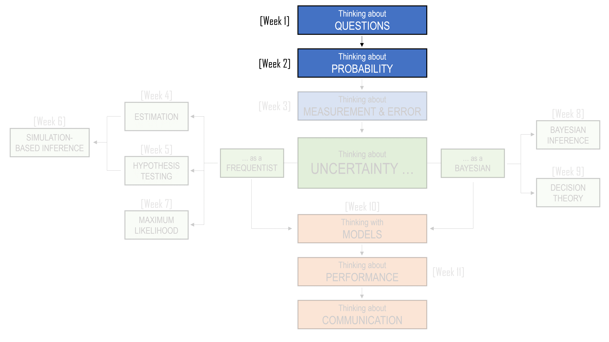
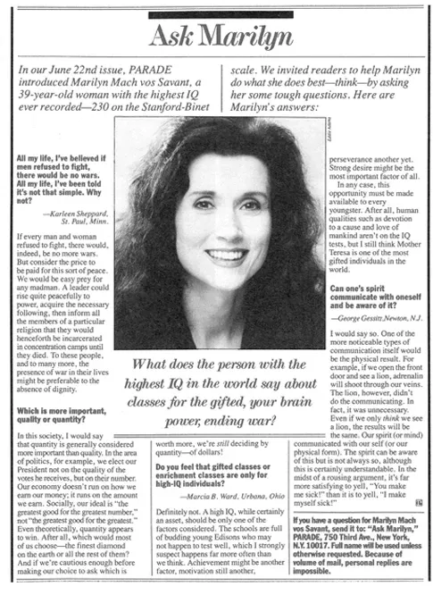
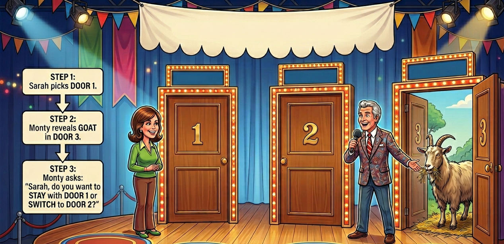
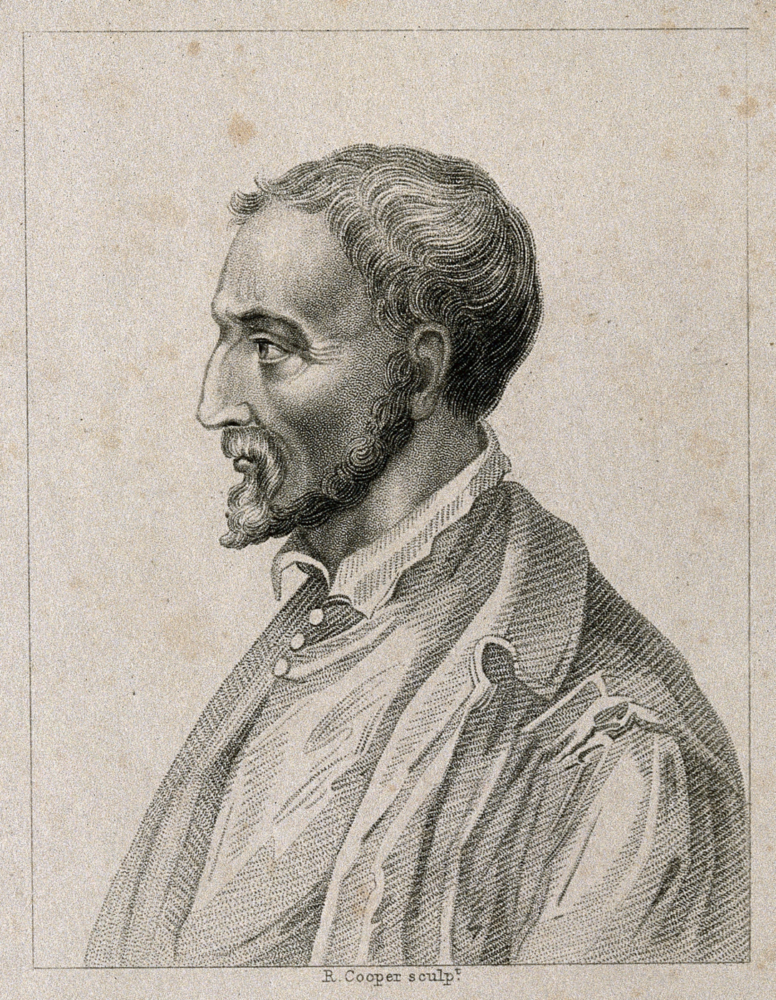
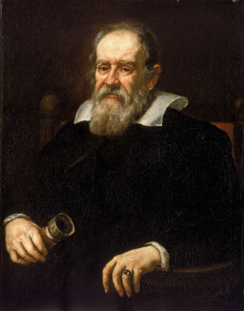
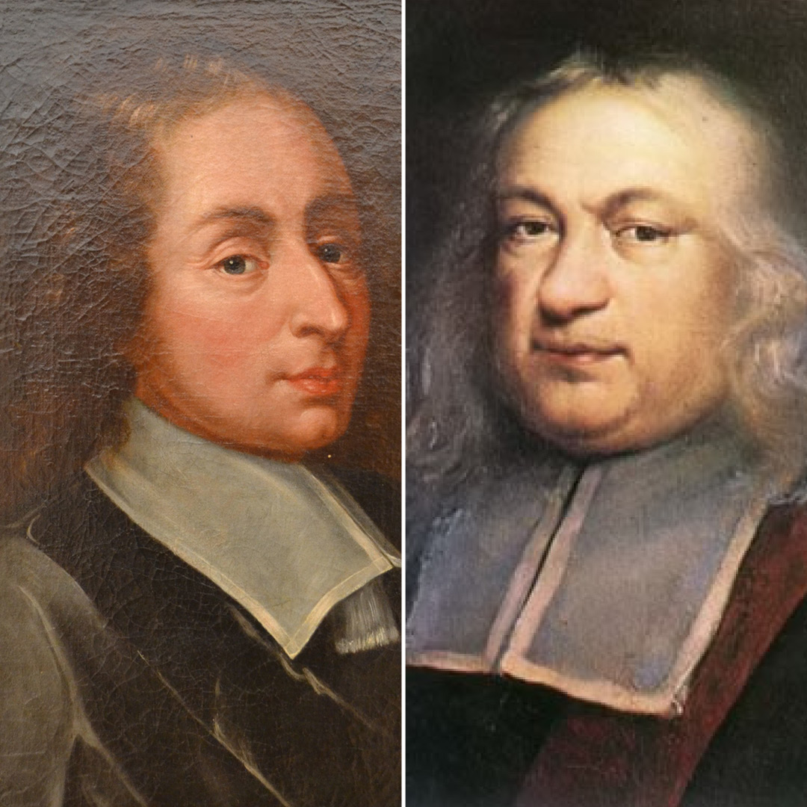
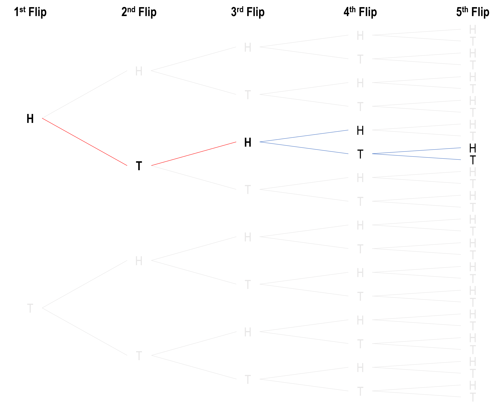

```{r, include=FALSE}
library(tidyverse)
library(flextable)
library(webexercises)
library(gt)
```

::: callout-note
## Learning Objectives

By the end of this chapter, you should be able to:

1.  Define a sample space, an outcome, and an event.
2.  Use sample spaces to describe simple random processes.
3.  Apply basic probability rules, including that probabilities lie between 0 and 1, and that the probability of the full sample space is 1.
4.  Calculate probabilities by counting favourable outcomes and total possible outcomes when outcomes are equally likely.
5.  Recognise when the wording of a probability problem changes the relevant sample space.
6.  Explain why the process that produces information matters when reasoning under uncertainty.
7.  Distinguish between outcomes where order matters and outcomes where order does not matter.
8.  Explain why some events are more likely because they can occur in more ways.
9.  Use examples such as dice, birthdays, and lotteries to explain why surprising events may be less surprising than they first appear.
10. Interpret combinations notation and explain how Pascal's triangle helps count combinations.
:::

<center>

```{r, echo=FALSE}
#| classes: .enlarge-image

```

</center>

<br>

## The problem with intuition

*Parade* magazine had been part of American popular culture for decades. It began publication in 1941 and, for much of its life, was distributed as a Sunday newspaper magazine. At its peak, it reached millions of readers each week. Although the print magazine eventually ceased regular publication in 2022, *Parade* continues today as a website and email newsletter.

One of its most popular features was the “Ask Marilyn” column, which began in 1986. The column was written by Marilyn vos Savant, who became well known for answering puzzles, logic problems, and questions from readers. People wrote to her about all kinds of things: mathematics, language, philosophy, everyday reasoning, and strange little problems that seemed simple at first but became more difficult the longer one thought about them.

<center></center>

Perhaps the most famous question Marilyn ever answered was about a game show. It is now famously referred to as *The Monty Hall Problem*, and has appeared in modern television shows such as *NUMB3RS*, *Brooklyn Nine-Nine*, *Mythbusters*, and the 2008 movie *21*.

### The Monty Hall Problem

In the puzzle, you are a contestant on a game show.

-   In front of you are three closed doors.
    -   Behind one door is a car.
    -   Behind the other two doors are goats.
-   You choose one door.
    -   The host, who knows what is behind each door, then opens one of the two doors you did not choose.
    -   The door he opens has a goat behind it.
-   There are now two unopened doors: the door you originally chose, and one other door.
-   The host gives you a choice:

> Should you stay with your original door, or should you switch?

<center></center>

At first, the answer seems obvious. There are two doors left. One has a car, and one has a goat. So it feels like the probability must now be 50/50. If there are only two possibilities, surely each is equally likely?

This is a good moment to pause and ask yourself what you would do.

-   Would you stay?
-   Would you switch?
-   Would you say it does not matter?

::: {.callout-note collapse="true"}
## Click to see what Mariln suggests you should do

Marilyn’s answer was that: you should switch.
:::

This answer caused an enormous backlash. Many readers (over 10,000 letters, including nearly 1000 PhDs) wrote in to say she was wrong. Some of the responses were not simply polite disagreements. People were confident that the answer had to be 50/50, and many were amazed that someone known for solving logic puzzles would make what they saw as such an obvious mistake.

A Mathematics Professor from George Mason University wrote:

> "You blew it! Let me explain. If one door is shown to be a loser, that information changes the probability of either remaining choice, neither of which has any reason to be more likely to 1/2. As a professional mathematician, I'm very concerned with the general public's lack of mathematical skills. Please help by confessing your error and in the future being more careful."

From Dickinson State University:

> “I am in shock that after being corrected by at least three mathematicians, you still do not see your mistake.”

From Georgetown:

> “How many irate mathematicians are needed to change your mind?”

But ... Marilyn's answer was the correct one. Switching gives you a better chance of winning the car.

The Monty Hall problem has since become one of the most famous examples in probability. Part of its appeal is that it does not require advanced mathematics. You do not need calculus, algebra, or specialised statistical theory to solve it. What you need is a careful understanding of how probability works, and especially how to define the set of possible outcomes.

This is where intuition can mislead us. We look at the final situation: two unopened doors, and our mind jumps to “50/50”. But here is the important part:

> Probability is not only about counting what we can see at the end. It is about understanding the full process that produced the situation we are in.

For now, we will leave the puzzle unresolved. Instead of jumping straight to the answer, we will use the Monty Hall problem as a reason to build up the basic language of probability. We will begin with outcomes, events, and sample spaces. Then we will use these ideas to return to the Monty Hall problem and see whether our first intuition still holds.

## Cardano and the law of the sample space

Long before Marilyn vos Savant received angry letters about the Monty Hall problem, people were already arguing, guessing, and reasoning badly about games of chance. One of the earliest people to think carefully about these questions was Gerolamo Cardano.

<center>

{width="50%"}

**17th-century portrait engraving of Cardano**

</center>

<br>

Cardano was born in Milan in 1501. His early life was difficult. He was an illegitimate child, he grew up in an unstable household, and his health was often poor. Yet he became one of the most remarkable thinkers of the Renaissance: a physician, mathematician, astrologer, inventor, and writer. He was brilliant, difficult, restless, and often unlucky.

He was also a gambler.

From a young age, Cardano noticed that he had a talent for games of chance. In his time, gambling was common. People played games involving dice, cards, coins, and objects known as *astrali*, which were small bones or dice-like objects used in games of chance. Gambling was not merely entertainment. For many people, including Cardano, it was also a way to make money, lose money, test one’s nerve, and attempt to understand fortune.

Cardano’s interest in gambling eventually led him to write a book called *Liber de Ludo Aleae*, usually translated as *The Book on Games of Chance*. It is often described as one of the first serious attempts in history to understand uncertainty mathematically. Cardano was not writing probability in the modern language we use today, but he was beginning to express one of its central ideas: to reason well about chance, we must first understand all the possible outcomes.

One of the chapters in Cardano’s book was titled “On Combined Points”, or “On Possibilities”. In that chapter, Cardano described what he called a “general rule”. In modern terms, this rule is closely related to what we now call the law of the sample space.

The idea is simple, but powerful:

> If all outcomes are equally likely, the probability of an event is the number of outcomes in which the event occurs divided by the total number of possible outcomes.

This is one of the foundations of probability.

But the simplicity is deceptive. Many probability mistakes happen because we do not define the possible outcomes carefully enough.

::: callout-note
### Some terminology

A **sample space** is the set of all possible outcomes of a random process.

If we roll a standard six-sided die, the sample space is:

$$
S = \{1,2,3,4,5,6\}.
$$

Each number in this set is an **outcome**. An outcome is one possible result of the random process.

An **event** is a collection of outcomes. For example:

-   The event “roll an even number” is: $\{2,4,6\}$
-   The event “roll a number greater than 4” is: $\{5,6\}$

If the die is fair, each of the six outcomes is equally likely. So the probability of

-   rolling a 4 is: $P(4) = \frac{1}{6}$
-   rolling an even number is: $P(\text{even}) = \frac{3}{6} = \frac{1}{2}$

This is Cardano’s general rule in modern form. First, define the set of possible outcomes. Then count the outcomes that match the event you care about.

We can also see one of the basic rules, or axioms, of probability here.

Probabilities must be between 0 and 1:

$$
0 \leq P(A) \leq 1.
$$

An event with probability 0 is impossible. An event with probability 1 is certain. Most events we care about fall somewhere between these two extremes.

For the die, rolling a 7 has probability 0, because 7 is not in the sample space:

$$
P(7)=0.
$$

Rolling a number from 1 to 6 has probability 1, because one of those outcomes must happen:

$$
P(\{1,2,3,4,5,6\})=1.
$$

This gives us another axiom of probability:

$$
P(S)=1.
$$

The probability of the entire sample space is 1. Something in the sample space must happen.
:::

### The two-daughter problem

Suppose a family has two children, and suppose, for simplicity, that each child is equally likely to be a boy or a girl. Also suppose that the sex of one child does not affect the sex of the other.

If we record the children in birth order, the sample space is:

$$
S = \{BB, BG, GB, GG\}.
$$

Here, $BG$ means the older child is a boy and the younger child is a girl. $GB$ means the older child is a girl and the younger child is a boy.

This distinction is important. If we ask, “What is the probability that both children are girls?”, the answer is:

$$
P(GG) = \frac{1}{4}.
$$

There is one outcome in which both children are girls, out of four equally likely outcomes.

Now consider a slightly different question:

> A family has two children. At least one of them is a girl. What is the probability that both children are girls?

Many people are tempted to reason like this: we already know one child is a girl, so there is only one child left to consider. That remaining child is either a boy or a girl, so the probability that both children are girls must be $1/2$.

This sounds reasonable, but it is not correct under the usual assumptions of the problem. The mistake is that the sample space has changed, but not in the way our intuition first suggests. Before receiving any information, the sample space was:

$$
S = \{BB, BG, GB, GG\}.
$$

Once we are told that at least one child is a girl, the outcome $BB$ is no longer possible. So the reduced sample space is:

$$
S = \{BG, GB, GG\}.
$$

Of these three possible outcomes, only one has two girls:

$$
GG.
$$

So the probability is:

$$
P(\text{both girls} \mid \text{at least one girl}) = \frac{1}{3}.
$$

This is exactly the kind of situation Cardano’s general rule helps us handle. Instead of relying on intuition, we define the possible outcomes and count them carefully.

### Why the wording matters

Probability problems are often sensitive to how information is obtained.

Compare the previous question with this one:

> A family has two children. The older child is a girl. What is the probability that both children are girls?

Now the sample space is different again.

If the older child is known to be a girl, then the only possible outcomes are:

$$
S = \{GB, GG\}.
$$

Only one of these outcomes has two girls, so:

$$
P(\text{both girls} \mid \text{older child is a girl}) = \frac{1}{2}.
$$

The difference between these two questions is subtle but important. “At least one child is a girl” and “the older child is a girl” sound similar, but they give different information. Different information means a different sample space. A different sample space can mean a different probability.

This is one of the central lessons of probability:

> To solve a probability problem, we must know not only what happened, but how we came to know it.

## Solving Monty Hall with the sample space

We are now in a better position to think about the Monty Hall problem that was introduced at the start of this chapter.

At the beginning of the game, there are three possible locations for the car:

$$
S = \{\text{Door 1}, \text{Door 2}, \text{Door 3}\}.
$$

If you choose Door 1, then the chance that your first choice is correct is $1/3$. The chance that the car is behind one of the two doors you did not choose is $2/3$.

This part is straightforward. The sample space has three equally likely possibilities.

The difficult part comes after the host opens a door. Many people look at the two remaining closed doors and think the sample space must now be:

$$
S = \{\text{your door}, \text{other unopened door}\}.
$$

If those two possibilities were equally likely, the answer would be $1/2$. But we have just seen that we must be careful. The correct sample space depends not only on what remains visible, but on how the information was produced.

In the Monty Hall problem, the host knows where the car is. The host does not open a door randomly. The host deliberately opens a door with a goat behind it. That means the host’s action carries information.

Suppose, without loss of generality, that you first choose Door 1. There is nothing special about Door 1. We are choosing it only so that we can write down the possible outcomes clearly.

At the moment you choose Door 1, the car could be behind Door 1, Door 2, or Door 3.

$$
S = \{\text{Car behind Door 1}, \text{Car behind Door 2}, \text{Car behind Door 3}\}.
$$

Each of these possibilities has probability $1/3$.

Now consider what happens in each case.

| Where the car is | Your first choice | What the host can open | If you stay | If you switch |
|---------------|---------------|---------------|---------------|---------------|
| Door 1 | Door 1 | Door 2 or Door 3 | Win | Lose |
| Door 2 | Door 1 | Door 3 | Lose | Win |
| Door 3 | Door 1 | Door 2 | Lose | Win |

This table is the key to the problem.

If the car is behind Door 1, then your first choice was correct. The host can open either Door 2 or Door 3, because both of those doors have goats behind them. If you stay, you win. If you switch, you lose.

If the car is behind Door 2, then your first choice was wrong. The host cannot open Door 2, because that would reveal the car. The host must open Door 3, revealing a goat. If you stay, you lose. If you switch, you win.

If the car is behind Door 3, then your first choice was wrong. The host must open Door 2. If you stay, you lose. If you switch, you win.

So switching wins in two of the three possible cases.

$$
P(\text{win by switching}) = \frac{2}{3}.
$$

Staying wins in only one of the three possible cases.

$$
P(\text{win by staying}) = \frac{1}{3}.
$$

This is why Marilyn vos Savant was right. You should switch.

The most important point is that the host’s action does not reset the probabilities to $1/2$ and $1/2$. Your original choice had a $1/3$ chance of being correct when you made it. The host’s action does not change the fact that your first choice was probably wrong. In fact, your first choice was wrong with probability $2/3$.

::: callout-note
### Bonus Round

Imagine you were playing a variation of the Monty Hall game, except the rules are now:

1.  There are 100 doors
2.  Behind one of these doors is a car
3.  Behind the other 99 doors are goats
4.  You choose 1 door
5.  The host (who knows there the car is), opens 98 doors that you did not choose, each revealing a goat.
6.  There are now 2 doors left: 1 with a car, and 1 with a goat
7.  The host asks you:

> "Do you stay or switch?"

Using the same logic as above, can you determine the best choice to make here?
:::

The idea of the sample space gives us a way to begin thinking carefully about probability. Before we can assign probabilities, we need to know what the possible outcomes are.

But there is another important step. Once we know the possible outcomes, we often need to ask:

> How many different ways can the event happen?

## Galileo and counting the ways something can happen

The Monty Hall problem shows why the sample space matters. At first, we see two unopened doors and our intuition says “two possibilities, so 50/50”. But once we carefully describe the full process (i.e., your original choice, the host’s knowledge, and the door the host is forced to open) we see that the two remaining doors do not have the same probability. The lesson is not just that we need to list the possible outcomes. We also need to count them in the right way.

This brings us to the next step in probability thinking. Sometimes the difficulty is not deciding what the outcomes are, but recognising that an event can happen in more than one way. Two events may look equally likely on the surface, but one may have more hidden pathways leading to it. This takes us to the yea 1583, where we meet a young Galileo Galilei.

Today, Galileo Galilei is remembered as one of the great figures in the history of science. He is best known for his work in astronomy and physics, including his telescopic observations, his studies of motion, and his role in the controversy with the Church.

<center></center>

<br>

However, Galileo also made a rather unusual contribution to the early understanding of probability. While connected with the University of Pisa, Galileo was hired by the Grand Duke of Tuscany to explain a problem involving dice:

> When you throw three dice, why does the sum of 10 appear more frequently than the sum of 9?

At first, this seems strange. There are six combinations that can produce a total of 9:

$$
1+2+6 = 9
$$

$$
1+3+5 = 9
$$

$$
1+4+4 = 9
$$

$$
2+2+5 = 9
$$

$$
2+3+4 = 9
$$

$$
3+3+3 = 9
$$

There are also six combinations that can produce a total of 10:

$$
1+3+6 = 10
$$

$$
1+4+5 = 10
$$

$$
2+2+6 = 10
$$

$$
2+3+5 = 10
$$

$$
2+4+4 = 10
$$

$$
3+3+4 = 10
$$

So it seems as though 9 and 10 should be equally likely. However, the Grand Duke had noticed that 10 appeared more often. Galileo explained why. The mistake is that the lists above do not count all the possible ways the dice can land. They count combinations, but they do not count order.

For example:

$$
1+2+6
$$

can occur in several different ways:

$$
(1,2,6)
$$

$$
(1,6,2)
$$

$$
(2,1,6)
$$

$$
(2,6,1)
$$

$$
(6,1,2)
$$

$$
(6,2,1)
$$

These are different outcomes when three dice are rolled, because the first die, second die, and third die can each show different numbers.

So although 9 and 10 each appear to have six combinations, those combinations do not produce the same number of ordered outcomes.

For a total of 9, there are 25 ordered outcomes.

For a total of 10, there are 27 ordered outcomes.

Therefore:

$$
P(\text{sum is 9}) = \frac{25}{216}
$$

while

$$
P(\text{sum is 10}) = \frac{27}{216}.
$$

A total of 10 is slightly more likely.

The difference is small, but gamblers who played often enough (such as the Grand Duke) could notice it. Galileo’s contribution was to show that the pattern was not magic, luck, or superstition. It came from counting the possible outcomes properly.

This gives us another important rule:

> The probability of an event depends on the number of ways in which it can occur.

### The birthday problem

One of the most famous examples of counting the ways an event can happen is the birthday problem. Imagine a class of students. Ignore leap years and assume that each birthday is equally likely to fall on any of the 365 days of the year. Here is the question:

> How many people need to be in a room before there is a better than 50% chance that at least two people share a birthday?

Most people guess a number much larger than the true answer. There are 365 possible birthdays, so it feels as though we would need a very large group before a shared birthday becomes likely. Many people guess 100, 150, or even more.

::: {.callout-note collapse="true"}
### Click to see answer

<center>The surprising answer is 23.</center>

<br>

With just 23 people, the probability that at least two people share a birthday is slightly greater than 50%.
:::

The easiest way to calculate the birthday problem is to work backwards. Instead of first calculating the probability that at least two people share a birthday, we calculate the probability that nobody shares a birthday.

The first person can have any birthday, since there is no one else to match with. The second person must avoid that first birthday, leaving 364 possible birthdays that would keep everyone unique. The third person must avoid the two birthdays already taken, leaving 363 possible choices. The fourth person must avoid three birthdays, leaving 362 possible choices. Continuing this pattern, each new person has one fewer safe birthday available than the person before them.

```{r, echo=FALSE}
birthday_steps <- data.frame(
  Person = c("1st person", "2nd person", "3rd person", "4th person", "...", "23rd person"),
  Requirement = c(
    "Can have any birthday",
    "Must avoid the first person's birthday",
    "Must avoid the first two birthdays",
    "Must avoid the first three birthdays",
    "Continue in the same way",
    "Must avoid the birthdays of the first 22 people"
  ),
  Safe_days = c(365, 364, 363, 362, "...", 343),
  Probability = c(
    "$\\frac{365}{365}$",
    "$\\frac{364}{365}$",
    "$\\frac{363}{365}$",
    "$\\frac{362}{365}$",
    "$\\cdots$",
    "$\\frac{343}{365}$"
  )
)

knitr::kable(
  birthday_steps,
  col.names = c("Person", "What must happen", "Safe birthday choices", "Probability"),
  escape = FALSE
)
```

Multiplying these probabilities together, for 23 people the probability that nobody shares a birthday is:

$$
\frac{365}{365}
\times
\frac{364}{365}
\times
\frac{363}{365}
\times
\cdots
\times
\frac{343}{365}
\approx 0.493.
$$

Notice that the probability we have just calculated is **not** the probability that someone shares a birthday. We have calculated the probability that nobody shares a birthday.

We can now apply the **complement rule** to solve this.

The **complement rule** says that if an event has probability (P(A)), then the probability that the event does **not** happen is:

$$
P(\text{not } A) = 1 - P(A).
$$

Equivalently,

$$
P(A) = 1 - P(\text{not } A).
$$

In the birthday problem, let (A) be the event that **at least two people share a birthday**.

Then the complement of (A), written (A\^c), is the event that **nobody shares a birthday**.

So:

$$
A = \text{at least two people share a birthday}
$$

and

$$
A^c = \text{nobody shares a birthday}.
$$

These two events cover all possible outcomes. Either there is at least one shared birthday, or there is no shared birthday. Since one of these must happen, their probabilities add to 1:

$$
P(A) + P(A^c) = 1.
$$

Rearranging this gives:

$$
P(A) = 1 - P(A^c).
$$

In this example, we calculated:

$$
P(A^c) = P(\text{nobody shares a birthday}) \approx 0.493.
$$

Therefore:

$$
P(A)
=
1 - P(A^c)
=
1 - 0.493
=
0.507.
$$

So the probability that at least two people share a birthday is approximately (0.507), or **50.7%**.

In the birthday problem, it is easier to calculate the probability of no shared birthdays and then subtract from 1. This is a common strategy in probability. When the event we care about is hard to count directly, it may be easier to count its complement.

> The birthday problem is surprising because a shared birthday feels unlikely when we think about one comparison at a time. But it becomes much more likely when we count all the possible comparisons. This is one reason probability often feels unintuitive. Our minds tend to focus on one person, one comparison, or one outcome. Probability often asks us to step back and count the whole structure of possibilities.

## Pascal, Fermat, and the mathematics of chance

Galileo’s work with dice showed that probability depends on counting the ways an event can happen. Some outcomes are more likely than others, not because they are favoured by fate, but because there are more ways for them to occur.

This idea also helps explain events that look astonishing at first glance. In Germany’s Lotto 6/49, six winning numbers are drawn from the numbers 1 to 49. On June 21, 1995, the winning numbers were:

$$
15,\ 25,\ 27,\ 30,\ 42,\ 48.
$$

What made this draw remarkable was that the exact same set of numbers had already appeared on December 20, 1986. It was the first repeated winning sequence in 3,016 drawings.

At first, this sounds almost impossible. But, as with the birthday problem, the important question is not just

> “What is the chance of this exact sequence appearing again?”

A better question is

> “Across thousands of drawings, how many opportunities were there for some sequence to repeat?”

But how do we actually calculate a probability like this? (by the way, the answer is 28% - a value we'll learn how to compute later). The numbers are too large to list every possible lottery draw, and the event we care about is not just one specific repeat. We want to know the chance that any repeat occurs somewhere among thousands of draws.

This is where the work of Blaise Pascal and Pierre de Fermat becomes important. Pascal is remembered for many contributions to mathematics and science, including Pascal’s triangle, work on pressure and fluids, and his writing on philosophy and religion. Fermat is best known for his work in number theory, including the famous Fermat’s Last Theorem, as well as important ideas in analytic geometry and calculus.

<center>{width="50%"}</center>

<br>

However, in this section, we are interested in a famous correspondence between the two of them about games of chance. In the seventeenth century, Pascal and Fermat exchanged letters about how to solve problems involving uncertainty, especially the question of how to divide the stakes of an unfinished game fairly (i.e. "*The Problem of Points*). These questions came from gambling, but the ideas behind them became much more important. Their correspondence helped establish probability as a mathematical subject: a way of counting possible outcomes, comparing favourable cases with all cases, and reasoning systematically about chance.

::::: callout-note
### The Problem of Points

The Problem of Points goes something like this:

> Imagine two players are playing a coin-flipping game. We will call them Harry and Tom. Harry scores a point whenever the coin lands Heads (H). Tom scores a point whenever the coin lands Tails (T). The first player to reach 3 points wins the game and takes the prize of \$100. Now suppose the first three flips are: H, T, H. So the current score is H = 2, and T = 1. Harry needs one more Head to win. Tom needs two more Tails. Now imagine that, for some reason, the game is interrupted and cannot continue. How should Harry and Tom divide the \$100 prize?

One tempting answer is to divide the prize according to the current score. Harry has 2 points and Tom has 1 point, so perhaps Harry should receive two-thirds of the prize and Tom should receive one-third.

<center>But this does not answer the **right question**.</center>

::: {style="height: 12px;"}
:::

The prize was not meant to reward whoever was ahead when the game stopped. It was meant to reward whoever would eventually reach 3 points first. So the fair question is not:

> What is the score right now?

The fair question is:

> If the game had continued, what chance did each player have of winning?

To solve this, let us consider all possible futures that the game could have finished:

<center></center>

::: {style="height: 12px;"}
:::

If the fourth flip is Heads, then Harry reaches 3 points, wins the prize, and the game stops immediately. However, if the fourth flip is Tails, the score becomes tied at 2 points each, and a fifth flip is required to decide the winner.

So, from the interrupted position, the sample space of possible ways the game can finish is:

$$
S = \{H,TH,TT\}
$$

This sample space needs to be treated carefully, because the outcomes are not equally likely. The outcome (H) requires only one future flip, while (TH) and (TT) require two future flips.

Therefore:

$$
P(H)=\frac{1}{2}
$$

$$
P(TH)=\frac{1}{2}\times\frac{1}{2}=\frac{1}{4}
$$

$$
P(TT)=\frac{1}{2}\times\frac{1}{2}=\frac{1}{4}
$$

```{r}
#| echo: false

future_paths <- data.frame(
  `Future flips` = c("H", "TH", "TT"),
  Probability = c("1/2", "1/4", "1/4"),
  Winner = c("Harry", "Harry", "Tom"),
  check.names = FALSE
)

future_paths |>
  gt::gt() |>
  gt::cols_align(
    align = "center",
    columns = everything()
  )
```

Therefore, the probability of Harry winning is:

$$
\begin{aligned}
P(\text{Harry wins})
&= P(H) + P(TH) \
&= \frac{1}{2} + \frac{1}{4} \
&= \frac{3}{4}
\end{aligned}
$$

The probability of Tom winning is:

$$
\begin{aligned}
P(\text{Tom wins})
&= P(TT) \
&= \frac{1}{4}
\end{aligned}
$$

So the fair way to divide the \$100 prize is not according to the current score of 2 to 1. Instead, it should be divided according to each player’s probability of eventually winning the game.

-   Harry should receive: $\frac{3}{4}\times 100 = \$75$

-   Tom should receive: $\frac{1}{4}\times 100 = \$25$

This is the central idea behind the problem of points. The value of an unfinished game is not determined only by the score at the moment the game stops. It is determined by the possible futures that remain, and by the probability of each of those futures.

It also reinforces a lesson from earlier in the chapter. A sample space is not enough on its own. We must also ask whether the outcomes in the sample space are equally likely. In this example, there are three possible future paths, but Harry does not win with probability $2/3$. That would only be true if the three paths were equally likely. Since $P(H)$ is more likely than either $P(TH)$ or $P(TT)$, the correct probability is $3/4$.
:::::

### Pascal's triangle and combinations

The problem of points shows us how probability can be used to reason about unfinished situations. But so far, our counting problems have been small enough to carry out without much effort. As the numbers get larger, counting becomes difficult. Suppose you are arranging a wedding reception for 100 guests, and each table seats 10 people. Even if we focus only on the first table, the question quickly becomes large:

> How many ways are there to choose 10 people from a group of 100?

This is a counting problem that appears in many other settings. It is similar to asking how many ways there are to choose 10 investments from 100 possible funds, 10 applicants from 100 candidates, or 10 suburbs from 100 possible sites for a policy trial.

The story changes, but the mathematical structure is the same. We are choosing a group of 10 from a larger group of 100.

This is where we need to distinguish between an **arrangement** and a **combination**.

-   An arrangement counts different orders.
-   A combination counts different groups.

This distinction matters because probability depends on counting the right thing.

Let us use a small example. Suppose there are 4 guests:

$$
A,B,C,D
$$

and we want to choose 2 of them. The possible pairs are:

$$
AB,\; AC,\; AD,\; BC,\; BD,\; CD
$$

There are 6 possible pairs. So the number of ways to choose 2 guests from 4 is 6. We write this as:

$$
\binom{4}{2}=6
$$

and read it as "4 choose 2".

This notation means:

> How many ways are there to choose 2 items from 4, when order does not matter?

Now suppose we wanted to choose 1 guest from 4. There are obviously 4 ways:

$$
\binom{4}{1}=4
$$

If we wanted to choose all 4 guests from 4, there is only 1 way:

$$
\binom{4}{4}=1
$$

If we wanted to choose no guests from 4, there is also only 1 way:

$$
\binom{4}{0}=1
$$

That last one may feel strange at first. But there is exactly one way to choose nothing: choose nobody.

So for 4 guests, the numbers are:

$$
\binom{4}{0}=1
$$

$$
\binom{4}{1}=4
$$

$$
\binom{4}{2}=6
$$

$$
\binom{4}{3}=4
$$

$$
\binom{4}{4}=1
$$

Written in a row, this gives:

$$
1 \quad 4 \quad 6 \quad 4 \quad 1
$$

This row appears in **Pascal's triangle**. Pascal's triangle is a pattern of numbers that begins like this:

$$
1
$$

$$
1 \quad 1
$$

$$
1 \quad 2 \quad 1
$$

$$
1 \quad 3 \quad 3 \quad 1
$$

$$
1 \quad 4 \quad 6 \quad 4 \quad 1
$$

$$
1 \quad 5 \quad 10 \quad 10 \quad 5 \quad 1
$$

Pascal's triangle gives us a compact way to count possibilities without writing them all out. The same counting idea can be written as a formula:

$$
\binom{n}{k}
=
\frac{n!}{k!(n-k)!}
$$

This means the number of ways to choose $k$ items from $n$ items, when order does not matter. For example, the number of ways to choose 10 guests from 100 is:

$$
\binom{100}{10}
=
\frac{100!}{10!90!}
$$

This number is enormous (17,310,309,456,440). The important point is not that we need to memorise it. The important point is that probability often depends on counting possibilities that are far too numerous to list by hand. Pascal's triangle helps us count possibilities. Pascal also helped develop another idea: how to place a value on uncertain outcomes. That idea is called **mathematical expectation**.

### Mathematical expectation

The problem of points asked how a prize should be divided when a game is interrupted. Pascal and Fermat's solution was to look forward. Instead of asking only what had already happened, they asked what could still happen, how likely those futures were, and what each future was worth.

This way of thinking leads naturally to mathematical expectation.

The basic idea is simple:

> To value an uncertain situation, multiply each possible outcome by its probability, then add the results.

If a random quantity $X$ can take values:

$$
x_1,\;x_2,\;x_3,\ldots,x_k
$$

with probabilities:

$$
p_1,\;p_2,\;p_3,\ldots,p_k
$$

then the expected value is:

$$
E(X)
=
p_1x_1+p_2x_2+p_3x_3+\cdots+p_kx_k
$$

Expected value is not necessarily what will happen. It is not a prediction of the next outcome. Instead, it is a long-run average, or a way of placing a value on uncertainty before the outcome is known.

Expected value is easiest to understand through a simple game. Suppose you pay \$10 to play a game in which a fair coin is tossed. If the coin lands heads, you receive \$30. If it lands tails, you receive nothing.

```{r}
#| echo: false

positive_ev_game <- data.frame(
  Outcome = c("Heads", "Tails"),
  Probability = c("1/2", "1/2"),
  Winnings = c("$30", "$0")
)

positive_ev_game |>
  gt() |>
  cols_align(
    align = "center",
    columns = Probability
  ) |>
  cols_align(
    align = "right",
    columns = Winnings
  )
```

To calculate the expected winnings, we multiply each possible outcome by its probability and then add the results:

$$
\begin{aligned}
E(\text{winnings})
&=
\left(\frac{1}{2}\times 30\right)
+
\left(\frac{1}{2}\times 0\right) \\
&= 15
\end{aligned}
$$

So the game pays, on average, \$15. However, it costs \$10 to play, so the expected profit is:

$$
15 - 10 = 5
$$

This game has a positive expected value. That does not mean you will win \$5 every time you play. In any single game, you either receive \$30 or receive nothing. But over many repeated plays, the average profit would tend towards \$5 per game.

Now change the game slightly. Suppose it still costs \$10 to play, and the coin is still fair, but the prize for heads is now only \$15.

```{r}
#| echo: false

negative_ev_game <- data.frame(
  Outcome = c("Heads", "Tails"),
  Probability = c("1/2", "1/2"),
  Winnings = c("$15", "$0")
)

negative_ev_game |>
  gt() |>
  cols_align(
    align = "center",
    columns = Probability
  ) |>
  cols_align(
    align = "right",
    columns = Winnings
  )
```

The expected winnings are now:

$$
\begin{aligned}
E(\text{winnings})
&=
\left(\frac{1}{2}\times 15\right)
+
\left(\frac{1}{2}\times 0\right) \\
&= 7.50
\end{aligned}
$$

Since the game still costs \$10 to play, the expected profit is:

$$
7.50 - 10 = -2.50
$$

This game has a negative expected value. You might still win if you play once, but the structure of the game works against you in the long run.

The important lesson is this:

> A game can be possible to win and still be a bad bet.

::: callout-note
#### Everyday expectation

Expected value can make ordinary decisions look different.

For example, my colleagues and I sometimes have different views about parking on campus. Parking legally using the O-Park app costs about \$5.50 per day. That is the certain cost: if you pay for parking, you know exactly what you are giving up.

But suppose someone decides not to pay. On that particular day, parking costs them nothing. Of course, they also run the risk of receiving a parking fine. Suppose the fine is about \$125, and suppose the probability of being fined on any given day is about:

$$
\frac{1}{20}
$$

We will discuss how to estimate probabilities like this from data in a later chapter. For now, treat it as an assumption.

The choice can be summarised like this:

```{r}
#| echo: false

library(gt)

campus_parking <- data.frame(
  Choice = c("Pay using O-Park", "Do not pay"),
  `Certain cost` = c("$5.50", "$0"),
  `Possible fine` = c("$0", "$125"),
  `Probability of fine` = c("0", "1/20"),
  `Expected cost` = c("$5.50", "$6.25"),
  check.names = FALSE
)

campus_parking |>
  gt() |>
  cols_align(
    align = "center",
    columns = c(`Probability of fine`)
  ) |>
  cols_align(
    align = "right",
    columns = c(`Certain cost`, `Possible fine`, `Expected cost`)
  )
```

If you pay through O-Park, the cost is simply:

$$
5.50
$$

If you do not pay, the expected cost is:

$$
\begin{aligned}
E(\text{fine})
&=
P(\text{fine})\times(\text{fine amount}) \
&=
\frac{1}{20}\times 125 \
&=
6.25
\end{aligned}
$$

So even though not paying feels cheaper on most individual days, its expected cost is \$6.25 per day. That is slightly higher than the \$5.50 cost of paying for parking.

This does not mean that every person who avoids paying will be fined. Most days, they may get away with it. But expectation is not about what happens on one particular day. It is about the long-run average cost if the same decision is repeated many times.

Over 20 days, for example, paying for parking would cost:

$$
20 \times 5.50 = 110
$$

If the probability of a fine is really (1/20), then over 20 unpaid parking days you would expect, on average, one fine:

$$
1 \times 125 = 125
$$

From this point of view, the decision is not between paying \$5.50 and paying \$0. It is between a certain cost of \$5.50 and an expected cost of \$6.25.

Of course, this calculation depends on the assumptions. If the probability of being fined were lower, not paying might have a lower expected cost. If the probability were higher, not paying would look even worse.

For example, the break-even probability is the probability that makes the expected fine equal to the daily parking cost:

$$
\begin{aligned}
125p &= 5.50 \\
p &= \frac{5.50}{125} \\
&= 0.044
\end{aligned}
$$

So if the chance of a fine is greater than about 4.4%, paying for parking has the lower expected cost. If the chance of a fine is less than about 4.4%, not paying has the lower expected cost.

This example shows why expected value is useful. It turns a vague disagreement — “Is it worth paying for parking?” — into a clearer question:

How likely is the fine, and how large is the cost if it happens?

That is the logic of mathematical expectation.
:::

Lotteries are another clear example of expectation. A lottery ticket offers a small chance of a very large prize. That is what makes it exciting. But the expected value of a ticket is usually much lower than the ticket price.

The general structure is:

$$
\begin{aligned}
E(\text{ticket})
&=
P(\text{major prize})\times(\text{major prize}) \\
&\quad +
P(\text{minor prize})\times(\text{minor prize}) \\
&\quad +
P(\text{no prize})\times 0 \\
&\quad -
\text{ticket cost}
\end{aligned}
$$

In most lotteries, this expected value is negative. Lottery organisers usually design the game so that the average amount returned to players is less than the amount collected through ticket sales.

This does not mean nobody should ever buy a lottery ticket. People may buy tickets for entertainment, hope, excitement, or the pleasure of imagining what they would do if they won. But mathematically, lotteries are usually poor financial bets.

This is another example of probability helping us separate two different questions:

```{r}
#| echo: false

lottery_questions <- data.frame(
  Question = c("Could I win?", "Is this a favourable bet?"),
  Meaning = c(
    "Is the outcome possible?",
    "Is the expected value positive?"
  )
)

lottery_questions |>
  gt()
```

For a lottery ticket, the answer to the first question may be yes. The answer to the second is usually no.

Sometimes, however, the expected value can briefly favour the player. In 1992, a group of investors connected to Melbourne noticed an unusual opportunity in the Virginia Lottery in the United States. The lottery required players to choose 6 numbers from 44.

The number of possible combinations was:

$$
\binom{44}{6} = 7,059,052
$$

So, in principle, if someone bought one ticket for every possible combination, they could guarantee holding the winning ticket.

Usually, this would not be worth doing, because the total cost of buying all possible tickets would exceed the expected prize. But in this case, the jackpot had grown very large. Including smaller prizes, the total prize pool was about \$27.9 million.

If there were 7,059,052 possible tickets, then the average value per ticket was roughly:

$$
\frac{27,900,000}{7,059,052}
\approx 3.95
$$

```{r}
#| echo: false

virginia_lottery <- data.frame(
  Quantity = c(
    "Possible number combinations",
    "Approximate total prize pool",
    "Approximate value per combination",
    "Ticket price"
  ),
  Value = c(
    "7,059,052",
    "$27.9 million",
    "$3.95",
    "$1"
  )
)

virginia_lottery |>
  gt() |>
  cols_align(
    align = "right",
    columns = Value
  )
```

On the surface, this looked like a favourable opportunity. Each \$1 ticket had an average value much higher than its cost.

Of course, the plan was not risk-free. Someone else might also choose the winning numbers, forcing the prize to be shared. There was also a major practical problem: the investors had to buy millions of tickets before the deadline.

Still, the basic reasoning was expectation. They were not asking:

> Will this particular ticket win?

They were asking:

> What is the average value of this strategy, given the probabilities and payoffs?

In the end, the group ran out of time and only managed to purchase around 5 million tickets. Fortunately, their gamble paid off and the did hold the only winning ticket for that draw.

## Chapter summary

Probability gives us a language for thinking clearly when more than one outcome is possible. In this chapter, we began with situations where intuition can be misleading. A problem may look simple on the surface, but the answer can change once we define the possible outcomes carefully, understand how information was produced, and count the number of ways an event can occur.

We looked at many examples, such as the Monty Hall Problem, the Birthday Problem, the Problem of Points, the Lottery - all of which used probability to help us solve a question.

Across all of these examples, the main lesson is that probability is not just about formulas. It is about structure. To reason well under uncertainty, we need to ask:

-   What are the possible outcomes?
-   Are they equally likely?
-   What event do we care about?
-   How many ways can that event occur?
-   What information have we received?
-   How was that information produced?
-   Are we counting arrangements or combinations?
-   Are we treating rare events as impossible, or merely as unlikely?

Probability helps us slow down, define the situation carefully, and reason with uncertainty rather than simply relying on intuition.

## Coding the ideas in R

Throughout this chapter, we have solved probability problems by defining the possible outcomes, counting the relevant events, and thinking carefully about the process that produced the information. We can also use R to code these ideas directly.

The goal of this section is not to replace the reasoning from the chapter. The goal is to show that the same logic can be expressed in code. This is useful because code allows us to list sample spaces, simulate random processes many times, and check whether our answers make sense.

The code below uses the packages loaded at the start of the chapter. If you are running this section by itself, run the following code first.

```{r}
#| label: coding-r-packages
#| message: false
#| warning: false

library(tidyverse)
library(gt)
```

### Simulating the Monty Hall problem

The Monty Hall problem has a simple structure:

1. A car is placed behind one of three doors.
2. The contestant chooses one door.
3. The host opens a goat door that the contestant did not choose.
4. The contestant either stays with the original door or switches to the remaining unopened door.

We can write a function that plays one game.

```{r}
#| label: monty-one-game

sample_one <- function(x) {
  tibble(value = x) |>
    slice_sample(n = 1) |>
    pull(value)
}

play_monty <- function() {
  
  doors <- 1:3
  
  tibble(game = 1) |>
    mutate(
      car = sample_one(doors),
      first_choice = sample_one(doors),
      host_options = list(setdiff(doors, c(first_choice, car))),
      host_opens = map_int(host_options, sample_one),
      switch_options = list(setdiff(doors, c(first_choice, host_opens))),
      switch_choice = map_int(switch_options, sample_one),
      stay_win = first_choice == car,
      switch_win = switch_choice == car
    ) |>
    select(
      car,
      first_choice,
      host_opens,
      switch_choice,
      stay_win,
      switch_win
    )
}

play_monty()
```

Because one game is not very informative, we repeat the game many times.

```{r}
#| label: monty-simulation

set.seed(24205242)

n_games <- 1000

monty_results <- map_dfr(
  1:n_games,
  ~ play_monty()
)

monty_summary <- monty_results |>
  summarise(
    `Stay` = mean(stay_win),
    `Switch` = mean(switch_win)
  ) |>
  pivot_longer(
    cols = everything(),
    names_to = "Strategy",
    values_to = "Win rate"
  )

monty_summary
```

The function `map_dfr()` repeats the function many times and combines the results into one data frame. The function `mean()` is being used on logical values: in R, `TRUE` is treated as 1 and `FALSE` is treated as 0, so the mean of a logical column gives the proportion of `TRUE` values.

We can present the results in a table.

```{r}
#| label: tbl-monty-simulation
#| tbl-cap: "Simulated win rates for staying and switching in the Monty Hall problem"
#| echo: false

monty_summary |>
  mutate(`Win rate` = round(`Win rate`, 3)) |>
  gt() |>
  cols_align(
    align = "center",
    columns = everything()
  )
```

The simulated win rates should be close to:

$$
P(\text{win by staying}) = \frac{1}{3}
$$

and:

$$
P(\text{win by switching}) = \frac{2}{3}
$$

The exact numbers will not be exactly the same every time, because this is a simulation. However, when the number of games is large, the simulated results should be close to the theoretical probabilities.

### Coding the two-daughter problem

The two-daughter problem is a good example of why the sample space matters. Suppose a family has two children, and each child is equally likely to be a boy or a girl. If we record the children in birth order, the sample space is:

$$
S = \{BB, BG, GB, GG\}
$$

We can create this sample space in R.

```{r}
#| label: two-daughter-sample-space

children <- crossing(
  older = c("Boy", "Girl"),
  younger = c("Boy", "Girl")
)

children
```

The function `crossing()` creates all combinations of the values supplied to it. Here, it creates all possible combinations of the older child's sex and the younger child's sex.

Now suppose we are told that at least one child is a girl. We can filter the sample space to keep only the outcomes consistent with that information.

```{r}
#| label: two-daughter-filter

children_at_least_one_girl <- children |>
  mutate(
    at_least_one_girl = older == "Girl" | younger == "Girl",
    both_girls = older == "Girl" & younger == "Girl"
  ) |>
  filter(at_least_one_girl)

children_at_least_one_girl
```

The symbol `|` means "or", and the symbol `&` means "and". So the code `older == "Girl" | younger == "Girl"` checks whether at least one child is a girl, while `older == "Girl" & younger == "Girl"` checks whether both children are girls.

We can now calculate the probability that both children are girls, given that at least one child is a girl.

```{r}
#| label: two-daughter-probability

children_at_least_one_girl |>
  summarise(
    probability_both_girls = mean(both_girls)
  )
```

The answer is:

$$
P(\text{both girls} \mid \text{at least one girl}) = \frac{1}{3}
$$

We can also display the reduced sample space in a table.

```{r}
#| label: tbl-two-daughter
#| tbl-cap: "Reduced sample space when at least one child is a girl"
#| echo: false

children_at_least_one_girl |>
  select(older, younger, both_girls) |>
  gt() |>
  cols_label(
    older = "Older child",
    younger = "Younger child",
    both_girls = "Both girls?"
  ) |>
  cols_align(
    align = "center",
    columns = everything()
  )
```

The important idea is that the code follows the same logic as the sample-space reasoning. First, we list all possible outcomes. Then, we keep only the outcomes that match the information we were given. Finally, we count how many of the remaining outcomes match the event we care about.

### Coding the birthday problem

The birthday problem asks how likely it is that at least two people in a group share a birthday. The easiest way to calculate this is to first calculate the probability that nobody shares a birthday, and then subtract from 1.

If there are `n` people in the room, the probability of no shared birthdays is:

$$
\frac{365}{365}
\times
\frac{364}{365}
\times
\frac{363}{365}
\times
\cdots
\times
\frac{365-n+1}{365}
$$

So the probability of at least one shared birthday is:

$$
1 - P(\text{no shared birthday})
$$

We can turn this into a function.

```{r}
#| label: birthday-function

birthday_probability <- function(n_people, n_days = 365) {
  
  prob_no_match <- prod((n_days - 0:(n_people - 1)) / n_days)
  
  prob_match <- 1 - prob_no_match
  
  prob_match
}

birthday_probability(n_people = 23)
```

The argument `n_people` is the number of people in the group. The argument `n_days` is the number of possible birthdays, set to 365 by default. The function `prod()` multiplies all the values in a vector.

We can use the function for several group sizes.

```{r}
#| label: birthday-table-data

birthday_summary <- tibble(
  n_people = c(5, 10, 20, 23, 30, 40, 50)
) |>
  mutate(
    probability_shared_birthday = map_dbl(n_people, birthday_probability)
  )

birthday_summary
```

The function `map_dbl()` applies a function to each value and returns numeric results. Here, it calculates the birthday probability for each group size.

```{r}
#| label: tbl-birthday-problem
#| tbl-cap: "Probability of at least one shared birthday for different group sizes"
#| echo: false

birthday_summary |>
  mutate(
    probability_shared_birthday = round(probability_shared_birthday, 3)
  ) |>
  gt() |>
  cols_label(
    n_people = "Number of people",
    probability_shared_birthday = "Probability of shared birthday"
  ) |>
  cols_align(
    align = "center",
    columns = everything()
  )
```

We can also plot the probability as the group size increases.

```{r}
#| label: fig-birthday-problem
#| fig-cap: "Probability of at least one shared birthday as group size increases"

birthday_plot_data <- tibble(
  n_people = 1:60
) |>
  mutate(
    probability_shared_birthday = map_dbl(n_people, birthday_probability)
  )

ggplot(
  birthday_plot_data,
  aes(x = n_people, y = probability_shared_birthday)
) +
  geom_line() +
  geom_hline(yintercept = 0.5, linetype = "dashed") +
  labs(
    x = "Number of people",
    y = "Probability of at least one shared birthday"
  )
```

The horizontal dashed line marks probability 0.5. The plot shows that the probability passes 0.5 at around 23 people.

### Coding expected value: paying for parking or risking a fine

Expected value helps us compare uncertain costs. In the campus parking example, paying legally using the O-Park app costs about `$5.50` per day. Not paying costs `$0` immediately, but creates a risk of a fine. Suppose the fine is about `$125`, and suppose the probability of receiving a fine on a given day is:

$$
\frac{1}{20}
$$

We can put the two choices into a data frame.

```{r}
#| label: parking-expected-value

parking <- tibble(
  choice = c("Pay using O-Park", "Do not pay"),
  certain_cost = c(5.50, 0),
  fine_amount = c(0, 125),
  probability_of_fine = c(0, 1 / 20)
) |>
  mutate(
    expected_cost = certain_cost + probability_of_fine * fine_amount
  )

parking
```

The expected cost for not paying is:

$$
\begin{aligned}
E(\text{fine})
&=
P(\text{fine})\times(\text{fine amount}) \\
&=
\frac{1}{20}\times 125 \\
&=
6.25
\end{aligned}
$$

So, under these assumptions, not paying has an expected cost of `$6.25`, while paying has a certain cost of `$5.50`.

```{r}
#| label: tbl-parking-expected-value
#| tbl-cap: "Expected cost of paying for parking or risking a fine"
#| echo: false

parking |>
  mutate(
    certain_cost = paste0("$", sprintf("%.2f", certain_cost)),
    fine_amount = paste0("$", sprintf("%.2f", fine_amount)),
    probability_of_fine = if_else(
      probability_of_fine == 0,
      "0",
      "1/20"
    ),
    expected_cost = paste0("$", sprintf("%.2f", expected_cost))
  ) |>
  gt() |>
  cols_label(
    choice = "Choice",
    certain_cost = "Certain cost",
    fine_amount = "Possible fine",
    probability_of_fine = "Probability of fine",
    expected_cost = "Expected cost"
  ) |>
  cols_align(
    align = "center",
    columns = everything()
  )
```

This calculation depends on the probability of being fined. We can also calculate the break-even probability: the probability of a fine that would make the expected cost of not paying equal to the cost of paying.

```{r}
#| label: parking-break-even

parking_cost <- 5.50
fine_amount <- 125

break_even_probability <- parking_cost / fine_amount

break_even_probability
```

In formula form:

$$
\begin{aligned}
125p &= 5.50 \\
p &= \frac{5.50}{125} \\
p &= 0.044
\end{aligned}
$$

So if the probability of being fined is greater than about 0.044, or 4.4%, paying for parking has the lower expected cost. If the probability of being fined is lower than about 4.4%, not paying has the lower expected cost.

```{r}
#| label: tbl-parking-break-even
#| tbl-cap: "Break-even probability for the campus parking example"
#| echo: false

break_even_table <- tibble(
  Quantity = c(
    "Daily parking cost",
    "Fine amount",
    "Break-even probability"
  ),
  Value = c(
    "$5.50",
    "$125.00",
    paste0(round(100 * break_even_probability, 1), "%")
  )
)

break_even_table |>
  gt() |>
  cols_align(
    align = "center",
    columns = everything()
  )
```

This example shows why coding is useful. Once the structure of the problem is clear, we can change the assumptions and immediately see how the expected cost changes. The statistical question becomes sharper:

> How likely is the fine, and how large is the cost if it happens?

## Exercises

These questions are designed to help you practise the main ideas from this chapter: sample spaces, events, probability rules, wording, information, counting, combinations, and possible futures. Some questions require calculations, while others ask you to explain the reasoning behind the calculation.

:::: callout-note
### Question 1

A fair six-sided die is rolled once.

**a.** Write down the sample space.

**b.** Write the event “roll a number greater than 4” as a set.

**c.** Calculate the probability of rolling a number greater than 4.

::: {.callout-important collapse="true"}
### Click for Solutions

**a.** The sample space is:

$$
S = \{1,2,3,4,5,6\}
$$

**b.** The event “roll a number greater than 4” is:

$$
\{5,6\}
$$

**c.** There are 2 favourable outcomes out of 6 possible outcomes:

$$
P(\text{greater than 4}) = \frac{2}{6} = \frac{1}{3}
$$
:::
::::

:::: callout-note
### Question 2

A fair coin is tossed three times.

**a.** Write down the sample space.

**b.** What is the probability of getting exactly two heads?

**c.** What is the probability of getting at least one tail?

::: {.callout-important collapse="true"}
### Click for Solutions

**a.** The sample space is:

$$
S = \{HHH,HHT,HTH,HTT,THH,THT,TTH,TTT\}
$$

**b.** Exactly two heads occurs in:

$$
HHT,\;HTH,\;THH
$$

So:

$$
P(\text{exactly two heads}) = \frac{3}{8}
$$

**c.** At least one tail means one tail, two tails, or three tails. It may be easier to use the complement. The only outcome with no tails is:

$$
HHH
$$

So:

$$
P(\text{at least one tail}) = 1 - P(\text{no tails})
$$

$$
= 1 - \frac{1}{8}
$$

$$
= \frac{7}{8}
$$
:::
::::

:::: callout-note
### Question 3

A family has two children. Assume that each child is equally likely to be a boy or a girl, and that the sex of one child does not affect the sex of the other.

**a.** Write the sample space if children are recorded in birth order.

**b.** What is the probability that both children are girls?

**c.** If you are told that at least one child is a girl, what is the probability that both children are girls?

**d.** If you are told that the older child is a girl, what is the probability that both children are girls?

::: {.callout-important collapse="true"}
### Click for Solutions

**a.** The sample space is:

$$
S = \{BB,BG,GB,GG\}
$$

**b.** There is one outcome with two girls:

$$
P(GG) = \frac{1}{4}
$$

**c.** If at least one child is a girl, then (BB) is removed from the sample space. The remaining possibilities are:

$$
\{BG,GB,GG\}
$$

Only one of these has two girls, so:

$$
P(\text{both girls} \mid \text{at least one girl}) = \frac{1}{3}
$$

**d.** If the older child is a girl, the remaining possibilities are:

$$
\{GB,GG\}
$$

Only one of these has two girls, so:

$$
P(\text{both girls} \mid \text{older child is a girl}) = \frac{1}{2}
$$
:::
::::

:::: callout-note
### Question 4

A car has four tyres: front left, front right, rear left, and rear right. Exactly one tyre has a slow leak, but you do not know which one.

**a.** Write down the sample space.

**b.** What is the probability that the leaking tyre is a front tyre?

**c.** A mechanic checks the rear left tyre and finds that it is not leaking. What is the probability that the leaking tyre is now a front tyre?

::: {.callout-important collapse="true"}
### Click for Solutions

**a.** The sample space is:

$$
S = \{\text{front left},\text{front right},\text{rear left},\text{rear right}\}
$$

**b.** There are two front tyres out of four tyres:

$$
P(\text{front tyre}) = \frac{2}{4} = \frac{1}{2}
$$

**c.** Once the rear left tyre is ruled out, the remaining possibilities are:

$$
\{\text{front left},\text{front right},\text{rear right}\}
$$

Two of these three possibilities are front tyres, so:

$$
P(\text{front tyre} \mid \text{rear left is not leaking}) = \frac{2}{3}
$$
:::
::::

:::: callout-note
### Question 5

Three fair six-sided dice are rolled.

The unordered combinations below can each produce a total of 9 or 10:

```{r}
#| echo: false

sum_combinations <- data.frame(
  `Total of 9` = c("1 + 2 + 6", "1 + 3 + 5", "1 + 4 + 4", "2 + 2 + 5", "2 + 3 + 4", "3 + 3 + 3"),
  `Total of 10` = c("1 + 3 + 6", "1 + 4 + 5", "2 + 2 + 6", "2 + 3 + 5", "2 + 4 + 4", "3 + 3 + 4"),
  check.names = FALSE
)

sum_combinations |>
  gt() |>
  cols_align(align = "center", columns = everything())
```

Both totals appear to have six combinations.

**a.** Why does this not mean that totals 9 and 10 are equally likely?

**b.** If there are 25 ordered outcomes that sum to 9 and 27 ordered outcomes that sum to 10, calculate both probabilities.

**c.** Which total is more likely?

::: {.callout-important collapse="true"}
### Click for Solutions

**a.** The listed combinations do not account for order. With three dice, ((1,2,6)), ((2,1,6)), and ((6,2,1)) are different ordered outcomes. Some unordered combinations can occur in more ordered ways than others.

**b.** There are:

$$
6^3 = 216
$$

ordered outcomes when three dice are rolled.

So:

$$
P(\text{sum is 9}) = \frac{25}{216}
$$

and:

$$
P(\text{sum is 10}) = \frac{27}{216}
$$

**c.** A total of 10 is more likely because:

$$
\frac{27}{216} > \frac{25}{216}
$$
:::
::::

:::: callout-note
### Question 6

A group of 23 students are in a classroom. Ignore leap years and assume that birthdays are equally likely across 365 days.

**a.** How many pairs of students are there in the room?

**b.** Why is the birthday problem not mainly about the probability that one particular student shares your birthday?

**c.** Explain in words why a shared birthday becomes more likely than many people expect.

::: {.callout-important collapse="true"}
### Click for Solutions

**a.** The number of pairs is:

$$
\frac{23\times 22}{2} = 253
$$

**b.** The birthday problem is not mainly about one person matching your birthday. It is about whether any pair in the room shares a birthday.

**c.** Each individual pair has a small chance of matching, but there are many possible pairs. With 23 people, there are 253 opportunities for a match. Many opportunities can make a seemingly rare event much more likely.
:::
::::

:::: callout-note
### Question 7

A lottery draws 6 numbers from 49 numbers. The number of possible combinations is:

$$
\binom{49}{6} = 13{,}983{,}816
$$

**a.** What is the probability of one particular combination being drawn in a single draw?

**b.** Why is this different from asking whether some combination will repeat after many lottery draws?

**c.** If there have been 3,016 lottery draws, how many pairs of draws are there?

::: {.callout-important collapse="true"}
### Click for Solutions

**a.** The probability of one particular combination is:

$$
\frac{1}{13{,}983{,}816}
$$

**b.** One particular combination appearing in one draw is very unlikely. But over many draws, there are many pairs of draws that could potentially match. The repeated-draw question has many more opportunities for a coincidence.

**c.** The number of pairs is:

$$
\frac{3016\times 3015}{2}
$$

$$
= 4{,}546{,}620
$$
:::
::::

:::: callout-note
### Question 8

Harry and Tom are playing a coin-flipping game. Harry scores a point when the coin lands Heads. Tom scores a point when the coin lands Tails. The first player to reach 3 points wins a prize of \$100.

After three flips, the sequence is:

$$
H,\;T,\;H
$$

So Harry has 2 points and Tom has 1 point. The game is interrupted.

**a.** What are the possible future paths from this point if the game stops as soon as someone reaches 3 points?

**b.** What is the probability of each path?

**c.** What is the probability that Harry eventually wins?

**d.** How should the \$100 prize be divided fairly?

::: {.callout-important collapse="true"}
### Click for Solutions

**a.** The possible future paths are:

$$
S = \{H,TH,TT\}
$$

If the next flip is Heads, Harry wins immediately. If the next flip is Tails, then one more flip is needed.

**b.** The probabilities are:

$$
P(H)=\frac{1}{2}
$$

$$
P(TH)=\frac{1}{2}\times\frac{1}{2}=\frac{1}{4}
$$

$$
P(TT)=\frac{1}{2}\times\frac{1}{2}=\frac{1}{4}
$$

**c.** Harry wins if the future path is (H) or (TH):

$$
\begin{aligned}
P(\text{Harry wins})
&= P(H)+P(TH) \\
&= \frac{1}{2}+\frac{1}{4} \\
&= \frac{3}{4}
\end{aligned}
$$

**d.** Harry should receive:

$$
\frac{3}{4}\times 100 = 75
$$

Tom should receive:

$$
\frac{1}{4}\times 100 = 25
$$

So the fair split is \$75 for Harry and \$25 for Tom.
:::
::::

:::: callout-note
### Question 9

In Question 8, the possible future paths were:

$$
\{H,TH,TT\}
$$

A student says:

> Harry wins in two of the three paths, so Harry's probability of winning is (2/3).

**a.** What is wrong with this reasoning?

**b.** What does this teach us about sample spaces?

::: {.callout-important collapse="true"}
### Click for Solutions

**a.** The paths are not equally likely. The path (H) has probability (1/2), while (TH) and (TT) each have probability (1/4). We cannot count paths equally unless they are equally likely.

**b.** A sample space is not enough on its own. We must also ask whether the outcomes in the sample space are equally likely. If they are not equally likely, we need to account for their different probabilities.
:::
::::

:::: callout-note
### Question 10

Suppose there are 8 guests at a small dinner party.

**a.** How many ways are there to arrange all 8 guests in 8 labelled seats?

**b.** How many ways are there to choose 3 guests from the 8 guests to sit at a small side table, if order does not matter?

**c.** Explain the difference between parts **a** and **b**.

::: {.callout-important collapse="true"}
### Click for Solutions

**a.** Since order matters, the number of arrangements is:

$$
8! = 8\times7\times6\times5\times4\times3\times2\times1 = 40{,}320
$$

**b.** Since order does not matter, we use combinations:

$$
\binom{8}{3} = \frac{8!}{3!5!}
$$

$$
= 56
$$

**c.** In part **a**, different seat orders count as different arrangements. In part **b**, only the group of 3 guests matters, not the order in which they are listed or seated.
:::
::::

:::: callout-note
### Question 11

Use Pascal’s triangle:

$$
1
$$

$$
1 \quad 1
$$

$$
1 \quad 2 \quad 1
$$

$$
1 \quad 3 \quad 3 \quad 1
$$

$$
1 \quad 4 \quad 6 \quad 4 \quad 1
$$

$$
1 \quad 5 \quad 10 \quad 10 \quad 5 \quad 1
$$

**a.** What is $\binom{5}{2}$?

**b.** What is $\binom{5}{3}$?

**c.** Why are these two values the same?

::: {.callout-important collapse="true"}
### Click for Solutions

**a.** From the row for 5 items:

$$
\binom{5}{2}=10
$$

**b.** Also from the row for 5 items:

$$
\binom{5}{3}=10
$$

**c.** Choosing 2 items to include is equivalent to choosing 3 items to leave out. That is why:

$$
\binom{5}{2}=\binom{5}{3}
$$
:::
::::

:::: callout-note
### Question 12

A fair coin is tossed 5 times.

**a.** Use Pascal’s triangle to determine how many sequences have exactly 2 heads.

**b.** How many total sequences are possible when a fair coin is tossed 5 times?

**c.** What is the probability of getting exactly 2 heads?

::: {.callout-important collapse="true"}
### Click for Solutions

**a.** The row for 5 tosses is:

$$
1 \quad 5 \quad 10 \quad 10 \quad 5 \quad 1
$$

The number of ways to get exactly 2 heads is:

$$
\binom{5}{2}=10
$$

**b.** Each toss has 2 possible outcomes, so the total number of sequences is:

$$
2^5 = 32
$$

**c.** Therefore:

$$
P(\text{exactly 2 heads}) = \frac{10}{32} = \frac{5}{16}
$$
:::
::::

:::: callout-note
### Question 13

For each situation below, identify whether order matters.

```{r}
#| echo: false

order_matters <- data.frame(
  Situation = c(
    "Choosing 4 students from a class of 30 for a committee",
    "Awarding gold, silver, and bronze medals in a race",
    "Choosing 6 lottery numbers from 45 numbers",
    "Creating a ranked top 5 list of songs",
    "Selecting 3 suburbs for a pilot transport program"
  ),
  `Does order matter?` = c("", "", "", "", ""),
  check.names = FALSE
)

order_matters |>
  gt() |>
  cols_align(align = "left", columns = everything())
```

::: {.callout-important collapse="true"}
### Click for Solutions

```{r}
#| echo: false

order_matters_solution <- data.frame(
  Situation = c(
    "Choosing 4 students from a class of 30 for a committee",
    "Awarding gold, silver, and bronze medals in a race",
    "Choosing 6 lottery numbers from 45 numbers",
    "Creating a ranked top 5 list of songs",
    "Selecting 3 suburbs for a pilot transport program"
  ),
  `Does order matter?` = c(
    "No. The same committee is formed regardless of order.",
    "Yes. Gold, silver, and bronze are different positions.",
    "No. The selected set of numbers matters, not the order drawn.",
    "Yes. A ranked list depends on order.",
    "No. The same three suburbs are selected regardless of order."
  ),
  check.names = FALSE
)

order_matters_solution |>
  gt() |>
  cols_align(align = "left", columns = everything())
```
:::
::::

:::: callout-note
### Question 14

A survey researcher wants to choose 5 people from a group of 20 volunteers for a focus group.

**a.** Should this be treated as an arrangement or a combination if the order of selection does not matter?

**b.** Calculate the number of possible focus groups.

**c.** Why would listing all possible focus groups by hand be impractical?

::: {.callout-important collapse="true"}
### Click for Solutions

**a.** This is a combination because the order of selection does not matter.

**b.** The number of possible focus groups is:

$$
\binom{20}{5} = \frac{20!}{5!15!}
$$

$$
= 15{,}504
$$

**c.** There are 15,504 possible focus groups, so listing all of them by hand would be tedious and impractical. Combinations give us a way to count them systematically.
:::
::::

:::: callout-note
### Question 15

A student says:

> If an event is rare, then it probably has a special explanation.

**a.** Explain why this statement is not always true.

**b.** Use either the birthday problem, lottery example, or social media example to support your answer.

**c.** Write a better statistical question to ask when a rare event occurs.

::: {.callout-important collapse="true"}
### Click for Solutions

**a.** Rare events can happen by chance, especially when there are many opportunities for them to occur. Rare does not mean impossible, and it does not automatically mean there is a special cause.

**b.** In the birthday problem, any one pair of people sharing a birthday is unlikely. But in a room of 23 people, there are 253 pairs, so a shared birthday becomes much more likely than intuition suggests.

The lottery example is similar. A particular repeated draw is unlikely, but with thousands of lottery draws, there are millions of pairs of draws that could potentially match.

**c.** A better question is:

> How many opportunities were there for an event like this to occur by chance?
:::
::::
