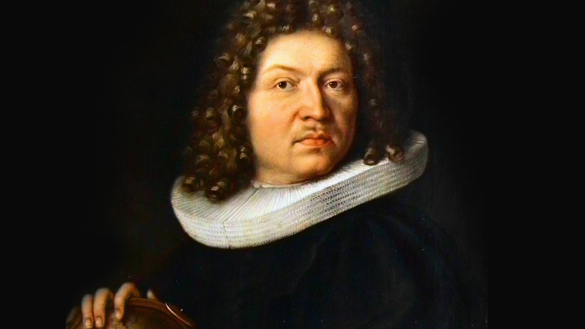
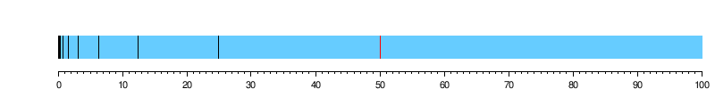
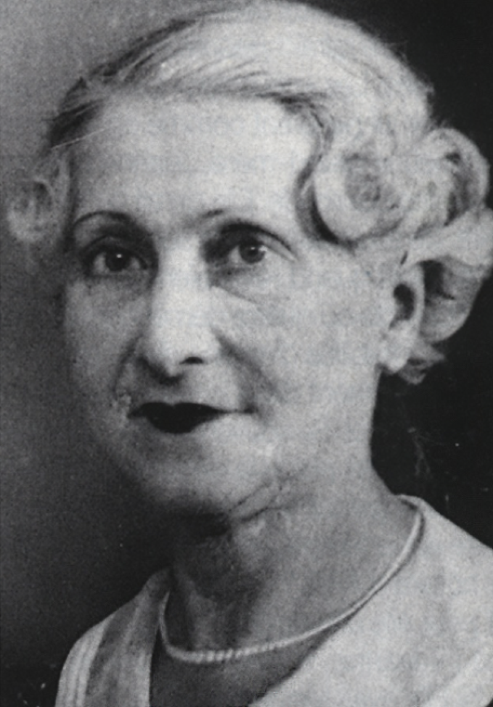
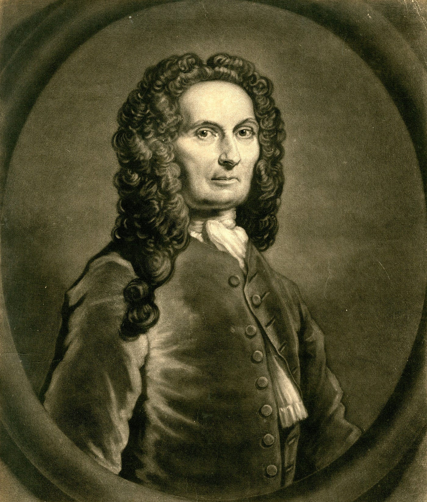
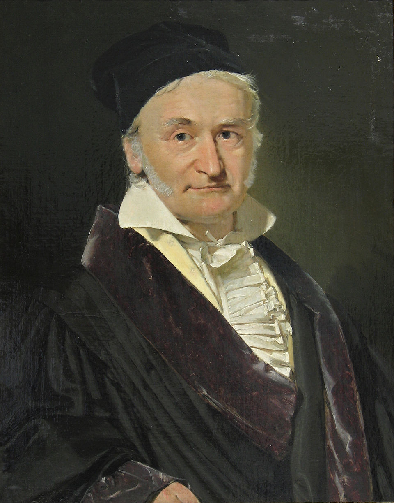

```{r, include=FALSE}
library(tidyverse)
library(flextable)
library(webexercises)
library(gt)
```

::: callout-note
## Learning Objectives

By the end of this chapter, you should be able to:

1.  Explain why an observed number is not always the same as the thing we want to understand.
2.  Describe measurement as a process that can introduce uncertainty.
3.  Distinguish between random error and systematic error.
4.  Explain how repeated observations can reveal patterns hidden by short-run variation.
5.  Use the law of large numbers to explain why long-run proportions tend to stabilise.
6.  Recognise why small samples can be misleading.
7.  Explain why averages summarise groups but do not perfectly predict individual outcomes.
8.  Interpret the mean as a measure of centre and standard deviation as a measure of variation.
9.  Describe how the bell curve can emerge from repeated chance processes.
10. Explain why the normal distribution is useful for thinking about measurement error, while recognising that not all data are bell-shaped.
:::

<centre>

```{r, echo=FALSE}
#| classes: .enlarge-image
knitr::include_graphics("images/chapter2/outline.png")
```

</centre>

<br>

## When one number feels more precise than it is

Imagine standing in a bottle shop, looking at two bottles of wine:

<center></center>

<br>

One point separates them. One point may be enough to change what a customer buys, what a shop charges, and what a winemaker can proudly print on the next vintage. But what does that one point really mean?

If the same critic tasted the same wine tomorrow, would it still receive a 90? If another critic tasted it, would they agree? If the bottle were tasted after lunch rather than before lunch, in a warm room rather than a cool one, after a different sequence of wines, or without knowing the label, would the score be the same? The number looks precise. But the process that produced the number is not perfectly precise. This is the problem of measurement.

In statistics, we often work with numbers as if they are straightforward facts. A wine receives 90 points. A student receives 73 on an exam. A political party receives 52% support in a poll. A car is measured travelling at 64 kilometres per hour. A country’s unemployment rate is reported as 4.1%. A candidate receives 12,431 votes. These numbers can be useful. They may even be the best information we have. But they are not the same as the thing we are trying to understand. They are measurements of that thing.

-   A wine score is not wine quality itself
-   An exam mark is not understanding itself
-   A poll result is not public opinion itself
-   A speed reading is not speed itself
-   A vote count is not democracy itself

Each number is produced by a process. And every process can introduce uncertainty. To see this more clearly, consider the wine rating again. Suppose we ask five critics to taste the same bottle independently. Their ratings might look like this:

```{r, echo=FALSE}

wine_ratings <- tibble(
  critic = paste("Critic", 1:5),   
  rating = c(88, 90, 91, 89, 92))  

wine_ratings |>   
  gt() |>   
  cols_label(critic = "Critic",    
             rating = "Rating") 
```

None of these ratings needs to be a mistake. The critics may all be experienced. They may all be tasting carefully. They may all be trying to be fair. Yet they do not produce exactly the same number.

The variation may come from many sources.

-   One critic may be more sensitive to acidity.
-   Another may value aroma more highly.
-   One may have tasted the wine after a very different bottle, making this one seem lighter or heavier by comparison.
-   Another may simply be having a different kind of day. Even if the critic is the same person, the score may change from one tasting to the next.

This does not mean wine ratings are worthless. It means they should be interpreted as measurements rather than truths. A useful way to think about this is:

$$
\text{Observed value} = \text{True value} + \text{Error}
$$

At this stage, we should not treat this as a perfect formula. It is more like a statistical habit of mind. It reminds us that the number we observe is not always the exact value we care about. For the wine example, we might imagine:

$$
\text{Observed wine rating} = \text{Wine quality} + \text{Rating error}
$$

The difficult part is that we usually do not get to see the true value directly. We see only the observed value. That is why measurement matters. The same issue appears in many everyday situations.

```{r,echo=FALSE}
measurement_examples <- 
  tibble(situation = c("Wine tasting",
                       "Essay grading",
                       "Speed detection",
                       "Political polling",
                       "Election counting",
                       "Medical testing"),   
         target = c("Quality of the wine",
                    "Student understanding",
                    "Actual speed of the car",
                    "Public opinion",
                    "Voters' choices",
                    "Health status"),   
         observed = c("A critic's score",
                      "A mark or grade",
                      "A radar reading",
                      "A survey estimate",
                      "A recorded vote count",
                      "A test result"))  

measurement_examples |>   
  gt() |>   
  cols_label(situation = "Situation",     
             target = "What we want to know",     
             observed = "What we observe")
```

In each case, there is a gap between the thing we want to know and the number we record. Sometimes the gap is small. Sometimes it is large. Sometimes it is mostly random. Sometimes it is systematic. Sometimes it comes from the measuring instrument. Sometimes it comes from the person doing the measuring. Sometimes it comes from the way the question was asked, the way categories were defined, or the way observations were collected. This is why a number can be both informative and uncertain.

Consider exam marks. If a student receives 73, we often behave as though 73 is an exact measurement of performance. But what if a different marker would have given the same answer 75? What if the same student, with the same level of understanding, would have scored 69 on a slightly different version of the exam? What if one question happened to focus on a topic the student revised the night before, while another equally valid question would have exposed a weakness? Again, this does not mean marks are meaningless. It means they are measurements. They contain information, but they also contain error.

The same applies to polling. Suppose a poll reports that 52% of respondents support a particular policy. It is tempting to say:

> 52% of people support the policy.

But the poll did not ask everyone. It asked a sample of people. A different sample might have produced 50%, or 53%, or 48%. The reported number is an estimate produced by a measurement process. A more careful statement would be:

> In this poll, using this sampling method, 52% of respondents supported the policy.

That version is less dramatic, but more honest.

This chapter is about learning to think in that more careful way. We will not stop using numbers. Statistics depends on numbers. But we will stop pretending that numbers speak for themselves.

Instead, whenever we see a number, we will ask:

> How was this number produced?

## Two kinds of error

Once we accept that measurement is not the same as truth, the next question is:

> In what way can a measurement be wrong?

Not all errors are the same. Some errors bounce around unpredictably. Others lean consistently in one direction. This distinction is one of the most important ideas in statistics.

Imagine a bathroom scale. You step on it five times in a row and it gives these readings:

```{r, echo=FALSE}

scale_readings <- tibble(
  attempt = paste("Attempt", 1:5),
  reading_kg = c(70.1, 69.8, 70.3, 69.9, 70.0)
)

scale_readings |>
  gt() |>
  cols_label(
    attempt = "Attempt",
    reading_kg = "Scale reading (kg)"
  )
```

The readings are not identical, but they are close. One reading is slightly high, another slightly low. The differences might be due to how you stood on the scale, tiny changes in the floor, or small imperfections in the instrument. This is an example of **random error**.

Random error is the kind of error that varies from measurement to measurement. Sometimes it pushes the observed value a little too high. Sometimes it pushes it a little too low. It does not follow an obvious direction in a single observation, but over repeated measurements we may begin to see its pattern.

Now imagine a different scale. This scale is faulty. Every time you step on it, it adds \~2 kilograms. If your true weight is 70 kilograms, the scale might show:

```{r, echo=FALSE}
biased_scale <- tibble(
  attempt = paste("Attempt", 1:5),
  true_weight_kg = rep(70, 5),
  reading_kg = c(72.1, 71.8, 72.3, 71.9, 72.0)
)

biased_scale |>
  gt() |>
  cols_label(
    attempt = "Attempt",
    true_weight_kg = "True weight (kg)",
    reading_kg = "Scale reading (kg)"
  )
```

The readings still vary a little, but they are all centred around the wrong value. The scale is not merely noisy. It is biased upward. This is an example of **systematic error**.

Systematic error occurs when a measurement process tends to push the observed value in a particular direction.

-   A faulty scale may always read too high.
-   A poorly worded survey question may consistently encourage one kind of answer.
-   A wine critic may consistently favour expensive labels.
-   A speed camera may be miscalibrated.
-   A test may consistently advantage students who are familiar with a particular cultural context.

The difference between random error and systematic error can be summarised like this:

```{r, echo=FALSE}
error_types <- tibble(
  type = c("Random error", "Systematic error"),
  description = c(
    "The measurement varies unpredictably from one observation to the next.",
    "The measurement is consistently pushed in one direction."
  ),
  example = c(
    "A wine receives 88, 90, and 91 from different critics.",
    "A scale always reads 2 kg too high."
  )
)

error_types |>
  gt() |>
  cols_label(
    type = "Type of error",
    description = "Description",
    example = "Example"
  )
```

Random error can often be reduced by taking repeated measurements. If five wine critics independently rate the same bottle, their average rating may be more stable than any one critic's score. If we weigh an object several times, the average reading may be more reliable than a single reading. If we survey more people, the random variation caused by sampling can become smaller.

But repeated measurement does not automatically fix systematic error. If a scale is always 2 kilograms too high, weighing yourself one hundred times will not solve the problem. The average of the one hundred readings will still be about 2 kilograms too high. If a poll systematically misses a group of voters, increasing the sample size may give us a very precise estimate of the wrong population. If a wine critic is influenced by the label, asking them to taste the wine repeatedly while still seeing the label may simply reproduce the same bias.

Consider political polling. Suppose a survey is conducted before an election. There are at least two different ways the result might be wrong. First, by chance, the sample might include slightly too many supporters of one party. If another random sample were taken, the result might be slightly different. This is random error. Second, the survey might systematically miss young renters, people who work irregular hours, or people who do not answer unknown phone numbers. If those people vote differently from the people who are reached, the poll may be biased. This is systematic error. The two problems require different responses. To reduce random sampling error, we might increase the sample size. To reduce systematic error, we need to improve the measurement process: who is sampled, how they are contacted, how responses are weighted, and how questions are asked.

The same idea applies to grading. Suppose two markers grade the same essay. One gives it 72 and another gives it 76. That difference may reflect random variation in judgement. A clear rubric, double marking, or averaging across markers may help. But suppose an assessment systematically rewards students who already know a particular social, cultural, or professional context. In that case, the assessment may be biased. Marking more essays will not fix the problem. The measurement process itself needs to be examined.

The wine example shows both forms of error. A critic might give the same wine slightly different scores on different days. That is random error. But if the critic consistently gives higher scores to wines with prestigious labels, that is systematic error. If the tasting is not blind, the score may reflect both the wine and the critic's expectations. This is why blind tasting is so valuable. It is not designed to remove all variation. Critics may still disagree. But it can reduce one particular source of systematic error: the influence of knowing the label, price, region, or reputation of the wine.

We can now return to the simple measurement equation from the previous section:

$$
\text{Observed value} = \text{True value} + \text{Error}
$$

We can make it more informative by separating error into two parts:

$$
\text{Observed value} = \text{True value} + \text{Systematic error} + \text{Random error}
$$

This formula is still a simplification. In real settings, the “true value” may be difficult to define, and the two kinds of error may be tangled together. But the formula gives us a useful way to think. For example:

$$
\text{Observed wine score} =
\text{Wine quality}
+
\text{Critic bias}
+
\text{Tasting variation}
$$

When we see a number, we should ask:

-   Could this number be a little different if the measurement were repeated?
-   Is the measurement process likely to push the number consistently upward or downward?
-   Would more observations help?
-   Or is the problem built into the way the measurement is being made?

These questions will return throughout the chapter. They are also the reason probability becomes so important for statistics. If random error is part of measurement, then we need a way to understand how much random variation to expect.

That is where the next example (Joseph Jagger) takes us.

::: callout-note
### Case Study: Joseph Jagger

Joseph Jagger (1830 - 1892) not a magician, psychic, or gambler in the usual romantic sense. He was an engineer and mechanic from Yorkshire, and that background mattered. He understood machines. He knew that real machines are not perfect mathematical objects. They wear down. They wobble. Their surfaces become uneven. Their parts are made, assembled, repaired, and used by human beings.

Roulette, however, depends on the idea that the wheel behaves as though it were perfect. A European roulette wheel has 37 numbered compartments: 1 through 36, plus 0. When the wheel is spun, a small ball eventually lands in one of these compartments. If the wheel is fair, each number should have the same chance of appearing:

$$
P(\text{any particular number}) = \frac{1}{37}
$$

The casino pays less than true fairness would require. If you bet on a single number and win, you are paid 35 to 1, even though there are 37 possible outcomes. That difference is the house edge. In the long run, if the wheel is fair, the casino wins. But Jagger asked a different question:

> What if the wheel is not fair?

This was a measurement question. Jagger was not trying to predict the next spin by luck or intuition. He was trying to measure the behaviour of the wheel. In 1873, he travelled to Monte Carlo with his savings and hired six assistants, one for each of the casino’s roulette wheels. Their task was simple but tedious: watch the wheels and record the numbers that came up. Each day, while the casino was open, the assistants collected observations. Each night, Jagger analysed the counts.

For six days, he looked for a pattern. On five of the wheels, he found nothing useful. The numbers varied, of course, but not in a way that gave him confidence. On the sixth wheel, however, something stood out. Nine numbers appeared more often than expected:

$$
7,\ 8,\ 9,\ 17,\ 18,\ 19,\ 22,\ 28,\ 29
$$

Jagger had found what every statistician hopes to find when analysing noisy data: a possible signal. The next day, he went to the casino and began betting heavily on those nine numbers. By the end of the day, he was up \$70,000. This is the dramatic part of the story, but the statistical part is even more important. Jagger won because he treated the roulette wheel as a physical measurement system. He did not assume that the official probabilities were correct. He collected data and compared what the wheel actually did with what a fair wheel should have done.

We can summarise his reasoning like this:

```{r, echo=FALSE}
jagger_reasoning <- tibble(
  step = c(
    "1. Statistical model",
    "2. Measurement",
    "3. Comparison",
    "4. Interpretation",
    "5. Action"
  ),
  jagger_example = c(
    "A fair roulette wheel should give each number probability 1/37",
    "Assistants recorded the numbers produced by each wheel",
    "Jagger compared observed counts with what fairness would suggest",
    "One wheel seemed to favour certain number.",
    "Jagger bet on the numbers that appeared too often"
  )
)

jagger_reasoning |>
  gt() |>
  cols_label(
    step = "Step",
    jagger_example = "Jagger's investigation"
  )

```

The casino quickly realised something was wrong. Other players noticed Jagger winning and began following his bets. Inspectors watched him closely, looking for cheating or a hidden trick. But Jagger was not cheating. He was exploiting measurement error in the wheel.

Over the next few days, his winnings grew. By the fourth day of betting, he had accumulated around \$300,000. The casino needed to stop him. They did something clever. They switched the wheel. At first, Jagger began to lose. This is an important detail. He did not lose every spin, just as he had not won every spin before. Gambling, even with an advantage, still contains randomness. But now the balance had changed. Previously, he had been winning more often than losing. After the switch, he was losing more often than winning. This is what makes signal and noise difficult. The change did not announce itself instantly. It appeared through the accumulation of results.

Jagger eventually noticed something small but crucial. During his winning days, he had seen a tiny scratch on the wheel. Now the scratch was gone. The most likely explanation was not that the scratch had been repaired. It was that the casino had moved the wheel. So Jagger looked around. Another wheel had the scratch. He moved to that wheel and began winning again.

This moment is worth pausing over. Jagger’s success depended on recognising that his data were attached to a particular physical object. The favourable numbers were not magical numbers. They were not lucky numbers. They belonged to one imperfect wheel. Once the wheel changed, the pattern changed. A pattern may exist only under a particular measurement process. Change the process, and the pattern may disappear.

Eventually, the casino worked out more of what was happening. They began moving the frets, the dividers between the numbered compartments, so that the wheel’s imbalance would favour different numbers each day. Once the favoured numbers changed, Jagger’s advantage disappeared. He began losing again and finally stopped. Even so, he left Monte Carlo with about \$325,000, a huge sum at the time.

Jagger had beaten the casino, but not by defeating randomness. He won by discovering that the randomness was not quite random. If a roulette wheel is perfectly fair, uneven results will still occur. Some numbers will appear more often than others over a short period. A fair wheel does not politely arrange itself so that every number appears exactly the same number of times. Randomness produces clusters, streaks, gaps, and surprises. So when Jagger observed that some numbers appeared more often than others, there were two possible explanations:

```{r, echo=FALSE}
jagger_explanations <- tibble(
  explanation = c(
    "Random variation",
    "Systematic bias"
  ),
  meaning = c(
    "The wheel is fair, but chance has produced uneven counts.",
    "The wheel is physically imperfect, so some numbers really are more likely."
  ),
  implication = c(
    "The apparent pattern may disappear with more spins.",
    "The pattern may persist as long as the same wheel is used."
  )
)

jagger_explanations |>
  gt() |>
  cols_label(
    explanation = "Possible explanation",
    meaning = "Meaning",
    implication = "What we would expect over time"
  )
```

Jagger’s problem was to decide whether the observed pattern was large and persistent enough to act on. That is the problem of signal and noise.

-   A signal is a real pattern that tells us something about the process being measured. In Jagger’s case, the signal was the wheel’s physical bias.
-   Noise is random variation that looks meaningful but does not reflect a real underlying pattern. A fair wheel might make one number appear unusually often for a while, but that does not mean the number is truly favoured.

```{r, echo=FALSE}
signal_noise_jagger <- tibble(
  term = c("Signal", "Noise"),
  general_meaning = c(
    "A real pattern in the process being measured.",
    "Random variation that may look like a pattern."
  ),
  jagger_example = c(
    "A physical imperfection makes some roulette numbers more likely.",
    "A fair wheel happens to produce uneven counts over a short run."
  )
)

signal_noise_jagger |>
  gt() |>
  cols_label(
    term = "Term",
    general_meaning = "General meaning",
    jagger_example = "Jagger example"
  )
```

This is why Jagger needed many observations. One spin tells us almost nothing. Ten spins tell us very little. Even after many spins, there is still a chance that the apparent pattern is just luck. But the more data Jagger collected, the more clearly he could compare the wheel’s observed behaviour with the behaviour expected from a fair wheel.

The lesson is not that every apparent pattern should be trusted. It is almost the opposite. Many patterns are illusions. If we stare at random data for long enough, some parts of it will look meaningful.

-   A roulette number may appear several times in a short sequence.
-   A student may receive a surprisingly high mark on one test.
-   A player may score in several consecutive games.
-   A poll may move by two percentage points.
-   A wine may receive one unusually high rating.

None of these automatically proves that something real has changed.

But Jagger’s story also shows that not every pattern is an illusion. Sometimes the wheel really is biased. Sometimes the measurement process really is distorted. Sometimes the observed results are trying to tell us something. The statistical challenge is to decide which situation we are in.

Jagger’s investigation began with the assumption of fairness:

$$
P(0) = P(1) = P(2) = \cdots = P(36) = \frac{1}{37}
$$

His data suggested that this assumption might not hold for one particular wheel. By comparing observed results with expected results, he reasoned backwards from data to process.

In probability, we often begin with a model and ask:

> If the wheel is fair, what results could it produce?

In statistics, we often begin with results and ask:

> Given what we observed, does the wheel look fair?

Jagger’s story sits exactly at that turning point. It shows how data can be used to investigate an unseen process. It also shows why we must be careful. Random variation can create false patterns, but systematic bias can create real ones. Jagger won because he found a real bias hiding inside what was supposed to be a random system. The next question is how this becomes possible at all. Why does collecting more observations help? Why are short runs so unreliable, while long runs can reveal structure?

That takes us to Bernoulli and the law of large numbers.
:::

## Bernoulli and the law of large numbers

Jacob Bernoulli was born in Basel, Switzerland, in 1654, into a family that would become one of the most remarkable mathematical families in European history. Several Bernoullis became famous mathematicians, but Jacob was one of the first to see that probability might become something more than a set of clever rules for gambling.

<center>

```{r}
#| fig-cap: "Image Source: https://www1.wdr.de/stichtag/stichtag-392.html"
#| echo: false


```

</center>

In the world Bernoulli inherited, probability was closely tied to games of chance. Dice, cards, lotteries, and wagers were the natural places to think mathematically about uncertainty. This made sense. In many games, the possible outcomes are clearly defined. A die has six faces. A deck has a fixed number of cards. A lottery has a known number of tickets. If we know the structure of the game, we can often calculate the probability before anything happens.

For example, if a fair die is rolled, the probability of rolling a six is:

$$
P(\text{six}) = \frac{1}{6}
$$

If a fair coin is tossed, the probability of heads is:

$$
P(\text{heads}) = \frac{1}{2}
$$

These probabilities come from symmetry. We do not need to toss the coin 10,000 times to know that a fair coin has two equally possible sides. We do not need to roll the die forever to know that a fair six-sided die has six equally possible faces. For games of chance, this approach is powerful.

But Bernoulli saw a problem. What about events where the possible outcomes are not arranged so neatly?

-   What is the probability that a person of a certain age will die within the next year?
-   What is the probability that a medical treatment will work?
-   What is the probability that a witness is telling the truth?
-   What is the probability that a political candidate will win an election?
-   What is the probability that a machine is faulty?

In these cases, there is no obvious die to inspect. There may be no clean sample space. We cannot simply count equally likely cases and divide. So where do the probabilities come from? Bernoulli’s answer was that, in many cases, probabilities must be learned through observation.

This is the key link back to Jagger. Joseph Jagger came after Bernoulli, but his method illustrates Bernoulli’s idea beautifully. Jagger did not know the true probabilities of the roulette wheel in advance. Officially, each number on a European roulette wheel should have probability:

$$
\frac{1}{37}
$$

But Jagger suspected that the actual wheel might not behave like the official mathematical wheel. So he observed it. He counted outcomes. He looked for stable patterns in repeated spins. In other words, he treated probability not only as something calculated from an ideal model, but as something that could be discerned through data. That shift is enormous. It moves probability from the gambling table into the world.

Bernoulli wanted to understand how repeated observations could teach us about an unknown probability. If we observe enough cases, can the pattern in the data reveal the underlying chance process?

Before stating his famous result, it is useful to pause on a mathematical idea that sits quietly behind it: the idea of approaching a limit. A limit is a value that a sequence gets closer and closer to, even if the early terms jump around or even if the value is never reached exactly at any particular step. One of the oldest ways to feel this idea is through Zeno’s paradox.

::: callout-note
### Zeno's Paradox

Zeno of Elea (c. 490–430 BC) was a pre-Socratic Greek philosopher from the city of Elea. He is famous for creating thought experiments, or paradoxes, that challenge our understanding of space, time, and motion.

One of his paradoxes goes something like this:

> Suppose Atalanta wishes to walk to the end of a path. Before she can get there, she must get halfway there. Before she can get halfway there, she must get a quarter of the way there. Before traveling a quarter, she must travel one-eighth; before an eighth, one-sixteenth; and so on.

<centre></centre>

There are infinitely many pieces in this sequence. That seems troubling. If Atalanta must complete infinitely many pieces of the journey, how can she ever arrive?

$$
\frac{1}{2},\ \frac{1}{4},\ \frac{1}{8},\ \frac{1}{16},\ \ldots
$$

At first, Zeno’s reasoning feels persuasive. Every time Atalanta completes one part of the journey, another smaller part remains. The process never seems to end. But the important detail is that the pieces are not all the same size. They shrink very quickly.

This is exactly the sort of situation where the ideas of sequence, series, and limit become useful. Rather than trying to add infinitely many terms at once, let us look at the journey one stage at a time.

After the first interval, Atalanta has travelled:

$$
\frac{1}{2} \text{ of a meter}
$$

After the second interval, she has travelled:

$$
\frac{1}{2} + \frac{1}{4} = \frac{3}{4} \text{ of a meter}
$$

After the third interval, she has travelled:

$$
\frac{1}{2} + \frac{1}{4} + \frac{1}{8} = \frac{7}{8} \text{ of a meter}
$$

After the fourth interval, she has travelled:

$$
\frac{1}{2} + \frac{1}{4} + \frac{1}{8} + \frac{1}{16} = \frac{15}{16} \text{ of a meter}
$$

These totals form a new sequence:

$$
\frac{1}{2},\ \frac{3}{4},\ \frac{7}{8},\ \frac{15}{16},\ \ldots
$$

There is a clear pattern. The denominators are powers of 2, and the numerators are always one less than the denominator. So after 10 intervals, Atalanta would have traveled:

$$
\frac{1023}{1024} \text{ of a meter}
$$

After 20 intervals, she would have travelled:

$$
\frac{1{,}048{,}575}{1{,}048{,}576} \text{ of a meter}
$$

Each additional interval takes Atalanta a little farther. Zeno was right about that. The total keeps increasing. But the total is not racing off toward infinity. Instead, it is getting closer and closer to 1 meter.

In mathematical language, we say that 1 is the limit of the sequence of partial sums:

$$
\lim_{n \to \infty}
\sum_{k = 1}^{n} \frac{1}{2^k}
= 1
$$

For our purposes, the deeper lesson is not about walking across a room. It is about what it means for a sequence to settle toward a value. A process can keep going, step after step, while the accumulated result approaches a fixed limit.
:::

Just as Zeno’s partial distances get closer and closer to 1 meter, Bernoulli showed that long-run relative frequencies can get closer and closer to the probabilities that generate them. Zeno helps us understand the idea of approaching a limit; Bernoulli applies a similar way of thinking to repeated observations under uncertainty.

Bernoulli worked on this result for nearly 20 years and regarded it as one of his greatest achievements. He called it his “golden theorem.” Today, it is usually known as the law of large numbers. The theorem has many real-world applications, but its central message is simple: a small number of observations may be misleading, while a large number of repeated observations can begin to reveal the underlying probability. We will start with a simple example of the kind Bernoulli himself used, which I have modified slightly for the modern reader:

*Suppose a box contains 300 white balls and 200 black balls. In other words, 60% of the balls are white and 40% are black. Now imagine drawing one ball at random, recording its colour, placing it back in the box, mixing the balls, and drawing again. Because the ball is replaced each time, the probability of drawing a white ball remains the same on every draw:*

$P(white)=300/500=0.60$

Bernoulli’s question was not simply whether white balls are more likely than black balls. In this example, we already know that they are. His deeper question was about repeated observation:

> If the true probability of drawing a white ball is 60%, how close should the observed proportion of white balls be to 60% after many draws, and how confident can we be that it will be close?

A small number of draws may easily give a proportion quite far from 60%. But as the number of draws increases, Bernoulli showed that the observed proportion should become increasingly likely to lie near the true probability.

After 10 draws, we might observe 7 white balls:

$$
\hat{p} = \frac{7}{10} = 0.7.
$$

After 100 draws, we might observe 63 white balls:

$$
\hat{p} = \frac{63}{100} = 0.63.
$$

After 1000 draws, we might observe 604 white balls:

$$
\hat{p} = \frac{604}{1000} = 0.604.
$$

The observed proportion is not exactly 0.6 at every stage. It can wander. But with more observations, it tends to become more stable.

```{r, echo=FALSE}
urn_examples <- tibble(
  draws = c(10, 100, 1000, 10000),
  black_balls_observed = c(7, 63, 604, 5991),
  observed_proportion = black_balls_observed / draws
)

urn_examples |>
  gt() |>
  fmt_number(
    columns = observed_proportion,
    decimals = 3
  ) |>
  cols_label(
    draws = "Number of draws",
    black_balls_observed = "Black balls observed",
    observed_proportion = "Observed proportion"
  )
```

In notation, we might write:

$$
\hat{p}_n \to p
$$

where $\hat{p}_n$ is the observed proportion after $n$ observations, and $p$ is the true underlying probability.

This small piece of notation contains a large idea. The observed proportion is not guaranteed to equal the true probability. It is not guaranteed to move smoothly. It may jump around, especially early on. But with enough observations, it tends to settle.

A simulation makes this easier to see:

```{r, echo=FALSE}
set.seed(2420)

urn_draws <- tibble(
  draw = 1:1000,
  result = sample(
    c("Black", "White"),
    size = 1000,
    replace = TRUE,
    prob = c(0.6, 0.4)
  ),
  black_so_far = cumsum(result == "Black"),
  observed_proportion = black_so_far / draw
)

urn_draws |>
  ggplot(aes(x = draw, y = observed_proportion)) +
  geom_line() +
  geom_hline(yintercept = 0.6, linetype = "dashed") +
  labs(
    x = "Number of draws from the box",
    y = "Observed proportion of white balls"
  )
```

In the early draws, the proportion may move sharply. One extra white ball can change the observed proportion dramatically. Later, each new draw has less influence on the accumulated proportion. The line may still wander, but it usually wanders less. This is why repeated observation is powerful.

However, we need to be careful. The law of large numbers does not say that more data automatically give us the truth. It helps with random variation, not necessarily systematic bias. If a box is shaken properly and the draws are made fairly, repeated draws can help us learn its composition. But if the balls are not mixed, or if one colour is easier to draw, or if someone records the colours incorrectly, then more observations may simply give us a more precise version of the wrong answer.

The same warning applies everywhere.

-   A large poll can still be biased if it misses part of the population.
-   A large set of wine ratings can still be biased if all critics are influenced by the label.
-   A large number of exam marks can still mislead if the assessment does not measure the kind of understanding we care about.
-   A roulette wheel can only be studied properly if we know which physical wheel produced the observations.

This is the lesson that connects Bernoulli back to measurement. Repeated observations can reduce random error. They can help us see stable patterns. They can allow us to estimate probabilities that cannot be calculated in advance. But they do not remove the need to ask how the data were produced.

## The danger of small numbers

Consider a simple coin example. Suppose you watch someone flip a coin four times, and the result is:

$$
H,\ H,\ H,\ H
$$

Four heads in a row feels suspicious. It is natural to wonder whether the coin is biased, or whether the person flipping it is doing something unusual. But before we jump to that conclusion, we should ask: how surprising is this result if the coin is actually fair?

For a fair coin, the probability of heads on each flip is:

$$
P(H) = \frac{1}{2}
$$

So the probability of four heads in a row is:

\$\$ P(HHHH) =

\frac{1}{2}
\times
\frac{1}{2}
\times
\frac{1}{2}
\times
\frac{1}{2}

= \frac{1}{16}

= 0.0625

\$\$

So four heads in a row is unusual, but not astonishing (6.25%). If many people flipped coins four times, we would expect some of them to get four heads. Seeing four heads should make us curious, but it is not enough on its own to prove that the coin is biased.

Now suppose the same person flips the coin ten times, and the result is:

$$
H,\ H,\ H,\ H,\ H,\ H,\ H,\ H,\ H,\ H
$$

This feels much more suspicious. Again, under the fair coin model:

\$\$ P(10 \text{ heads in a row})

= \left(\frac{1}{2}\right)\^{10}

\frac{1}{1024}
\approx 0.00098

\$\$

Ten heads in a row does not logically prove that the coin is biased. Rare events can happen. But it gives us much stronger reason to question the fairness of the coin than four heads in a row. The same kind of result can mean different things depending on how much evidence we have. Four heads in a row may be a coincidence. Ten heads in a row is harder to dismiss.

But even then, we should be careful. The conclusion is not automatically:

> The coin is biased.

A better conclusion is:

> This result would be quite unlikely if the coin were fair, so the fairness of the coin is worth questioning.

Statistical thinking does not require us to ignore surprising patterns. It asks us to compare those patterns with what chance alone might reasonably produce. This is why small samples are dangerous. They often look more informative than they really are.

Suppose a new café opens and receives two online reviews. Both are five stars. It would be tempting to say:

> This café is excellent.

But two reviews are not enough to know. Perhaps the first two reviewers were the owner’s friends. Perhaps they happened to visit on a good day. Perhaps they love that particular style of food. Perhaps the next ten customers will be less impressed.

Now suppose the café has 200 reviews and an average rating of 4.8 stars. That still does not prove the café is excellent, but it is stronger evidence. The rating is based on many more experiences. A few unusually enthusiastic customers have less power to dominate the average.

The same logic applies to wine ratings. If one critic gives a wine 95, the rating may be informative, but it may also be unusual. Perhaps that critic particularly likes the style. Perhaps the bottle tasted better than usual. Perhaps the tasting conditions helped. If twenty independent critics give the wine ratings between 93 and 96, the evidence is much stronger.

Small numbers are also dangerous in sport. A basketball player who makes 4 shots out of 5 has an 80% shooting rate for that small set of shots:

$$
\hat{p} = \frac{4}{5} = 0.8
$$

But we should be careful. Five shots do not tell us very much about the player’s long-run ability. A weaker shooter can make 4 out of 5 by chance. A strong shooter can miss 4 out of 5 by chance. Short sequences are noisy.

If the same player makes 400 shots out of 500, then the 80% figure becomes much more meaningful:

$$
\hat{p} = \frac{400}{500} = 0.8
$$

Again, the proportion is the same. The strength of the evidence is not.

```{r, echo=FALSE}
shooting_examples <- tibble(
  situation = c(
    "Small sample",
    "Large sample"
  ),
  made = c(4, 400),
  attempted = c(5, 500),
  shooting_percentage = made / attempted,
  what_to_say = c(
    "A short streak; interpret cautiously",
    "Much stronger evidence of shooting ability"
  )
)

shooting_examples |>
  gt() |>
  fmt_percent(
    columns = shooting_percentage,
    decimals = 0
  ) |>
  cols_label(
    situation = "Situation",
    made = "Shots made",
    attempted = "Shots attempted",
    shooting_percentage = "Shooting percentage",
    what_to_say = "Careful interpretation"
  )
```

This is sometimes called the **law of small numbers**. The name is a little playful, because it is not a true mathematical law like Bernoulli’s law of large numbers. It refers to a common mistake in human thinking: the belief that a small sample should already look like the larger population or process it came from.

We expect short sequences to behave too neatly. We expect 10 coin tosses to look roughly like 50% heads and 50% tails. We expect a small poll to resemble the electorate. We expect one exam to reveal a student’s true understanding. We expect a handful of reviews to reveal the quality of a restaurant. We expect one week of sales to reveal whether a business is succeeding.

But small samples do not have to behave. They can be lopsided. They can be unrepresentative. They can produce extreme results. And because extreme results attract attention, small samples can be especially misleading. A useful way to remember this is:

> The smaller the sample, the louder the noise.

This does not mean we should ignore small samples. Sometimes small samples are all we have. Early data can be useful. One poor quiz result may suggest that a student needs help. One unusual medical result may call for follow-up. A sudden change in sales may deserve attention. Jagger himself began with observed imbalances before he knew whether they were meaningful.

The point is not to dismiss small samples. The point is to treat them with the right level of caution. A small sample can raise a question. It should rarely settle the question.

Some quantities describe groups quite well, but fail when we apply them too confidently to individuals. A life expectancy, for example, may summarise many lives. But can it tell us how long one person will live?

That question takes us to Jeanne Calment.

## The problem of individual prediction

Jeanne Calment was born in France in 1875. Her life stretched across an almost unbelievable span of history. She was alive before the invention of the modern automobile, before aeroplanes, before radio, before television, before antibiotics, and before the First World War. As a teenager, she even encountered Vincent van Gogh in her father’s shop.

<center>

```{r}
#| fig-cap: "Image Source: https://forgottennewsmakers.com/"
#| echo: false
#| out-width: "50%"
#| fig-align: "center"


```

</center>

By the time Calment was 90 years old, she owned an apartment but needed money to live on. So she made an arrangement with a 47-year-old lawyer. The lawyer would pay her a small monthly amount for the rest of her life. In exchange, when she died, he would inherit the apartment.

At first glance, this may have seemed like a sensible deal for the lawyer. Calment was already 90. The lawyer was only 47. If she lived only a few more years, he would eventually receive an apartment for far less than its full value. But randomness had other plans. Calment turned 100. Then she turned 110. The lawyer kept paying. Then, in 1995, the lawyer himself died. Calment was still alive. She eventually died in 1997 at the age of 122, becoming one of the longest-lived people ever recorded.

The lawyer’s mistake was not necessarily that he ignored statistics. More likely, he misunderstood what the statistics could tell him. A number such as life expectancy sounds as though it should answer a simple question:

> How long will this person live?

But that is not quite what life expectancy does.

> Life expectancy is a summary of a group. It tells us something about the average pattern across many lives. It does not tell us the exact path of one particular life.

Suppose we say that the life expectancy of a certain population is 80 years. That does not mean every person dies at 80. Some people die in infancy. Some die in early adulthood. Many die in old age. A small number live far beyond 100. The average may be 80, but the individual lives are scattered around that average.

In other words, the average is not a prophecy.

```{r, echo=FALSE}

life_expectancy_questions <- tibble(
  question = c(
    "How long do people in this population live on average?",
    "How long does a person aged 90 usually live from now?",
    "How long will Jeanne Calment live?"
  ),
  type_of_question = c(
    "Population summary",
    "Conditional population summary",
    "Individual prediction"
  ),
  careful_interpretation = c(
    "Useful for describing a group, not a guarantee for each person.",
    "More relevant than life expectancy at birth, because the person has already reached 90.",
    "Highly uncertain, even with good population data."
  )
)

life_expectancy_questions |>
  gt() |>
  cols_label(
    question = "Question",
    type_of_question = "Type of question",
    careful_interpretation = "Careful interpretation"
  )
```

There is another important detail. The relevant question for Calment was not:

> How long does the average person live from birth?

The relevant question was:

> Given that she has already reached 90, how much longer might she live?

These are different questions.

A person who has already reached 90 has already survived all the risks that might have ended life earlier. They did not die in childhood. They did not die in a car accident at 25. They did not die of illness at 50. They have already passed through many hazards. So their remaining life expectancy is not calculated from birth. It is conditional on having already reached 90.

This is an example of conditional thinking.

In probability language, we are not asking simply about the probability of living to a certain age. We are asking about the probability of living longer, given that a person has already lived to some age.

For example, compare these two questions:

$$
P(\text{live to 100})
$$

and

$$
P(\text{live to 100} \mid \text{already lived to 90})
$$

These are not the same.

Many people in a population may not live to 100. But among those who have already reached 90, the chance of reaching 100 is much higher than it was at birth. The group has changed. We are no longer talking about everyone born in a particular year. We are talking only about those who survived to 90.

That is why the condition matters.

```{r, echo=FALSE}
conditional_life <- tibble(
  probability_statement = c(
    "P(live to 100)",
    "P(live to 100 | already lived to 90)"
  ),
  plain_language = c(
    "The chance that a newborn eventually reaches 100.",
    "The chance that a 90-year-old reaches 100."
  ),
  why_it_differs = c(
    "Includes all early and middle-life risks.",
    "Only includes people who have already survived to age 90."
  )
)

conditional_life |>
  gt() |>
  cols_label(
    probability_statement = "Probability statement",
    plain_language = "Plain-language meaning",
    why_it_differs = "Why this matters"
  )
```

This distinction connects directly to measurement and error. When we measure a population, we often summarise it with a single number: an average, a percentage, a rate, or a probability. These summaries are useful. They compress many observations into something we can understand. But compression comes at a cost. A single number hides variation.

Imagine a very simple population of ten people with the following ages at death:

```{r, echo=FALSE}
lifespans <- tibble(
  person = paste("Person", 1:10),
  age_at_death = c(62, 70, 74, 78, 80, 83, 86, 89, 94, 104)
)

lifespans |>
  gt() |>
  cols_label(
    person = "Person",
    age_at_death = "Age at death"
  )
```

The mean age at death is:

```{r, echo=FALSE}
lifespan_summary <- lifespans |>
  summarise(
    mean_age = mean(age_at_death),
    youngest = min(age_at_death),
    oldest = max(age_at_death),
    range = oldest - youngest
  )

lifespan_summary |>
  gt() |>
  fmt_number(
    columns = mean_age,
    decimals = 1
  ) |>
  cols_label(
    mean_age = "Mean age at death",
    youngest = "Youngest age",
    oldest = "Oldest age",
    range = "Range"
  )

```

The average is useful. It tells us something about the centre of the group. But it does not describe any one person perfectly. In this small example, not a single person dies exactly at the mean. Some die much earlier. Some die much later. This is the danger of treating an average as though it were an individual prediction.

The lawyer in Calment’s story was not necessarily wrong to think statistically. In fact, the arrangement itself depended on a statistical idea. People who sell annuities, life insurance, pensions, and similar products rely on the fact that lifespans are uncertain for individuals but patterned in groups. If an insurance company sells policies to thousands of people, it does not need to know exactly when each person will die. It needs the group pattern to be stable enough. Some people will die earlier than expected. Some will live longer than expected. Across many people, these differences may partly balance out. But the lawyer made a private deal with one person. That changed everything. For an insurance company, Jeanne Calment would have been one observation among many. For the lawyer, she was the whole dataset. The mathematics of averages works best when there are many observations. It is much more fragile when applied to a single case. We can express this idea informally as:

$$
\text{Individual outcome} = \text{Group pattern} + \text{Individual variation}
$$

For lifespans, this becomes:

$$
\text{Population life expectancy}
+
\text{Individual variation}
$$

The individual variation is not a small technical detail. It is the part of the equation where much of life happens. It includes genetics, health, diet, wealth, occupation, medical care, accidents, environment, behaviour, and luck. Some of those factors can be measured. Some cannot. Some are known only after the fact. This is why individual prediction is hard. When we know the average, we know something. But we do not know everything. We should therefore be careful with statements such as:

> The life expectancy is 80, so this person will live to about 80.

A more careful statement is:

> In this population, the average lifespan is about 80, but individual lifespans vary, sometimes greatly.

That difference in wording matters. The first statement treats the average as a forecast for a person. The second treats the average as a summary of a distribution. This distinction appears throughout statistics.

-   An average exam mark does not tell us how every student performed.
-   An average wine rating does not tell us whether every critic agreed.
-   An average income does not tell us how income is distributed.
-   An average life expectancy does not tell us when one person will die.

Each average needs a companion question:

> How much variation is there?

## What averages reveal, and what they hide

Jeanne Calment’s story shows why averages must be handled carefully. A life expectancy may summarise a population, but it does not tell us exactly how long one person will live. The same is true of many statistical summaries. An average can be useful. It gives us a centre. It compresses many observations into one number. It lets us compare groups, track change, and describe patterns that would otherwise be hard to see. But an average is also a compression. Something is gained, but something is lost.

When we say that the average lifespan in a population is 80 years, we are not saying that everyone dies at 80. Some people die much younger. Some live much longer. The average gives us the centre of the distribution, but it hides the spread.

The same issue appears in the wine example from the beginning of the chapter. Suppose five critics taste Wine A and give the following scores:

```{r, echo=FALSE}

wine_a <- tibble(
  critic = paste("Critic", 1:5),
  rating = c(88, 89, 90, 91, 92)
)

wine_a |>
  gt() |>
  cols_label(
    critic = "Critic",
    rating = "Wine A rating"
  )
```

The mean rating is:

\$\$

\bar{x} =

\frac{88 + 89 + 90 + 91 + 92}{5}

=90

\$\$

Now suppose another wine, Wine B, receives these ratings:

```{r, echo=FALSE}
wine_b <- tibble(
  critic = paste("Critic", 1:5),
  rating = c(80, 85, 90, 95, 100)
)

wine_b |>
  gt() |>
  cols_label(
    critic = "Critic",
    rating = "Wine B rating"
  )
```

The mean rating is also:

\$\$

\bar{x} =

\frac{80 + 85 + 90 + 95 + 100}{5}

= 90

\$\$

If we look only at the average, the two wines appear identical. Both are “90-point wines”. But they are not the same kind of 90.

-   Wine A receives scores that are tightly clustered around 90. The critics mostly agree. One gives 88, another gives 92, but nobody is far from the centre.
-   Wine B receives scores ranging from 80 to 100. The average is still 90, but the critics disagree strongly. Some seem unimpressed. Others think the wine is exceptional.

The average alone hides this difference.

```{r, echo=FALSE}
wine_comparison <- tibble(
  wine = c("Wine A", "Wine B"),
  ratings = c(
    "88, 89, 90, 91, 92",
    "80, 85, 90, 95, 100"
  ),
  mean_rating = c(90, 90),
  interpretation = c(
    "Critics mostly agree",
    "Critics strongly disagree"
  )
)

wine_comparison |>
  gt() |>
  cols_label(
    wine = "Wine",
    ratings = "Ratings",
    mean_rating = "Mean rating",
    interpretation = "Interpretation"
  )
```

Variation is the part of the data that the average leaves out. To see this, we can measure how far each rating is from the mean. These differences are called **deviations**.

For Wine A, the mean is 90. The deviations are:

```{r, echo=FALSE}
wine_a_deviations <- wine_a |>
  mutate(
    mean_rating = mean(rating),
    deviation = rating - mean_rating
  )

wine_a_deviations |>
  gt() |>
  fmt_number(
    columns = c(mean_rating, deviation),
    decimals = 1
  ) |>
  cols_label(
    critic = "Critic",
    rating = "Rating",
    mean_rating = "Mean",
    deviation = "Deviation from mean"
  )
```

For Wine B, the mean is also 90, but the deviations are much larger:

```{r, echo=FALSE}
wine_b_deviations <- wine_b |>
  mutate(
    mean_rating = mean(rating),
    deviation = rating - mean_rating
  )

wine_b_deviations |>
  gt() |>
  fmt_number(
    columns = c(mean_rating, deviation),
    decimals = 1
  ) |>
  cols_label(
    critic = "Critic",
    rating = "Rating",
    mean_rating = "Mean",
    deviation = "Deviation from mean"
  )
```

In both cases, the deviations add to zero. The ratings below the mean balance the ratings above the mean. This is not an accident. The mean is the balancing point of the data.

For Wine A:

$$
(-2) + (-1) + 0 + 1 + 2 = 0
$$

For Wine B:

$$
(-10) + (-5) + 0 + 5 + 10 = 0
$$

This creates a small problem. If we simply add the deviations, we get zero for both wines. That does not help us measure spread. The negative deviations cancel the positive deviations. So statisticians need a way to summarise how large the deviations are without letting the signs cancel out. One simple option is to ignore the signs and look at the size of the deviations. Another common option is to square the deviations, making them all positive.

That is the idea behind variance and standard deviation. At this stage, we do not need the full formula (although you can see an example of it [here](https://m2huynh.github.io/ETC1000/02-Analysing-numerical-data.html#variance)). We only need the interpretation:

> Standard deviation measures how far observations typically sit from the mean.

A small standard deviation means the observations are tightly clustered around the mean. A large standard deviation means the observations are more spread out. For our two wines:

```{r, echo=FALSE}
wine_sd_summary <- tibble(
  wine = c("Wine A", "Wine B"),
  ratings = c(
    "88, 89, 90, 91, 92",
    "80, 85, 90, 95, 100"
  ),
  mean_rating = c(mean(wine_a$rating), mean(wine_b$rating)),
  standard_deviation = c(sd(wine_a$rating), sd(wine_b$rating))
)

wine_sd_summary |>
  gt() |>
  fmt_number(
    columns = c(mean_rating, standard_deviation),
    decimals = 2
  ) |>
  cols_label(
    wine = "Wine",
    ratings = "Ratings",
    mean_rating = "Mean rating",
    standard_deviation = "Standard deviation"
  )
```

Both wines have a mean of 90. But Wine B has a much larger standard deviation. That tells us that its ratings vary more. This changes the interpretation.

-   For Wine A, a score of 90 feels stable. It is a good summary of the critics’ views. The critics mostly agree, so the average is a fairly clear description.
-   For Wine B, a score of 90 is more fragile. It hides disagreement. Some critics see a very good wine; others see something much less impressive. The average is still correct, but it is less complete.

This distinction matters because averages often travel alone. We hear about average income, average rent, average exam marks, average life expectancy, average satisfaction, average rainfall, average ratings, and average treatment effects. But without variation, these averages can be misleading.

```{r, echo=FALSE}
average_hides_examples <- tibble(
  context = c(
    "Wine ratings",
    "Exam marks",
    "Income",
    "Life expectancy",
    "Polls"
  ),
  average_tells_us = c(
    "The centre of critics' ratings",
    "The centre of student performance",
    "The centre of household income",
    "The centre of lifespans",
    "The estimated level of support"
  ),
  variation_tells_us = c(
    "How much critics agree or disagree",
    "How spread out student performance is",
    "How unequal incomes are",
    "How much individual lifespans differ",
    "How uncertain the estimate may be"
  )
)

average_hides_examples |>
  gt() |>
  cols_label(
    context = "Context",
    average_tells_us = "What the average tells us",
    variation_tells_us = "What variation tells us"
  )
```

This gives us a second major lesson:

> The mean tells us about centre. Variation tells us about uncertainty, disagreement, and spread.

In measurement, both matter. If we measure the same object five times and obtain values close together, we have a different kind of evidence than if the five values are scattered widely. If five critics mostly agree about a wine, the average rating carries one kind of meaning. If they disagree sharply, the same average carries a different meaning.

Variation tells us how much the observations move around. It tells us whether an average is stable or fragile. It tells us whether repeated measurements agree or disagree. It tells us how much caution we should use when interpreting a number. The Calment story now becomes clearer. Life expectancy is an average. It is useful. But individual lifespans vary enormously around that average. Jeanne Calment’s life was extraordinary not because the average was useless, but because individual variation can be very large.

So the right question is not only:

> What is the average?

It is also:

> How much variation is there around the average?

Once we ask that question, we are ready for the next step. Repeated measurements do not merely vary. Often, they vary in patterned ways. Values close to the centre may be common. Values far from the centre may be rare. The spread may have a shape.

That idea leads us to one of the most important patterns in statistics: the bell curve.

## De Moivre and the shape of repeated chance

Repeated measurements do not merely vary. Often, they vary in patterned ways. Values close to the centre may be common. Values far from the centre may be rare. The spread may have a shape. That idea leads us to one of the most important patterns in statistics: the *bell curve*.

```{r}
bell_curve <- tibble(
  x = seq(-4, 4, length.out = 1000),
  density = dnorm(x, mean = 0, sd = 1)
)

bell_curve |>
  ggplot(aes(x = x, y = density)) +
  geom_line(linewidth = 1) +
  labs(
    x = "Value",
    y = "Density"
  )
```


But the bell curve did not first appear as a mysterious picture in a statistics textbook. It emerged from a much older question:

> What happens when we repeat a simple chance process many times?

To see this, we return to games of chance.

Abraham de Moivre was born in France in 1667, but spent much of his adult life in England. Like Pascal, Fermat, Huygens, and Bernoulli before him, he belonged to the early history of probability, when many of the central questions still came from gambling, wagers, annuities, and games.

<center>

```{r}
#| fig-cap: "Image Source: https://en.wikipedia.org/wiki/Abraham_de_Moivre"
#| echo: false
#| out-width: "50%"
#| fig-align: "center"


```

</center>

De Moivre was a gifted mathematician and a friend of Isaac Newton, but his life was not especially secure. As a Protestant in Catholic France, he left for England after the revocation of the Edict of Nantes. In England, despite his brilliance, he never obtained the kind of university position or official post that might have given him comfort. He earned a living by tutoring mathematics, advising on annuities, and solving probability problems for people who wanted answers about risk, money, and chance.

This setting matters. Probability was not born as a purely abstract subject. It grew out of practical questions:

> What is a fair wager?

> How likely is a run of wins?

> How should we price an annuity?

> What should we expect after many repetitions of the same chance event?

One of the simplest repeated chance events is the toss of a coin. If we toss a fair coin once, there are two possible outcomes:

$$
H,\ T
$$

If we toss it twice, there are four possible sequences:

$$
HH,\ HT,\ TH,\ TT
$$

But now notice something important. If we care only about the number of heads, the outcomes are not evenly distributed.

There is one way to get 0 heads:

$$
TT
$$

There are two ways to get 1 head:

$$
HT,\ TH
$$

There is one way to get 2 heads:

$$
HH
$$

So the counts are:

$$
1,\ 2,\ 1
$$

The middle outcome (one head) is already more common than the extremes, not because the coin prefers balance, but because there are more ways to get one head and one tail than to get all heads or all tails. If we toss the coin three times, there are eight possible sequences:

$$
HHH,\ HHT,\ HTH,\ THH,\ HTT,\ THT,\ TTH,\ TTT
$$

Again, count the number of heads.

```{r, echo=FALSE}
three_tosses <- tibble(
  heads = 0:3,
  ways = c(1, 3, 3, 1),
  sequences = c(
    "TTT",
    "HTT, THT, TTH",
    "HHT, HTH, THH",
    "HHH"
  )
)

three_tosses |>
  ggplot(aes(x = factor(heads), y = ways)) +
  geom_col() +
  geom_text(
    aes(label = ways),
    vjust = -0.4
  ) +
  labs(
    x = "Number of heads in three tosses",
    y = "Number of possible sequences"
  ) +
  ylim(0, 3.5)
```

These numbers should look familiar. They are rows of Pascal’s triangle.

```{r, echo=FALSE}
library(tidyverse)
library(gt)

pascal_rows <- tibble(
  tosses = c(1, 2, 3, 4, 5, 6),
  counts = c(
    "1, 1",
    "1, 2, 1",
    "1, 3, 3, 1",
    "1, 4, 6, 4, 1",
    "1, 5, 10, 10, 5, 1",
    "1, 6, 15, 20, 15, 6, 1"
  )
)

pascal_rows |>
  gt() |>
  cols_label(
    tosses = "Number of coin tosses",
    counts = "Number of ways to get 0, 1, 2, ... heads"
  )
```

Pascal’s triangle tells us how many ways each number of heads can occur. The extremes are rare because they can happen in only one way. There is only one sequence with all heads and only one sequence with all tails. The middle outcomes are common because they can happen in many different ways.

For example, with 6 tosses, there is only one way to get 6 heads:

$$
HHHHHH
$$

There is also only one way to get 0 heads:

$$
TTTTTT
$$

But there are 20 ways to get exactly 3 heads. The centre is more crowded.

```{r, echo=FALSE}
six_tosses <- tibble(
  heads = 0:6,
  ways = choose(6, heads),
  example_sequence = c(
    "TTTTTT",
    "One H, five T",
    "Two H, four T",
    "Three H, three T",
    "Four H, two T",
    "Five H, one T",
    "HHHHHH"
  )
)

six_tosses |>
  ggplot(aes(x = factor(heads), y = ways)) +
  geom_col() +
  geom_text(
    aes(label = ways),
    vjust = -0.4
  ) +
  labs(
    x = "Number of heads in six tosses",
    y = "Number of possible sequences"
  ) +
  ylim(0, 22)
```

This simple counting fact is the beginning of the bell curve. At first, with only a few tosses, the pattern is jagged. We just see a short row of numbers. But as the number of tosses grows, the shape becomes clearer. The counts pile up near the centre and thin out toward the extremes.

Imagine tossing a fair coin 20 times. The most likely result is not 20 heads or 0 heads. Those are possible, but each can happen in only one way. The most likely results are near 10 heads and 10 tails, because there are many more ways for that balance to occur.

```{r, echo=FALSE}
coin_distribution <- tibble(
  heads = 0:20,
  ways = choose(20, heads),
  probability = dbinom(heads, size = 20, prob = 0.5)
)

coin_distribution |>
  gt() |>
  fmt_number(
    columns = probability,
    decimals = 5
  ) |>
  cols_label(
    heads = "Number of heads in 20 tosses",
    ways = "Number of ways",
    probability = "Probability"
  )
```

The table contains the arithmetic, but the shape is easier to see in a graph.

```{r, echo=FALSE}
coin_distribution |>
  ggplot(aes(x = heads, y = probability)) +
  geom_col() +
  labs(
    x = "Number of heads in 20 tosses",
    y = "Probability"
  )
```

The bars rise toward the middle and fall away toward the edges. The distribution is symmetric because heads and tails are equally likely. It is centred at 10 because, in 20 fair tosses, 10 heads is the balancing point.

Now increase the number of tosses to 100.

```{r, echo=FALSE}
coin_distribution_100 <- tibble(
  heads = 0:100,
  probability = dbinom(heads, size = 100, prob = 0.5)
)

coin_distribution_100 |>
  ggplot(aes(x = heads, y = probability)) +
  geom_col() +
  labs(
    x = "Number of heads in 100 tosses",
    y = "Probability"
  )
```

The same basic pattern appears, but now it looks smoother. The distribution rises to a peak near 50 and then falls away on both sides. Values near the centre are common. Values far from the centre are rare.

This is the shape de Moivre studied. In 1733, de Moivre found a remarkable approximation. He showed that, when the number of trials is large, the jagged probabilities from repeated coin tossing can be approximated by a smooth curve. That curve rises in the middle and falls away on both sides. Today, we recognise this as an early form of the normal curve, or bell curve.

This was an important step in the history of probability. De Moivre showed that a pattern built from discrete counts could be approximated by a continuous curve. A row of separate probabilities could be replaced, approximately, by a smooth mathematical shape.

A single coin toss is only heads or tails. But many coin tosses, gathered together, produce a shape. One toss gives randomness. Many tosses give structure. We can see this by comparing several distributions.

```{r, echo=FALSE}
coin_distributions <- bind_rows(
  tibble(tosses = "10 tosses", heads = 0:10, probability = dbinom(0:10, 10, 0.5)),
  tibble(tosses = "20 tosses", heads = 0:20, probability = dbinom(0:20, 20, 0.5)),
  tibble(tosses = "50 tosses", heads = 0:50, probability = dbinom(0:50, 50, 0.5)),
  tibble(tosses = "100 tosses", heads = 0:100, probability = dbinom(0:100, 100, 0.5))
) |>
  mutate(
    tosses = factor(
      tosses,
      levels = c("10 tosses", "20 tosses", "50 tosses", "100 tosses")
    )
  )

coin_distributions |>
  ggplot(aes(x = heads, y = probability)) +
  geom_col() +
  facet_wrap(~ tosses, scales = "free_x") +
  labs(
    x = "Number of heads",
    y = "Probability"
  )
```

With 10 tosses, the pattern is still rough. With 20 tosses, the mound is clearer. With 50 or 100 tosses, the distribution increasingly resembles a smooth bell. The reason is simple but powerful:

> There are many ways to be near the centre, and very few ways to be extreme.

In 100 fair coin tosses, getting exactly 100 heads requires one very special sequence:

$$
HHHHHHHHHH \cdots H
$$

Getting exactly 0 heads also requires one very special sequence:

$$
TTTTTTTTTT \cdots T
$$

But getting close to 50 heads can happen in an enormous number of different orders. The heads and tails can be mixed in countless ways. The centre is crowded because many paths lead there. The extremes are lonely because very few paths reach them. This gives us an intuitive way to understand the bell curve:

> The bell curve appears when many small sources of variation combine, and there are many more ways to end up near the centre than far from it.

Now we can connect de Moivre back to measurement. A repeated measurement is not the same as a coin toss, but the underlying logic is similar. A measurement can be pushed slightly upward or downward by many small influences. A wine score might be affected by the order of tasting, the temperature of the wine, the glassware, the critic’s expectations, the food eaten beforehand, and the critic’s mood. An exam mark might be affected by preparation, sleep, question wording, time pressure, nerves, marking judgement, and chance. A physical measurement might be affected by instrument precision, calibration, temperature, vibration, rounding, and the observer’s judgement.

Each influence may be small. Some push the measurement upward. Others push it downward. Often, they partly cancel out. When they do, the result stays near the centre. A very large error requires many influences to push in the same direction at once, just as getting 100 heads requires every toss to land the same way. This is why the bell curve became so important. It gave mathematicians and scientists a way to describe variation, not as shapeless disorder, but as patterned uncertainty. At the same time, we should be careful. Not everything follows a bell curve. Many real datasets are skewed, uneven, or shaped by social forces, physical limits, or feedback loops. Incomes, house prices, waiting times, social media followers, and city sizes often do not form neat bell-shaped patterns.

The bell curve is not a universal law of data. But it is a remarkably useful model for many situations involving repeated measurement and many small sources of variation. It helps us understand why values often cluster near an average, why extreme values are rarer, and why variation can have a predictable shape.

## Gauss and the normal distribution

De Moivre showed that a bell-shaped curve could emerge from repeated chance. Many coin tosses, counted carefully, produced a pattern: results near the centre were common, and results far from the centre were rare.

But the bell curve became truly central to statistics when it moved from games of chance into the problem of measurement. This brings us to Carl Friedrich Gauss.

<center>

```{r}
#| fig-cap: "Portrait of Carl Friedrich Gauss by Christian Albrecht Jensen"
#| echo: false


```

</center>

Gauss was born in Germany in 1777 and is often described as one of the greatest mathematicians in history. Stories about his talent begin when he was a child. One famous story says that when his schoolteacher asked the class to add the numbers from 1 to 100, hoping to keep them busy, Gauss quickly noticed a shortcut. Pair the first and last numbers:

$$
1 + 100 = 101
$$

Then:

$$
2 + 99 = 101
$$

And:

$$
3 + 98 = 101
$$

There are 50 such pairs, so the total is:

$$
50 \times 101 = 5050
$$

Whether or not the story happened exactly this way, it captures something true about Gauss’s reputation. He had an extraordinary ability to see structure where others saw only tedious calculation. That ability mattered because Gauss worked in a world where measurement was becoming increasingly important. Astronomers were tracking planets, comets, and stars. Surveyors were measuring land. Scientists were using instruments to record physical quantities. But repeated measurements rarely agreed perfectly.

An astronomer might measure the position of a planet several times and obtain slightly different answers. A surveyor might measure an angle and find that repeated readings disagree by a small amount. A physicist might measure the same quantity again and again, only to find that the last decimal place keeps changing.

The question was not merely:

> What is the measurement?

The question was:

> Given several imperfect measurements, what is our best estimate of the true value?

This is the measurement problem at the heart of this chapter. Suppose we are trying to measure a true value. We do not see the true value directly. Instead, we observe measurements that contain error:

$$
\text{Observed value} = \text{True value} + \text{Error}
$$

If the errors are random and balanced, some measurements will be too high and some will be too low. Most errors will be small. Large errors will be less common. Very large errors will be rare.

That is exactly the shape we have been building toward. The bell curve gives us a way to describe this pattern. Today, we usually call this curve the **normal distribution**. Its familiar shape is symmetric, highest in the middle, and tapering toward both ends.

The normal distribution is usually described using two quantities:

$$
\mu
\quad \text{and} \quad
\sigma
$$

The symbol $\mu$ represents the centre, or mean. The symbol $\sigma$ represents the spread, or standard deviation.

We write:

$$
X \sim N(\mu, \sigma)
$$

This is read as:

> (X) follows a normal distribution with mean $\mu$ and standard deviation $\sigma$

The mean tells us where the curve is centred. The standard deviation tells us how spread out the curve is. A normal distribution with a small standard deviation is tightly clustered around the mean. A normal distribution with a large standard deviation is more spread out.

```{r, echo=FALSE}
normal_curves <- tibble(
  x = rep(seq(70, 110, length.out = 400), 2),
  sd = rep(c("Small standard deviation", "Large standard deviation"), each = 400)
) |>
  mutate(
    density = case_when(
      sd == "Small standard deviation" ~ dnorm(x, mean = 90, sd = 3),
      sd == "Large standard deviation" ~ dnorm(x, mean = 90, sd = 8)
    )
  )

normal_curves |>
  ggplot(aes(x = x, y = density, linetype = sd)) +
  geom_line() +
  labs(
    x = "Value",
    y = "Density",
    linetype = "Distribution"
  )
```

Both curves are centred at 90. But they tell very different stories. In the narrow curve, values close to 90 are very common, and values far from 90 are rare. In the wider curve, values are more spread out. A value of 80 or 100 is no longer so surprising.

Let's revisit the wine example. Suppose two wines both have an average rating of 90.

-   If Wine A has a standard deviation of 2, critics mostly agree.
-   If Wine B has a standard deviation of 8, critics disagree much more.

The average rating alone says both wines are 90-point wines. The standard deviation tells us whether that average is stable or uncertain. This is why the normal distribution is so useful for thinking about measurement. It does not merely tell us the centre. It tells us how observations are likely to vary around that centre.

For example, suppose repeated ratings of a wine are approximately normal with mean 90 and standard deviation 2:

$$
X \sim N(90, 2)
$$

Then ratings near 90 are common. Ratings such as 89, 90, and 91 would not surprise us. Ratings such as 84 or 96 would be much less common.

Now suppose another wine has ratings that are approximately normal with mean 90 and standard deviation 8:

$$
X \sim N(90, 8)
$$

Now ratings far from 90 are much more plausible. A critic giving 82 or 98 would not be nearly as surprising. The mean is the same. The uncertainty is not.

Gauss’s connection to this curve came through the problem of errors. If many small, independent sources of error affect a measurement, and if those errors tend to balance around zero, then the resulting measurements often cluster around the true value in a bell-shaped pattern. In that setting, the centre of the curve represents the true value, or our best estimate of it. The spread of the curve represents measurement error. This is sometimes called the **law of error**.

The phrase can sound grand, but the intuition is simple. If a measurement is affected by many small accidental influences, then most measurements should be close to the truth. Occasionally, several influences will push in the same direction and the error will be larger. Very large errors should be rare.

Imagine measuring the same object 100 times. If the true value is 50, and the measurement errors are small and balanced, the observed values might look like this:

```{r, echo=FALSE}
set.seed(24205242)

measurement_data <- tibble(
  measurement = 1:100,
  observed_value = rnorm(100, mean = 50, sd = 2)
)

measurement_data |>
  ggplot(aes(x = observed_value)) +
  geom_histogram(bins = 15) +
  labs(
    x = "Observed value",
    y = "Number of measurements"
  )
```

The histogram will not be perfectly smooth. Real data rarely are. But the general pattern should be visible: many observations near 50, fewer observations farther away.

This is the bell curve in measurement form.

Now compare two measurement processes. Both are centred around the same true value, 50. But one process has small error and the other has larger error.

```{r, echo=FALSE}
set.seed(24205242)

measurement_comparison <- bind_rows(
  tibble(
    process = "More precise measurement process",
    observed_value = rnorm(200, mean = 50, sd = 1)
  ),
  tibble(
    process = "Less precise measurement process",
    observed_value = rnorm(200, mean = 50, sd = 4)
  )
)

measurement_comparison |>
  ggplot(aes(x = observed_value)) +
  geom_histogram(bins = 20) +
  facet_wrap(~ process, ncol = 1) +
  labs(
    x = "Observed value",
    y = "Number of measurements"
  )
```

The first measurement process produces values tightly clustered around 50. The second produces values spread more widely. Both may be centred correctly, but they are not equally precise.

This lets us distinguish two ideas that are often confused:

-   **Accuracy**: whether measurements are centred around the true value.
-   **Precision**: how tightly repeated measurements cluster together.

A measurement process can be accurate but not very precise. It can be precise but not accurate. Ideally, we want both.

```{r, echo=FALSE}
accuracy_precision <- tibble(
  pattern = c(
    "Accurate and precise",
    "Accurate but not precise",
    "Precise but not accurate",
    "Neither accurate nor precise"
  ),
  meaning = c(
    "Measurements cluster tightly around the true value",
    "Measurements are spread out but centred correctly",
    "Measurements cluster tightly around the wrong value",
    "Measurements are spread out and off-centre"
  ),
  example = c(
    "A well-calibrated instrument with little noise",
    "A noisy instrument that is correct on average",
    "A miscalibrated instrument that gives consistent but biased readings",
    "A poor instrument with both bias and noise"
  )
)

accuracy_precision |>
  gt() |>
  cols_label(
    pattern = "Pattern",
    meaning = "Meaning",
    example = "Example"
  )
```


The normal distribution gives us one way to describe this uncertainty. It says: do not look only at the observed value. Ask how much variation surrounds it. This is why the bell curve became so deeply connected to statistics. It joined three ideas that have been running through the chapter:

1.  **A centre**: values tend to cluster around some typical value.
2.  **Variation**: observations differ from that centre.
3.  **Pattern**: the variation is not always shapeless; it may follow a predictable form.

The normal distribution is not the only distribution in statistics (more on this in Chapter 7). It is not always appropriate. We should not force a bell curve onto every dataset simply because it is familiar. But when a quantity is shaped by many small, roughly independent influences, and when those influences push in both directions, the normal distribution is often a useful starting point.

## Coding the ideas in R

Throughout this chapter, we have treated data as the result of a measurement process. A number may look exact, but it may contain random error, systematic error, or both. We have also seen that repeated observations can reveal patterns, while small samples can mislead us.

We can use R to code these ideas directly.

The goal of this section is not to replace the reasoning from the chapter. The goal is to show how the same ideas can be expressed in code. This is useful because code allows us to simulate measurement processes, repeat them many times, and see how variation behaves.

### Simulating random and systematic error

A useful way to think about measurement is:

$$
\text{Observed value} = \text{True value} + \text{Error}
$$

In this chapter, we separated error into two parts:

$$
\text{Observed value}
=
\text{True value}
+
\text{Systematic error}
+
\text{Random error}
$$

We can simulate this idea in R.

Suppose the true value of an object is 100. We measure it 30 times. The measurement device has small random error, but no systematic error.

```{r}
#| label: simulate-random-error

set.seed(24205242)

random_error_measurements <- tibble(
  measurement = 1:30,
  true_value = 100,
  systematic_error = 0,
  random_error = rnorm(n = 30, mean = 0, sd = 2),
  observed_value = true_value + systematic_error + random_error
)

random_error_measurements
```

The function `rnorm()` generates random numbers from a normal distribution.

In this example:

- `n = 30` means we generate 30 random errors,
- `mean = 0` means the random errors are centred around zero,
- `sd = 2` means the random errors typically vary by about 2 units.

We can summarise the observed measurements.

```{r}
#| label: random-error-summary

random_error_measurements |>
  summarise(
    mean_observed = mean(observed_value),
    sd_observed = sd(observed_value),
    minimum = min(observed_value),
    maximum = max(observed_value)
  )
```

The mean observed value should be close to 100, because the random errors are centred around zero. The individual measurements vary, but they do not consistently lean upward or downward.

Now suppose the measurement device is biased upward by 5 units. This is systematic error.

```{r}
#| label: simulate-systematic-error

set.seed(24205242)

systematic_error_measurements <- tibble(
  measurement = 1:30,
  true_value = 100,
  systematic_error = 5,
  random_error = rnorm(n = 30, mean = 0, sd = 2),
  observed_value = true_value + systematic_error + random_error
)

systematic_error_measurements
```

The random error is the same kind of noise as before, but the measurements are now centred around the wrong value.

We can compare the two measurement processes.

```{r}
#| label: measurement-error-comparison

measurement_comparison <- bind_rows(
  random_error_measurements |>
    mutate(process = "Random error only"),
  systematic_error_measurements |>
    mutate(process = "Random error plus systematic error")
)

measurement_comparison |>
  group_by(process) |>
  summarise(
    mean_observed = mean(observed_value),
    sd_observed = sd(observed_value),
    .groups = "drop"
  )
```

The function `bind_rows()` stacks two data frames on top of each other. The function `group_by()` tells R to calculate the summary separately for each measurement process.

We can also plot the measurements.

```{r}
#| label: fig-random-systematic-error
#| fig-cap: "Repeated measurements with and without systematic error"

measurement_comparison |>
  ggplot(aes(x = measurement, y = observed_value)) +
  geom_point() +
  geom_hline(yintercept = 100, linetype = "dashed") +
  facet_wrap(~ process) +
  labs(
    x = "Measurement number",
    y = "Observed value"
  )
```

The dashed line shows the true value. In the random-error-only case, the observations jump around the true value. In the systematic-error case, the observations still jump around, but they are centred too high.

### Simulating the law of large numbers

The law of large numbers says that short-run results may jump around, but long-run proportions tend to stabilise.

Suppose a box contains red and blue balls. The probability of drawing a red ball is 0.6. We draw one ball, record its colour, put it back, and repeat this many times.

We can simulate this in R.

```{r}
#| label: urn-law-large-numbers

set.seed(24205242)

n_draws <- 1000

urn_draws <- tibble(
  draw = 1:n_draws,
  colour = sample(
    x = c("Red", "Blue"),
    size = n_draws,
    replace = TRUE,
    prob = c(0.6, 0.4)
  )
)

urn_draws
```

The function `sample()` randomly samples values from a set.

Here:

- `x = c("Red", "Blue")` gives the possible outcomes,
- `size = n_draws` says how many draws to make,
- `replace = TRUE` means each ball is replaced before the next draw,
- `prob = c(0.6, 0.4)` gives the probabilities of red and blue.

Now we calculate the running proportion of red balls.

```{r}
#| label: urn-running-proportion

urn_draws <- urn_draws |>
  mutate(
    red_so_far = cumsum(colour == "Red"),
    proportion_red = red_so_far / draw
  )

urn_draws
```

The expression `colour == "Red"` returns `TRUE` when the draw is red and `FALSE` otherwise. In R, `TRUE` is treated as 1 and `FALSE` is treated as 0. So `cumsum(colour == "Red")` counts how many red balls have appeared so far.

We can plot the running proportion.

```{r}
#| label: fig-law-large-numbers
#| fig-cap: "The observed proportion of red balls stabilises as the number of draws increases"

urn_draws |>
  ggplot(aes(x = draw, y = proportion_red)) +
  geom_line() +
  geom_hline(yintercept = 0.6, linetype = "dashed") +
  labs(
    x = "Number of draws",
    y = "Observed proportion of red balls"
  )
```

Early in the simulation, the observed proportion can move sharply. One extra red or blue ball can make a large difference. Later, each new draw has less influence on the accumulated proportion.

The dashed line marks the true probability:

$$
P(\text{red}) = 0.6.
$$

The observed proportion does not equal 0.6 at every moment. But as the number of draws increases, it usually becomes more stable.

This is the law of large numbers in action.

### Seeing why small samples can mislead

The law of large numbers helps explain why large samples are often more stable than small samples. The same observed proportion can mean different things depending on how many observations it is based on.

Suppose a basketball player makes 8 out of 10 shots.

```{r}
#| label: small-sample-shooting

small_sample <- tibble(
  shots_taken = 10,
  shots_made = 8,
  shooting_percentage = shots_made / shots_taken
)

small_sample
```

The shooting percentage is 80%. But this is based on only 10 shots. A short run can easily be affected by chance.

Now suppose a player makes 80 out of 100 shots.

```{r}
#| label: larger-sample-shooting

larger_sample <- tibble(
  shots_taken = 100,
  shots_made = 80,
  shooting_percentage = shots_made / shots_taken
)

larger_sample
```

The shooting percentage is still 80%, but it is based on much more information.

We can compare the two cases in one table.

```{r}
#| label: tbl-small-large-samples
#| tbl-cap: "The same percentage can carry different amounts of evidence"
#| echo: false

shooting_examples <- bind_rows(
  small_sample |>
    mutate(sample_size = "Small sample"),
  larger_sample |>
    mutate(sample_size = "Larger sample")
)

shooting_examples |>
  mutate(
    shooting_percentage = paste0(round(100 * shooting_percentage), "%")
  ) |>
  select(sample_size, shots_made, shots_taken, shooting_percentage) |>
  gt() |>
  cols_label(
    sample_size = "Situation",
    shots_made = "Shots made",
    shots_taken = "Shots taken",
    shooting_percentage = "Shooting percentage"
  ) |>
  cols_align(
    align = "center",
    columns = everything()
  )
```

Both rows show 80%, but they should not be interpreted in the same way. The larger sample gives stronger evidence about the player's long-run shooting ability.

We can see this more directly by simulating many players who all have the same true shooting probability.

Suppose the true probability of making a shot is 0.7. We simulate many short samples of 10 shots, and many larger samples of 100 shots.

```{r}
#| label: simulate-small-large-samples

set.seed(24205242)

n_simulations <- 5000
true_probability <- 0.7

shooting_simulations <- bind_rows(
  tibble(
    simulation = 1:n_simulations,
    shots_taken = 10,
    shots_made = rbinom(
      n = n_simulations,
      size = 10,
      prob = true_probability
    )
  ),
  tibble(
    simulation = 1:n_simulations,
    shots_taken = 100,
    shots_made = rbinom(
      n = n_simulations,
      size = 100,
      prob = true_probability
    )
  )
) |>
  mutate(
    shooting_percentage = shots_made / shots_taken,
    sample_size = paste(shots_taken, "shots")
  )

shooting_simulations
```

The function `rbinom()` simulates the number of successes in a fixed number of trials.

Here:

- `n = n_simulations` says how many simulated samples to generate,
- `size` gives the number of shots in each sample,
- `prob = true_probability` gives the true chance of making each shot.

Now we plot the simulated shooting percentages.

```{r}
#| label: fig-small-large-samples
#| fig-cap: "Small samples vary more than larger samples"

shooting_simulations |>
  ggplot(aes(x = shooting_percentage)) +
  geom_histogram(bins = 25) +
  facet_wrap(~ sample_size, ncol = 1) +
  labs(
    x = "Observed shooting percentage",
    y = "Number of simulations"
  )
```

The 10-shot samples are much more spread out. Some look very high, and some look very low, even though every simulated player has the same true shooting probability.

The 100-shot samples are more tightly clustered around 0.7.

This shows why small samples can be misleading:

> Small samples are noisy. They can make ordinary randomness look like a real difference.

### Coding the normal distribution

The normal distribution gives us a way to describe variation around a centre. It is often useful when a measurement is affected by many small sources of random error.

Suppose repeated measurements of an object are centred around 50, with a standard deviation of 2. We can write this as:

$$
X \sim N(50, 2)
$$

In R, we can draw the bell curve using `dnorm()`.

```{r}
#| label: normal-bell-curve

bell_curve <- tibble(
  x = seq(40, 60, length.out = 1000),
  density = dnorm(x, mean = 50, sd = 2)
)

bell_curve
```

The function `seq()` creates a sequence of values. Here, it creates 1000 values from 40 to 60.

The function `dnorm()` calculates the height of the normal curve at each value of `x`.

Here:

- `mean = 50` sets the centre of the curve,
- `sd = 2` sets the spread of the curve.

We can plot the curve.

```{r}
#| label: fig-normal-bell-curve
#| fig-cap: "A normal distribution centred at 50 with standard deviation 2"

bell_curve |>
  ggplot(aes(x = x, y = density)) +
  geom_line(linewidth = 1) +
  labs(
    x = "Observed value",
    y = "Density"
  )
```

The curve is highest near 50. Values close to 50 are more common. Values far from 50 are less common.

Now compare two measurement processes. Both are centred around 50, but one has smaller measurement error and the other has larger measurement error.

```{r}
#| label: compare-normal-curves

normal_curves <- tibble(
  x = rep(seq(35, 65, length.out = 1000), 2),
  process = rep(
    c("More precise measurement", "Less precise measurement"),
    each = 1000
  )
) |>
  mutate(
    density = case_when(
      process == "More precise measurement" ~ dnorm(x, mean = 50, sd = 2),
      process == "Less precise measurement" ~ dnorm(x, mean = 50, sd = 6)
    )
  )

normal_curves
```

The function `case_when()` lets us calculate different values depending on a condition. Here, we use standard deviation 2 for the more precise process and standard deviation 6 for the less precise process.

```{r}
#| label: fig-compare-normal-curves
#| fig-cap: "Two normal distributions with the same mean but different standard deviations"

normal_curves |>
  ggplot(aes(x = x, y = density, linetype = process)) +
  geom_line(linewidth = 1) +
  labs(
    x = "Observed value",
    y = "Density",
    linetype = "Measurement process"
  )
```

Both curves are centred at 50. But the narrower curve is more precise: repeated measurements cluster tightly around the centre. The wider curve is less precise: repeated measurements are more spread out.


## Exercises

These exercises ask you to apply the ideas from this chapter to new examples. Focus not only on the number you observe, but also on the measurement process that produced it. In each case, ask whether the number might contain random error, systematic error, or both.

:::: callout-note
### Question 1

For each situation below, identify:

1.  the thing we want to know,
2.  the number or observation we actually record,
3.  one possible source of random error,
4.  one possible source of systematic error.

| Situation | Description |
|------------------------------------|------------------------------------|
| A | A university course receives an average student evaluation score of 4.2 out of 5. |
| B | A fitness tracker reports that someone walked 8,740 steps in a day. |
| C | A newspaper survey reports that 61% of readers support a new stadium. |
| D | A thermometer records a child's temperature as 38.1°C. |
| E | A music competition judge gives a singer a score of 82 out of 100. |

::: {.callout-important collapse="true"}
### Click for Solutions

There are several reasonable answers. One possible set is shown below.

| Situation | What we want to know | What we observe | Possible random error | Possible systematic error |
|---------------|---------------|---------------|---------------|---------------|
| A | Quality of the course | Student evaluation score | Only a few students may respond | Students with strong opinions may be more likely to complete the survey |
| B | Actual walking activity | Step count | The tracker may misread some arm movements | The device may consistently overcount steps for this person's walking style |
| C | Public opinion about the stadium | Survey percentage | A different group of readers may give a different result | Newspaper readers may not represent the whole population |
| D | True body temperature | Thermometer reading | Slight variation due to timing or placement | The thermometer may be poorly calibrated |
| E | Singing performance | Judge's score | The judge's mood or performance order may affect the score | The judge may consistently favour a particular style of music |

The key idea is that the observed value is not the same as the target. It is produced by a measurement process.
:::
::::

:::: callout-note
### Question 2

Classify each source of error as mostly **random error** or mostly **systematic error**.

a.  A digital thermometer gives readings that vary slightly depending on exactly where it is placed.

b.  A clock is running three minutes slow all day.

c.  A teacher marks essays while tired, causing some small inconsistencies from one paper to another.

d.  A job interview process consistently rewards applicants who attended the same university as the interviewer.

e.  A survey question is worded in a way that encourages agreement.

f.  A kitchen scale gives slightly different readings because the bowl is not placed in exactly the same position each time.

::: {.callout-important collapse="true"}
### Click for Solutions

a.  Random error. The reading varies slightly from measurement to measurement.

b.  Systematic error. The clock is consistently shifted in one direction.

c.  Random error. The inconsistency varies from essay to essay.

d.  Systematic error. The process consistently favours one group of applicants.

e.  Systematic error. The question wording pushes responses in one direction.

f.  Random error. Small changes in placement create small unpredictable changes in the reading.

Some situations can contain both kinds of error. For example, essay marking may include random variation between markers and systematic bias if the rubric favours one style of writing.
:::
::::

:::: callout-note
### Question 3

A person rolls a fair six-sided die three times and gets:

$$
6,\ 6,\ 6
$$

a.  What is the probability of rolling three sixes in a row if the die is fair?

b.  Is this enough evidence to conclude that the die is loaded?

Now suppose the person rolls the die six times and gets:

$$
6,\ 6,\ 6,\ 6,\ 6,\ 6
$$

c.  What is the probability of rolling six sixes in a row if the die is fair?

d.  How should we interpret this result?

::: {.callout-important collapse="true"}
### Click for Solutions

a.  For a fair die:

$$
P(6,6,6)
=
\left(\frac{1}{6}\right)^3
=
\frac{1}{216}
\approx 0.00463.
$$

So the probability is about 0.46%.

b.  Three sixes in a row is surprising, but it still does not prove that the die is loaded. Rare events can happen.

c.  For six sixes in a row:

$$
P(6,6,6,6,6,6)
=
\left(\frac{1}{6}\right)^6
=
\frac{1}{46656}
\approx 0.0000214.
$$

That is about 0.0021%.

d.  Six sixes in a row is extremely surprising under the fair die model. It still does not logically prove that the die is loaded, but it gives strong reason to question whether the die or the rolling process is fair.
:::
::::

:::: callout-note
### Question 4

A new tutoring service receives three reviews in its first month. The reviews are:

$$
5,\ 5,\ 4
$$

on a five-star scale.

a.  Why might it be misleading to conclude that the tutoring service is excellent?

b.  Another tutoring service has 180 reviews with an average rating of 4.6. Why is this stronger evidence?

c.  Does the larger number of reviews guarantee that the second service is better? Explain.

::: {.callout-important collapse="true"}
### Click for Solutions

a.  Three reviews are a very small sample. They may come from unusually satisfied students, friends of the tutor, or people who had a particularly good experience.

b.  An average based on 180 reviews is usually more stable than an average based on three reviews. A few unusually high or low ratings have less influence when there are many observations.

c.  No. The larger number of reviews does not guarantee that the second service is better. The reviews may still be biased. For example, only students with strong opinions may leave reviews, or the two services may teach different kinds of students.
:::
::::

:::: callout-note
### Question 5

Two coffee blends receive the following ratings from five reviewers.

| Reviewer | Blend A | Blend B |
|---------:|--------:|--------:|
|        1 |      76 |      64 |
|        2 |      78 |      72 |
|        3 |      80 |      80 |
|        4 |      82 |      88 |
|        5 |      84 |      96 |

a.  Calculate the mean rating for Blend A.

b.  Calculate the mean rating for Blend B.

c.  Which blend has more variation in its ratings?

d.  Explain why the two blends should not be interpreted in the same way, even if they have the same mean.

::: {.callout-important collapse="true"}
### Click for Solutions

a.  For Blend A:

$$
\bar{x}
=
\frac{76 + 78 + 80 + 82 + 84}{5}
=
\frac{400}{5}
=
80.
$$

b.  For Blend B:

$$
\bar{x}
=
\frac{64 + 72 + 80 + 88 + 96}{5}
=
\frac{400}{5}
=
80.
$$

c.  Blend B has more variation. Blend A ranges from 76 to 84, while Blend B ranges from 64 to 96.

d.  Blend A's ratings are tightly clustered around 80, so reviewers mostly agree. Blend B has the same mean, but reviewers disagree much more. The mean tells us the centre, but the variation tells us how stable or uncertain that centre is.
:::
::::

:::: callout-note
### Question 6

Two students complete five short practice tests.

Student A receives:

$$
71,\ 73,\ 72,\ 74,\ 75
$$

Student B receives:

$$
54,\ 64,\ 74,\ 84,\ 94
$$

a.  Calculate the mean mark for each student.

b.  Which student has more variation in their marks?

c.  What might this tell us about the two students?

::: {.callout-important collapse="true"}
### Click for Solutions

a.  For Student A:

$$
\bar{x}
=
\frac{71 + 73 + 72 + 74 + 75}{5}
=
\frac{365}{5}
=
73.
$$

For Student B:

$$
\bar{x}
=
\frac{54 + 64 + 74 + 84 + 94}{5}
=
\frac{370}{5}
=
74.
$$

b.  Student B has more variation. Their marks range from 54 to 94. Student A's marks range only from 71 to 75.

c.  Student A's performance is more consistent. Student B's average is slightly higher, but their performance is much less stable. This could reflect differences in preparation, topic coverage, question type, confidence, or test conditions.
:::
::::

:::: callout-note
### Question 7

A machine fills bags of rice that are meant to contain 1 kg. A quality checker weighs six bags and records:

$$
0.98,\ 1.01,\ 1.00,\ 0.99,\ 1.02,\ 1.00
$$

kilograms.

a.  Are the measurements identical?

b.  Does the variation necessarily mean the machine is broken?

c.  What would be more worrying: this pattern, or six measurements all close to 1.08 kg? Explain.

::: {.callout-important collapse="true"}
### Click for Solutions

a.  No. The measurements vary slightly.

b.  Not necessarily. Small variation around 1 kg may be ordinary random error in the filling or weighing process.

c.  Six measurements all close to 1.08 kg would be more worrying because they suggest systematic error. The machine may be consistently overfilling the bags. The first pattern varies a little, but it is centred close to the target value of 1 kg.
:::
::::

:::: callout-note
### Question 8

A researcher samples balls from a box with replacement. The box contains 120 red balls and 80 blue balls.

a.  What is the probability of drawing a red ball on any one draw?

b.  If the researcher draws 10 balls and gets 8 red balls, should they conclude that the probability of red is 0.8?

c.  According to the law of large numbers, what should happen to the observed proportion of red balls as the number of draws becomes very large?

::: {.callout-important collapse="true"}
### Click for Solutions

a.  There are 200 balls in total, and 120 are red:

$$
P(\text{red})
=
\frac{120}{200}
=
0.6.
$$

b.  No. Ten draws are a small sample. Getting 8 red balls may happen by chance, even though the true probability is 0.6.

c.  As the number of draws becomes very large, the observed proportion of red balls should tend to get closer to the true probability, 0.6. It will not necessarily equal 0.6 at every point, but it should become more stable in the long run.
:::
::::

:::: callout-note
### Question 9

A town reports that the average daily commute time is 32 minutes.

a.  Does this mean that most people commute for exactly 32 minutes?

b.  Why would it be a mistake to use this number to predict exactly how long one person's commute will take tomorrow?

c.  Give two reasons why individual commute times might vary around the average.

::: {.callout-important collapse="true"}
### Click for Solutions

a.  No. The average is a summary. Some people commute for less than 32 minutes, and some commute for more.

b.  An average describes a group. It does not determine an individual outcome. One person's commute may vary from day to day.

c.  Possible reasons include traffic, weather, public transport delays, roadworks, accidents, school holidays, different departure times, or working from home.

The key point is that an average gives us a centre, but it does not describe all the variation around that centre.
:::
::::

:::: callout-note
### Question 10

For each statement below, explain what is wrong or incomplete.

a.  "This course is definitely better because its student evaluation score is 4.3 and the other course scored 4.1."

b.  "The survey says 61%, so exactly 61% of residents support the stadium."

c.  "This suburb is wealthier because its average income is \$2000 higher."

d.  "The bell curve applies to all data."

::: {.callout-important collapse="true"}
### Click for Solutions

a.  A difference of 0.2 may be small relative to the measurement error in student evaluations. Response rates, student expectations, course difficulty, and who completed the survey may all affect the score.

b.  A survey is produced by a measurement process. The result may depend on the sample, question wording, timing, and who responded. The 61% is an estimate, not an exact statement about every resident.

c.  The average alone is incomplete. We also need to know the variation, sample size, and distribution of incomes. A small number of high-income households could lift the average.

d.  The bell curve is useful in many settings, especially where many small sources of variation combine, but not all data are bell-shaped. Many variables are skewed or have extreme outliers.
:::
::::

:::: callout-note
### Question 11

A variable is described as approximately normal:

$$
X \sim N(120, 15)
$$

a.  What does 120 represent?

b.  What does 15 represent?

c.  In context, what would it mean if (X) represented systolic blood pressure?

d.  Would a value of 122 be surprising? Would a value of 180 be more surprising? Explain.

::: {.callout-important collapse="true"}
### Click for Solutions

a.  The value 120 represents the mean, or centre, of the distribution.

b.  The value 15 represents the standard deviation, or typical spread around the mean.

c.  If (X) represents systolic blood pressure, then values are centred around 120, with typical variation of about 15.

d.  A value of 122 would not be surprising because it is very close to the mean. A value of 180 would be much more surprising because it is 60 above the mean:

$$
\frac{180 - 120}{15} = 4.
$$

So 180 is 4 standard deviations above the mean, which would be rare in a normal distribution.
:::
::::

:::: callout-note
### Question 12

The following table shows the number of ways to get each number of heads in eight fair coin tosses.

| Number of heads | Number of ways |
|----------------:|---------------:|
|               0 |              1 |
|               1 |              8 |
|               2 |             28 |
|               3 |             56 |
|               4 |             70 |
|               5 |             56 |
|               6 |             28 |
|               7 |              8 |
|               8 |              1 |

a.  Why are 0 heads and 8 heads rare compared with 4 heads?

b.  How does this table help explain the bell curve?

c.  What is meant by the phrase "the centre is crowded"?

::: {.callout-important collapse="true"}
### Click for Solutions

a.  There is only one way to get 0 heads:

$$
TTTTTTTT.
$$

There is only one way to get 8 heads:

$$
HHHHHHHH.
$$

But there are 70 different ways to get exactly 4 heads.

b.  The table rises toward the middle and falls toward the extremes. With many more tosses, this same pattern becomes smoother and begins to resemble a bell curve.

c.  "The centre is crowded" means there are many more ways to get outcomes near the middle than outcomes at the extremes. In measurement, this helps explain why small errors are often common and large errors are often rare.
:::
::::

:::: callout-note
### Question 13

Write a short response to the following statement:

> A statistic is not just a number. It is the outcome of a process.

Your response should use at least two examples not already used in your answer above.

::: {.callout-important collapse="true"}
### Click for Solutions

A good response should explain that statistics are produced by measurement processes, and those processes may contain error.

For example, a fitness tracker reporting 8,740 steps is not a perfect record of movement. It is a device-based estimate produced by sensors and algorithms. It may miss some steps or count some non-steps.

Similarly, a student evaluation score of 4.2 is not the course quality itself. It is produced by a survey process, and it may depend on who responded, when the survey was completed, what students expected, and how the questions were worded.

So before trusting a statistic, we should ask what was measured, how it was measured, how much variation there might be, and whether systematic bias may have entered the process.
:::
::::
