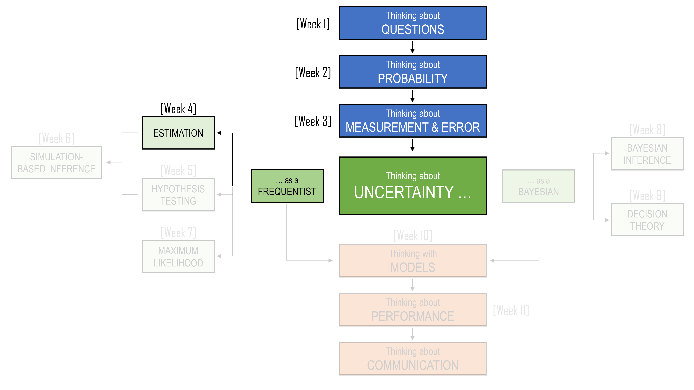

```{r, include=FALSE}
library(tidyverse)
library(flextable)
library(webexercises)
library(gt)
```

::: callout-note
## Learning Objectives

By the end of this chapter, you should be able to:

1. Explain the role of estimation in moving from sample data to claims about a wider population.
2. Distinguish between populations, samples, observations, parameters, statistics, estimators, and estimates.
3. Explain the difference between observed values and random variables.
4. Use sample statistics, such as the mean, median, and proportion, as point estimates of population parameters.
5. Describe sampling variation and explain why different samples can produce different estimates.
6. Explain what a sampling distribution is and why it is central to frequentist inference.
7. Calculate and interpret the standard error of a sample mean.
8. Construct and interpret interval estimates and confidence intervals for a population mean.
9. Explain the Central Limit Theorem and describe why sample means can be approximately normal even when the original data are not.
10. Compare two means using independent and paired sample structures, and explain why the structure of the data matters.
:::


## Introduction

The first three chapters were about preparing ourselves to think statistically. We began with questions, because the most important statistical mistake is often not a wrong calculation, but asking the wrong thing. We then turned to probability, which gave us a language for what could have happened, not just what did happen. Finally, we looked at measurement and error, where we saw that data are not pure facts but numbers produced by processes: surveys, instruments, definitions, memories, records, and judgement. Some of the foundation for inference is already here: questions, chance, variation, populations, samples, and error.

<center>

```{r, echo=FALSE}
#| classes: .enlarge-image

```

</center>

<br>

As the diagram above shows, we now move into the centre of the unit: uncertainty. Some of this may feel familiar, because the first three chapters have already been circling around uncertainty from different directions. But from this point on, uncertainty becomes the main object of study. For the next six weeks, we will ask how we can learn from data when the data could have turned out differently. 

We begin with the frequentist view, where uncertainty is understood by imagining repeated samples, repeated experiments, and repeated analyses. Specifically, we begin this section with a discussion around estimation.

Estimation sounds simple. We want to know some quantity, so we use data to estimate it. 

- What is the average number of school days missed by students? 
- What proportion of voters support a policy? 
- What is the average rent near campus? 
- How much time do students spend studying each week?

But think back to what we have already covered in the first three chapters:

- the answer depends on the question being asked
- the data we observe are only one version of what could have happened
- the numbers themselves are produced by imperfect measurement processes.

So estimation is not simply the act of calculating an average, a proportion, or a difference. It is the act of using an imperfect number from a particular dataset to say something careful about a wider world. A sample average is not the population average. A poll percentage is not the exact level of public support. A study result is not a perfect mirror of reality. These numbers are estimates: useful, informative, sometimes powerful, but still estimates.

The central lesson of this chapter is therefore:

> One number is not the truth.

This does not mean one number is useless. A single estimate can be an excellent starting point. It can summarise a messy collection of observations and give us something concrete to discuss. But on its own, it is incomplete. Whenever we report an estimate, there is a question quietly waiting behind it (and one we touched on in Chapter 3):

> How wrong might this estimate be?

That question will guide the rest of the chapter. We will begin with point estimation: using a sample statistic, such as a mean or median, to estimate an unknown population quantity. We will then look at why estimates vary from sample to sample, even when the data are collected carefully. This will lead us to sampling distributions, standard errors, and confidence intervals: tools for describing the uncertainty around an estimate.

## Parameters and Estimates

We'll use the following example to explain most of the concepts in this chapter:

::: {.callout-note}

### Household income

Suppose you work for the Australian Bureau of Statistics. You have been asked to report the typical annual income of Australian households. This sounds simple, but it immediately raises statistical questions. What counts as a household? What counts as income? Are we interested in the mean, the median, or the proportion of households below a particular income level? And if we only survey a sample of households, how close will our answer be to the truth?

:::

Let us begin with a small illustrative dataset. Suppose we record annual income from ten households:

```{r}
#| echo: false
#| message: false
#| warning: false

library(tibble)
library(gt)
library(dplyr)
library(ggplot2)
library(scales)

income_example <- tibble(
  Household = LETTERS[1:10],
  income = c(
    52000, 61000, 68000, 73000, 81000,
    89000, 97000, 112000, 138000, 420000
  )
)

income_example |>
  mutate(`Annual income` = income) |>
  select(Household, `Annual income`) |>
  gt() |>
  fmt_currency(
    columns = `Annual income`,
    currency = "AUD",
    decimals = 0
  )
```

At first glance, this looks like a simple list of numbers. But even this small table already contains a lesson. Most households in the sample have incomes between about \$50,000 and \$140,000. One household has an income of \$420,000. This high value is not impossible, but it affects some summaries more than others.

If we calculate the mean income, we get a sample mean of:

$$
\bar{x}
=
\frac{52000 + 61000 + \cdots + 420000}{10}
=
119100.
$$

But does \$119,100 feel typical? Looking at the table above, seven of the ten households have incomes below this value. The mean is not wrong, but it has been pulled upward by the high-income household.

The median tells a different story. Since there are ten households, the sample median is halfway between the 5th and 6th values:

$$
\text{median}
=
\frac{81000 + 89000}{2}
=
85000
$$
The same data have produced two different answers:

```{r}
#| echo: false
#| message: false
#| warning: false

income_summary_table <- tibble(
  Summary = c("Mean", "Median"),
  `Value in sample` = c(
    mean(income_example$income),
    median(income_example$income)
  ),
  `Question it answers` = c(
    "If total income were shared equally, how much would each household receive?",
    "What is the income of the household in the middle?"
  )
)

income_summary_table |>
  gt() |>
  fmt_currency(
    columns = `Value in sample`,
    currency = "AUD",
    decimals = 0
  )
```

Both numbers are useful, but they answer different questions. The mean is sensitive to the total amount of income in the sample. The median is sensitive to the ordering of households. For income data, which are often right-skewed, the median may feel closer to what we mean by a typical household.

This brings us back to the first chapter: the question matters. There is no single automatic answer to “What is the typical household income?” The answer depends on what we mean by typical.

If we care about the total amount of income spread across households, the mean is useful. If we care about the household in the middle, the median is more useful. If we care about economic hardship, we may instead ask about the proportion of households below some threshold.

For example, in our sample, one household has income below \$60,000. So the sample proportion below \$60,000 is:

$$
\hat{p}
=
\frac{1}{10}
=
0.10.
$$

That is:

$$
\hat{p} = 10\%.
$$

Now we have at least three possible quantities we might report.

```{r}
#| echo: false
#| message: false
#| warning: false

tibble(
  `Quantity estimated from the sample` = c(
    "Mean income",
    "Median income",
    "Proportion below $60,000"
  ),
  `Sample value` = c(
    "$119,100",
    "$85,000",
    "10%"
  ),
  `What it tells us` = c(
    "Average income if the total were spread equally",
    "Income of the household in the middle",
    "Share of households below a chosen threshold"
  )
) |>
  gt()
```

These are all statistics: numbers calculated from the sample. But in estimation, the sample is not usually the final destination. We want to use the sample to learn something about a larger population. In this example, the population might be all Australian households. The ten households in our table are the sample. Each household is one observation.

:::: {.callout-note}
### Terminology: population, sample, and observation

A **population** is the full group we want to learn about.

A **sample** is the smaller group we actually observe.

An **observation** is the information recorded for one unit in the sample.

In the household income example, the population might be all Australian households. The sample is the households whose incomes are recorded. Each household contributes one observation.
::::

Now we can introduce one of the most important distinctions in statistics.

A **parameter** is a numerical feature of a population. A **statistic** is a numerical feature calculated from a sample.

For example, the true median annual income of all Australian households is a parameter. We usually do not know it. The median income calculated from our sample is a statistic. We do know it, once the data have been collected.

This distinction can feel small at first, but it is the beginning of statistical inference. We use what we can calculate to estimate what we cannot directly see.

For instance, suppose our target is the true mean annual income of all Australian households. We might call this unknown population mean $\mu$. We do not know $\mu$, because we have not observed every household. Instead, we calculate the sample mean $\bar{x}$, and use it as an estimate of $\mu$.

$$
\mu = \text{population mean}
$$

$$
\bar{x} = \text{sample mean}
$$

In our illustrative sample:

$$
\bar{x} = 119{,}100
$$

So \$119,100 is our estimate of the unknown population mean.

If our target is the true proportion of Australian households below \$60,000, we might call the parameter $p$. The sample proportion is written as $\hat{p}$, pronounced “p-hat”.

$$
p = \text{population proportion}
$$

$$
\hat{p} = \text{sample proportion}
$$

In our illustrative sample:

$$
\hat{p} = 0.10.
$$

So 10% is our estimate of the unknown population proportion. The small hat symbol is often used to show that something is an estimate. More generally, if $\theta$ is an unknown parameter, then $\hat{\theta}$ is an estimate of that parameter.

:::: {.callout-note}
### Terminology: estimate and point estimate

An **estimate** is a value calculated from sample data and used to approximate an unknown parameter.

A **point estimate** is a single-number estimate.

For example, if the unknown population mean income is $\mu$, then the sample mean $\bar{x}$ can be used as a point estimate of $\mu$.
::::

At this stage, we should be careful with language. It is tempting to say:

> The average household income is \$119,100.

But that sentence quietly drops the uncertainty. A better sentence is:

> In this sample, the average household income is \$119,100.

An even better sentence is:

> In this sample, the average household income is \$119,100, which we use as an estimate of the average income in the wider population.

The difference may seem subtle, but it changes the claim. The first sentence sounds like a fact about Australia. The second is a fact about the sample. The third is an inferential statement: it uses the sample to say something cautious about the population.

This also connects back to measurement. Household income sounds simple, but it depends on definitions. Are we measuring income before tax or after tax? Do we include government payments? Do we include investment income? What about irregular income? Are we measuring household income, personal income, or income adjusted for household size?

A household of one person earning \$80,000 and a household of five people earning \$80,000 are not in the same financial position. The number is the same, but its meaning is different.

So the task is not simply:

> Calculate household income.

The task is closer to:

> Define the population, choose the parameter, collect a sample, calculate a statistic, and use that statistic as an estimate.

The arithmetic is the easy part. The statistical thinking is deciding what the arithmetic means.

To close this section, let us summarise the structure.

```{r}
#| echo: false
#| message: false
#| warning: false

tibble(
  Step = c(
    "1. Define the population",
    "2. Choose the parameter",
    "3. Collect a sample",
    "4. Calculate a statistic",
    "5. Use the statistic as an estimate"
  ),
  `Household income example` = c(
    "All Australian households",
    "Mean income, median income, or proportion below a threshold",
    "A surveyed set of households",
    "Sample mean, sample median, or sample proportion",
    "Use the sample value to estimate the population value"
  )
) |>
  gt()
```

This is the basic logic of estimation. But it leaves one large question unanswered.

> If we had chosen a different sample of households, would we have obtained the same estimate?

Almost certainly not.

The estimate depends on the sample. A different sample would give a different sample mean, a different sample median, and a different sample proportion. This variation from sample to sample is not a mistake. It is the reason we need the rest of this chapter.

## Observed values and random variables

In the previous section, we used the household income example to separate the number we want to know from the number we can calculate. The unknown population quantity is the **parameter**. The sample quantity is the **statistic**. When we use that statistic to approximate the parameter, it becomes an **estimate**.

But there is another distinction that is just as important, and it is one of the reasons statistical notation can feel strange at first. The data we have observed are fixed. They are already in the spreadsheet. But before we collected the data, the values could have been different. A different set of households could have been surveyed. Their incomes could have led to a different sample mean, a different sample median, and a different sample proportion.

Statistics needs a way to talk about both of these things:

- the data we actually observed;
- the data we could have observed.

This is why we distinguish between **observed values** and **random variables**.

Let us return to the household income example. In our small illustrative sample, the ten observed incomes were:

```{r}
#| echo: false
#| message: false
#| warning: false

library(tibble)
library(gt)
library(dplyr)
library(ggplot2)
library(scales)

income_example <- tibble(
  Household = LETTERS[1:10],
  income = c(
    52000, 61000, 68000, 73000, 81000,
    89000, 97000, 112000, 138000, 420000
  )
)

income_example |>
  mutate(`Observed income` = income) |>
  select(Household, `Observed income`) |>
  gt() |>
  fmt_currency(
    columns = `Observed income`,
    currency = "AUD",
    decimals = 0
  )
```

Once these values are observed, they are fixed. Household A has income \$52,000 in this dataset. Household B has income \$61,000. These numbers are not moving around anymore.

We write the observed values using lowercase letters:

$$
x_1, x_2, \ldots, x_n.
$$

For our ten households, this means:

$$
x_1 = 52000,\quad x_2 = 61000,\quad \ldots,\quad x_{10} = 420000.
$$

The lowercase letter $x$ refers to the data after they have been observed. But before the survey was conducted, we did not know which incomes would appear. The first household selected might have had an income of \$52,000, or \$83,000, or \$210,000, or something else. The second selected household also could have had many possible incomes. The whole sample could have turned out differently.

To represent this pre-observation uncertainty, we use uppercase letters:

$$
X_1, X_2, \ldots, X_n.
$$

Here, $X_1$ represents the income of the first household before we know what it will be. It is a **random variable**. It has not yet landed on a value. After the sample is collected, $X_1$ becomes $x_1$. The random variable has produced an observed value.

This distinction gives us two versions of the same idea.

```{r}
#| echo: false
#| message: false
#| warning: false

tibble(
  `Before data collection` = c(
    "$X_1$",
    "$X_2$",
    "$\\vdots$",
    "$X_n$"
  ),
  `After data collection` = c(
    "$x_1$",
    "$x_2$",
    "$\\vdots$",
    "$x_n$"
  ),
  `Household income example` = c(
    "Income of the first selected household, before we know it",
    "Income of the second selected household, before we know it",
    "Other possible selected households",
    "Income of the nth selected household, before we know it"
  )
) |>
  gt() |>
  fmt_markdown(columns = everything())
```

This matters because estimation is not only about the data in front of us. It is about the process that produced those data. If we imagine repeating the survey, we imagine a new set of random variables producing a new set of observed values.

Suppose the ABS repeated the household survey tomorrow with a different set of ten households. The sample might look like this:

```{r}
#| echo: false
#| message: false
#| warning: false

income_sample_2 <- tibble(
  Household = LETTERS[1:10],
  income = c(
    47000, 59000, 64000, 76000, 84000,
    92000, 105000, 121000, 148000, 230000
  )
)

income_sample_2 |>
  mutate(`Observed income` = income) |>
  select(Household, `Observed income`) |>
  gt() |>
  fmt_currency(
    columns = `Observed income`,
    currency = "AUD",
    decimals = 0
  )
```

This second sample is not wildly different from the first. It still contains lower-income households, middle-income households, and one relatively high-income household. But it is not identical. The largest value is now \$230,000 rather than \$420,000.

That difference changes the summaries.

```{r}
#| echo: false
#| message: false
#| warning: false

income_comparison <- tibble(
  Sample = c("First sample", "Second sample"),
  Mean = c(
    mean(income_example$income),
    mean(income_sample_2$income)
  ),
  Median = c(
    median(income_example$income),
    median(income_sample_2$income)
  ),
  `Proportion below $60,000` = c(
    mean(income_example$income < 60000),
    mean(income_sample_2$income < 60000)
  )
)

income_comparison |>
  gt() |>
  fmt_currency(
    columns = c(Mean, Median),
    currency = "AUD",
    decimals = 0
  ) |>
  fmt_percent(
    columns = `Proportion below $60,000`,
    decimals = 0
  )
```

The two samples give different estimates. This is not a contradiction, and it is not necessarily an error. It is sampling variation.

This is why we need uppercase notation. When we write the sample mean using lowercase values,

$$
\bar{x}
=
\frac{x_1 + x_2 + \cdots + x_n}{n},
$$

we are talking about the mean of the data we actually observed. In the first sample, this is:

$$
\bar{x} = 119100.
$$

But before data collection, the sample mean itself is uncertain. It depends on the random variables $X_1, X_2, \ldots, X_n$. So we write the estimator as:

$$
\bar{X}
=
\frac{X_1 + X_2 + \cdots + X_n}{n}
$$

This uppercase version, $\bar{X}$, is a random variable. It represents the sample mean before we know what the sample will be. Once the data are observed, $\bar{X}$ produces the observed estimate $\bar{x}$.

```{r}
#| echo: false
#| message: false
#| warning: false

tibble(
  Concept = c(
    "Observed values",
    "Random variables",
    "Observed sample mean",
    "Random sample mean"
  ),
  Notation = c(
    "$x_1, x_2, \\ldots, x_n$",
    "$X_1, X_2, \\ldots, X_n$",
    "$\\bar{x}$",
    "$\\bar{X}$"
  ),
  Meaning = c(
    "The household incomes actually recorded",
    "The household incomes before we know what they will be",
    "The mean calculated from the observed incomes",
    "The sample mean before the sample is observed"
  )
) |>
  gt() |>
  fmt_markdown(columns = everything())
```

This distinction can feel fussy at first, but it helps us say exactly what kind of uncertainty we are talking about.

When we write:

$$
\bar{x} = 119100,
$$

we are describing the sample we observed.

When we write:

$$
\bar{X}
=
\frac{X_1 + X_2 + \cdots + X_n}{n},
$$

we are describing the method before the data arrive. The first is an **estimate**. The second is an **estimator**. The formulas look almost identical. The difference is the case of the letter. But that small difference carries a big idea.

Uppercase says:

> This could have turned out differently.

Lowercase says:

> This is what we observed.

## Sampling distributions

In the previous section, we made a small but important shift. We stopped treating the sample mean as just a number in a dataset and started treating it as something that could have turned out differently.

For the first household income sample, the observed mean was:

$$
\bar{x} = 119{,}100
$$

But if a different set of households had been selected, the sample mean would probably have been different. The population parameter we are trying to estimate has not changed. The sample has changed, and therefore the estimate has changed.

This is the key idea behind a **sampling distribution**.

:::: {.callout-note}
### Terminology: sampling distribution

A **sampling distribution** is the probability distribution of a statistic over repeated samples.

It describes how a statistic, such as the sample mean, would vary if we repeated the data collection process again and again.
::::

This definition can sound abstract, so let us return to the Australian household income example.

Imagine that the ABS could perform a strange experiment. Suppose it could repeatedly draw new samples of 10 households from the same population. For each sample, it calculates the sample mean income. The first sample might give one mean. The second sample might give another. The third sample might give another again.

The population has not changed. Only the sample has changed.

```{r}
#| echo: false
#| message: false
#| warning: false

library(tibble)
library(gt)
library(dplyr)

hypothetical_samples <- tibble(
  `Hypothetical sample` = paste("Sample", 1:8),
  `Sample mean income` = c(
    119100, 102600, 96700, 131400,
    111900, 88400, 125300, 108700
  )
)

hypothetical_samples |>
  gt() |>
  fmt_currency(
    columns = `Sample mean income`,
    currency = "AUD",
    decimals = 0
  )
```

Each row in the table is a possible result from the same sampling process. If we took enough samples and plotted all the sample means, we would get the sampling distribution of the sample mean.

This is a distribution of **statistics**, not a distribution of individual household incomes. That distinction is easy to miss.

The original data distribution is about households:

> What incomes do individual households have?

The sampling distribution is about estimates:

> What sample means would we get across repeated samples?

These are different kinds of variation.

```{r}
#| echo: false
#| message: false
#| warning: false

library(ggplot2)
library(scales)
library(patchwork)

set.seed(2420)

# Create a skewed hypothetical population of household incomes.
population_income <- round(rlnorm(100000, meanlog = log(85000), sdlog = 0.55), -2)

# Take one sample of 10 households.
one_sample <- sample(population_income, size = 10)

# Repeated samples of size 10.
sample_means <- replicate(
  3000,
  mean(sample(population_income, size = 10))
)

plot_data_income <- tibble(
  income = one_sample
)

plot_data_means <- tibble(
  sample_mean = sample_means
)

p1 <- ggplot(plot_data_income, aes(x = income)) +
  geom_histogram(bins = 8, boundary = 0) +
  scale_x_continuous(labels = dollar_format(prefix = "$")) +
  labs(
    x = "Household income",
    y = "Count",
    title = "One sample of household incomes"
  ) +
  theme_minimal()

p2 <- ggplot(plot_data_means, aes(x = sample_mean)) +
  geom_histogram(bins = 30, boundary = 0) +
  scale_x_continuous(labels = dollar_format(prefix = "$")) +
  labs(
    x = "Sample mean income",
    y = "Count",
    title = "Many sample means"
  ) +
  theme_minimal()

p1+p2
```

The first plot shows variation between households in one sample. Some households earn more than others. That is ordinary data variation. The second plot shows variation between sample means. Each value in this plot is itself an average from a sample of 10 households. That is sampling variation.

This repeated-sampling idea is at the centre of Frequentist statistics. We usually do not get to take thousands of real samples. In practice, the ABS would take one carefully designed sample and publish estimates from that one sample. But to understand the uncertainty in those estimates, we imagine what would happen if the sampling process were repeated.

This imagined repetition allows us to ask questions such as:

- Would the sample mean usually be close to the population mean?
- How far away from the population mean might it be?
- Are some estimators more stable than others?
- How much does the sample size matter?

A good estimator is one that tends to land close to the parameter. But there are two different ways an estimator can fail. It can be systematically off target. Or it can be highly unstable.

Suppose two teams are asked to estimate the average household income in Australia.

- Team A samples only households in wealthy inner-city suburbs. Their estimate may be high every time. Even with a large sample, the method is systematically tilted upward.

- Team B samples households randomly from across the country, but only samples five households. Their method may be fair, but their estimate will jump around a lot from sample to sample.

These two problems are called **bias** and **variance**.

:::: {.callout-note}
### Terminology: bias and variance

**Bias** describes whether an estimator tends to miss the parameter systematically.

**Variance** describes how much an estimator changes from sample to sample.

A good estimator is usually one that is centred near the truth and does not wobble too much.
::::

In notation, if $\hat{\theta}$ is an estimator for a parameter $\theta$, the bias is:

$$
\text{Bias}(\hat{\theta}) = E(\hat{\theta}) - \theta
$$

The variance of the estimator is:

$$
\text{Var}(\hat{\theta})
$$

The bias tells us whether the estimator is centred in the wrong place. The variance tells us how spread out the sampling distribution is.

The household income example helps make this concrete. If we sample only wealthy suburbs, the sampling distribution of the sample mean may be centred above the true national mean. That is bias. If we take very small random samples, the sampling distribution may be centred near the true national mean but spread very widely. That is high variance.

```{r}
#| echo: false
#| message: false
#| warning: false


set.seed(5242)

true_mean <- 100000

bias_variance_data <- bind_rows(
  tibble(
    estimator = "Unbiased but variable",
    estimate = rnorm(2000, mean = true_mean, sd = 25000)
  ),
  tibble(
    estimator = "Biased upward",
    estimate = rnorm(2000, mean = 130000, sd = 12000)
  ),
  tibble(
    estimator = "Unbiased and stable",
    estimate = rnorm(2000, mean = true_mean, sd = 8000)
  )
)

ggplot(bias_variance_data, aes(x = estimate)) +
  geom_histogram(bins = 35) +
  geom_vline(xintercept = true_mean, linetype = "dashed", linewidth = 0.8) +
  facet_wrap(~ estimator, ncol = 1) +
  scale_x_continuous(labels = dollar_format(prefix = "$")) +
  labs(
    x = "Estimate of average household income",
    y = "Count"
  ) +
  theme_minimal()
```

The dashed line represents the true population mean. In a real study, we would not know where this line is. But the picture is useful because it shows what we want from an estimator. We want the sampling distribution to be centred near the parameter. We also want it to be narrow. Centred means low bias. Narrow means low variance.

This is why sampling design matters so much. A very large biased sample can still be misleading. Sampling only households from a wealthy suburb may produce a very precise estimate of the wrong thing. More data do not automatically fix a bad design.

It is also why sample size matters. If the sampling is sound, larger samples usually make estimates more stable. A sample of 10 households may produce an estimate that moves around a great deal. A sample of 1,000 households will usually produce a sample mean that varies less from sample to sample.

To see the basic idea, imagine repeatedly sampling from the same population of household incomes, but changing the sample size.

```{r}
#| echo: false
#| message: false
#| warning: false

set.seed(24205242)

sample_size_data <- bind_rows(
  tibble(
    n = "n = 10",
    sample_mean = replicate(3000, mean(sample(population_income, size = 10)))
  ),
  tibble(
    n = "n = 30",
    sample_mean = replicate(3000, mean(sample(population_income, size = 30)))
  ),
  tibble(
    n = "n = 90",
    sample_mean = replicate(3000, mean(sample(population_income, size = 90)))
  )
)

ggplot(sample_size_data, aes(x = sample_mean)) +
  geom_histogram(bins = 35) +
  facet_wrap(~ n, ncol = 1) +
  scale_x_continuous(labels = dollar_format(prefix = "$")) +
  labs(
    x = "Sample mean income",
    y = "Count"
  ) +
  theme_minimal()
```

The individual household incomes are still uneven and right-skewed. But the sample mean becomes more stable as the sample size grows. This is one of the reasons averages are so useful. They smooth out some of the disorder in individual observations.

But notice the wording: **some** of the disorder. Averages do not remove all uncertainty. They reduce sampling variation, especially when the sample size is large and the sampling process is well designed. They do not automatically remove bias, measurement problems, or poor definitions.

:::: {.callout-warning}
### Larger samples do not fix every problem

A larger random sample usually reduces sampling variation. But a larger sample does not automatically remove bias. If the sampling process misses some kinds of households, or if income is measured inconsistently, a large sample can still produce a misleading estimate.
::::

The sampling distribution is therefore not just a technical idea. It is the picture behind uncertainty.

When we report a point estimate, such as:

$$
\bar{x} = 119{,}100,
$$

we are reporting one realised value from a process that could have produced other values.

The natural next question is:

> How much would this estimate tend to vary from sample to sample?

## Standard error: the wobble of an estimate

At the end of the previous section, we reached a new question. If a statistic changes from sample to sample, then how much does it change?

This is not a small detail. It is the difference between an estimate that is useful and an estimate that is floating in space with no sense of reliability. Saying that the sample mean household income is $\$119{,}100$ gives us a number. But it does not yet tell us how much trust to place in that number.

To do that, we need to measure the **wobble** of the estimate.

In the household income example, there are two different kinds of wobble we might care about.

- First, individual households differ from one another. Some households have lower incomes, some have middle incomes, and a few have much higher incomes. This is variation in the data.
- Second, sample means differ from one sample to another. One sample might produce a mean of $\$119{,}100$. Another might produce $\$102{,}600$. Another might produce something else. This is variation in the estimate.

These are related, but they are not the same thing.

:::: {.callout-important}
### Do not confuse these two quantities

The **standard deviation** describes how much individual observations vary.

The **standard error** describes how much an estimate varies from sample to sample.

In the household income example, the standard deviation is about variation among household incomes. The standard error is about variation among sample mean incomes.
::::

Let us return to the small household income sample, which had a sample mean of:

$$
\bar{x} = 119{,}100
$$

The sample standard deviation is:

$$
s
=
\sqrt{
\frac{1}{n-1}
\sum_{i=1}^{n}
(x_i - \bar{x})^2
}
=108{,}735
$$


The sample standard deviation is large because the incomes themselves are spread out, especially because of the high-income household.

For a sample mean, the standard error has a particularly important form:

$$
SE(\bar{X}) = \frac{\sigma}{\sqrt{n}}.
$$

Here, $\sigma$ is the population standard deviation and $n$ is the sample size. This formula says two important things.

- First, if individual households are highly variable, then sample means will also be more variable. Income is much harder to estimate precisely when households differ greatly from one another.
- Second, larger samples produce more stable sample means. The sample size appears under a square root, so increasing $n$ reduces the standard error.

But there is a catch. In real life, we usually do not know $\sigma$, the population standard deviation. If we knew the population standard deviation, we might already know a lot about the population. Instead, we estimate $\sigma$ using $s$, the sample standard deviation.

So in practice we often use:

$$
se(\bar{x}) = \frac{s}{\sqrt{n}}.
$$

For the household income sample:

$$
se(\bar{x})
=
\frac{s}{\sqrt{n}}
=
\frac{108735}{\sqrt{10}}
=
34387
$$

So the estimated standard error of the sample mean is about \$34,386.

This number is not saying that household incomes are typically about \$34,386 away from the mean. That would be a statement about the standard deviation. Instead, it says that the sample mean itself would tend to vary by roughly this amount from sample to sample, under the assumptions we are using.

This is why the standard error is one of the most important quantities in statistical inference. It gives a scale for uncertainty. Without it, a point estimate is lonely. With it, we begin to see how precise, or imprecise, the estimate might be.

A useful reporting style is:

$$
\text{estimate} \pm \text{standard error}.
$$

For our sample:

$$
119{,}100 \pm 34{,}387
$$

This is already more informative than reporting $\$119{,}100$ alone. It tells the reader that the estimate is not especially precise. With only ten households and one very high-income household, the sample mean is quite wobbly.

The idea is simple but powerful:

> A point estimate tells us where we landed.  
> A standard error tells us how much that landing point tends to wobble.

Now let us look at why sample size matters. Suppose the household incomes in the wider population are highly variable. That variability is a fact about the population. We cannot make Australian households less economically diverse by collecting more data. But we can make our estimate of the mean more stable by collecting a larger sample.

The formula tells us why:

$$
se(\bar{x}) = \frac{s}{\sqrt{n}}
$$

As $n$ increases, the denominator gets larger, so the standard error gets smaller.

```{r}
#| echo: false
#| message: false
#| warning: false

income_values <- c(
  52000, 61000, 68000, 73000, 81000,
  89000, 97000, 112000, 138000, 420000
)

assumed_sd <- sd(income_values)

tibble(
  `Sample size` = c(10, 25, 100, 400, 1600),
  `Estimated standard error` = assumed_sd / sqrt(`Sample size`)
) |>
  gt() |>
  fmt_currency(
    columns = `Estimated standard error`,
    currency = "AUD",
    decimals = 0
  )
```

The standard error falls as the sample size grows. But it does not fall in a straight line. Because the sample size is under a square root, reducing the standard error substantially requires a much larger sample. To halve the standard error, we need about four times as much data.

For example:

$$
\sqrt{4n} = 2\sqrt{n}.
$$

So:

$$
\frac{s}{\sqrt{4n}}
=
\frac{s}{2\sqrt{n}}
=
\frac{1}{2}\frac{s}{\sqrt{n}}.
$$

This is one of the quiet realities of survey work. Precision is expensive. Asking ten households is easy but unstable. Asking one thousand households is much better, but it takes planning, money, time, and careful design.

```{r}
#| echo: false
#| message: false
#| warning: false

se_curve <- tibble(
  n = seq(10, 2000, by = 10),
  se = assumed_sd / sqrt(n)
)

ggplot(se_curve, aes(x = n, y = se)) +
  geom_line(linewidth = 1) +
  scale_y_continuous(labels = dollar_format(prefix = "$")) +
  labs(
    x = "Sample size",
    y = "Estimated standard error"
  ) +
  theme_minimal()
```

The curve drops quickly at first, then flattens out. This is the mathematical version of a familiar practical problem: early improvements can be large, but each additional gain in precision costs more and more data.

:::: {.callout-important}
### Precision has a cost

Increasing the sample size reduces the standard error, but with diminishing returns. To halve the standard error, we generally need about four times the sample size.
::::

The standard error also helps us compare two estimates that look similar on the surface.

Suppose one household survey reports an estimated average income of $\$119{,}100$, with a standard error of $\$38{,}323$. Another much larger survey reports an estimated average income of $\$105{,}000$, with a standard error of $\$2{,}000$.

The first estimate is higher, but much less precise. The second estimate is lower, but much more stable.

```{r}
#| echo: false
#| message: false
#| warning: false

tibble(
  Survey = c("Small survey", "Large survey"),
  Estimate = c(119100, 105000),
  `Standard error` = c(38323, 2000),
  Interpretation = c(
    "Higher estimate, but very uncertain",
    "Lower estimate, but much more precise"
  )
) |>
  gt() |>
  fmt_currency(
    columns = c(Estimate, `Standard error`),
    currency = "AUD",
    decimals = 0
  )
```

A point estimate alone might tempt us to focus on $\$119{,}100$, because it is larger. But the standard error tells us that this number is not very stable. The large survey’s estimate may be more useful, even though it is less dramatic.

A statistical estimate should not be judged only by where it lands. It should also be judged by how much it wobbles. The standard error gives us that wobble in a single number. But often we want to communicate uncertainty as a range rather than as a separate quantity. That takes us to **interval estimation**.

## Interval estimation

A standard error gives us one useful number: the typical wobble of an estimate. For the household income sample, we estimated the mean annual income as:

$$
\bar{x} = 119{,}100
$$

The estimated standard error was about:

$$
se(\bar{x}) = 34{,}385
$$

So we could report:

$$
119{,}100 \pm 34{,}385
$$

This is better than reporting the point estimate alone, because it gives the reader some sense of uncertainty. But it still requires a little mental work. The reader has to remember what “plus or minus one standard error” means, and they still have to translate it into a range.

A more direct way to communicate uncertainty is to report an **interval estimate**.

Instead of saying:

> Our estimate is \$119,100.

we say something like:

> Our estimate is \$119,100, with a plausible range from about \$50,330 to \$187,870.

The exact range depends on the method we use, but the general idea is simple:

$$
\text{interval estimate}
=
\left(
\text{estimate} - \text{error},
\text{estimate} + \text{error}
\right).
$$

Or, in a more familiar shorthand:

$$
\text{estimate} \pm \text{error}.
$$

:::: {.callout-note}
### Terminology: interval estimate

An **interval estimate** gives a range of plausible values for a parameter.

A **point estimate** gives one number.

An **interval estimate** gives a lower value and an upper value.
::::

For the household income example, the point estimate is the sample mean:

$$
\bar{x} = 119{,}100.
$$

A rough interval estimate can be formed by going two standard errors below and above the estimate:

$$
\bar{x} \pm 2 \times se(\bar{x}).
$$

Substituting the values from our sample:

$$
119{,}100 \pm 2(34{,}385)
=
119{,}100 \pm 68{,}770.
$$

This gives:

$$
(50{,}330,\ 187{,}870).
$$

So instead of presenting only one number, we can say:

> Based on this sample, the estimated mean annual household income is \$119,100, with a rough plausible range from about \$50,330 to \$187,870.

That is a very wide range. But that is the point. With only ten households, and with one very high-income household in the sample, we should not pretend to have a precise estimate.

The interval does not make the result weaker. It makes the uncertainty visible.

```{r}
#| echo: false
#| message: false
#| warning: false

library(tibble)
library(gt)
library(dplyr)
library(ggplot2)
library(scales)

income_values <- c(
  52000, 61000, 68000, 73000, 81000,
  89000, 97000, 112000, 138000, 420000
)

income_mean <- mean(income_values)
income_sd <- sd(income_values)
income_n <- length(income_values)
income_se <- income_sd / sqrt(income_n)

interval_data <- tibble(
  estimate = income_mean,
  lower = income_mean - 2 * income_se,
  upper = income_mean + 2 * income_se
)

ggplot(interval_data, aes(y = "Mean income")) +
  geom_errorbarh(
    aes(xmin = lower, xmax = upper),
    height = 0.15,
    linewidth = 1
  ) +
  geom_point(aes(x = estimate), size = 4) +
  scale_x_continuous(labels = dollar_format(prefix = "$"), limits = c(0,200000)) +
  labs(
    x = "Annual household income",
    y = NULL
  ) +
  theme_minimal()
```

The dot is the point estimate. The line is the interval estimate. The dot tells us where our sample landed. The line reminds us that the population value might plausibly be somewhere else. This is especially important when different samples produce different estimates. Suppose two small household income surveys produce the following results:

```{r}
#| echo: false
#| message: false
#| warning: false

two_surveys <- tibble(
  Survey = c("Survey A", "Survey B"),
  Estimate = c(119100, 102600),
  `Standard error` = c(34385, 28000),
  Lower = Estimate - 2 * `Standard error`,
  Upper = Estimate + 2 * `Standard error`
)

two_surveys |>
  gt() |>
  fmt_currency(
    columns = c(Estimate, `Standard error`, Lower, Upper),
    currency = "AUD",
    decimals = 0
  )
```

The point estimates are different:

$$
119{,}100
\quad \text{and} \quad
102{,}600.
$$

If we focused only on the point estimates, we might be tempted to tell a story about the difference. Perhaps income has changed. Perhaps one survey found a richer group of households. Perhaps something interesting is going on.

But once we include the uncertainty, the story becomes more cautious. Both intervals are wide. The difference between the two point estimates may not be very surprising, because small samples can wobble quite a lot.

```{r}
#| echo: false
#| message: false
#| warning: false

ggplot(two_surveys, aes(y = Survey)) +
  geom_errorbarh(
    aes(xmin = Lower, xmax = Upper),
    height = 0.15,
    linewidth = 1
  ) +
  geom_point(aes(x = Estimate), size = 4) +
  scale_x_continuous(labels = dollar_format(prefix = "$"), limits = c(0,200000)) +
  labs(
    x = "Annual household income",
    y = NULL
  ) +
  theme_minimal()
```

This is one of the habits we want to develop in statistical thinking:

> Do not compare estimates without also comparing their uncertainty.

A difference between two point estimates can look meaningful simply because we have hidden the wobble. Once the uncertainty is visible, the difference may look less dramatic.

:::: {.callout-important}
### Point estimates can overstate certainty

A point estimate is useful, but it can make a result look more precise than it really is. An interval estimate reminds us that the statistic came from one sample, and another sample could have produced another value.
::::

So far, we have used a rough rule:

$$
\text{estimate} \pm 2 \times \text{standard error}.
$$

This is a useful first approximation, and it often gives the right intuition. But it is not the full story. In formal statistical inference, the most common interval estimate is the **confidence interval**.

A confidence interval has the same broad shape:

$$
\text{estimate} \pm \text{multiplier} \times \text{standard error}.
$$

The multiplier depends on the confidence level, the sample size, and the probability model being used. For a 95% confidence interval, the multiplier is often close to 2, but not always exactly 2.

For example, when estimating a population mean and using the sample standard deviation, the interval often takes the form:

$$
\bar{x}
\pm
t_{n-1,0.975}
\frac{s}{\sqrt{n}}.
$$

This looks more complicated, but the structure is the same:

$$
\text{estimate}
\pm
\text{multiplier}
\times
\text{standard error}.
$$

The point estimate tells us where the interval is centred. The standard error tells us the scale of the uncertainty. The multiplier tells us how wide the interval should be for the confidence level we want.

:::: {.callout-note}
### The general shape of many intervals

Many statistical intervals have the form:

$$
\text{estimate}
\pm
\text{multiplier}
\times
\text{standard error}.
$$

The details change from problem to problem, but the basic logic is the same.
::::

For our small household income sample, the rough interval using $2$ as the multiplier was:

$$
119{,}100 \pm 2(34{,}385)
$$

A formal 95% confidence interval would use a multiplier from the $t$-distribution rather than exactly 2. Since the sample size is $n=10$, the relevant degrees of freedom are:

$$
n - 1 = 9.
$$

The multiplier is approximately:

$$
t_{9,0.975} = 2.262.
$$

So the formal interval is:

$$
119{,}100 \pm 2.262(34{,}385)
$$

That is:

$$
119{,}100 \pm 77{,}784
$$

which gives:

$$
(41{,}316,\ 196{,}884)
$$

The formal interval is slightly wider than the rough two-standard-error interval. This is because the sample size is small, and the $t$-distribution allows for the extra uncertainty created by estimating the standard deviation from the same small sample.

```{r}
#| echo: false
#| message: false
#| warning: false

t_multiplier <- qt(0.975, df = income_n - 1)

interval_comparison <- tibble(
  Method = c(
    "Rough interval",
    "95% t confidence interval"
  ),
  Multiplier = c(2, t_multiplier),
  Lower = c(
    income_mean - 2 * income_se,
    income_mean - t_multiplier * income_se
  ),
  Upper = c(
    income_mean + 2 * income_se,
    income_mean + t_multiplier * income_se
  )
)

interval_comparison |>
  gt() |>
  fmt_number(
    columns = Multiplier,
    decimals = 3
  ) |>
  fmt_currency(
    columns = c(Lower, Upper),
    currency = "AUD",
    decimals = 0
  )
```

This table shows that the rough interval and the formal confidence interval are built from the same ingredients. The difference is the multiplier.

The rough interval uses $2$, which is easy to remember.

The formal interval uses $t_{9,0.975}$, which is more appropriate for a sample mean with a small sample size.

In practice, we usually let software calculate the interval. But it is important to understand the structure, because the software is not doing magic. It is taking an estimate, measuring its wobble, choosing a multiplier, and turning the result into a range.

That raises the next question:

> What exactly does the “95%” in a 95% confidence interval mean?

## Confidence intervals

The previous section ended with a question that sounds innocent:

> What does the “95%” in a 95% confidence interval mean?

This is one of the most misunderstood ideas in statistics. The phrase “95% confidence” sounds as though it should mean something simple, like:

> There is a 95% chance that the true value is inside this interval.

That sentence is tempting. It is also not quite right, at least not from the Frequentist point of view. To see why, return to the household income example. Our formal 95% confidence interval for the population mean was approximately:

$$
(41{,}316,\ 196{,}884)
$$

This interval was calculated from the sample. Once we have observed the data, the interval is fixed. It starts at $41{,}316$ and ends at $196{,}884$. The true population mean, $\mu$, is also fixed. We may not know it, but it is not moving around.

So after the interval has been calculated, there are only two possibilities:

- the interval contains $\mu$;
- or the interval does not contain $\mu$.

There is no longer any randomness in this particular interval. The randomness was in the sampling process that produced it.

So what does the 95% refer to? It refers to the long-run behaviour of the method. Imagine repeating the household income survey many times. Each time, we take a new sample, calculate a new sample mean, calculate a new standard error, and construct a new confidence interval using the same procedure.

Some of those intervals will contain the true population mean. Some will miss it. A 95% confidence interval procedure is designed so that, in the long run, about 95% of the intervals produced by that method will contain the true parameter. The confidence is in the **procedure**, not in the one interval after it has been calculated.

:::: {.callout-note}
### Terminology: confidence interval

A **confidence interval** is an interval estimate constructed by a method that has a specified long-run success rate.

A 95% confidence interval procedure is one that, under the assumptions of the model, produces intervals that contain the true parameter in 95% of repeated samples.
::::

This is a bit of a mouthful. But the idea is easier to see than to say. Suppose the true average household income were known to be $\mu = 100{,}000$. In real life, we would not know this value. But for the purpose of illustration, imagine that we do. Now suppose we repeatedly take samples and construct 95% confidence intervals. Each interval is different, because each sample is different.

```{r}
#| echo: false
#| message: false
#| warning: false

library(tibble)
library(dplyr)
library(ggplot2)
library(scales)

set.seed(2420)

true_mu <- 100000
true_sigma <- 70000
n <- 40
n_intervals <- 60

ci_sim <- tibble(
  sample_id = 1:n_intervals
) |>
  rowwise() |>
  mutate(
    sample_values = list(rlnorm(n, meanlog = log(true_mu) - 0.5 * log(1 + (true_sigma / true_mu)^2),
                                sdlog = sqrt(log(1 + (true_sigma / true_mu)^2)))),
    xbar = mean(sample_values),
    s = sd(sample_values),
    se = s / sqrt(n),
    multiplier = qt(0.975, df = n - 1),
    lower = xbar - multiplier * se,
    upper = xbar + multiplier * se,
    captures = lower <= true_mu & upper >= true_mu
  ) |>
  ungroup()

ggplot(ci_sim, aes(y = sample_id)) +
  geom_segment(
    aes(x = lower, xend = upper, yend = sample_id, colour = captures),
    linewidth = 0.8
  ) +
  geom_point(aes(x = xbar), size = 1.6) +
  geom_vline(xintercept = true_mu, linetype = "dashed", linewidth = 0.8) +
  scale_colour_discrete(
    labels = c("No", "Yes")
  ) +
  scale_x_continuous(labels = dollar_format(prefix = "$")) +
  scale_y_reverse(NULL) +
  labs(
    x = "Estimated mean household income",
    colour = "Interval contains true mean?"
  ) +
  theme_minimal()
```

Each horizontal line is a confidence interval from a different sample. The dot marks the sample mean for that sample. The vertical dashed line marks the true population mean in this simulation.

Most intervals cross the dashed line. A few do not. That is what the confidence level means. It is not a promise that any one interval is correct. It is a statement about the long-run performance of the method.

This repeated-sampling interpretation may feel awkward, but it is the core of Frequentist thinking. We usually observe one sample, but we evaluate our methods by imagining what would happen if the sampling process were repeated again and again.

In practice, when we communicate results, we often use more intuitive language. We might say:

> The 95% confidence interval gives a range of plausible values for the population mean, given the data and the assumptions.

This is not the formal definition, but it is often a useful way to explain what the interval is doing. It reminds the reader not to focus only on the point estimate.

For the household income example, we might report:

> In this small sample, the mean annual household income was estimated to be \$119,100. A 95% confidence interval for the population mean is approximately \$41,316 to \$196,884.

This sentence does three useful things. It gives the point estimate. It gives the uncertainty. And it avoids pretending that the sample mean is the exact population mean.

But we should still be careful. A confidence interval only accounts for the uncertainty described by the model. It does not automatically fix problems in the data.

If the households were sampled only from wealthy suburbs, the confidence interval might be narrow but centred in the wrong place. If income was measured inconsistently, the interval would not magically correct the measurement problem. If the sample missed some kinds of households altogether, the interval would not know that.

:::: {.callout-warning}
### Confidence intervals do not fix bad data

A confidence interval describes uncertainty from sampling variation, under a set of assumptions.

It does not automatically correct bias, poor measurement, non-response, or a badly chosen sample.
::::

This is why confidence intervals should be reported with context. The interval tells us about uncertainty in the estimate, but the quality of the estimate still depends on the quality of the data collection.

The formula we used for the household income example was:

$$
\bar{x}
\pm
t_{n-1,0.975}
\frac{s}{\sqrt{n}}.
$$

This is a confidence interval for a population mean. It has three ingredients.

```{r}
#| echo: false
#| message: false
#| warning: false

library(gt)

tibble(
  Ingredient = c(
    "Point estimate",
    "Standard error",
    "Multiplier"
  ),
  Symbol = c(
    "$\\bar{x}$",
    "$\\frac{s}{\\sqrt{n}}$",
    "$t_{n-1,0.975}$"
  ),
  `Role in the interval` = c(
    "Centres the interval",
    "Measures the wobble of the estimate",
    "Controls how wide the interval is"
  )
) |>
  gt() |>
  fmt_markdown(columns = everything())
```

The point estimate tells us where the interval is centred. The standard error tells us how much the estimate tends to wobble. The multiplier tells us how much wobble to allow for.

For our sample:

$$
\bar{x} = 119{,}100,
$$

$$
se(\bar{x}) = 34{,}385,
$$

and, because $n = 10$,

$$
t_{9,0.975} \approx 2.262.
$$

So:

$$
119{,}100
\pm
2.262(34{,}385)
=
119{,}100
\pm
77{,}784.
$$

This gives:

$$
(41{,}316,\ 196{,}884).
$$

The interval is wide. But that is not a failure of the method. It is an honest reflection of the data: the sample is small, and the incomes vary a lot.

A wider interval says:

> We have less precision.

A narrower interval says:

> We have more precision.

But a narrow interval is not automatically better if it is built from biased or poor-quality data. Precision and truth are not the same thing.

:::: {.callout-note}
### Precision and accuracy

A **precise** estimate has little sampling variation, so its confidence interval is narrow.

An **accurate** estimate is close to the true parameter.

A large, biased sample can produce a precise estimate of the wrong quantity.
::::

This distinction matters in official statistics. A national income estimate should not merely be precise. It should be meaningful, well-defined, and based on a sample that represents the population of interest.

So the question is not only:

> How wide is the interval?

It is also:

> What population does this interval refer to?  
> How were the households selected?  
> How was income defined and measured?  
> What assumptions are being made?

This takes us back to the beginning of the chapter. Estimation is not just calculation. It is a chain of reasoning from question, to data, to statistic, to parameter, to uncertainty.

Confidence intervals are one of the main tools in that chain. They do not eliminate uncertainty. They make it visible.

The next question is why this particular interval formula works as often as it does. To answer that, we need to return to a familiar shape: the bell curve.

## Why the bell curve keeps returning

The confidence interval in the previous section used this formula:

$$
\bar{x}
\pm
t_{n-1,0.975}
\frac{s}{\sqrt{n}}.
$$

This formula may look like it appeared out of nowhere. Why is the sample mean at the centre? Why do we divide by $\sqrt{n}$? Why is there a mysterious $t$ multiplier? And why, once again, does a bell-shaped curve seem to be hiding in the background?

To answer these questions, we need to separate two ideas that are often confused:

- the distribution of the **data**;
- the distribution of the **estimate**.

The household income data are right-skewed. Most households have incomes in a lower or middle range, while a smaller number have much higher incomes. This means a histogram of household incomes will usually not look like a neat bell curve.

But the confidence interval is not based on the claim that household incomes themselves are normally distributed. It is based on a claim about the behaviour of the **sample mean**.

That distinction matters.

:::: {.callout-important}
### The bell curve does not need to describe the data

For many confidence intervals, the bell curve describes the sampling distribution of the estimate, not necessarily the distribution of the original data. Household incomes can be skewed, while sample means can still be approximately bell-shaped.
::::

Let us build the idea visually. Imagine a large population of household incomes. In this example, we deliberately create a right-skewed population, because income data often have that shape.

```{r}
#| echo: false
#| message: false
#| warning: false

library(tibble)
library(dplyr)
library(ggplot2)
library(scales)
library(gt)

set.seed(2420)

population_income <- round(
  rlnorm(
    100000,
    meanlog = log(85000),
    sdlog = 0.65
  ),
  -2
)

population_data <- tibble(
  income = population_income
)

ggplot(population_data, aes(x = income)) +
  geom_histogram(bins = 60) +
  scale_x_continuous(
    labels = dollar_format(prefix = "$"),
    limits = c(0, 600000)
  ) +
  labs(
    x = "Annual household income",
    y = "Number of households"
  ) +
  theme_minimal()
```

This is not a normal distribution. It is not symmetric. It has a long right tail.

Now suppose we repeatedly take samples from this population. For each sample, we calculate the sample mean. If the sample size is small, the sample means still show some skewness and instability. But as the sample size grows, the distribution of sample means becomes more concentrated and more bell-shaped.

```{r}
#| echo: false
#| message: false
#| warning: false

set.seed(5242)

sample_mean_data <- bind_rows(
  tibble(
    `Sample size` = "n = 5",
    sample_mean = replicate(
      5000,
      mean(sample(population_income, size = 5))
    )
  ),
  tibble(
    `Sample size` = "n = 25",
    sample_mean = replicate(
      5000,
      mean(sample(population_income, size = 25))
    )
  ),
  tibble(
    `Sample size` = "n = 100",
    sample_mean = replicate(
      5000,
      mean(sample(population_income, size = 100))
    )
  )
)

ggplot(sample_mean_data, aes(x = sample_mean)) +
  geom_histogram(bins = 45) +
  facet_wrap(~ `Sample size`, ncol = 1, scales = "free_y") +
  scale_x_continuous(labels = dollar_format(prefix = "$")) +
  labs(
    x = "Sample mean annual income",
    y = "Number of simulated samples"
  ) +
  theme_minimal()
```

The individual household incomes are still skewed. Nothing has changed about the population. But the sample mean behaves differently from an individual observation.

This is the idea behind the **Central Limit Theorem**.

:::: {.callout-note}
### Reminder: Central Limit Theorem

The **Central Limit Theorem** says that, under broad conditions, the sampling distribution of the sample mean becomes approximately normal as the sample size increases. This can happen even when the original data are not normally distributed.
::::

In symbols, suppose we have a random sample:

$$
X_1, X_2, \ldots, X_n.
$$

Suppose each observation has mean $\mu$ and variance $\sigma^2$. Then, for large enough $n$, the sample mean is approximately normally distributed:

$$
\bar{X}
\approx
N\left(
\mu,
\frac{\sigma^2}{n}
\right).
$$

This compact statement contains several important ideas.

First, the sample mean is centred around the population mean:

$$
E(\bar{X}) = \mu.
$$

So, under the usual assumptions, the sample mean is not systematically too high or too low. Across repeated samples, it is centred on the quantity we are trying to estimate.

Second, the variance of the sample mean is:

$$
\text{Var}(\bar{X})
=
\frac{\sigma^2}{n}.
$$

So the standard deviation of the sample mean is:

$$
SD(\bar{X})
=
\frac{\sigma}{\sqrt{n}}.
$$

This is exactly the quantity we called the standard error.

The Central Limit Theorem therefore explains why the standard error has the form it does. Averages are less variable than individual observations, and the amount of variation shrinks with the square root of the sample size.

This is one of the most important pieces of mathematical machinery in introductory statistics. It explains why averages are useful. It explains why large samples tend to produce more stable estimates. It explains why confidence intervals for means often use bell-shaped distributions, even when the original data are not bell-shaped.

But the Central Limit Theorem is not magic. It has conditions.

The usual version assumes that the observations are independent and identically distributed. This is often shortened to **iid**.

:::: {.callout-note}
### Terminology: iid

The abbreviation **iid** means **independent and identically distributed**.

**Independent** means that one observation does not directly determine another.

**Identically distributed** means that the observations are treated as coming from the same underlying distribution.
::::

In the household income example, the iid assumption would mean that each household in the sample is treated as an independent draw from the same population of households.

That may be a reasonable approximation in some survey settings, but it should never be accepted without thought. Households in the same suburb may be more similar to one another than households chosen from different parts of the country. Survey non-response may mean some types of households are less likely to appear in the data. Income may be recorded differently across households. These are not algebra problems; they are design and measurement problems.

So when we write something like:

$$
X_1, X_2, \ldots, X_n \stackrel{iid}{\sim} F,
$$

we are saying that the observations are modelled as independent draws from the same population distribution $F$. We are not saying that this is automatically true. We are making a modelling assumption.

:::: {.callout-warning}
### Assumptions are not decorations

The iid assumption is not a technical detail to skip over. It is a claim about how the data were generated. If the sampling process is biased, clustered, dependent, or poorly measured, then the usual formulas may not describe the uncertainty correctly.
::::

This is why official statistics agencies spend so much effort on survey design. The calculation of a sample mean is easy. The hard part is making sure the sample can support the inference we want to make.

There is one more detail hiding in the confidence interval formula. If the sample mean is approximately normal, why did we use a $t$-multiplier rather than a normal multiplier?

The reason is that we usually do not know the population standard deviation $\sigma$. We estimate it using the sample standard deviation $s$. This extra estimation adds uncertainty, especially when the sample size is small.

That extra uncertainty is handled by the **t-distribution**.

:::: {.callout-note}
### Terminology: t-distribution

The **t-distribution** is a bell-shaped distribution similar to the standard normal distribution, but with heavier tails.

It is used when estimating a population mean and the population standard deviation is unknown.

The shape depends on the **degrees of freedom**, commonly $n-1$ for a one-sample mean.
::::

The $t$-distribution has heavier tails than the standard normal distribution. This means it allows for more extreme values. When the sample size is small, the tails are noticeably heavier. As the sample size increases, the $t$-distribution becomes almost identical to the standard normal distribution.

```{r}
#| echo: false
#| message: false
#| warning: false


x <- seq(-4, 4, length.out = 1000)

t_dist_data <- bind_rows(
  tibble(x = x, density = dnorm(x), Distribution = "Normal"),
  tibble(x = x, density = dt(x, df = 2), Distribution = "t, df = 2"),
  tibble(x = x, density = dt(x, df = 5), Distribution = "t, df = 5"),
  tibble(x = x, density = dt(x, df = 60), Distribution = "t, df = 60")
)

ggplot(t_dist_data, aes(x = x, y = density, color = Distribution)) +
  geom_line(linewidth = 0.9) +
  labs(
    x = NULL,
    y = "Density",
    linetype = "Distribution"
  ) +
  theme_minimal()
```

For our household income sample, $n = 10$, so the degrees of freedom are:

$$
n - 1 = 9.
$$

For a 95% confidence interval, we use the 0.975 quantile of the $t$-distribution with 9 degrees of freedom:

$$
t_{9,0.975} \approx 2.262.
$$

This is larger than the familiar normal value of about 1.96. The interval becomes wider because the sample is small.

```{r}
#| echo: false
#| message: false
#| warning: false

tibble(
  `Sample size` = c(5, 10, 20, 50, 100, 1000),
  `Degrees of freedom` = `Sample size` - 1,
  `95% t multiplier` = qt(0.975, df = `Degrees of freedom`)
) |>
  gt() |>
  fmt_number(
    columns = `95% t multiplier`,
    decimals = 3
  )
```

As the sample size grows, the multiplier moves closer to 1.96. With small samples, we pay a penalty for uncertainty about the standard deviation. With large samples, that penalty becomes small.

Now the confidence interval formula should feel less mysterious:

$$
\bar{x}
\pm
t_{n-1,0.975}
\frac{s}{\sqrt{n}}.
$$

The pieces are:

```{r}
#| echo: false
#| message: false
#| warning: false

tibble(
  Piece = c(
    "$\\bar{x}$",
    "$s$",
    "$n$",
    "$\\frac{s}{\\sqrt{n}}$",
    "$t_{n-1,0.975}$"
  ),
  Meaning = c(
    "The sample mean; the point estimate",
    "The sample standard deviation; variation among observations",
    "The sample size",
    "The standard error; variation among sample means",
    "The multiplier chosen from the t-distribution"
  )
) |>
  gt() |>
  fmt_markdown(columns = everything())
```

The formula is not just a recipe. It is a compressed story.

We start with a sample mean. We recognise that it would wobble from sample to sample. We estimate the size of that wobble using the standard error. We use the $t$-distribution to decide how much wobble to allow for. The result is an interval estimate designed to capture the true mean in a known proportion of repeated samples.

The Central Limit Theorem explains why this works so often.

But it also tells us what to watch out for. If the sample is tiny, if the data are extremely skewed, if there are severe outliers, or if the observations are not reasonably independent, then the usual confidence interval may be less reliable. The formula is useful, but it is not a substitute for thinking.

We have now seen how to estimate a single population mean and describe the uncertainty around it. But many real questions are comparative. We do not only ask, “What is the typical household income?” We ask whether one group differs from another, or whether one option is cheaper than another.

That takes us from estimating one mean to comparing two means.

## Comparing two means

So far, we have focused on estimating one population quantity.

We asked:

> What is the typical annual income of Australian households?

That led us to a sample mean, a standard error, and a confidence interval for one population mean. But many statistical questions are not about one group in isolation. They are comparisons.

A policy analyst may not only ask:

> What is the average household income?

They may ask:

> Is average household income different between two regions?

Or:

> Do households in capital cities have higher average incomes than households outside capital cities?

Or:

> Has average household income changed from one year to the next?

Comparison is one of the main reasons we collect data. We often want to know whether one group is higher, lower, faster, slower, cheaper, more expensive, healthier, or riskier than another.

The simplest version is a comparison of two means.

:::: {.callout-note}
### Running example: household income in two regions

Suppose the ABS wants to compare annual household income between two types of areas:

- capital city households;
- regional households.

The question is:

> What is the difference in mean annual household income between capital city and regional households?

The numbers below are illustrative, not official ABS estimates. They are used so we can see the statistical logic clearly.
::::

Suppose we collect the following small samples.

```{r}
#| echo: false
#| message: false
#| warning: false

library(tibble)
library(dplyr)
library(gt)
library(ggplot2)
library(scales)

income_regions <- tibble(
  Household = paste("Household", 1:20),
  Region = rep(c("Capital city", "Regional"), each = 10),
  income = c(
    68000, 74000, 82000, 91000, 97000,
    106000, 118000, 135000, 162000, 430000,
    48000, 56000, 61000, 69000, 74000,
    81000, 88000, 95000, 112000, 210000
  )
)

income_regions |>
  mutate(`Annual income` = income) |>
  select(Household, Region, `Annual income`) |>
  gt() |>
  fmt_currency(
    columns = `Annual income`,
    currency = "AUD",
    decimals = 0
  )
```

The two groups both contain a range of incomes. Both are right-skewed, with a few high-income households. The capital city sample contains one especially high income, which will pull its mean upward.

Let us summarise the two groups.

```{r}
#| echo: false
#| message: false
#| warning: false

region_summary <- income_regions |>
  group_by(Region) |>
  summarise(
    n = n(),
    Mean = mean(income),
    Median = median(income),
    `Standard deviation` = sd(income),
    .groups = "drop"
  )

region_summary |>
  gt() |>
  fmt_currency(
    columns = c(Mean, Median, `Standard deviation`),
    currency = "AUD",
    decimals = 0
  )
```

The parameter of interest is the difference between two population means:

$$
\mu_1 - \mu_2.
$$

Here, $\mu_1$ might represent the mean annual income of capital city households, and $\mu_2$ might represent the mean annual income of regional households.

The point estimate is the difference between the two sample means:

$$
\bar{x}_1 - \bar{x}_2.
$$

```{r}
#| echo: false
#| message: false
#| warning: false

mean_capital <- income_regions |>
  filter(Region == "Capital city") |>
  pull(income) |>
  mean()

mean_regional <- income_regions |>
  filter(Region == "Regional") |>
  pull(income) |>
  mean()

diff_regions <- mean_capital - mean_regional

tibble(
  Quantity = c(
    "Mean income, capital city households",
    "Mean income, regional households",
    "Difference in sample means"
  ),
  Value = c(
    mean_capital,
    mean_regional,
    diff_regions
  )
) |>
  gt() |>
  fmt_currency(
    columns = Value,
    currency = "AUD",
    decimals = 0
  )
```

In this sample, the capital city households have a higher mean income. The observed difference is:

$$
\bar{x}_{\text{capital}}
-
\bar{x}_{\text{regional}}
=
66{,}900
$$

But the phrase “in this sample” matters. We are not only interested in these 20 households. We are using these sample means to estimate a difference in the wider population.

A difference in sample means is still a statistic. It varies from sample to sample. If we had sampled a different set of capital city households and a different set of regional households, the two sample means would change. Their difference would change too.

So the next question is familiar:

> How much does this difference wobble from sample to sample?

For two independent samples, an approximate standard error for the difference in sample means is:

$$
se(\bar{x}_1 - \bar{x}_2)
=
\sqrt{
\frac{s_1^2}{n_1}
+
\frac{s_2^2}{n_2}
}
$$

Each group contributes uncertainty. If either group is highly variable, or if either sample size is small, the difference becomes less precise.

For the household income comparison:

```{r}
#| echo: false
#| message: false
#| warning: false

capital_income <- income_regions |>
  filter(Region == "Capital city") |>
  pull(income)

regional_income <- income_regions |>
  filter(Region == "Regional") |>
  pull(income)

n1 <- length(capital_income)
n2 <- length(regional_income)
s1 <- sd(capital_income)
s2 <- sd(regional_income)

se_diff <- sqrt(s1^2 / n1 + s2^2 / n2)

tibble(
  Quantity = c(
    "Capital city sample size",
    "Regional sample size",
    "Capital city standard deviation",
    "Regional standard deviation",
    "Standard error of difference"
  ),
  Value = c(n1, n2, s1, s2, se_diff)
) |>
  gt() |>
  fmt_number(
    columns = Value,
    decimals = 0
  )
```

The standard error is large. This should not surprise us. The sample sizes are small, and household incomes vary greatly within each group.

A confidence interval for the difference in means has the same general form we have seen throughout this chapter:

$$
\text{estimate}
\pm
\text{multiplier}
\times
\text{standard error}.
$$

For two independent means, this becomes:

$$
(\bar{x}_1 - \bar{x}_2)
\pm
t
\sqrt{
\frac{s_1^2}{n_1}
+
\frac{s_2^2}{n_2}
}.
$$

For a simple approximation, we can use:

$$
k = \min(n_1 - 1,\ n_2 - 1)
$$

as the degrees of freedom. Software often uses a more accurate version called Welch's approximation.

```{r}
#| echo: false
#| message: false
#| warning: false

df_simple <- min(n1 - 1, n2 - 1)
t_multiplier <- qt(0.975, df = df_simple)

lower_diff <- diff_regions - t_multiplier * se_diff
upper_diff <- diff_regions + t_multiplier * se_diff

tibble(
  `Point estimate` = diff_regions,
  `Standard error` = se_diff,
  `Degrees of freedom` = df_simple,
  `95% CI lower` = lower_diff,
  `95% CI upper` = upper_diff
) |>
  gt() |>
  fmt_currency(
    columns = c(`Point estimate`, `Standard error`, `95% CI lower`, `95% CI upper`),
    currency = "AUD",
    decimals = 0
  ) |>
  fmt_number(
    columns = `Degrees of freedom`,
    decimals = 0
  )
```

The point estimate suggests that capital city households have a higher mean income in this sample. But the interval is wide. With such small samples and such variable incomes, the estimate is not precise.

That is not a failure. It is the lesson.

> The difference between two means is itself an estimate, and it has its own uncertainty.

A plot makes the same point visually.

```{r}

#| echo: false
#| message: false
#| warning: false


ci_diff_plot <- tibble(
  Comparison = "Capital city minus regional",
  Estimate = diff_regions,
  Lower = lower_diff,
  Upper = upper_diff
)

ggplot(ci_diff_plot, aes(y = Comparison)) +
  geom_vline(xintercept = 0, linetype = "dashed") +
  geom_errorbarh(
    aes(xmin = Lower, xmax = Upper),
    height = 0.15,
    linewidth = 1
  ) +
  geom_point(aes(x = Estimate), size = 4) +
  scale_x_continuous(labels = dollar_format(prefix = "$")) +
  labs(
    x = "Difference in mean annual household income",
    y = NULL
  ) +
  theme_minimal()
```

The dashed vertical line marks zero: no difference in means. If an interval for $\mu_1 - \mu_2$ is entirely above zero, that suggests the first group has a higher mean. If it is entirely below zero, that suggests the first group has a lower mean. If the interval includes zero, then zero remains one of the plausible values for the difference.

However, we should be careful not to overstate what this comparison tells us. Even if capital city households have a higher mean income than regional households, that does not mean living in a capital city causes higher income. The two groups may differ in education, occupation, age, housing costs, household size, employment opportunities, industry mix, and many other factors. A difference in means is a description. It is not automatically an explanation.

### Independent and paired samples

The capital city and regional household samples are an example of **independent samples**. A household in the capital city sample is not naturally matched to a household in the regional sample. The two groups are separate. But not all comparisons have this structure. Sometimes the same household is measured twice, or two observations are naturally linked.

Suppose the ABS surveys the same households in two different years. Now the question is:

> How much did household income change for the same households?

This is not an independent two-sample problem. It is a paired problem. To see the difference, imagine we observe eight households in two years.

```{r}
#| echo: false
#| message: false
#| warning: false

income_paired <- tibble(
  Household = paste("Household", LETTERS[1:8]),
  `Income in 2025` = c(72000, 85000, 91000, 105000, 116000, 128000, 142000, 210000),
  `Income in 2026` = c(76000, 87000, 98000, 109000, 121000, 133000, 146000, 225000)
) |>
  mutate(`Change` = `Income in 2026` - `Income in 2025`)

income_paired |>
  gt() |>
  fmt_currency(
    columns = c(`Income in 2025`, `Income in 2026`, Change),
    currency = "AUD",
    decimals = 0
  )
```

Each row belongs together. The 2025 and 2026 incomes are measurements on the same household. So instead of comparing two unrelated sets of incomes, we calculate the change for each household:

$$
d_i = x_{i,\text{2026}} - x_{i,\text{2025}}
$$

Then we estimate the mean change:

$$
\mu_D
$$

The point estimate is:

$$
\bar{d}
$$

```{r}
#| echo: false
#| message: false
#| warning: false

changes <- income_paired$Change
mean_change <- mean(changes)
sd_change <- sd(changes)
n_change <- length(changes)
se_change <- sd_change / sqrt(n_change)
t_change <- qt(0.975, df = n_change - 1)
lower_change <- mean_change - t_change * se_change
upper_change <- mean_change + t_change * se_change

tibble(
  Quantity = c(
    "Mean change",
    "Standard deviation of changes",
    "Standard error of mean change",
    "95% CI lower",
    "95% CI upper"
  ),
  Value = c(
    mean_change,
    sd_change,
    se_change,
    lower_change,
    upper_change
  )
) |>
  gt() |>
  fmt_currency(
    columns = Value,
    currency = "AUD",
    decimals = 0
  )
```

The paired confidence interval is:

$$
\bar{d}
\pm
t_{n-1,0.975}
\frac{s_D}{\sqrt{n}}
$$

where $s_D$ is the sample standard deviation of the changes.

The important move is that we reduce the paired problem to a one-sample problem by analysing the differences.

The paired structure can make a large difference because it removes some background variation.

Households differ greatly from one another. Some have much higher incomes than others. But when we compare a household to itself over time, much of that between-household variation disappears. We focus on the change within each household.

```{r}
#| echo: false
#| message: false
#| warning: false

income_paired_long <- income_paired |>
  tidyr::pivot_longer(
    cols = c(`Income in 2025`, `Income in 2026`),
    names_to = "Year",
    values_to = "Income"
  )

ggplot(income_paired_long, aes(x = Year, y = Income, group = Household)) +
  geom_line(alpha = 0.6) +
  geom_point(size = 2) +
  scale_y_continuous(labels = dollar_format(prefix = "$")) +
  labs(
    x = NULL,
    y = "Annual household income"
  ) +
  theme_minimal()
```

The lines show that each household is being followed over time. This structure is valuable. If we ignored the pairing and treated the 2025 and 2026 incomes as unrelated samples, we would throw away information.

The larger lesson is simple:

> The formula should follow the structure of the data.

For one mean, we estimate:

$$
\mu
$$

For two independent means, we estimate:

$$
\mu_1 - \mu_2
$$

For paired data, we first form differences:

$$
D_i = X_{i2} - X_{i1},
$$

and then estimate:

$$
\mu_D
$$

```{r}
#| echo: false
#| message: false
#| warning: false

tibble(
  Situation = c(
    "One sample",
    "Two independent samples",
    "Paired samples"
  ),
  `Household income question` = c(
    "What is the mean income of Australian households?",
    "What is the difference in mean income between capital city and regional households?",
    "What is the mean change in income for the same households across two years?"
  ),
  Parameter = c(
    "$\\mu$",
    "$\\mu_1 - \\mu_2$",
    "$\\mu_D$"
  ),
  `Point estimate` = c(
    "$\\bar{x}$",
    "$\\bar{x}_1 - \\bar{x}_2$",
    "$\\bar{d}$"
  ),
  `Typical standard error` = c(
    "$s / \\sqrt{n}$",
    "$\\sqrt{s_1^2/n_1 + s_2^2/n_2}$",
    "$s_D / \\sqrt{n}$"
  )
) |>
  gt() |>
  fmt_markdown(columns = everything())
```

The details differ, but the rhythm is the same.

We choose a parameter. We calculate a statistic. We estimate the wobble using a standard error. We report uncertainty using an interval.

This is estimation.

## Exercises

The exercises below review the main ideas from this chapter: parameters, statistics, point estimates, sampling variation, standard errors, confidence intervals, the Central Limit Theorem, and comparisons of means. The examples use different contexts from the chapter, but the same logic applies: one observed estimate is only one version of what could have happened.

:::: callout-note
## Question 1

A local council wants to estimate the average weekly household spending on public transport among residents in its area.

For each item below, identify whether it is a **population**, **sample**, **parameter**, **statistic**, **observation**, or **estimate**.

```{r}
#| echo: false
#| message: false
#| warning: false

tribble(
  ~Item,
  "All households in the council area",
  "The 250 households surveyed by the council",
  "The weekly transport spending recorded for one surveyed household",
  "The true average weekly transport spending among all households in the council area",
  "The average weekly transport spending calculated from the 250 surveyed households",
  "The value $42.60, calculated from the survey data"
) |>
  gt()
```

::: {.callout-important collapse="true"}
## Click for Solutions

```{r}
#| echo: false
#| message: false
#| warning: false

tribble(
  ~Item, ~Answer,
  "All households in the council area", "Population",
  "The 250 households surveyed by the council", "Sample",
  "The weekly transport spending recorded for one surveyed household", "Observation",
  "The true average weekly transport spending among all households in the council area", "Parameter",
  "The average weekly transport spending calculated from the 250 surveyed households", "Statistic",
  "The value $42.60, calculated from the survey data", "Estimate, or point estimate"
) |>
  gt()
```

The important distinction is that **parameters belong to populations**, while **statistics belong to samples**. The council wants the population parameter, but it uses a sample statistic to estimate it.
:::
::::


:::: callout-note
## Question 2

A researcher records the number of hours that 8 students spent studying last Saturday:

$$
2,
4,
5,
3,
6,
2,
8,
10.
$$

1. Calculate the sample mean.
2. Calculate the sample median.
3. Which summary better describes a “typical” student in this small sample? Explain briefly.

::: {.callout-important collapse="true"}
## Click for Solutions

The sample mean is:

$$
\bar{x}
=
\frac{2+4+5+3+6+2+8+10}{8}
=
\frac{40}{8}
=
5.
$$

So the sample mean is:

$$
\bar{x}=5 \text{ hours}.
$$

To find the median, first order the data:

$$
2,
2,
3,
4,
5,
6,
8,
10.
$$

There are 8 observations, so the median is halfway between the 4th and 5th values:

$$
\text{median}
=
\frac{4+5}{2}
=
4.5.
$$

So the sample median is:

$$
4.5 \text{ hours}.
$$

Both summaries are reasonable. The mean is slightly larger than the median because the values 8 and 10 pull it upward. The median may feel a little closer to the middle student, while the mean describes the average number of study hours per student.
:::
::::


:::: callout-note
## Question 3

A café owner wants to estimate the average waiting time for coffee orders during the morning rush. She records the waiting times, in minutes, for 12 randomly selected customers:

$$
4,
6,
5,
7,
8,
6,
5,
9,
4,
7,
6,
5.
$$

The sample mean is:

$$
\bar{x}=6.
$$

The sample standard deviation is:

$$
s=1.54.
$$

1. Calculate the estimated standard error of the sample mean.
2. Explain what the standard error means in this context.

::: {.callout-important collapse="true"}
## Click for Solutions

The standard error of the sample mean is:

$$
se(\bar{x})
=
\frac{s}{\sqrt{n}}.
$$

Here:

$$
s=1.54,
\qquad
n=12.
$$

So:

$$
se(\bar{x})
=
\frac{1.54}{\sqrt{12}}
=
0.44.
$$

The estimated standard error is about:

$$
0.44 \text{ minutes}.
$$

This does **not** mean that individual customers are usually 0.44 minutes away from the mean. That would be closer to the role of the standard deviation. The standard error describes how much the **sample mean waiting time** would tend to vary from sample to sample.
:::
::::


:::: callout-note
## Question 4

A survey of 36 households estimates that the average monthly electricity bill is:

$$
\bar{x} = 184
$$

dollars, with sample standard deviation:

$$
s = 48.
$$

1. Calculate the standard error of the sample mean.
2. Construct a rough interval estimate using:

$$
\bar{x} \pm 2 \times se(\bar{x}).
$$

3. Write one sentence interpreting the interval.

::: {.callout-important collapse="true"}
## Click for Solutions

The standard error is:

$$
se(\bar{x})
=
\frac{s}{\sqrt{n}}
=
\frac{48}{\sqrt{36}}
=
\frac{48}{6}
=
8.
$$

A rough interval estimate is:

$$
184 \pm 2(8)
=
184 \pm 16.
$$

So the interval is:

$$
(168,
200).
$$

A suitable interpretation is:

> Based on this sample, the average monthly electricity bill is estimated to be $184, with a rough plausible range from about $168 to $200.

This is not yet a formal confidence interval, but it communicates uncertainty more honestly than the point estimate alone.
:::
::::


:::: callout-note
## Question 5

A health researcher estimates the average daily step count of adults in a suburb. A sample of 25 adults has:

$$
\bar{x}=7{,}850,
\qquad
s=1{,}500.
$$

Use the following multiplier for a 95% confidence interval:

$$
t_{24,0.975}=2.064.
$$

Construct a 95% confidence interval for the population mean daily step count.

::: {.callout-important collapse="true"}
## Click for Solutions

The standard error is:

$$
se(\bar{x})
=
\frac{s}{\sqrt{n}}
=
\frac{1500}{\sqrt{25}}
=
\frac{1500}{5}
=
300.
$$

The 95% confidence interval is:

$$
\bar{x}
\pm
t_{24,0.975}
\frac{s}{\sqrt{n}}.
$$

Substituting the values:

$$
7850
\pm
2.064(300)
=
7850
\pm
619.2.
$$

So the interval is:

$$
(7230.8,
8469.2).
$$

Rounded to whole steps, the 95% confidence interval is approximately:

$$
(7{,}231,
8{,}469).
$$

In words:

> The estimated average daily step count is 7,850 steps, with a 95% confidence interval from about 7,231 to 8,469 steps.
:::
::::


:::: callout-note
## Question 6

A student writes the following sentence:

> There is a 95% probability that this confidence interval contains the true population mean.

Explain what is wrong with this statement from a frequentist perspective. Then write a better version.

::: {.callout-important collapse="true"}
## Click for Solutions

From a frequentist perspective, once the data have been observed, the confidence interval is fixed. The true population mean is also fixed. The interval either contains the true mean or it does not.

The 95% refers to the long-run behaviour of the **method**, not the probability attached to this one realised interval.

A better version is:

> If we repeatedly took samples and constructed intervals using this same method, about 95% of those intervals would contain the true population mean.

In practice, we might also say:

> The interval gives a range of plausible values for the population mean, given the data and assumptions.
:::
::::


:::: callout-note
## Question 7

A university wants to compare average weekly spending on takeaway food between students living on campus and students living off campus.

A sample gives the following summaries:

```{r}
#| echo: false
#| message: false
#| warning: false

spending_summary <- tribble(
  ~Group, ~n, ~Mean, ~SD,
  "On campus", 40, 62, 18,
  "Off campus", 45, 54, 20
)

spending_summary |>
  gt() |>
  fmt_currency(columns = c(Mean, SD), currency = "AUD", decimals = 0)
```

1. What is the point estimate of the difference in means, using:

$$
\bar{x}_{\text{on campus}} - \bar{x}_{\text{off campus}}?
$$

2. Calculate the standard error of the difference using:

$$
se(\bar{x}_1 - \bar{x}_2)
=
\sqrt{
\frac{s_1^2}{n_1}
+
\frac{s_2^2}{n_2}
}.
$$

::: {.callout-important collapse="true"}
## Click for Solutions

The point estimate is:

$$
\bar{x}_{\text{on campus}} - \bar{x}_{\text{off campus}}
=
62 - 54
=
8.
$$

So the sample suggests that students living on campus spend, on average, $8 more per week on takeaway food.

The standard error is:

$$
se(\bar{x}_1 - \bar{x}_2)
=
\sqrt{
\frac{18^2}{40}
+
\frac{20^2}{45}
}.
$$

Calculate each part:

$$
\frac{18^2}{40}
=
\frac{324}{40}
=
8.10,
$$

and:

$$
\frac{20^2}{45}
=
\frac{400}{45}
=
8.89.
$$

So:

$$
se(\bar{x}_1 - \bar{x}_2)
=
\sqrt{8.10+8.89}
=
\sqrt{16.99}
=
4.12.
$$

The standard error of the difference is approximately:

$$
4.12.
$$

The observed difference is $8, but the standard error reminds us that this difference would wobble from sample to sample.
:::
::::


:::: callout-note
## Question 8

A researcher records the same 6 households' weekly grocery spending before and after a budgeting workshop.

```{r}
#| echo: false
#| message: false
#| warning: false

grocery <- tribble(
  ~Household, ~Before, ~After,
  "A", 210, 190,
  "B", 165, 155,
  "C", 240, 215,
  "D", 180, 175,
  "E", 195, 178,
  "F", 225, 205
)

grocery |>
  gt() |>
  fmt_currency(columns = c(Before, After), currency = "AUD", decimals = 0)
```

1. Are these independent samples or paired samples? Explain.
2. Calculate the difference for each household using:

$$
d_i = \text{Before}_i - \text{After}_i.
$$

3. Calculate the mean difference.

::: {.callout-important collapse="true"}
## Click for Solutions

These are **paired samples**, because the same households are measured before and after the workshop. Each “before” value is naturally linked to an “after” value for the same household.

The differences are:

```{r}
#| echo: false
#| message: false
#| warning: false

grocery_solution <- grocery |>
  mutate(Difference = Before - After)

grocery_solution |>
  gt() |>
  fmt_currency(columns = c(Before, After, Difference), currency = "AUD", decimals = 0)
```

The mean difference is:

$$
\bar{d}
=
\frac{20+10+25+5+17+20}{6}
=
\frac{97}{6}
=
16.17.
$$

So the households spent, on average, about $16.17 less per week after the workshop.

The paired structure matters because we are comparing each household to itself. This removes some of the background variation between households.
:::
::::


:::: callout-note
## Question 9

A student says:

> The Central Limit Theorem says that data become normally distributed when the sample size is large.

Is this correct? Explain.

::: {.callout-important collapse="true"}
## Click for Solutions

This statement is not quite correct.

The Central Limit Theorem does **not** say that the original data become normally distributed. If household incomes are right-skewed, they do not magically become symmetric just because we collect a larger sample.

The Central Limit Theorem says that, under broad conditions, the **sampling distribution of the sample mean** becomes approximately normal as the sample size increases.

A better statement is:

> The Central Limit Theorem says that the distribution of sample means becomes approximately normal as the sample size grows, even if the original data are not normally distributed.
:::
::::


:::: callout-note
## Question 10

A report gives the following two estimates for average weekly rent in two suburbs:

```{r}
#| echo: false
#| message: false
#| warning: false

rent <- tribble(
  ~Suburb, ~Estimate, ~`Standard error`,
  "Suburb A", 530, 15,
  "Suburb B", 560, 80
)

rent |>
  gt() |>
  fmt_currency(columns = c(Estimate, `Standard error`), currency = "AUD", decimals = 0)
```

A reader says:

> Suburb B definitely has higher average rent because $560 is larger than $530.

Explain why this conclusion is too strong.

::: {.callout-important collapse="true"}
## Click for Solutions

The conclusion focuses only on the point estimates and ignores uncertainty.

Suburb B has the larger estimate:

$$
560 > 530.
$$

But Suburb B also has a much larger standard error. Its estimate is much less precise.

A rough interval for Suburb A is:

$$
530 \pm 2(15)
=
530 \pm 30,
$$

which gives:

$$
(500,
560).
$$

A rough interval for Suburb B is:

$$
560 \pm 2(80)
=
560 \pm 160,
$$

which gives:

$$
(400,
720).
$$

The intervals overlap substantially. The estimate for Suburb B is higher, but the uncertainty is large. A more careful conclusion is:

> In this sample, Suburb B has a higher estimated average rent, but the estimate is much less precise. We should not conclude too strongly from the point estimates alone.
:::
::::


