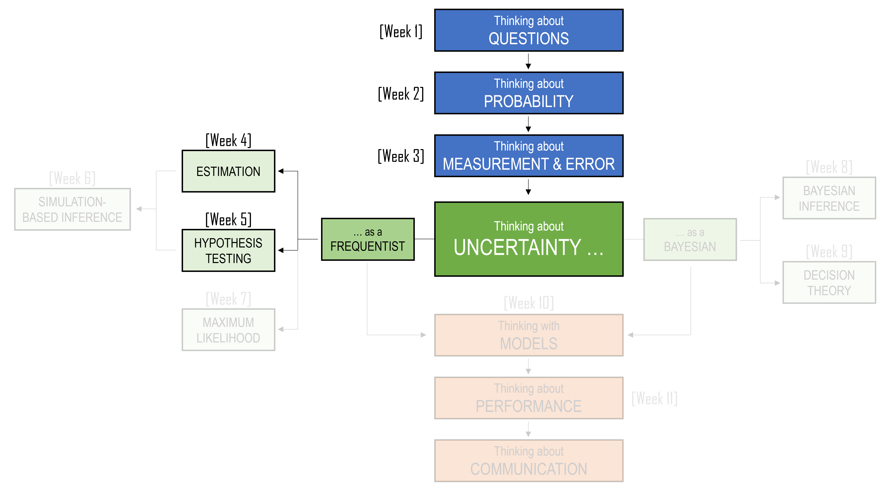

```{r, include=FALSE}
library(tidyverse)
library(flextable)
library(webexercises)
library(gt)
library(scales)
```

::: callout-note
## Learning Objectives

By the end of this chapter, you should be able to:

1.  Explain how hypothesis testing builds on sampling distributions, standard errors, confidence intervals, and the Central Limit Theorem.
2.  Distinguish between a research question, a null hypothesis, and an alternative hypothesis.
3.  Identify the population parameter being tested and the sample statistic used as evidence.
4.  Explain why the null hypothesis is treated as a default position or benchmark claim.
5.  Calculate and interpret test statistics for means and proportions.
6.  Calculate and interpret p-values without treating them as probabilities that hypotheses are true.
7.  Distinguish between one-sided and two-sided hypothesis tests.
8.  Explain Type I error, Type II error and significance level.
9.  Carry out simple hypothesis tests.
10. Describe why hypothesis testing should usually be reported alongside estimates, confidence intervals, and careful discussion of context.
:::

<centre>

```{r, echo=FALSE}
#| classes: .enlarge-image

```

</centre>

<br>

## A famous cup of tea

One of the most famous stories in statistics begins with a cup of tea. The story is usually told like this.

> At a summer afternoon tea party in Cambridge in the 1920s, a woman claimed that she could tell whether milk had been poured into a cup before the tea, or whether tea had been poured in before the milk. To many people, this might have sounded like a small matter of personal taste. Perhaps she preferred one method. Perhaps she was imagining the difference. Perhaps she was simply confident.

But the statistician, Ronald Fisher, saw something deeper in the claim. The question was not whether she liked tea. The question was not whether milk-first tea and tea-first tea tasted different to everyone. The question was more precise:

> Could this particular person distinguish between the two methods better than would be expected by guessing?

Imagine that we prepare eight cups of tea.

-   Four are made by pouring the milk first, and four are made by pouring the tea first.
-   The cups are presented in random order.
-   The woman is told that there are four of each type.
-   She must identify which four had the milk poured first.

<center>
```{r}
#| echo: false


```
</center><br>

There are many ways she could choose four cups out of eight. If she is only guessing, she might still get some correct by chance. She might even get all four correct by chance, although that would be rare.

That last point is important. A perfect score would not automatically prove that she has a special ability. Chance can sometimes produce surprising results. But if a perfect score would be very unlikely under guessing, then the result may give us a reason to doubt the guessing explanation.

So we begin with a skeptical view of her tea-tasting ability:

$$
\text{She is guessing}
$$

We then ask whether the result gives us evidence for a different explanation:

$$
\text{She can distinguish between the two ways of preparing tea}
$$

The experiment does not begin by assuming that she is wrong in any moral sense. Nor does it begin by assuming that she is right. Instead, it begins with a benchmark model:

> What would her results look like if she were only guessing?

Under this guessing model, every possible selection of four cups is equally likely. The number of ways to choose four cups from eight is:

$$
\binom{8}{4} = 70
$$

Only one of these 70 choices is perfectly correct. So, if she is guessing, the probability of identifying all four milk-first cups correctly is:

$$
\frac{1}{70} \approx 0.014
$$

That probability is small. It tells us that a perfect score would be unusual if she were merely guessing. Although, this does not give us certainty. It does not prove beyond all possible doubt that she can taste the difference. But it gives us a disciplined way to compare two explanations:

-   perhaps she is only guessing;
-   perhaps she really can tell the difference.

The tea story also shows why the design of the test matters. Before seeing the result, we need to decide what kind of outcome would count as strong evidence. Would four correct identifications be enough? What about three? Should we count only a perfect score, or should a nearly perfect score also make us skeptical of the guessing explanation? These choices need to be made before the cups are tasted. Otherwise, we risk changing the rules after seeing the result.

This chapter is about that logic.

## Recap

In the previous chapter, we began the formal study of statistical inference. We used samples to estimate population quantities, and we learned that an estimate is never the whole story. A sample mean, sample median, or sample proportion may be useful, but it is still only one number from one possible sample. Another sample could have produced a different number.

In this chapter, we move from estimation to hypothesis testing. At first, this may feel like a new topic. There will be new words: null hypothesis, alternative hypothesis, test statistic, significance level, p-value, Type I error, Type II error, and power. But the machinery underneath is familiar. We are still thinking about samples, populations, parameters, statistics, standard errors, and sampling distributions.

The difference is the question we ask.

In estimation, we usually begin with the data and ask:

> What population values are plausible?

In hypothesis testing, we usually begin with a claim and ask:

> Are the data surprising if that claim is true?

For example, in the previous chapter we estimated average household income. We also estimated differences between groups and proportions below particular income thresholds. Now suppose someone makes a claim:

> The average annual income of Australian households is \$100,000.

Or:

> The proportion of households with annual income below \$60,000 is 20%.

Or:

> Mean household income is the same in capital city and regional areas.

These are no longer just estimation questions. They are claims about a population. Hypothesis testing gives us a formal way to compare such claims with data.

## From estimation to testing

Let us return to the running example from the previous chapter.

::: callout-note
### Household income

Suppose you work for the Australian Bureau of Statistics. You have been asked to report on annual income for Australian households. In the previous chapter, you used sample data to estimate population quantities such as mean income, median income, the proportion of households below a threshold, and the difference between regions.

Now suppose a report claims that the mean annual income of Australian households is \$100,000.

Your sample mean is higher than this. Is the difference just sampling variation, or does the sample provide evidence against the claim?
:::

This question sounds simple, but it contains the whole logic of hypothesis testing.

The claim is about a **population parameter**. In this case, the parameter is the population mean household income, which we write as: $\mu$.

The data give us a **sample statistic**. In this case, the statistic is the sample mean, which we write as: $\bar{x}$.

The sample statistic will almost never be exactly equal to the claimed population value. If a report claims that the population mean is \$100,000, and a sample gives a mean of \$101,200, that difference alone is not interesting. Samples wobble. That is what we learned in the previous chapter.

The real question is not:

> Is the sample mean different from \$100,000?

Of course it probably is. The better question is:

> Is the sample mean far enough from \$100,000 that it would be unusual if the true population mean really were \$100,000?

This is where the ideas from estimation return.

```{r}
#| echo: false
#| message: false
#| warning: false

tibble(
  `Idea from estimation` = c(
    "Population parameter",
    "Sample statistic",
    "Sampling variation",
    "Standard error",
    "Sampling distribution",
    "Confidence interval"
  ),
  `Role in hypothesis testing` = c(
    "The unknown value appearing in the hypothesis",
    "The evidence used to assess the hypothesis",
    "The reason the statistic need not equal the hypothesised value exactly",
    "The scale used to judge whether a difference is large or small",
    "The distribution of the statistic if the null hypothesis were true",
    "A related way to show which parameter values are plausible"
  )
) |>
  gt()
```

## Research questions and hypotheses

A research question is usually written in ordinary language.

For example:

> Is average household income different from \$100,000?

or:

> Is the proportion of households below \$60,000 greater than 20%?

or:

> Do capital city households and regional households have different mean incomes?

A statistical hypothesis translates a question like this into a statement about a population parameter.

A hypothesis is a statement about a population distribution or a population parameter. In this chapter, we will mostly focus on *parametric hypotheses*, which are statements about parameters such as means and proportions.

The two main hypotheses are:

-   the **null hypothesis**, written as $H_0$;
-   the **alternative hypothesis**, written as $H_1$ or sometimes $H_A$.

The null hypothesis usually represents a default position, a benchmark, or a claim of no difference or no change. The alternative hypothesis represents the effect or difference we are looking for evidence of.

For the mean household income claim, we might write:

$$
H_0: \mu = 100{,}000
$$

$$
H_1: \mu \neq 100{,}000.
$$

The null hypothesis says that the population mean is \$100,000. The alternative says that it is not \$100,000.

Notice what these hypotheses are about. They are not about the sample mean. They are not:

$$
H_0: \bar{x} = 100{,}000.
$$

That would not make sense as a population claim. Once we have the sample, $\bar{x}$ is known. The hypothesis is about the unknown population mean $\mu$. This distinction is important.

> Hypotheses are about populations. Test statistics are calculated from samples.

### The role of the null hypothesis

The null hypothesis has a special role. It is the position we assume for the purpose of the test. We then ask whether the data look unusual under that assumption. This can feel backwards. If we are interested in whether mean household income is above \$100,000, why begin by assuming it is exactly \$100,000?

One way to understand this is to think of the null as a skeptical position. If someone claims that the mean is different from \$100,000, we ask them to provide evidence. The null hypothesis is the position that must be challenged.

This is similar to a court case. The starting point is not that the defendant has proved innocence. The starting point is that guilt has not been established. The prosecution must provide strong enough evidence to move us away from the default position. In hypothesis testing, we do something similar. We do not reject the null just because the sample statistic is different from the null value. We reject the null only if the difference is large relative to the sampling variation we would expect.

::: callout-important
#### Warning: We do not accept the null

A hypothesis test has two possible outcomes:

1.  Reject $H_0$.
2.  Fail to reject $H_0$.

We do not usually say that we “accept” $H_0$. Failing to reject the null means that the data did not provide strong enough evidence against it. It does not prove that the null hypothesis is true.
:::

### One-sided and two-sided alternatives

The alternative hypothesis should match the research question.

Sometimes we care about any difference from the null value. For example:

> Is average household income different from \$100,000?

This leads to a **two-sided** alternative:

$$
H_0: \mu = 100{,}000
$$

$$
H_1: \mu \neq 100{,}000
$$

The symbol $\neq$ means “not equal to”. This alternative includes values below \$100,000 and values above \$100,000.

Sometimes we care about a specific direction. For example:

> Is average household income higher than \$100,000?

This leads to a **one-sided** alternative:

$$
H_0: \mu = 100{,}000
$$

$$
H_1: \mu > 100{,}000
$$

Or if the question is:

> Is average household income lower than \$100,000?

we would write:

$$
H_0: \mu = 100{,}000
$$

$$
H_1: \mu < 100{,}000
$$

The direction matters because it changes what counts as evidence against the null.

If our alternative is $\mu > 100{,}000$, then sample means much larger than \$100,000 count as evidence against the null. Sample means much smaller than \$100,000 do not support that particular alternative. They may be surprising, but they are surprising in the wrong direction.

If our alternative is $\mu \neq 100{,}000$, then sample means far above or far below \$100,000 count as evidence against the null.

::: callout-important
#### Warning: Choose the alternative before looking at the data

The alternative hypothesis should be chosen before inspecting the sample result. Choosing a one-sided test after seeing which direction the data point is a form of changing the rules after the game has started.
:::

## Test statistics: measuring distance from the null

Suppose we collect a sample of $n = 100$ households and obtain:

$$
\bar{x} = 105{,}000
$$

If the null hypothesis is:

$$
H_0: \mu = 100{,}000,
$$

then the sample mean is \$5,000 above the null value. But is \$5,000 large?

There is no way to answer that question from the difference alone. A difference of \$5,000 might be large in a very precise survey. It might be small in a small or highly variable survey. The missing ingredient is the standard error.

In the previous chapter, the standard error told us how much a statistic tends to wobble from sample to sample. In hypothesis testing, the standard error gives us the scale for judging whether a difference from the null is large or small.

The general form of many test statistics is:

$$
\text{test statistic}
=
\frac{\text{estimate} - \text{null value}}{\text{standard error}}
$$

For a one-sample mean, the test statistic is:

$$
t
=
\frac{\bar{x} - \mu_0}{s / \sqrt{n}},
$$

where:

-   $\bar{x}$ is the sample mean;
-   $\mu_0$ is the value of $\mu$ under the null hypothesis;
-   $s$ is the sample standard deviation;
-   $n$ is the sample size;
-   $s/\sqrt{n}$ is the estimated standard error of the sample mean.

The test statistic tells us how many standard errors the estimate is from the null value.

::: callout-note
### A test statistic in words

A test statistic is a standardised measure of disagreement between the data and the null hypothesis. A value near zero means the estimate is close to the null value. A large positive or negative value means the estimate is far from the null value, measured in standard errors.
:::

Let us calculate a simple example.

Suppose:

$$
\bar{x} = 105{,}000,
\quad
\mu_0 = 100{,}000,
\quad
s = 40{,}000,
\quad
n = 100
$$

The standard error is:

$$
SE(\bar{x}) = \frac{40{,}000}{\sqrt{100}} = 4{,}000
$$

So the test statistic is:

$$
t
=
\frac{105{,}000 - 100{,}000}{4{,}000}
=
1.25
$$

The sample mean is 1.25 standard errors above the null value.

```{r}
#| echo: false
#| message: false
#| warning: false

xbar <- 105000
mu0 <- 100000
s <- 40000
n <- 100
se <- s / sqrt(n)
t_stat <- (xbar - mu0) / se

tibble(
  Quantity = c("Sample mean", "Null value", "Sample standard deviation", "Sample size", "Standard error", "Test statistic"),
  Value = c(xbar, mu0, s, n, se, t_stat)
) |>
  gt() |>
  fmt_number(columns = Value, decimals = 2)
```

This is the same logic as a confidence interval. In a confidence interval, the standard error tells us how wide the interval should be. In a hypothesis test, the standard error tells us how far the estimate is from the null value.

## The sampling distribution under the null

A test statistic is useful because we know, at least approximately, how it should behave if the null hypothesis is true. This is where the sampling distribution returns. In the previous chapter, we asked:

> What would the sample mean look like across repeated samples?

Now we ask a more specific question:

> What would the sample mean look like across repeated samples if the null hypothesis were true?

Suppose the null hypothesis is:

$$
H_0: \mu = 100{,}000
$$

If this null hypothesis is true, and if our sample size is large enough for the Central Limit Theorem to be useful, then repeated sample means should vary around \$100,000. Most sample means should be reasonably close to \$100,000. A few will be far away just by chance.

The hypothesis test asks whether our observed sample mean is ordinary or unusual under this imagined world.

```{r}
#| echo: false
#| message: false
#| warning: false

set.seed(2420)

null_mu <- 100000
null_sigma <- 70000
sample_size <- 100
n_reps <- 5000
observed_mean <- 108000

# Simulate a right-skewed population with mean approximately equal to null_mu.
meanlog_null <- log(null_mu) - 0.5 * log(1 + (null_sigma / null_mu)^2)
sdlog_null <- sqrt(log(1 + (null_sigma / null_mu)^2))

null_sample_means <- replicate(
  n_reps,
  mean(rlnorm(sample_size, meanlog = meanlog_null, sdlog = sdlog_null))
)

null_dist <- tibble(sample_mean = null_sample_means)

ggplot(null_dist, aes(x = sample_mean)) +
  geom_histogram(bins = 45, boundary = 0) +
  geom_vline(xintercept = null_mu, linewidth = 1) +
  geom_vline(xintercept = observed_mean, linewidth = 1, linetype = "dashed") +
  scale_x_continuous(labels = dollar_format(prefix = "$")) +
  labs(
    x = "Sample mean income",
    y = "Number of simulated samples",
    subtitle = "Solid line: null value. Dashed line: observed sample mean."
  ) +
  theme_minimal()
```

The plot shows the idea behind the test. We are not asking whether the observed sample mean equals the null value. We are asking **where** the observed sample mean falls in the sampling distribution that would be expected if the null hypothesis were true.

-   If the observed statistic is near the centre of this distribution, it is compatible with the null.
-   If it is far out in the tail, it is less compatible with the null.

This is the repeated-sampling logic of hypothesis testing.

## Critical regions and significance levels

A hypothesis test can be described as a decision rule. A test statistic is a statistic used to assess the null hypothesis. A critical region is the set of values of the test statistic for which we reject the null hypothesis. For example, suppose a test statistic $T$ tends to be near zero when the null hypothesis is true. Large positive values are evidence against the null. Then a possible decision rule is:

$$
\text{Reject } H_0 \text{ if } T > c
$$

The number $c$ is the critical value. The critical region is the set of values greater than $c$. How should we choose $c$?

One common approach is to choose a significance level, written as $\alpha$. The significance level is the probability of rejecting the null hypothesis when the null hypothesis is true.

$$
\alpha = P(\text{reject } H_0 \mid H_0 \text{ is true})
$$

This is also the probability of a Type I error, which we will discuss in more detail later.

A very common choice is:

$$
\alpha = 0.05
$$

A 5% significance level means that, if the null hypothesis were true and we repeated the testing procedure many times, we would reject the null about 5% of the time.

::: callout-important
### Warning: The 5% level is a convention

There is nothing magical about 0.05. It is a common convention, not a law of nature. In some settings, a smaller or larger significance level may be more appropriate. The choice should depend on the consequences of the possible errors.
:::

For a two-sided test using a standard normal approximation, the 5% critical region is roughly:

$$
|Z| > 1.96
$$

This means that we reject the null if the test statistic is more than 1.96 standard errors below the null value or more than 1.96 standard errors above it.

```{r}
#| echo: false
#| message: false
#| warning: false

z_grid <- tibble(z = seq(-4, 4, length.out = 1000)) |>
  mutate(
    density = dnorm(z)
  )

ggplot(z_grid, aes(x = z, y = density)) +
  geom_line(linewidth = 1) +
  geom_area(
    data = filter(z_grid, z <= -1.96),
    aes(y = density),
    alpha = 0.35
  ) +
  geom_area(
    data = filter(z_grid, z >= 1.96),
    aes(y = density),
    alpha = 0.35
  ) +
  geom_vline(xintercept = c(-1.96, 1.96), linetype = "dashed") +
  labs(
    x = "Test statistic",
    y = "Density",
    subtitle = "The shaded tails contain 5% of the probability under the null model."
  ) +
  theme_minimal()
```

The critical region gives a rule. If the observed test statistic lands in the shaded area, we reject $H_0$. If it does not, we fail to reject $H_0$.

## P-values

The critical-region approach is useful because it makes the decision rule clear. But in practice, hypothesis tests are often reported using **p-values**.

A p-value asks:

> If the null hypothesis were true, how likely would it be to observe a test statistic as extreme as, or more extreme than, the one we actually observed?

This definition is worth reading slowly.

The p-value is calculated **assuming the null hypothesis is true**. It is not the probability that the null hypothesis is true.

For example, suppose we test:

$$
H_0: \mu = 100{,}000
$$

against:

$$
H_1: \mu \neq 100{,}000
$$

And suppose the observed test statistic is:

$$
t = 2.29.
$$

For a two-sided test, values at least as extreme as $2.29$ include values greater than $2.29$ and values less than $-2.29$. The p-value is the probability, under the null distribution, of landing in either tail.

In R, using a $t$ distribution with 99 degrees of freedom:

```{r}
2 * pt(-abs(2.29), df = 99)
```

This gives a p-value of about 0.024.

At the 5% significance level, we would reject $H_0$ because:

$$
p\text{-value} < 0.05
$$

At the 1% significance level, we would not reject $H_0$ because:

$$
p\text{-value} > 0.01
$$

This is why it is often more informative to report the p-value than only saying “significant” or “not significant”. The p-value gives more detail about the strength of disagreement between the data and the null model.

But it must be interpreted carefully.

::: callout-important
### Warning: What a p-value is not

A p-value is not:

-   the probability that the null hypothesis is true;
-   the probability that the alternative hypothesis is true;
-   the probability that the result is due to chance;
-   the size of the effect;
-   proof that the null hypothesis is false.

A small p-value means that the observed data would be unusual if the null hypothesis were true.
:::

A useful way to say it is:

> A p-value measures compatibility between the data and the null model. Smaller p-values indicate less compatibility.

## A one-sample t-test for mean household income

Let us now work through a full example.

::: callout-note
### Mean household income

A report claims that the mean annual income of Australian households is \$100,000. A sample of 100 households gives a sample mean of \$108,000 and a sample standard deviation of \$35,000.

Is there evidence that the population mean is different from \$100,000?
:::

The population parameter is:

$$
\mu = \text{mean annual income of all Australian households}
$$

The null and alternative hypotheses are:

$$
H_0: \mu = 100{,}000
$$

$$
H_1: \mu \neq 100{,}000
$$

The sample information is:

$$
\bar{x} = 108{,}000,
\quad
s = 35{,}000,
\quad
n = 100
$$

The standard error is:

$$
SE(\bar{x})
=
\frac{s}{\sqrt{n}}
=
\frac{35{,}000}{\sqrt{100}}
=
3{,}500
$$

The test statistic is:

$$
t
=
\frac{\bar{x} - \mu_0}{s/\sqrt{n}}
=
\frac{108{,}000 - 100{,}000}{3{,}500}
=
2.286
$$

The degrees of freedom are:

$$
n - 1 = 99
$$

The two-sided p-value is:

```{r}
#| message: false
#| warning: false

xbar <- 108000
mu0 <- 100000
s <- 35000
n <- 100
se <- s / sqrt(n)
t_obs <- (xbar - mu0) / se
p_value <- 2 * pt(-abs(t_obs), df = n - 1)


```

```{r}
#| message: false
#| warning: false
#| echo: false

tibble(
  `Sample mean` = xbar,
  `Null value` = mu0,
  `Standard error` = se,
  `Test statistic` = t_obs,
  `Degrees of freedom` = n - 1,
  `p-value` = p_value
) |>
  gt() |>
  fmt_currency(columns = c(`Sample mean`, `Null value`, `Standard error`), currency = "AUD", decimals = 0) |>
  fmt_number(columns = c(`Test statistic`, `p-value`), decimals = 3)
```

The p-value is about 0.024. At the 5% significance level, we reject the null hypothesis.

A careful conclusion would be:

> The sample provides evidence that the mean annual household income differs from \$100,000. The sample mean was \$108,000, and the difference from \$100,000 was large relative to the estimated standard error.

It is also incomplete to report only the p-value. We should report the estimate and uncertainty as well.

The corresponding 95% confidence interval is:

```{r}
#| message: false
#| warning: false

multiplier <- qt(0.975, df = n - 1)
lower <- xbar - multiplier * se
upper <- xbar + multiplier * se


```

```{r}
#| message: false
#| warning: false
#| echo: false

tibble(
  Estimate = xbar,
  Lower = lower,
  Upper = upper
) |>
  gt() |>
  fmt_currency(columns = c(Estimate, Lower, Upper), currency = "AUD", decimals = 0)
```

This interval gives a fuller picture. It shows not only that \$100,000 lies outside the interval, but also which values are reasonably compatible with the data.

## Confidence intervals and hypothesis tests

The connection between confidence intervals and hypothesis tests is important. For a two-sided test at the 5% significance level, testing:

$$
H_0: \mu = \mu_0
$$

is closely related to checking whether $\mu_0$ lies inside or outside the 95% confidence interval.

-   If $\mu_0$ lies outside the 95% confidence interval, the two-sided 5% test rejects $H_0$.
-   If $\mu_0$ lies inside the 95% confidence interval, the two-sided 5% test does not reject $H_0$.

In the previous example, the 95% confidence interval was approximately:

$$
(101{,}056,\ 114{,}944)
$$

The null value \$100,000 is outside this interval. So the two-sided 5% test rejects:

$$
H_0: \mu = 100{,}000
$$

This connection can help you interpret both tools. But the confidence interval is usually more informative. The test asks whether one value is hard to believe. The interval shows a range of values that remain plausible.

## Two-sample t-tests

Now suppose we want to compare two groups.

In the previous chapter, we estimated the difference in mean household income between capital city and regional households. Here we turn that into a hypothesis test.

::: callout-note
### Household income in two regions

Suppose we collect annual income data from households in capital city areas and regional areas.

We want to know whether the mean income differs between the two populations.
:::

Let: $\mu_{\text{capital}}$ be the population mean income for capital city households, and let: $\mu_{\text{regional}}$ be the population mean income for regional households.

The estimation question is:

> How large is the difference between the two means?

The hypothesis testing question is:

> Is there evidence that the two population means differ?

The hypotheses for a two-sided test are:

$$
H_0: \mu_{\text{capital}} - \mu_{\text{regional}} = 0
$$

$$
H_1: \mu_{\text{capital}} - \mu_{\text{regional}} \neq 0
$$

Equivalently, we could write:

$$
H_0: \mu_{\text{capital}} = \mu_{\text{regional}}
$$

$$
H_1: \mu_{\text{capital}} \neq \mu_{\text{regional}}
$$

Let us create a sample dataset to illustrate the calculation.

```{r}
#| echo: false
#| message: false
#| warning: false

set.seed(5242)

income_regions <- tibble(
  region = rep(c("Capital city", "Regional"), each = 80),
  income = c(
    round(rlnorm(80, meanlog = log(105000) - 0.5 * log(1 + (55000 / 105000)^2),
                 sdlog = sqrt(log(1 + (55000 / 105000)^2))), -2),
    round(rlnorm(80, meanlog = log(90000) - 0.5 * log(1 + (50000 / 90000)^2),
                 sdlog = sqrt(log(1 + (50000 / 90000)^2))), -2)
  )
)

income_regions |>
  group_by(region) |>
  summarise(
    n = n(),
    `Sample mean` = mean(income),
    `Sample standard deviation` = sd(income),
    .groups = "drop"
  ) |>
  gt() |>
  fmt_currency(columns = c(`Sample mean`, `Sample standard deviation`), currency = "AUD", decimals = 0)
```

The sample means differ, but again we must ask whether the difference is large relative to its standard error.

For two independent samples, a common test statistic is:

$$
t
=
\frac{\bar{x}_{\text{capital}} - \bar{x}_{\text{regional}}}
{\sqrt{s^2_{\text{capital}}/n_{\text{capital}} + s^2_{\text{regional}}/n_{\text{regional}}}}
$$

This version is called Welch's two-sample t-test. It does not require us to assume that the two population variances are equal.

We usually let R calculate the details, including the degrees of freedom.

```{r}
#| message: false
#| warning: false

t.test(income ~ region, data = income_regions)
```

The output includes:

-   the test statistic;
-   the degrees of freedom;
-   the p-value;
-   a confidence interval for the difference in means;
-   the two sample means.

This is useful because it reminds us that the test is not separate from estimation. The same output gives both a decision and an interval estimate.

If our research question were directional, we could use a one-sided test. For example:

> Is mean household income higher in capital city areas than in regional areas?

Then the alternative would be:

$$
H_1: \mu_{\text{capital}} - \mu_{\text{regional}} > 0
$$

In R, the direction depends on how the groups are ordered. It is often clearer to create two objects and then use them directly.

```{r}
#| message: false
#| warning: false

capital_income <- income_regions |>
  filter(region == "Capital city") |>
  pull(income)

regional_income <- income_regions |>
  filter(region == "Regional") |>
  pull(income)

t.test(capital_income, regional_income, alternative = "greater")
```

## Paired samples t-test

Not all comparisons involve two independent groups. Sometimes each observation in one group is naturally paired with an observation in another group. When data are paired, the analysis should use the pairing.

::: callout-note
### Income before and after housing costs

Suppose we record household income before housing costs and disposable income after housing costs for the same households.

Each household contributes two values. These values are paired because they come from the same household.
:::

In a paired design, we reduce the problem to a one-sample problem by calculating differences.

Let:

$$
D_i = X_i - Y_i,
$$

where:

-   $X_i$ is income before housing costs for household $i$;
-   $Y_i$ is income after housing costs for household $i$;
-   $D_i$ is the difference for household $i$.

If we want to test whether income before housing costs is higher than income after housing costs, we test:

$$
H_0: \mu_D = 0
$$

$$
H_1: \mu_D > 0
$$

The paired t-test is just a one-sample t-test applied to the differences.

```{r}
#| echo: false
#| message: false
#| warning: false

set.seed(2421)

housing_data <- tibble(
  household = 1:40,
  before_housing = round(rlnorm(40, meanlog = log(95000) - 0.5 * log(1 + (45000 / 95000)^2),
                                sdlog = sqrt(log(1 + (45000 / 95000)^2))), -2),
  housing_costs = round(runif(40, min = 12000, max = 38000), -2),
  after_housing = before_housing - housing_costs,
  difference = before_housing - after_housing
)

housing_data |>
  summarise(
    n = n(),
    `Mean before housing costs` = mean(before_housing),
    `Mean after housing costs` = mean(after_housing),
    `Mean difference` = mean(difference)
  ) |>
  gt() |>
  fmt_currency(columns = c(`Mean before housing costs`, `Mean after housing costs`, `Mean difference`), currency = "AUD", decimals = 0)
```

We can run the paired test in R:

```{r}
#| message: false
#| warning: false

t.test(housing_data$before_housing, 
       housing_data$after_housing, 
       paired = TRUE, 
       alternative = "greater")
```

Or we can calculate the differences ourselves and run a one-sample t-test:

```{r}
#| message: false
#| warning: false

t.test(housing_data$difference, 
       mu = 0, 
       alternative = "greater")
```

These give the same test, because the paired test is a test of the mean difference.

## Type I error and Type II error

So far, we have described hypothesis testing as a procedure for deciding whether to reject the null hypothesis. But any decision made from uncertain data can be wrong.

There are two main kinds of error.

-   A **Type I error** occurs when we reject the null hypothesis even though it is true.
-   A **Type II error** occurs when we fail to reject the null hypothesis even though it is false.

```{r}
#| echo: false
#| message: false
#| warning: false

tibble(
  `Reality` = c("$H_0$ is true", "$H_0$ is true", "$H_0$ is false", "$H_0$ is false"),
  `Decision` = c("Fail to reject $H_0$", "Reject $H_0$", "Fail to reject $H_0$", "Reject $H_0$"),
  `Outcome` = c("Correct decision", "Type I error", "Type II error", "Correct decision")
) |>
  gt() |>
  fmt_markdown(columns = c(Reality, Decision, Outcome))
```

Let us put this in context.

::: callout-note
### A policy threshold

Suppose a government agency will introduce additional financial support in a region if there is strong evidence that more than 25% of households have annual income below \$60,000.
:::

The hypotheses might be:

$$
H_0: p = 0.25
$$

$$
H_1: p > 0.25
$$

A Type I error would occur if the true proportion were 25%, but the sample led us to reject $H_0$ and conclude that the proportion was higher. The agency might allocate extra support to a region that did not actually exceed the threshold.

A Type II error would occur if the true proportion were higher than 25%, but the sample did not lead us to reject $H_0$. The agency might fail to provide extra support to a region that did actually exceed the threshold.

Which error is worse?

There is no purely statistical answer. It depends on the context. If resources are limited, a Type I error may direct support away from other regions. If the consequences of missing need are severe, a Type II error may be more harmful.

This is why the significance level is not just a technical detail. It reflects how we balance errors.

The probability of a Type I error is:

$$
\alpha = P(\text{reject } H_0 \mid H_0 \text{ is true})
$$

The probability of a Type II error is:

$$
\beta = P(\text{fail to reject } H_0 \mid H_0 \text{ is false})
$$

The **power** of a test is:

$$
1 - \beta = P(\text{reject } H_0 \mid H_0 \text{ is false})
$$

Power is the probability of detecting an effect when the effect is really there.

## Statistical significance and practical importance

A statistically significant result is not necessarily an important result. This is one of the most common misunderstandings in applied statistics. Suppose a very large survey finds that mean household income is \$1,200 higher in capital city areas than in regional areas, with a p-value below 0.001. The result may be statistically significant because the sample size is large. With enough data, even very small differences can become difficult to explain by sampling variation alone.

But is \$1,200 per year practically important?

The answer depends on context. For some households, \$1,200 may matter a great deal. For a broad comparison of regional economic conditions, it may or may not be the main issue. The p-value alone cannot answer that question.

Now consider the opposite case. Suppose a small survey estimates that mean household income is \$12,000 lower in one region, but the p-value is 0.09. This is not statistically significant at the 5% level. But the estimated difference may still be practically important. The study may simply be too small to estimate the difference precisely.

```{r}
#| echo: false
#| message: false
#| warning: false

tibble(
  Scenario = c(
    "Very large sample, small estimated difference",
    "Small sample, large estimated difference"
  ),
  `Estimated difference` = c("$1,200", "$12,000"),
  `p-value` = c("<0.001", "0.09"),
  `Careful interpretation` = c(
    "Strong statistical evidence, but practical importance still needs context.",
    "Not statistically significant at 5%, but the possible effect may still matter."
  )
) |>
  gt()
```

The word “significant” is dangerous because in ordinary language it means important. In statistics, significant means something narrower: the result crossed a threshold in a hypothesis test.


### Common misinterpretations

Hypothesis testing is widely used, but it is also widely misinterpreted. Many mistakes come from treating the p-value as if it answers a question it does not answer.

```{r}
#| echo: false
#| message: false
#| warning: false

tibble(
  `Misinterpretation` = c(
    "The p-value is the probability that $H_0$ is true.",
    "A small p-value proves that $H_0$ is false.",
    "A large p-value proves that there is no effect.",
    "Statistical significance means practical importance.",
    "A non-significant result means the groups are the same.",
    "The 5% level is a magic boundary."
  ),
  `Better interpretation` = c(
    "The p-value is calculated assuming $H_0$ is true.",
    "A small p-value says the data are unusual under the null model.",
    "A large p-value means the data did not provide strong evidence against $H_0$.",
    "Importance depends on the size of the estimate and the context.",
    "The study may not have had enough power to detect a difference.",
    "The 5% level is a convention, not a natural law."
  )
) |>
  gt() |>
  fmt_markdown(columns = everything())
```

Let us apply this to the household income example.

Suppose we test:

$$
H_0: \mu_{\text{capital}} = \mu_{\text{regional}}
$$

and obtain:

$$
p = 0.18
$$

It would be wrong to say:

> There is an 18% chance that the two population means are equal.

It would also be wrong to say:

> The two regions have the same mean income.

A better interpretation is:

> Under this model, the sample does not provide strong evidence against the hypothesis of equal population means. The result should be interpreted alongside the estimated difference, the confidence interval, and the sample size.

Similarly, suppose we obtain:

$$
p = 0.003
$$

It would be wrong to say:

> There is a 0.3% chance that the null hypothesis is true.

A better interpretation is:

> If the population means were equal, a difference at least this large would be unusual under the sampling model. This provides evidence against the null hypothesis.

The difference between these statements may seem subtle, but it is central to careful statistical thinking.

## Exercises

The questions below ask you to practise the main ideas from this chapter. Some questions focus on interpretation and statistical thinking. Others ask you to carry out calculations using test statistics, p-values, and confidence intervals.

:::: callout-note
## Question 1

A report claims that the mean annual income of Australian households is \$100,000. A researcher collects a sample of households and wants to test whether the population mean differs from this value.

For this situation:

a.  Identify the population parameter.\
b.  Write the null hypothesis.\
c.  Write the alternative hypothesis for a two-sided test.\
d.  Explain, in words, what it would mean to reject the null hypothesis.

::: {.callout-important collapse="true"}
## Click for Solution

a.  The population parameter is the true mean annual income of all Australian households. We write this as:

$$
\mu
$$

b.  The null hypothesis is:

$$
H_0: \mu = 100{,}000
$$

c.  For a two-sided test, the alternative hypothesis is:

$$
H_1: \mu \neq 100{,}000
$$

d.  Rejecting the null hypothesis would mean that the sample provides evidence that the true mean annual household income is different from \$100,000.

It does not prove that the true mean is not \$100,000. It means the observed sample result would be unusual if the true mean really were \$100,000.
:::
::::

:::: callout-note
## Question 2

A policy analyst wants to test whether more than 25% of households in a region have annual income below \$60,000.

a.  Define the population parameter.\
b.  Write the null and alternative hypotheses.\
c.  Is this a one-sided or two-sided test? Explain.

::: {.callout-important collapse="true"}
## Click for Solution

a.  The population parameter is the true proportion of households in the region with annual income below \$60,000. We write this as:

$$
p
$$

b.  The hypotheses are:

$$
H_0: p = 0.25
$$

$$
H_1: p > 0.25
$$

c.  This is a one-sided test because the research question is directional. The analyst is not asking whether the proportion is simply different from 25%. They are specifically asking whether it is greater than 25%.
:::
::::

:::: callout-note
## Question 3

For each situation below, decide whether the alternative hypothesis should be one-sided or two-sided.

a.  A researcher asks whether the mean income of households in capital cities is different from the mean income of households in regional areas.\
b.  A consumer group tests whether the mean lifetime of a brand of washing machine is less than the manufacturer's advertised claim.\
c.  A health researcher asks whether the proportion of adults meeting physical activity guidelines has changed since last year.\
d.  A policy team asks whether the proportion of households experiencing rental stress is greater than 30%.

::: {.callout-important collapse="true"}
## Click for Solution

a.  Two-sided. The question asks whether the means are different, without specifying a direction.

$$
H_1: \mu_{\text{capital}} \neq \mu_{\text{regional}}
$$

b.  One-sided. The consumer group is specifically interested in whether the mean lifetime is less than the advertised claim.

$$
H_1: \mu < \mu_0
$$

c.  Two-sided. The word changed allows for an increase or a decrease.

$$
H_1: p \neq p_0
$$

d.  One-sided. The policy team is specifically interested in whether the proportion is greater than 30%.

$$
H_1: p > 0.30
$$
:::
::::

:::: callout-note
## Question 4

Explain the difference between rejecting the null hypothesis and failing to reject the null hypothesis.

Why do we usually avoid saying that we “accept” the null hypothesis?

::: {.callout-important collapse="true"}
## Click for Solution

Rejecting the null hypothesis means that the data provide enough evidence against the null hypothesis, according to the chosen significance level.

Failing to reject the null hypothesis means that the data do not provide enough evidence against the null hypothesis.

We usually avoid saying that we “accept” the null because a hypothesis test does not prove the null hypothesis is true. A non-significant result may occur because the null is approximately true, but it may also occur because the sample size is too small, the data are too variable, or the test has low power.

A better phrase is:

> The sample does not provide strong evidence against the null hypothesis.
:::
::::

:::: callout-note
## Question 5

A study comparing household income in two regions reports:

$$
p = 0.18
$$

The researchers write:

> There is an 18% probability that the two regions have the same mean income.

Explain why this interpretation is incorrect. Then write a better interpretation.

::: {.callout-important collapse="true"}
## Click for Solution

The interpretation is incorrect because the p-value is not the probability that the null hypothesis is true.

The p-value is calculated assuming the null hypothesis is true. It tells us how unusual the observed data would be under the null model.

A better interpretation is:

> If the two regions really had the same population mean income, then a sample difference at least as extreme as the one observed would occur with probability 0.18 under the sampling model.

Or more simply:

> The sample does not provide strong evidence against the hypothesis that the two population means are equal.
:::
::::

:::: callout-note
## Question 6

Suppose a very large survey finds that mean household income is \$900 higher in capital cities than in regional areas. The p-value is:

$$
p < 0.001
$$

A journalist writes:

> This proves that the difference is large and important.

Explain what is wrong with this statement.

::: {.callout-important collapse="true"}
## Click for Solution

The statement confuses statistical significance with practical importance.

A very small p-value indicates that the observed difference would be unusual under the null hypothesis of no difference. However, it does not tell us whether the difference is large or important.

With a very large sample, even a small difference can be statistically significant. Whether \$900 per year is important depends on the context, the households affected, living costs, inequality, and the purpose of the comparison.

A better interpretation is:

> The survey provides strong statistical evidence of a difference in mean income between the two regions, but the practical importance of the estimated \$900 difference needs to be judged in context.
:::
::::

:::: callout-note
## Question 7

Suppose a small study compares two education programs. The estimated difference in mean test scores is 8 points, but the p-value is:

$$
p = 0.12
$$

A researcher writes:

> The programs have no effect because the result is not statistically significant.

Explain why this conclusion is too strong.

::: {.callout-important collapse="true"}
## Click for Solution

The conclusion is too strong because failing to reject the null hypothesis does not prove that there is no effect.

The study estimated a difference of 8 points, which may be practically meaningful. The p-value of 0.12 means the study did not provide strong enough evidence against the null at common significance levels such as 5%.

This may have occurred because the true effect is small, because the data are highly variable, or because the sample size is too small.

A better conclusion is:

> The study does not provide strong statistical evidence of a difference between the programs, but the estimated difference may still be important. More data may be needed to estimate the effect more precisely.
:::
::::

:::: callout-note
## Question 8

A sample of 100 households has:

$$
\bar{x} = 108{,}000,
\quad
s = 35{,}000.
$$

Test the claim:

$$
H_0: \mu = 100{,}000
$$

against:

$$
H_1: \mu \neq 100{,}000.
$$

a.  Calculate the standard error.\
b.  Calculate the test statistic.\
c.  Using the fact that the two-sided p-value is approximately 0.024, state the conclusion at the 5% level.

::: {.callout-important collapse="true"}
## Click for Solution

a.  The standard error is:

$$
SE(\bar{x}) = \frac{s}{\sqrt{n}}
$$

Substituting the values:

$$
SE(\bar{x})
=
\frac{35{,}000}{\sqrt{100}}
=
\frac{35{,}000}{10}
=
3{,}500
$$

b.  The test statistic is:

$$
t =
\frac{\bar{x} - \mu_0}{s/\sqrt{n}}
$$

$$
t =
\frac{108{,}000 - 100{,}000}{3{,}500}
=
\frac{8{,}000}{3{,}500}
=
2.286
$$

c.  The p-value is approximately 0.024. Since:

$$
0.024 < 0.05
$$

we reject $H_0$ at the 5% significance level.

There is evidence that the true mean annual household income differs from \$100,000.
:::
::::

:::: callout-note
## Question 9

A sample of 64 households has a mean annual income of \$92,500 and a sample standard deviation of \$28,000.

Test:

$$
H_0: \mu = 100{,}000
$$

against:

$$
H_1: \mu < 100{,}000.
$$

a.  Calculate the standard error.\
b.  Calculate the test statistic.\
c.  The one-sided p-value is approximately 0.018. What conclusion would you make at the 5% level?

::: {.callout-important collapse="true"}
## Click for Solution

a.  The standard error is:

$$
SE(\bar{x})
=
\frac{s}{\sqrt{n}}
=
\frac{28{,}000}{\sqrt{64}}
=
\frac{28{,}000}{8}
=
3{,}500
$$

b.  The test statistic is:

$$
t =
\frac{\bar{x} - \mu_0}{s/\sqrt{n}}
$$

$$
t =
\frac{92{,}500 - 100{,}000}{3{,}500}
=
\frac{-7{,}500}{3{,}500}
=
-2.143
$$

c.  The p-value is approximately 0.018. Since:

$$
0.018 < 0.05
$$

we reject $H_0$ at the 5% level.

There is evidence that the true mean annual household income is less than \$100,000.
:::
::::

:::: callout-note
## Question 10

A survey of 500 households finds that 135 households have annual income below \$60,000.

A policy report claims that 25% of households have income below \$60,000.

Test:

$$
H_0: p = 0.25
$$

against:

$$
H_1: p > 0.25.
$$

a.  Calculate the sample proportion.\
b.  Calculate the standard error under the null hypothesis.\
c.  Calculate the test statistic:

$$
z =
\frac{\hat{p} - p_0}{\sqrt{p_0(1-p_0)/n}}.
$$

d.  The one-sided p-value is approximately 0.052. What conclusion would you make at the 5% level?

::: {.callout-important collapse="true"}
## Click for Solution

a.  The sample proportion is:

$$
\hat{p}
=
\frac{135}{500}
=
0.27
$$

b.  The standard error under the null hypothesis is:

$$
SE(\hat{p})
=
\sqrt{\frac{p_0(1-p_0)}{n}}
$$

$$
SE(\hat{p})
=
\sqrt{\frac{0.25(1-0.25)}{500}}
=
\sqrt{\frac{0.1875}{500}}
=
\sqrt{0.000375}
=
0.0194
$$

c.  The test statistic is:

$$
z =
\frac{0.27 - 0.25}{0.0194}
=
\frac{0.02}{0.0194}
=
1.03
$$

d.  The p-value is approximately 0.052. Since:

$$
0.052 > 0.05
$$

we fail to reject $H_0$ at the 5% significance level.

There is not quite enough evidence, at the 5% level, to conclude that more than 25% of households have annual income below \$60,000.

This is a useful example because the result is close to the 5% threshold. It would be better to report the estimate, the p-value, and the context rather than simply saying “significant” or “not significant”.
:::
::::

:::: callout-note
## Question 11

A researcher compares the proportion of households below \$60,000 in capital city and regional areas.

The results are:

| Group        | Number below \$60,000 | Sample size |
|--------------|----------------------:|------------:|
| Capital city |                    72 |         400 |
| Regional     |                   105 |         420 |

a.  Calculate the sample proportion for each group.\
b.  Calculate the difference in sample proportions, using:

$$
\hat{p}_{\text{regional}} - \hat{p}_{\text{capital}}.
$$

c.  The p-value for a two-proportion test is approximately 0.018. What conclusion would you make at the 5% level for the test:

$$
H_0: p_{\text{regional}} = p_{\text{capital}}
$$

against:

$$
H_1: p_{\text{regional}} \neq p_{\text{capital}}?
$$

::: {.callout-important collapse="true"}
## Click for Solution

a.  The sample proportion for capital city households is:

$$
\hat{p}_{\text{capital}}
=
\frac{72}{400}
=
0.18
$$

The sample proportion for regional households is:

$$
\hat{p}_{\text{regional}}
=
\frac{105}{420}
=
0.25
$$

b.  The difference in sample proportions is:

$$
\hat{p}_{\text{regional}} - \hat{p}_{\text{capital}}
=
0.25 - 0.18
=
0.07
$$

So the sampled regional households have a proportion below \$60,000 that is 7 percentage points higher than the sampled capital city households.

c.  Since the p-value is approximately 0.018 and:

$$
0.018 < 0.05
$$

we reject $H_0$ at the 5% level.

There is evidence that the population proportion of households below \$60,000 differs between regional and capital city areas.

The sample suggests the proportion is higher in regional areas, but the conclusion should be reported with the estimated difference and uncertainty.
:::
::::

:::: callout-note
## Question 12

A study compares mean income between two independent samples.

| Group        | Sample size | Sample mean | Sample standard deviation |
|--------------|------------:|------------:|--------------------------:|
| Capital city |          80 |   \$106,000 |                  \$52,000 |
| Regional     |          75 |    \$91,000 |                  \$47,000 |

Test whether the two population means differ.

a.  Write the null and alternative hypotheses.\
b.  Calculate the estimated standard error of the difference:

$$
SE(\bar{x}_{\text{capital}} - \bar{x}_{\text{regional}})
=
\sqrt{
\frac{s^2_{\text{capital}}}{n_{\text{capital}}}
+
\frac{s^2_{\text{regional}}}{n_{\text{regional}}}
}.
$$

c.  Calculate the test statistic:

$$
t =
\frac{\bar{x}_{\text{capital}} - \bar{x}_{\text{regional}}}{SE(\bar{x}_{\text{capital}} - \bar{x}_{\text{regional}})}.
$$

d.  Suppose the two-sided p-value from Welch's two-sample t-test is 0.061. What conclusion would you make at the 5% level?

::: {.callout-important collapse="true"}
## Click for Solution

a.  The hypotheses are:

$$
H_0: \mu_{\text{capital}} - \mu_{\text{regional}} = 0
$$

$$
H_1: \mu_{\text{capital}} - \mu_{\text{regional}} \neq 0
$$

Equivalently:

$$
H_0: \mu_{\text{capital}} = \mu_{\text{regional}}
$$

$$
H_1: \mu_{\text{capital}} \neq \mu_{\text{regional}}
$$

b.  The estimated standard error is:

$$
SE
=
\sqrt{
\frac{52{,}000^2}{80}
+
\frac{47{,}000^2}{75}
}
$$

Calculate each part:

$$
\frac{52{,}000^2}{80}
=
\frac{2{,}704{,}000{,}000}{80}
=
33{,}800{,}000
$$

$$
\frac{47{,}000^2}{75}
=
\frac{2{,}209{,}000{,}000}{75}
=
29{,}453{,}333.33
$$

So:

$$
SE
=
\sqrt{33{,}800{,}000 + 29{,}453{,}333.33}
$$

$$
SE
=
\sqrt{63{,}253{,}333.33}
=
7{,}953.20
$$

c.  The observed difference in sample means is:

$$
\bar{x}_{\text{capital}} - \bar{x}_{\text{regional}}
=
106{,}000 - 91{,}000
=
15{,}000
$$

Therefore:

$$
t =
\frac{15{,}000}{7{,}953.20}
=
1.89
$$

d.  The p-value is 0.061. Since:

$$
0.061 > 0.05
$$

we fail to reject $H_0$ at the 5% level.

There is not enough evidence, at the 5% level, to conclude that the two population mean incomes differ.

However, the estimated difference is \$15,000, which may still be practically meaningful. The result should be interpreted alongside a confidence interval and the context of the study.
:::
::::
