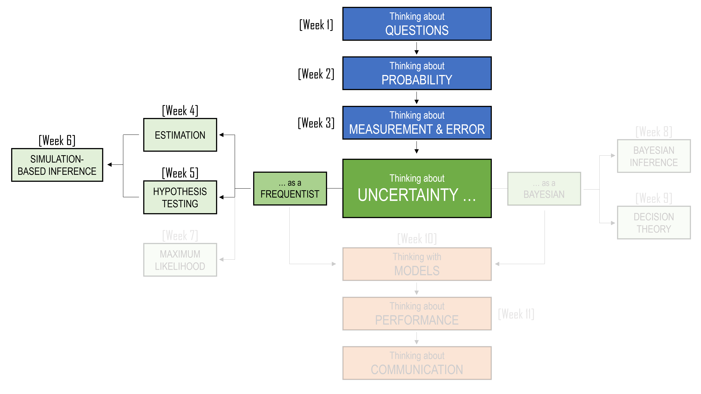
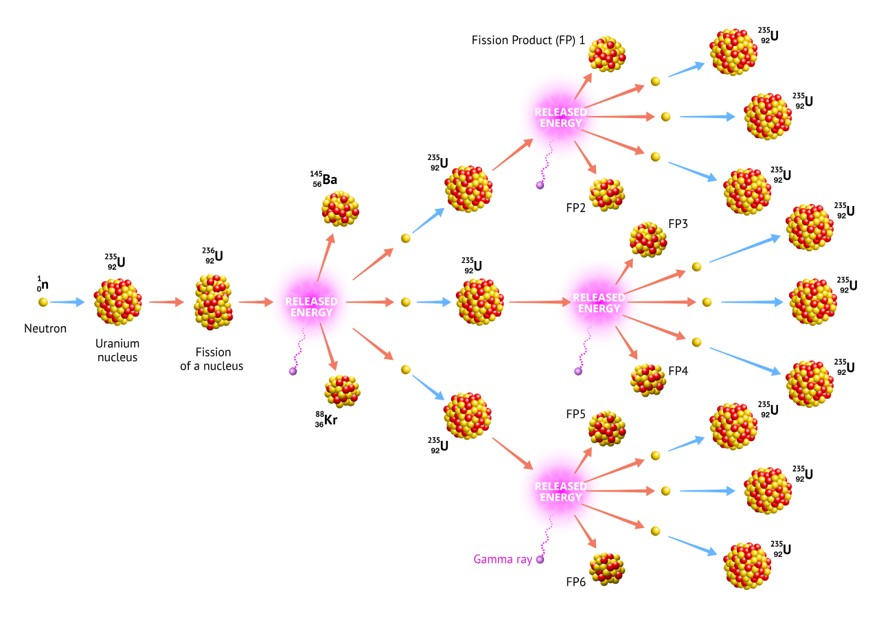

```{r, include=FALSE}
library(tidyverse)
library(flextable)
library(webexercises)
library(gt)
library(scales)
```

::: callout-note
## Learning Objectives

By the end of this chapter, you should be able to:

1.  Explain why simulation can be useful when a sampling distribution is difficult to derive mathematically.
2.  Describe how simulation connects to the ideas of sampling variation, confidence intervals, hypothesis testing, and p-values.
3.  Explain the logic of a permutation test.
4.  Use a permutation test to compare two groups.
5.  Interpret a simulated p-value as a tail proportion from a simulated null distribution.
6.  Explain the bootstrap idea of using the sample as a stand-in for the population.
7.  Generate bootstrap samples by sampling with replacement.
8.  Use bootstrap samples to approximate the sampling distribution of an estimator.
9.  Construct and interpret percentile bootstrap confidence intervals.
10. Distinguish between permutation methods for testing and bootstrap methods for estimation.
:::

<centre>

```{r, echo=FALSE}
#| classes: .enlarge-image

```

</centre>

<br>

## What does Solitaire and Nuclear Bombs have in common?

On the morning of 16 July 1945, in the New Mexico desert, the United States detonated the world’s first nuclear weapon. The test was code-named Trinity. The device itself was called the Gadget. It produced an explosion equivalent to thousands of tonnes of TNT and marked the culmination of the Manhattan Project: a vast, secret wartime effort that brought together some of the most brilliant scientists and mathematicians of the twentieth century.

Among them were J. Robert Oppenheimer, John von Neumann, and a Polish-born mathematician named Stanisław Ulam. Ulam was not as publicly famous as some of the others, but his mathematical imagination would become central to a new way of solving problems. These problems involved physical processes so complex that writing down an exact answer could be close to impossible.

One of the great difficulties was understanding how neutrons move and interact inside fissile material. The basic idea of a nuclear chain reaction is simple enough to describe. A neutron strikes the nucleus of an atom. The nucleus splits. Energy is released. More neutrons are released. Those neutrons may then strike other nuclei, releasing still more neutrons. If, on average, each stage produces enough further reactions, the process grows rapidly.

But the details are much harder. A neutron might strike another nucleus. It might scatter and change direction. It might slow down. It might escape. It might be absorbed without producing another fission event. Each possibility depends on features such as the neutron’s position, speed, energy, and the material around it.

<centre>

```{r, echo=FALSE}
#| classes: .enlarge-image
#| fig-cap: "Fission Chain Reaction. Image Source: Energy Encyclopedia"
#| echo: false
#| 

```

</centre>

So the question was not just:

> What happens to one neutron?

The question was closer to:

> Across an enormous number of possible neutron histories, how often does the process grow, fade out, or escape?

Trying to calculate every possible path directly was hopeless. The sample space was too large. There were too many branches, too many dependencies, and too many possible histories.

Then, in early 1946, Ulam became seriously ill. He developed encephalitis, an inflammation of the brain, and nearly died. His recovery was long and slow. Confined to bed, he passed the time by playing solitaire. As he played, a question began to bother him:

> What is the probability that a randomly shuffled game of solitaire can be won?

At first, this sounds like a straightforward probability question. In principle, one could try to list all possible deals of the cards, work out which deals lead to a win, and divide:

$$\frac{\text{number of winning deals}}{\text{number of possible deals}}$$

But in practice, this was a nightmare. The number of possible arrangements of a deck of cards is enormous. The game also unfolds through many decisions and dependencies. A neat formula was not easy to find. A deck of 52 cards can be arranged in $52!$ different ways. This is approximately

$$8 \times10^{67}$$

That's 8 followed by 67 zeros.

That is an unimaginably large number of possible deals. Listing them all was impossible. Analysing them all was impossible. Even describing the full sample space in a useful way was practically impossible. But Ulam noticed something. He did not need to list every possible game to learn something about the probability of winning. He could play many games and count the proportion that were won.

If he played 10 games, the answer would be rough. If he played 100 games, it might be better. If a machine could play thousands or millions of games, the proportion of wins could become a useful approximation. The idea was simple but powerful:

> When the exact probability is too hard to calculate, simulate the random process many times and count what happens.

When Ulam returned to Los Alamos, the connection became clear. Solitaire was only a card game, but the same way of thinking could be used for much harder problems. Instead of trying to calculate every possible neutron path exactly, one could simulate many possible neutron histories. One simulated neutron might scatter. Another might escape. Another might trigger a fission event and produce more neutrons, each with its own possible path. Repeating this process again and again could reveal the behaviour of the whole system.

This approach became known as the Monte Carlo method, named after the casino district famous for games of chance. The name is playful, but the idea is serious:

> If we can imitate the random process often enough, we can learn what it tends to do.

In this chapter, we will use the same basic idea for statistical inference.

## From formulae to simulation

In the previous chapter, we saw that many hypothesis tests follow the same structure:

1.  State a benchmark claim.
2.  Choose a statistic.
3.  Work out what values of that statistic would be expected under the benchmark claim.
4.  Compare the observed statistic with that reference distribution.

The hard part is usually step 3. Sometimes probability theory gives us a convenient answer. For example, when testing a mean, we may use a $t$-distribution. When comparing proportions, we may use an approximate normal distribution or a chi-squared test. These formula-based methods are powerful and efficient.

But they are not the only way.

Suppose we want to know whether a statistic is unusual under some assumption. If we can simulate many datasets under that assumption, then we can calculate the statistic for each simulated dataset. This produces an approximate sampling distribution.

Then we ask where the observed statistic sits in that simulated distribution. This is the same logic as the p-value in Chapter 5. The difference is how we get the reference distribution.

```{r}
#| echo: false
#| message: false
#| warning: false

reference_table <- tibble(
  Approach = c("Formula-based", "Simulation-based"),
  `How the reference distribution is obtained` = c(
    "Use mathematical theory, such as the t distribution or normal approximation",
    "Use a computer to create many hypothetical repeated results"
  ),
  `Advantage` = c(
    "Fast, exact or very accurate when assumptions hold",
    "Flexible and often easier to understand visually"
  ),
  `Risk` = c(
    "Can hide assumptions behind a formula",
    "Can be misleading if the simulation does not match the question"
  )
)

reference_table |>
  gt() |>
  tab_options(table.width = pct(100))
```

Simulation-based inference therefore does not replace statistical thinking. It makes the thinking more visible. We must say exactly what world we are simulating.

## Simulating from an assumed model

Before we get to permutation tests and bootstrapping, it is useful to see the basic idea of simulation in a simpler setting.

::: callout-note
### A benchmark claim about household income

Suppose we have a sample of 100 Australian households from an ABS-style income survey. A benchmark claim is made:

> The average annual household income in this population is \$100,000.

In our sample, the mean household income is \$112,000.

Is a sample mean of \$112,000 surprisingly high if the true average household income were \$100,000?
:::

Household income is usually right-skewed. Many households have incomes near the middle of the distribution, while a smaller number of households have very high incomes. A normal distribution may not describe individual household incomes well.

For illustration, suppose we are willing to assume that household income follows a log-normal distribution. A log-normal distribution is right-skewed and only produces positive values, which makes it a simple model for income-like data.

Under the benchmark claim, the mean household income is \$100,000. To simulate realistic income values, we also need to assume a population standard deviation. Suppose we use a standard deviation of \$70,000.

We can then simulate what the sample mean would look like if we repeatedly sampled 100 households from a log-normal distribution with mean \$100,000 and standard deviation \$70,000.

```{r}
#| echo: false
#| message: false
#| warning: false

set.seed(2420)

B <- 10000
n_households <- 100
claimed_mean_income <- 100000
assumed_sd_income <- 70000
observed_mean_income <- 112000

income_meanlog <- log(claimed_mean_income) -
  0.5 * log(1 + (assumed_sd_income / claimed_mean_income)^2)

income_sdlog <- sqrt(
  log(1 + (assumed_sd_income / claimed_mean_income)^2)
)

income_model_sim <- tibble(
  simulation = 1:B,
  sample_mean = replicate(
    B,
    mean(rlnorm(
      n_households,
      meanlog = income_meanlog,
      sdlog = income_sdlog
    ))
  )
)

income_model_p_value <- mean(income_model_sim$sample_mean >= observed_mean_income)

income_model_sim |>
  summarise(
    `Number of simulations` = n(),
    `Mean of simulated sample means` = mean(sample_mean),
    `Observed sample mean` = observed_mean_income,
    `Simulated p-value` = income_model_p_value
  ) |>
  gt() |>
  fmt_currency(
    columns = c(`Mean of simulated sample means`, `Observed sample mean`),
    currency = "AUD",
    decimals = 0
  ) |>
  fmt_number(columns = `Simulated p-value`, decimals = 3)
```

The simulated p-value is the proportion of simulated sample means that were at least as large as \$112,000.

First, here is what the assumed lognormal model looks like at the level of individual households. The individual incomes are clearly right-skewed. Most households are clustered toward the lower and middle part of the distribution, while a smaller number have much higher incomes.

```{r}
#| echo: false
#| message: false
#| warning: false

set.seed(2420)

income_values_from_model <- tibble(
  income = rlnorm(
    10000,
    meanlog = income_meanlog,
    sdlog = income_sdlog
  )
)

income_values_from_model |>
  ggplot(aes(x = income)) +
  geom_histogram(bins = 60, boundary = 0) +
  scale_x_continuous(labels = label_dollar(prefix = "$")) +
  coord_cartesian(xlim = c(0, 400000)) +
  labs(
    title = "A lognormal model for individual household incomes",
    x = "Household income",
    y = "Number of simulated households"
  ) +
  theme_minimal()
```

Now here is the simulated distribution of sample means. Each value is an average from a simulated sample of 100 households. Averaging reduces some of the extreme variation, so the simulated sample means form a distribution that is more concentrated and more bell-shaped. This is the Central Limit Theorem appearing through simulation rather than through a formula.

```{r}
#| echo: false
#| message: false
#| warning: false

income_model_sim |>
  ggplot(aes(x = sample_mean)) +
  geom_histogram(bins = 45, boundary = 0) +
  geom_vline(xintercept = observed_mean_income, linewidth = 1) +
  annotate(
    "text",
    x = observed_mean_income + 2500,
    y = Inf,
    label = "Observed mean",
    vjust = 1.5,
    hjust = 0
  ) +
  scale_x_continuous(labels = label_dollar(prefix = "$", suffix = "")) +
  labs(
    title = "Simulated sample means when the true mean is $100,000",
    x = "Sample mean household income",
    y = "Number of simulations"
  ) +
  theme_minimal()
```

But this approach relies on strong assumptions. We had to assume not only that the true mean was \$100,000, but also that household incomes followed a log-normal distribution with a standard deviation of \$70,000.In many practical settings, we do not want to make such a specific distributional assumption.

Permutation tests offer another route.

## Permutation tests

A permutation test is a simulation-based hypothesis test built around the idea of **shuffling**. The basic logic is:

> If the explanatory variable is unrelated to the outcome, then the labels attached to the observations could have been arranged differently.

This is easier to understand with data. We will return to the household income example from Chapters 4 and 5.

::: callout-note
### Household income in capital city and regional areas

Suppose we collect annual household income data from two groups:

-   households in capital city areas;
-   households in regional areas.

We want to know whether household income is associated with region.
:::

In Chapter 4, this was an estimation question:

> How large is the difference between mean household incomes in the two groups?

In Chapter 5, this became a hypothesis testing question:

> Is the observed difference surprising if the two population means are equal?

Now we will answer the testing question by simulation. Let us use the same type of illustrative income data as before. The data are simulated for teaching purposes, but the context is the same: an ABS-style household income survey.

```{r}
#| echo: false
#| message: false
#| warning: false

set.seed(5242)

income_regions <- tibble(
  region = rep(c("Capital city", "Regional"), each = 80),
  income = c(
    round(rlnorm(80, meanlog = log(105000) - 0.5 * log(1 + (55000 / 105000)^2),
                 sdlog = sqrt(log(1 + (55000 / 105000)^2))), -2),
    round(rlnorm(80, meanlog = log(90000) - 0.5 * log(1 + (50000 / 90000)^2),
                 sdlog = sqrt(log(1 + (50000 / 90000)^2))), -2)
  )
)

income_regions |>
  group_by(region) |>
  summarise(
    n = n(),
    `Sample mean` = mean(income),
    `Sample median` = median(income),
    `Sample standard deviation` = sd(income),
    .groups = "drop"
  ) |>
  gt() |>
  fmt_currency(
    columns = c(`Sample mean`, `Sample median`, `Sample standard deviation`),
    currency = "AUD",
    decimals = 0
  )
```

The two groups have different sample means. Let us calculate the observed difference as:

$$
\bar{x}_{\text{capital}} - \bar{x}_{\text{regional}}= \text{19,960}
$$

```{r}
#| echo: false
#| message: false
#| warning: false

observed_diff <- income_regions |>
  group_by(region) |>
  summarise(mean_income = mean(income), .groups = "drop") |>
  summarise(
    diff = mean_income[region == "Capital city"] - mean_income[region == "Regional"]
  ) |>
  pull(diff)

observed_medians <- income_regions |>
  group_by(region) |>
  summarise(median_income = median(income), .groups = "drop")

observed_median_diff <- observed_medians$median_income[observed_medians$region == "Capital city"] -
  observed_medians$median_income[observed_medians$region == "Regional"]
```

The key question is not whether the sample means are exactly equal. They almost certainly will not be exactly equal. The key question is:

> Would a difference this large be surprising if region were not associated with income?

This is where the permutation test begins.

### The shuffling idea

Suppose the region labels do not matter. That is, suppose income is not associated with whether a household is labelled "Capital city" or "Regional".

Under this benchmark claim, the incomes are still the incomes. We do not change them. The observed incomes are part of the data. What changes is the labels.

If region does not matter, then the label "Capital city" could have been attached to a different set of 80 households, and the label "Regional" could have been attached to the remaining 80 households.

So we shuffle the region labels. Each shuffle gives one possible world where region is unrelated to income. For each shuffled world, we calculate the difference in mean incomes between the two shuffled groups.

```{r}
#| echo: false
#| message: false
#| warning: false

tibble(
  id = c("1", "2", "3", "4", "5", "...", "160"),
  income = c(113100, 117200, 253200, 143541, 118152, NA, 157214),
  lab1 = c("Capital city", "Regional", "Capital city", "Regional", "Capital city", "...", "Regional"),
  lab2 = c("Regional", "Regional", "Capital city", "Capital city", "Regional", "...", "Capital city")
) |> 
  rename(
    "Original label" = 3,
    "Shuffled label" = 4
  ) |>
  gt() |>
  fmt_currency(
    columns = income,
    currency = "AUD",
    decimals = 0
  ) |>
  sub_missing(
    columns = income,
    missing_text = "..."
  ) |>
  cols_align(
    align = "center",
    columns = everything()
  )
```

Next, the sample statistics are computed for the date grouped by the shuffled labels. Then we repeat the process many times.

```{r}
#| echo: false
#| message: false
#| warning: false

mean_difference <- function(data) {
  data |>
    group_by(region) |>
    summarise(mean_income = mean(income), .groups = "drop") |>
    summarise(
      `Capital minus regional` =
        mean_income[region == "Capital city"] -
        mean_income[region == "Regional"]
    ) |>
    pull(`Capital minus regional`)
}

set.seed(5242)

shuffle_statistics <- tibble(
  shuffle = c("Observed data", paste("Shuffle", 1:8)),
  `Capital city mean` = NA_real_,
  `Regional mean` = NA_real_,
  `Capital minus regional` = NA_real_
)

observed_row <- income_regions |>
  group_by(region) |>
  summarise(mean_income = mean(income), .groups = "drop") |>
  summarise(
    shuffle = "Observed data",
    `Capital city mean` = mean_income[region == "Capital city"],
    `Regional mean` = mean_income[region == "Regional"],
    `Capital minus regional` =
      `Capital city mean` - `Regional mean`
  )

shuffled_rows <- map_dfr(
  1:8,
  \(i) {
    income_regions |>
      mutate(region = sample(region, size = n(), replace = FALSE)) |>
      group_by(region) |>
      summarise(mean_income = mean(income), .groups = "drop") |>
      summarise(
        shuffle = paste("Shuffle", i),
        `Capital city mean` = mean_income[region == "Capital city"],
        `Regional mean` = mean_income[region == "Regional"],
        `Capital minus regional` =
          `Capital city mean` - `Regional mean`
      )
  }
)

bind_rows(
  observed_row,
  shuffled_rows
) |>
  gt() |>
  fmt_currency(
    columns = c(
      `Capital city mean`,
      `Regional mean`,
      `Capital minus regional`
    ),
    currency = "AUD",
    decimals = 0
  )
```

### A permutation test for the difference in means

Suppose we did this shuffling process 5000 times. The summary statistics are provided below.

```{r}
#| echo: false
#| message: false
#| warning: false

set.seed(2420)

B <- 5000

perm_diffs <- tibble(
  simulation = 1:B,
  diff = replicate(B, {
    shuffled_data <- income_regions |>
      mutate(region = sample(region))
    
    shuffled_means <- shuffled_data |>
      group_by(region) |>
      summarise(mean_income = mean(income), .groups = "drop")
    
    shuffled_means$mean_income[shuffled_means$region == "Capital city"] -
      shuffled_means$mean_income[shuffled_means$region == "Regional"]
  })
)
```

```{r}
#| echo: false
#| message: false
#| warning: false

perm_diffs |>
  summarise(
    `Number of permutations` = n(),
    `Mean of permuted differences` = mean(diff),
    `Standard deviation of permuted differences` = sd(diff),
    `Smallest permuted difference` = min(diff),
    `Largest permuted difference` = max(diff)
  ) |>
  gt() |>
  fmt_currency(
    columns = c(
      `Mean of permuted differences`,
      `Standard deviation of permuted differences`,
      `Smallest permuted difference`,
      `Largest permuted difference`
    ),
    currency = "AUD",
    decimals = 0
  )
```

The simulated differences are centred close to zero. This is exactly what we should expect. If region labels do not matter, then sometimes the shuffled capital city group will have a higher mean, sometimes the shuffled regional group will have a higher mean, and the long-run centre should be near zero.

```{r}
#| echo: false
#| message: false
#| warning: false

perm_diffs |>
  ggplot(aes(x = diff)) +
  geom_histogram(bins = 45, boundary = 0) +
  geom_vline(xintercept = observed_diff, linewidth = 1) +
  annotate(
    "text",
    x = observed_diff,
    y = Inf,
    label = "Observed difference",
    vjust = 1.5,
    hjust = -0.05
  ) +
  scale_x_continuous(labels = dollar_format(prefix = "$")) +
  labs(
    title = "Permutation distribution for the income difference",
    subtitle = "Region labels are shuffled; incomes stay fixed",
    x = "Difference in sample means: capital city minus regional",
    y = "Number of permutations"
  ) +
  theme_minimal()
```

The histogram is the simulated null distribution. It shows what differences in mean income would look like if region were not associated with income. The solid vertical line is the observed difference. If the observed difference is far out in the tail of the histogram, then it is difficult to explain by shuffled labels alone.

### The simulated p-value

A p-value is a tail proportion. In a simulation-based test, it is estimated by counting how many simulated statistics are at least as extreme as the observed statistic.

```{r}
#| echo: false
#| message: false
#| warning: false

library(patchwork)

one_sided_plot <- perm_diffs |>
  mutate(
    as_extreme = diff >= observed_diff
  ) |>
  ggplot(aes(x = diff, fill = as_extreme)) +
  geom_histogram(bins = 45, boundary = 0) +
  geom_vline(xintercept = observed_diff, linewidth = 1) +
  annotate(
    "text",
    x = observed_diff,
    y = Inf,
    label = "Observed\ndifference",
    vjust = 1.5,
    hjust = -0.05
  ) +
  scale_fill_manual(
    values = c("FALSE" = "grey70", "TRUE" = "tomato"),
    guide = "none"
  ) +
  scale_x_continuous(labels = dollar_format(prefix = "$")) +
  labs(
    title = "One-sided test",
    subtitle = "Counts shuffled differences ≥ observed difference",
    x = "Capital city minus regional",
    y = "Number of permutations"
  ) +
  theme_minimal()

two_sided_plot <- perm_diffs |>
  mutate(
    as_extreme = abs(diff) >= abs(observed_diff)
  ) |>
  ggplot(aes(x = diff, fill = as_extreme)) +
  geom_histogram(bins = 45, boundary = 0) +
  geom_vline(xintercept = observed_diff, linewidth = 1) +
  geom_vline(xintercept = -observed_diff, linewidth = 1, linetype = "dashed") +
  annotate(
    "text",
    x = observed_diff,
    y = Inf,
    label = "Observed\ndifference",
    vjust = 1.5,
    hjust = -0.05
  ) +
  annotate(
    "text",
    x = -observed_diff,
    y = Inf,
    label = "Equally extreme\nin other direction",
    vjust = 1.5,
    hjust = 1.05
  ) +
  scale_fill_manual(
    values = c("FALSE" = "grey70", "TRUE" = "tomato"),
    guide = "none"
  ) +
  scale_x_continuous(labels = dollar_format(prefix = "$")) +
  labs(
    title = "Two-sided test",
    subtitle = "Counts shuffled differences with |difference| ≥ |observed|",
    x = "Capital city minus regional",
    y = NULL
  ) +
  theme_minimal()

one_sided_plot / two_sided_plot +
  plot_annotation(
    subtitle = "The shaded bars are the permutations used to calculate the simulated p-value"
  )
```

For a two-sided test, we count simulated differences whose absolute value is at least as large as the absolute value of the observed difference:

$$
\text{simulated p-value}
=
\frac{\text{number of simulated } |D| \ge |D_{\text{obs}}|}{\text{number of simulations}}.
$$

```{r}
#| echo: false
#| message: false
#| warning: false

perm_p_two_sided <- mean(abs(perm_diffs$diff) >= abs(observed_diff))
perm_p_greater <- mean(perm_diffs$diff >= observed_diff)

p_table <- tibble(
  Test = c("One-sided: capital city mean is higher", "Two-sided: means differ"),
  `Tail rule` = c(
    "Count permuted differences >= observed difference",
    "Count |permuted difference| >= |observed difference|"
  ),
  `Simulated p-value` = c(perm_p_greater, perm_p_two_sided)
)

p_table |>
  gt() |>
  fmt_number(columns = `Simulated p-value`, decimals = 4) |>
  tab_options(table.width = pct(100))
```

The p-value is not the probability that the two regions have the same population mean. It is the proportion of simulated shuffled worlds that produced a difference at least as extreme as the one we observed.

A small p-value says:

> Differences this large were rare in the shuffled worlds.

It does not say:

> The null hypothesis has this probability of being true.

That warning is the same as in Chapter 5. Simulation changes the calculation, not the interpretation.

### What a permutation test preserves

A permutation test is powerful because it keeps some features of the data exactly as they were observed.

In the income example, the permutation test preserves:

-   the full set of observed incomes;
-   the number of capital city labels;
-   the number of regional labels;
-   the skewness and outliers in the income distribution.

But it breaks the connection between income and region.

```{r}
#| echo: false
#| message: false
#| warning: false

preserve_table <- tibble(
  `Feature of the data` = c(
    "The observed income values",
    "The number of households in each group",
    "The association between income and region",
    "The shape of the income distribution"
  ),
  `What happens in a permutation test?` = c(
    "Preserved",
    "Preserved",
    "Broken by shuffling labels",
    "Preserved"
  )
)

preserve_table |>
  gt() |>
  tab_options(table.width = pct(100))
```

This makes the permutation test a natural method for testing whether two variables are associated. It creates a world where the association has been removed, while leaving the observed values themselves intact.

::: callout-important
### The key question for a permutation test

A permutation test asks:

> What would our statistic look like if the labels were exchangeable?

In the income example, this means asking what differences in mean income would look like if the labels "Capital city" and "Regional" could be shuffled among the households without changing anything important.
:::

### When is a permutation test reasonable?

The shuffling idea depends on a condition called **exchangeability**. Roughly, observations are exchangeable under the benchmark claim if rearranging the labels would be consistent with that claim.

For a two-group comparison, this means that if the benchmark claim is true, the group labels should not carry information about the outcome.

This is especially natural in a randomised experiment. Suppose people are randomly assigned to two teaching methods. If the teaching method has no effect, then the labels "Method A" and "Method B" are exchangeable. We could shuffle them and create another possible random assignment.

For observational data, such as household income by region, the idea requires more care. Households are not randomly assigned to live in capital city or regional areas. Region may be connected to employment opportunities, industry, housing costs, household composition, education, and many other factors. A permutation test can still answer a precise question about the observed data, but we should be cautious about turning that answer into a causal story.

In this chapter, our question is not:

> Does living in a capital city cause a household to have a higher income?

The safer question is:

> Is the observed association between region and income larger than we would expect from randomly shuffled region labels?

That distinction matters.

## Bootstrap methods

In Chapter 4, we learned that the uncertainty in an estimate is about what would happen across repeated samples. But in real life, we usually have only one sample. The ABS does not repeatedly draw thousands of new samples just so we can see how our estimate changes. So what can we do?

The bootstrap uses a clever approximation:

> If the sample is a reasonable miniature version of the population, then resampling from the sample can mimic repeated sampling from the population.

The word bootstrap comes from the expression "to pull oneself up by one's bootstraps".

<center>

```{r, echo=FALSE}

```

</center>

The statistical bootstrap has the same flavour. We use the sample itself to learn about the uncertainty in a statistic calculated from that sample. The key operation is **sampling with replacement**.

Suppose our sample contains five incomes:

$$
52000,\ 61000,\ 68000,\ 73000,\ 420000.
$$

A bootstrap sample of size five is created by randomly choosing five values from this list, replacing each value after it is chosen. This means the same value can appear more than once, and some original values may not appear at all.

```{r}
#| echo: false
#| message: false
#| warning: false

set.seed(2420)

mini_income <- c(52000, 61000, 68000, 73000, 420000)

bootstrap_examples <- tibble(
  `Original sample` = dollar(mini_income),
  `Bootstrap sample 1` = dollar(sample(mini_income, size = 5, replace = TRUE)),
  `Bootstrap sample 2` = dollar(sample(mini_income, size = 5, replace = TRUE)),
  `Bootstrap sample 3` = dollar(sample(mini_income, size = 5, replace = TRUE))
)

bootstrap_examples |>
  gt()
```

Each bootstrap sample is the same size as the original sample, but it is not the same set of values. Some values repeat. Others disappear. This repetition and disappearance is what creates variation across bootstrap samples.

::: callout-important
### Note: Bootstrap samples are not permutations

A permutation rearranges the existing observations without changing how many times each one appears.

A bootstrap sample resamples with replacement, so some observations can appear more than once and others can be absent.
:::

### Bootstrapping the mean income in one sample

Let us first bootstrap the mean household income for all households in our illustrative dataset, ignoring region.

Suppose the sample mean for our 160 households is \$94,629.

```{r}
#| echo: false
#| message: false
#| warning: false

observed_mean_income <- mean(income_regions$income)
observed_median_income <- median(income_regions$income)
observed_mean_income
```

To bootstrap this estimate:

1.  Resample 160 households from the observed 160 households, with replacement.
2.  Calculate the mean income in the bootstrap sample.
3.  Repeat many times.
4.  Examine the distribution of bootstrap means.

Suppose the table below represents 5000 bootstap samples for our data.

```{r}
#| echo: false
#| message: false
#| warning: false

set.seed(2420)

B <- 5000

boot_means <- tibble(
  simulation = 1:B,
  mean_income = replicate(B, {
    boot_sample <- sample(income_regions$income, size = nrow(income_regions), replace = TRUE)
    mean(boot_sample)
  })
)

boot_means_display <- bind_rows(
  boot_means |> slice_head(n = 5),
  tibble(
    mean_income = NA_real_
  ),
  boot_means |> slice_tail(n = 5)
)

boot_means_display |>
  gt() |>
  fmt_currency(
    columns = mean_income,
    currency = "AUD",
    decimals = 0
  ) |>
  sub_missing(
    columns = everything(),
    missing_text = "..."
  )
```

And the following table provides summary statistics for our boostrap sample:

```{r}
#| echo: false
#| message: false
#| warning: false

boot_mean_ci <- quantile(boot_means$mean_income, probs = c(0.025, 0.975))

boot_means |>
  summarise(
    `Observed mean` = observed_mean_income,
    `Mean of bootstrap means` = mean(mean_income),
    `Bootstrap standard error` = sd(mean_income),
    `2.5th percentile` = boot_mean_ci[1],
    `97.5th percentile` = boot_mean_ci[2]
  ) |>
  gt() |>
  fmt_currency(
    columns = everything(),
    currency = "AUD",
    decimals = 0
  )
```

The bootstrap standard error is the standard deviation of the bootstrap estimates. It estimates how much the sample mean might vary from sample to sample.

The interval from the 2.5th percentile to the 97.5th percentile is called a **percentile bootstrap confidence interval**.

```{r}
#| echo: false
#| message: false
#| warning: false

boot_means |>
  ggplot(aes(x = mean_income)) +
  geom_histogram(bins = 45, boundary = 0) +
  geom_vline(xintercept = observed_mean_income, linewidth = 1) +
  geom_vline(xintercept = boot_mean_ci, linetype = "dashed", linewidth = 1) +
  scale_x_continuous(labels = dollar_format(prefix = "$")) +
  labs(
    title = "Bootstrap distribution of the sample mean",
    subtitle = "Each bootstrap sample resamples households with replacement",
    x = "Bootstrap mean household income",
    y = "Number of bootstrap samples"
  ) +
  theme_minimal()
```

The histogram shows the bootstrap distribution of the mean. It is not a distribution of individual incomes. It is a distribution of estimates.

This distinction is central:

-   The original income distribution shows variation between households.
-   The bootstrap distribution shows variation between possible estimates.

### The percentile bootstrap confidence interval

The percentile bootstrap interval is simple to construct.

For an approximate 95% confidence interval:

1.  Generate many bootstrap samples.
2.  Calculate the statistic of interest for each bootstrap sample.
3.  Sort the bootstrap statistics.
4.  Use the 2.5th and 97.5th percentiles as the interval endpoints.

The idea is that the middle 95% of the bootstrap estimates gives a plausible range for the population parameter.

In notation, if the bootstrap estimates are:

$$
\hat{\theta}^{[1]},\ \hat{\theta}^{[2]},\ \ldots,\ \hat{\theta}^{[B]},
$$

then the percentile bootstrap interval is:

$$
\left(
\hat{\theta}^{[0.025]},
\hat{\theta}^{[0.975]}
\right),
$$

where these represent the 2.5th and 97.5th percentiles of the bootstrap estimates. This method is popular because it is easy to explain and easy to implement. It also works for many statistics where a standard formula is awkward.

### Bootstrapping the median

The median is an important example. Income data are often skewed, and the median is often more meaningful than the mean when describing a typical household.

But the standard error of the median is less familiar than the standard error of the mean. In an introductory course, we may not have a convenient formula for it. The bootstrap gives us a practical solution.

```{r}
#| echo: false
#| message: false
#| warning: false

set.seed(2420)

boot_medians <- tibble(
  simulation = 1:B,
  median_income = replicate(B, {
    boot_sample <- sample(income_regions$income, size = nrow(income_regions), replace = TRUE)
    median(boot_sample)
  })
)
```

```{r}
#| echo: false
#| message: false
#| warning: false

boot_median_ci <- quantile(boot_medians$median_income, probs = c(0.025, 0.975))

boot_medians |>
  summarise(
    `Observed median` = observed_median_income,
    `Bootstrap standard error` = sd(median_income),
    `2.5th percentile` = boot_median_ci[1],
    `97.5th percentile` = boot_median_ci[2]
  ) |>
  gt() |>
  fmt_currency(columns = everything(), currency = "AUD", decimals = 0)
```

```{r}
#| echo: false
#| message: false
#| warning: false

boot_medians |>
  ggplot(aes(x = median_income)) +
  geom_histogram(bins = 35, boundary = 0) +
  geom_vline(xintercept = observed_median_income, linewidth = 1) +
  geom_vline(xintercept = boot_median_ci, linetype = "dashed", linewidth = 1) +
  scale_x_continuous(labels = dollar_format(prefix = "$")) +
  labs(
    title = "Bootstrap distribution of the sample median",
    x = "Bootstrap median household income",
    y = "Number of bootstrap samples"
  ) +
  theme_minimal()
```

Notice that the bootstrap distribution for the median may look less smooth than the bootstrap distribution for the mean. This happens because the median can only take certain values from the data, especially when the sample size is not very large.

This is a useful reminder:

> The bootstrap is flexible, but it is still built from the data we have.

If the sample is small, or if the statistic depends heavily on a few observations, the bootstrap distribution may be rough.

### Bootstrap confidence interval for a difference in means

Let us now return to the comparison between capital city and regional households. In Chapter 5, we tested whether the difference in mean incomes was larger than expected under a benchmark claim. Here we estimate the uncertainty in the size of that difference. The parameter of interest is:

$$
\mu_{\text{capital}} - \mu_{\text{regional}}
$$

The estimate is:

$$
\bar{x}_{\text{capital}} - \bar{x}_{\text{regional}}
$$

For independent groups, the bootstrap should re-sample within each group separately. This preserves the two-sample structure.

```{r}
#| echo: false
#| message: false
#| warning: false

set.seed(2420)

capital_income <- income_regions |>
  filter(region == "Capital city") |>
  pull(income)

regional_income <- income_regions |>
  filter(region == "Regional") |>
  pull(income)

boot_diff_means <- tibble(
  simulation = 1:B,
  diff = replicate(B, {
    boot_capital <- sample(capital_income, size = length(capital_income), replace = TRUE)
    boot_regional <- sample(regional_income, size = length(regional_income), replace = TRUE)
    mean(boot_capital) - mean(boot_regional)
  })
)
```

```{r}
#| echo: false
#| message: false
#| warning: false

boot_diff_ci <- quantile(boot_diff_means$diff, probs = c(0.025, 0.975))

boot_diff_means |>
  summarise(
    `Observed difference` = observed_diff,
    `Bootstrap standard error` = sd(diff),
    `2.5th percentile` = boot_diff_ci[1],
    `97.5th percentile` = boot_diff_ci[2]
  ) |>
  gt() |>
  fmt_currency(columns = everything(), currency = "AUD", decimals = 0)
```

```{r}
#| echo: false
#| message: false
#| warning: false

boot_diff_means |>
  ggplot(aes(x = diff)) +
  geom_histogram(bins = 45, boundary = 0) +
  geom_vline(xintercept = observed_diff, linewidth = 1) +
  geom_vline(xintercept = boot_diff_ci, linetype = "dashed", linewidth = 1) +
  geom_vline(xintercept = 0, linetype = "dotted", linewidth = 1) +
  scale_x_continuous(labels = dollar_format(prefix = "$")) +
  labs(
    title = "Bootstrap distribution for the difference in mean incomes",
    subtitle = "Capital city minus regional",
    x = "Bootstrap difference in sample means",
    y = "Number of bootstrap samples"
  ) +
  theme_minimal()
```

The dotted vertical line marks zero. If the interval is entirely above zero, then the bootstrap interval suggests that positive differences are the plausible values. But remember the role of the bootstrap here: it is estimating uncertainty in the size of the difference. It is not primarily constructing a null distribution.

This is why the bootstrap distribution is centred near the observed difference, while the permutation distribution was centred near zero.

```{r}
#| echo: false
#| message: false
#| warning: false

compare_distributions <- bind_rows(
  perm_diffs |>
    transmute(Method = "Permutation distribution", diff),
  boot_diff_means |>
    transmute(Method = "Bootstrap distribution", diff)
)

compare_distributions |>
  ggplot(aes(x = diff)) +
  geom_histogram(bins = 45, boundary = 0) +
  facet_wrap(~ Method, ncol = 1, scales = "free_y") +
  geom_vline(xintercept = 0, linetype = "dotted", linewidth = 1) +
  geom_vline(xintercept = observed_diff, linewidth = 1) +
  scale_x_continuous(labels = dollar_format(prefix = "$")) +
  labs(
    title = "Permutation and bootstrap distributions answer different questions",
    x = "Difference in sample means: capital city minus regional",
    y = "Number of simulations"
  ) +
  theme_minimal()
```

The **permutation distribution** is centred near zero because it represents a world where region labels do not matter.

The **bootstrap distribution** is centred near the observed estimate because it represents repeated sampling from a population that looks like the observed sample.

So the two distributions have different centres because they answer different questions.

```{r}
#| echo: false
#| message: false
#| warning: false

centre_table <- tibble(
  Distribution = c("Permutation", "Bootstrap"),
  `Centred near` = c("The benchmark value, often 0", "The observed estimate"),
  `Why?` = c(
    "It simulates a world where the null claim is true",
    "It simulates repeated samples from a population like the observed sample"
  ),
  `Used mainly for` = c("p-values", "standard errors and confidence intervals")
)

centre_table |>
  gt() |>
  tab_options(table.width = pct(100))
```

### Paired data and the bootstrap

The bootstrap can also be used for paired data. Suppose we observe the same households under two measurements, such as income before and after housing costs. Since both values come from the same household, the two values are paired. In a paired problem, we should not re-sample the before values separately from the after values. That would break the pairing.

Instead, we first calculate the within-household differences:

$$
D_i = X_i - Y_i
$$

Then we bootstrap the differences.

```{r}
#| echo: false
#| message: false
#| warning: false

set.seed(2420)

paired_income <- tibble(
  household = 1:60,
  before_housing = round(rlnorm(60, meanlog = log(100000) - 0.5 * log(1 + (45000 / 100000)^2),
                                sdlog = sqrt(log(1 + (45000 / 100000)^2))), -2)
) |>
  mutate(
    housing_costs = round(runif(60, min = 14000, max = 36000), -2),
    after_housing = before_housing - housing_costs,
    difference = before_housing - after_housing
  )

paired_income |>
  summarise(
    n = n(),
    `Mean before housing costs` = mean(before_housing),
    `Mean after housing costs` = mean(after_housing),
    `Mean difference` = mean(difference)
  ) |>
  gt() |>
  fmt_currency(
    columns = c(`Mean before housing costs`, `Mean after housing costs`, `Mean difference`),
    currency = "AUD",
    decimals = 0
  )
```

```{r}
#| echo: false
#| message: false
#| warning: false

set.seed(2420)

boot_paired_diff <- tibble(
  simulation = 1:B,
  mean_difference = replicate(B, {
    boot_diffs <- sample(paired_income$difference, size = nrow(paired_income), replace = TRUE)
    mean(boot_diffs)
  })
)
```

```{r}
#| echo: false
#| message: false
#| warning: false

paired_observed_diff <- mean(paired_income$difference)
paired_ci <- quantile(boot_paired_diff$mean_difference, probs = c(0.025, 0.975))

boot_paired_diff |>
  summarise(
    `Observed mean difference` = paired_observed_diff,
    `Bootstrap standard error` = sd(mean_difference),
    `2.5th percentile` = paired_ci[1],
    `97.5th percentile` = paired_ci[2]
  ) |>
  gt() |>
  fmt_currency(columns = everything(), currency = "AUD", decimals = 0)
```

The important point is not the particular numbers. The important point is the structure. With paired data, resample the pairs or resample the differences. Do not break the pairing.

### When the bootstrap works well, and when it can struggle

The bootstrap is a remarkably useful method, but it is not a guarantee of truth. The bootstrap treats the sample as a stand-in for the population. This is reasonable when the sample is large enough and representative enough to capture the important features of the population. But the bootstrap can struggle when:

-   the sample size is very small
-   the sample misses important parts of the population
-   the statistic depends on extreme values
-   the population has rare but important tail behaviour
-   the data are biased or poorly measured

For example, suppose the true population contains a small number of extremely high-income households, but none of them appear in our sample. The bootstrap cannot invent the missing high-income households. It can only resample from what was observed.

it is important to remember that:

> The bootstrap cannot fix a bad sample.

It can describe the uncertainty implied by the data we have. It cannot repair data that were collected from the wrong population, measured badly, or missing important values. A useful habit is to always plot the bootstrap distribution. If it is extremely rough, heavily skewed, or dominated by a few repeated observations, then the bootstrap interval should be interpreted cautiously.

## Optional extension: Can the bootstrap be used for hypothesis testing?

So far, we have used permutation tests for hypothesis testing and bootstrap methods for confidence intervals. This is the cleanest distinction:

-   permutation tests simulate what would happen if the group labels did not matter;
-   bootstrap methods simulate how much an estimate might vary from sample to sample.

However, the bootstrap can also be adapted for hypothesis testing. The main complication is that, for a test, we need to simulate from a world where the benchmark claim is true. Suppose we are comparing mean household income in capital city and regional areas. The observed difference is:

$$
\bar{x}_{\text{capital}} - \bar{x}_{\text{regional}}
$$

If we simply bootstrap from the original capital city and regional samples, we simulate a world that looks like the data we observed. But that world may already contain a real difference between the groups. That is useful for a confidence interval, but it is not the right reference world for a hypothesis test.

For a hypothesis test, we need to simulate a world where the population mean difference is zero.

One simple method is to **recentre** the data.

1.  Compute the mean income in each group.
2.  Compute the overall mean income.
3.  Shift the capital city incomes so their mean becomes the overall mean.
4.  Shift the regional incomes so their mean also becomes the overall mean.
5.  Bootstrap from these shifted samples.
6.  Calculate the difference in means for each bootstrap sample.
7.  Compare the observed difference with this bootstrap null distribution.

```{r}
#| echo: true
#| message: false
#| warning: false

overall_mean <- mean(income_regions$income)
capital_mean <- mean(capital_income)
regional_mean <- mean(regional_income)

capital_shifted <- capital_income - capital_mean + overall_mean
regional_shifted <- regional_income - regional_mean + overall_mean

mean(capital_shifted)
mean(regional_shifted)
```

Both shifted groups now have the same mean. We have created a modified version of the data where the benchmark claim is true.

Now we bootstrap from the shifted groups.

```{r}
#| echo: true
#| message: false
#| warning: false

set.seed(2420)

boot_null_diffs <- tibble(
  simulation = 1:B,
  diff = replicate(B, {
    boot_capital <- sample(capital_shifted, size = length(capital_shifted), replace = TRUE)
    boot_regional <- sample(regional_shifted, size = length(regional_shifted), replace = TRUE)
    mean(boot_capital) - mean(boot_regional)
  })
)

boot_test_p <- mean(abs(boot_null_diffs$diff) >= abs(observed_diff))
```

```{r}
#| echo: false
#| message: false
#| warning: false

boot_null_diffs |>
  ggplot(aes(x = diff)) +
  geom_histogram(bins = 45, boundary = 0) +
  geom_vline(xintercept = observed_diff, linewidth = 1) +
  geom_vline(xintercept = -observed_diff, linetype = "dashed", linewidth = 1) +
  scale_x_continuous(labels = dollar_format(prefix = "$")) +
  labs(
    title = "Optional: bootstrap null distribution after recentring",
    subtitle = "The groups are shifted so that their means are equal before resampling",
    x = "Bootstrap difference in means under the benchmark claim",
    y = "Number of bootstrap samples"
  ) +
  theme_minimal()
```

```{r}
#| echo: false
#| message: false
#| warning: false

tibble(
  Method = c("Permutation test", "Bootstrap test after recentring"),
  `Two-sided simulated p-value` = c(perm_p_two_sided, boot_test_p)
) |>
  gt() |>
  fmt_number(columns = `Two-sided simulated p-value`, decimals = 4)
```

This produces a bootstrap version of a null distribution.

The reason we do not use this as the main testing method is that it is less transparent than a permutation test. In a permutation test, the benchmark claim says the labels do not matter, so we shuffle the labels. In a bootstrap test, we first have to construct a modified version of the data where the benchmark claim is true. That extra step is powerful, but it is also easier to misunderstand.

For this reason, in this unit we use:

-   permutation tests for simulation-based hypothesis testing;
-   bootstrap methods for simulation-based confidence intervals.

The bootstrap test is useful to know about, but it is not the main method we rely on here.

## Summary

Simulation-based inference uses repeated computation to understand what kinds of statistics we might expect under a particular process.

Permutation tests simulate a world where the labels are exchangeable. They are mainly used for hypothesis testing. In the household income example, we shuffled the region labels to ask whether the observed difference between capital city and regional incomes was unusual under a benchmark world where region did not matter.

Bootstrap methods simulate repeated sampling from a population that looks like the observed sample. They are mainly used for estimating uncertainty. In the household income example, we resampled households with replacement to estimate the sampling variability of means, medians, and differences between groups.

```{r}
#| echo: false
#| message: false
#| warning: false

summary_table <- tibble(
  Feature = c(
    "Main question",
    "What is resampled?",
    "Replacement?",
    "Typical centre of simulated distribution",
    "Common output"
  ),
  `Permutation test` = c(
    "What would happen if the labels did not matter?",
    "Labels are shuffled among observations",
    "No; labels are rearranged",
    "The benchmark value, often 0",
    "Simulated p-value"
  ),
  Bootstrap = c(
    "How much might the estimate vary from sample to sample?",
    "Observations are resampled from the sample",
    "Yes; observations can repeat",
    "The observed estimate",
    "Standard error or confidence interval"
  )
)

summary_table |>
  gt() |>
  tab_options(table.width = pct(100))
```

The computer can repeat an analysis thousands of times. But the computer does not know what question we are asking. That remains our job.

## Exercises

:::: callout-note
## Question 1

A cafe owner wants to know whether customers spend more when they order through a mobile app than when they order at the counter. The owner collects the following sample of order amounts, in dollars.

```{r}
#| echo: false
#| message: false
#| warning: false

q1_orders <- tibble(
  Method = rep(c("Mobile app", "Counter"), each = 12),
  Amount = c(
    18, 22, 21, 27, 25, 19, 31, 24, 28, 20, 26, 29,
    15, 18, 17, 22, 19, 16, 20, 21, 18, 17, 23, 19
  )
)

q1_orders |>
  group_by(Method) |>
  summarise(
    n = n(),
    `Mean amount` = mean(Amount),
    `Median amount` = median(Amount),
    .groups = "drop"
  ) |>
  gt() |>
  fmt_currency(columns = c(`Mean amount`, `Median amount`), currency = "AUD", decimals = 2)
```

(a) What is the observed difference in mean order amount, using:

$$
\bar{x}_{\text{app}} - \bar{x}_{\text{counter}}?
$$

(b) Explain how you would conduct a permutation test for this difference.

(c) In the context of this example, what does it mean to shuffle the labels?

(d) Suppose a permutation test gives a two-sided p-value of 0.018. Interpret this p-value in context.

::: {.callout-important collapse="true"}
## Click for Solutions

(a) The mobile app mean is:

$$
\frac{18+22+\cdots+29}{12} = 24.17
$$

The counter mean is:

$$
\frac{15+18+\cdots+19}{12} = 18.75
$$

So the observed difference is:

$$
24.17 - 18.75 = 5.42
$$

The mobile app orders are higher by about \$5.42 in this sample.

(b) To conduct a permutation test:

<!-- -->

1.  Keep all 24 order amounts fixed.
2.  Shuffle the labels "Mobile app" and "Counter" among the 24 orders.
3.  Calculate the difference in mean order amount for the shuffled data.
4.  Repeat many times.
5.  Compare the observed difference of 5.42 with the shuffled differences.

<!-- -->

(c) Shuffling the labels means pretending that the ordering method does not matter. The order amounts stay the same, but the labels "Mobile app" and "Counter" are randomly reassigned to the orders.

(d) A p-value of 0.018 means that, if ordering method were not associated with order amount, a difference in sample means at least as extreme as the one observed would occur in about 1.8% of shuffled datasets. This gives evidence that order amount differs between the two ordering methods.
:::
::::

:::: callout-note
## Question 2

A researcher records the number of minutes 15 students spend reading before a short comprehension test:

$$
18,\ 22,\ 25,\ 20,\ 30,\ 28,\ 24,\ 26,\ 21,\ 23,\ 35,\ 19,\ 27,\ 31,\ 29
$$

The sample mean is 25.2 minutes.

(a) Describe how to create one bootstrap sample from these data.

(b) Explain why sampling must be done with replacement.

(c) Suppose 1,000 bootstrap means have 2.5th and 97.5th percentiles of 22.4 and 28.3. Write down the approximate 95% percentile bootstrap confidence interval.

(d) Interpret the interval in context.

::: {.callout-important collapse="true"}
## Click for Solutions

(a) A bootstrap sample is created by randomly selecting 15 values from the original 15 reading times, with replacement. For example, a bootstrap sample might include 18 twice, 35 once, and omit 20 entirely.

(b) Sampling with replacement creates variation between bootstrap samples. If we sampled without replacement and kept the same sample size, we would simply rearrange the original 15 values. The mean would be unchanged every time.

(c) The approximate 95% percentile bootstrap confidence interval is:

$$
(22.4,\ 28.3)
$$

(d) The interval suggests that plausible values for the population mean reading time are roughly between 22.4 and 28.3 minutes, based on this sample and the bootstrap method.
:::
::::

:::: callout-note
## Question 3

A school trials two different reminder messages to encourage parents to return a permission form. The results are:

```{r}
#| echo: false
#| message: false
#| warning: false

q3_forms <- tibble(
  Message = c("Simple reminder", "Personalised reminder"),
  Returned = c(42, 55),
  `Not returned` = c(38, 25),
  Total = Returned + `Not returned`,
  `Proportion returned` = Returned / Total
)

q3_forms |>
  gt() |>
  fmt_percent(columns = `Proportion returned`, decimals = 1)
```

(a) Calculate the observed difference in proportions:

$$
\hat{p}_{\text{personalised}} - \hat{p}_{\text{simple}}
$$

(b) Explain how a permutation test could be used here.

(c) What would the null distribution represent?

::: {.callout-important collapse="true"}
## Click for Solutions

(a) The simple reminder return proportion is:

$$
\frac{42}{80} = 0.525
$$

The personalised reminder return proportion is:

$$
\frac{55}{80} = 0.6875
$$

So the observed difference is:

$$
0.6875 - 0.525 = 0.1625
$$

The personalised reminder group had a return rate 16.25 percentage points higher in the sample.

(b) We could keep the 160 outcomes fixed: 97 returned and 63 not returned. Then we shuffle the message labels between the students, keeping 80 labelled "Simple reminder" and 80 labelled "Personalised reminder". For each shuffle, calculate the difference in proportions.

(c) The null distribution represents differences in return proportions that could occur if the reminder message were unrelated to whether the form was returned.
:::
::::

:::: callout-note
## Question 4

A fitness instructor records the resting heart rate of 20 participants before and after a four-week exercise program. The researcher calculates the paired differences:

$$
D_i = \text{before}_i - \text{after}_i
$$

The differences, in beats per minute, are:

$$
4,\ 6,\ 3,\ 8,\ 5,\ 2,\ 7,\ 6,\ 5,\ 4,\ 9,\ 3,\ 5,\ 6,\ 4,\ 7,\ 5,\ 6,\ 8,\ 4
$$

(a) Why is this a paired-data problem?

(b) Describe how to bootstrap the mean difference.

(c) Suppose the 95% bootstrap confidence interval for the mean difference is $(4.5, 6.2)$. Interpret this interval.

(d) Why would it be wrong to independently bootstrap the before and after values separately?

::: {.callout-important collapse="true"}
## Click for Solutions

(a) It is paired because each participant contributes two measurements: one before and one after the program. The two measurements from the same participant are connected.

(b) First calculate the 20 differences. Then repeatedly sample 20 differences with replacement from the observed differences. For each bootstrap sample, calculate the mean difference. The distribution of bootstrap mean differences is used to estimate uncertainty.

(c) The interval suggests that the population mean reduction in resting heart rate is plausibly between 4.5 and 6.2 beats per minute, based on this sample and the bootstrap method.

(d) Bootstrapping the before and after values separately would break the pairing. It would ignore the fact that each before value is naturally linked to a particular after value for the same participant.
:::
::::

:::: callout-note
## Question 5

A supermarket compares the time taken by two checkout systems. The manager is interested in the median checkout time because the data are skewed by a few very large orders.

A sample gives:

-   median time for the standard checkout: 7.8 minutes;
-   median time for the express checkout: 5.9 minutes;
-   observed difference: 1.9 minutes.

A bootstrap distribution for the difference in medians has a 95% percentile interval of $(0.6, 3.2)$ minutes.

(a) What parameter is being estimated?

(b) Why might the median be preferred to the mean here?

(c) Interpret the confidence interval.

(d) Does the interval suggest that the express checkout is faster, on median? Explain.

::: {.callout-important collapse="true"}
## Click for Solutions

(a) The parameter is the difference in population median checkout times between the standard and express systems.

(b) The median may be preferred because checkout times can be right-skewed. A few very large orders can make the mean much larger, while the median better reflects a typical checkout time.

(c) The interval suggests that the standard checkout median is plausibly between 0.6 and 3.2 minutes longer than the express checkout median.

(d) Yes. Since the entire interval is above 0, the bootstrap interval suggests that the standard checkout has a higher median time, or equivalently that the express checkout is faster on median.
:::
::::

:::: callout-note
## Question 6

A researcher wants to test whether a new website design changes the time users spend on a page. The observed sample mean time is 14 seconds higher under the new design than under the old design.

The researcher creates two simulated distributions:

1.  Distribution A is created by shuffling the labels "old design" and "new design".
2.  Distribution B is created by bootstrapping separately within the old-design sample and the new-design sample.

<!-- -->

(a) Which distribution is most appropriate for a hypothesis test of no difference?

(b) Which distribution is most appropriate for a confidence interval for the difference in mean time?

(c) Which distribution would usually be centred near 0?

(d) Which distribution would usually be centred near the observed difference of 14 seconds?

::: {.callout-important collapse="true"}
## Click for Solutions

(a) Distribution A is most appropriate for a hypothesis test of no difference. Shuffling labels simulates a world where design does not matter.

(b) Distribution B is most appropriate for a confidence interval. Bootstrapping within each group simulates repeated sampling from populations like the observed samples.

(c) Distribution A, the permutation distribution, would usually be centred near 0.

(d) Distribution B, the bootstrap distribution, would usually be centred near the observed difference of 14 seconds.
:::
::::
