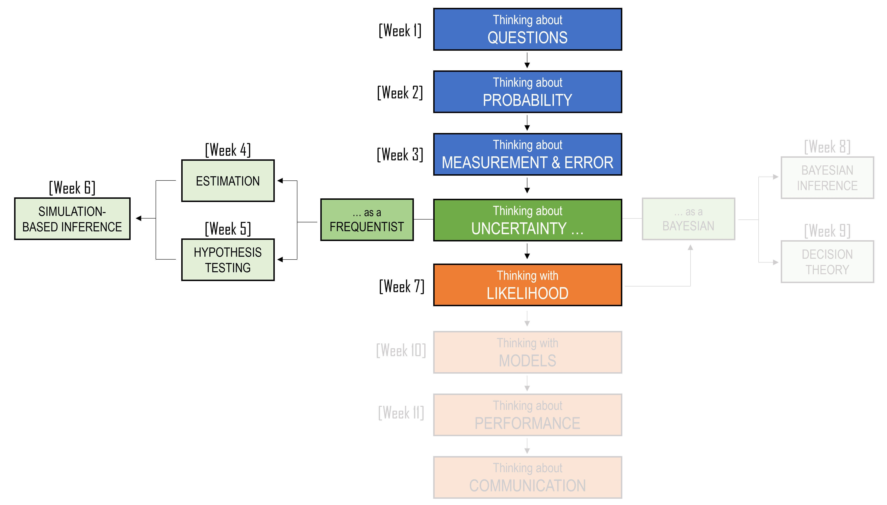
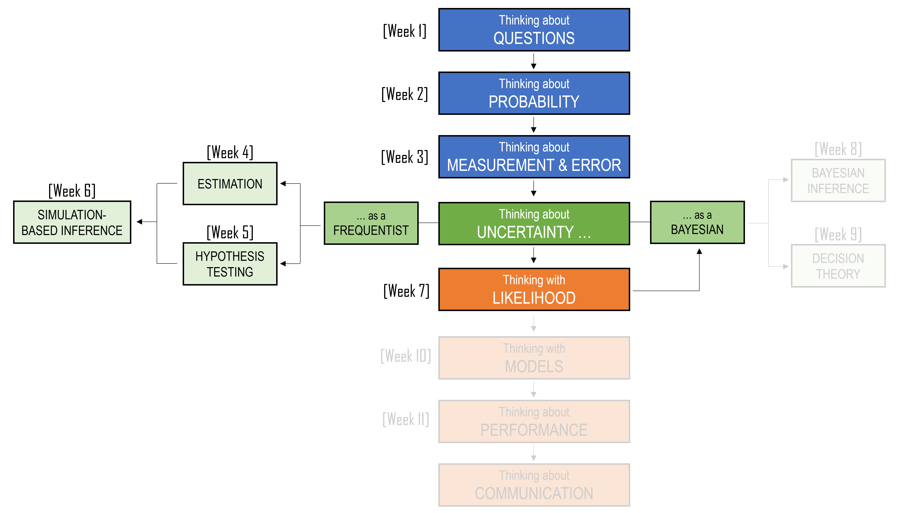

```{r, include=FALSE}
library(tidyverse)
library(flextable)
library(webexercises)
library(gt)
library(scales)
library(MASS)

set.seed(2420)
```

::: callout-note
## Learning Objectives

By the end of this chapter, you should be able to:

1. Explain why likelihood requires a probability model for the data.
2. Describe a statistical model as a simplified probability story about how data might have been generated.
3. Recognise why the normal distribution is not appropriate for every kind of data.
4. Match common data types to plausible probability models, including Bernoulli, binomial, Poisson, exponential, gamma, and normal models.
5. Distinguish between a probability mass function and a probability density function.
6. Distinguish between probability and likelihood.
7. Construct and interpret a simple likelihood function for binary data.
8. Explain maximum likelihood estimation as choosing the parameter value that makes the observed data most likely.
9. Explain why log-likelihoods are often easier to work with than likelihoods.
:::

## Introduction

Thus far, our journey has mostly been situated within the block labelled *Thinking about uncertainty*. We learned how uncertainty enters statistical questions, probability, measurement, estimation, hypothesis testing, and simulation-based inference. These tools helped us ask what the data show, how much estimates vary, and what kinds of patterns chance alone can produce.

We now move into the next part of the story: Thinking with likelihood. The focus is still uncertainty, but the question changes. Instead of only asking what the sample tells us directly, we begin to ask what kind of probability model could have produced data like these. Likelihood gives us a way to compare possible explanations within a chosen model, and it becomes the bridge from data-based inference to model-based thinking.

<centre>

```{r, echo=FALSE}
#| classes: .enlarge-image

```

</centre>

<br>

## Beyond the bell curve

The normal distribution has already played an important role in this book. It helped us think about measurement error. It helped us understand why sample means can behave predictably across repeated samples. It helped us construct approximate confidence intervals and hypothesis tests. The normal distribution is powerful because many small, roughly independent sources of variation can combine to produce a bell-shaped pattern.

But not all data are bell-shaped.

Some data are **binary**:

> Did a student attend class? Did a patient recover? Did a household own its home?

Some data are **counts**:

> How many hospital admissions occurred this week? How many goals were scored? How many insurance claims were lodged?

Some data are **positive and skewed**:

> How long did someone wait? How much income did a household report? How much rainfall fell in a day?

For these examples, the bell curve may not be a sensible model. A normal distribution can take negative values, but waiting times, incomes, rainfall amounts, and counts cannot be negative. A normal distribution is symmetric, but many real variables have a long right tail. A normal distribution describes continuous measurements, but yes/no outcomes only take the values 0 and 1.

So we need a broader idea.

Instead of asking:

> Can we use the normal distribution here?

we ask:

> What kind of probability model could have generated data like these?

That question does not mean there is one perfect model waiting to be discovered. A model is always a simplification. But some simplifications respect the structure of the data better than others.

```{r}
#| echo: false
#| message: false
#| warning: false

model_table <- tibble(
  `Kind of data` = c(
    "Yes/no outcome",
    "Number of successes out of n trials",
    "Count in a fixed time or place",
    "Waiting time until an event",
    "Positive skewed measurement",
    "Roughly symmetric measurement"
  ),
  `Possible values` = c(
    "0 or 1",
    "0, 1, ..., n",
    "0, 1, 2, ...",
    "Positive values",
    "Positive values",
    "Any real value"
  ),
  `Possible model` = c(
    "Bernoulli",
    "Binomial",
    "Poisson",
    "Exponential",
    "Gamma or log-normal",
    "Normal"
  ),
  `Example` = c(
    "Did a student use public transport?",
    "How many of 20 forms were returned?",
    "Number of arrivals at a clinic per hour",
    "Time until the next tram arrives",
    "Household income or rainfall",
    "Repeated measurement error"
  )
)

model_table |>
  gt() |>
  tab_options(table.width = pct(100))
```

This table is not a list to memorise. It is a habit of thought. Before fitting a model, ask what values the variable can take and what shape the data might reasonably have.

:::: {.callout-important}
### A useful habit

Before choosing a model, ask:

1. What values are possible?
2. Are the data discrete or continuous?
3. Are there natural bounds, such as 0 or 1?
4. Is the distribution likely to be symmetric or skewed?
5. What process might have generated the observations?
::::

This chapter is about what happens after we choose such a model. Once we have a probability model, the data can tell us which versions of that model are more or less plausible. If the model contains an unknown parameter, different parameter values describe different possible data-generating processes. Some values would make the observed data seem quite likely. Other values would make the observed data seem surprising. 

The tool we use to compare these possibilities is called **likelihood**.

## Discrete and continuous data

A useful first distinction is between **discrete** and **continuous** random variables. A discrete random variable takes values that can be counted. For example, the number of children in a household could be 0, 1, 2, 3, and so on. The number of hospital admissions in a day is also discrete. We can list the possible values, even if the list is long.

For discrete random variables, probabilities are assigned to individual values using a **probability mass function**, or pmf. For example, a pmf might tell us:

$$
P(Y = 3) = 0.18.
$$

```{r, echo=FALSE}
pmf_data <- tibble(
  x = 0:6,
  probability = c(0.05, 0.10, 0.16, 0.18, 0.22, 0.17, 0.12)
)

ggplot(pmf_data, aes(x = x, y = probability)) +
  geom_col(width = 0.7) +
  geom_text(aes(label = probability), vjust = -0.4) +
  scale_x_continuous(breaks = 0:6) +
  ylim(0, 0.25) +
  labs(
    x = "Number of events",
    y = "Probability",
    title = "A probability mass function"
  )
```

This means that the probability of observing exactly 3 events is 0.18.

A continuous random variable can take values on a continuum. Waiting time, height, rainfall, and income are often treated as continuous. For continuous variables, we do not usually assign probabilities to exact values. Instead, probabilities are areas over intervals.

For example, if $Y$ is a waiting time, we might ask:

$$
P(5 \leq Y \leq 10).
$$

```{r, echo=FALSE}
waiting_pdf <- tibble(
  x = seq(0, 25, length.out = 1000),
  density = dexp(x, rate = 1 / 6)
) |>
  mutate(
    shaded = x >= 5 & x <= 10
  )

ggplot(waiting_pdf, aes(x = x, y = density)) +
  geom_area(
    data = waiting_pdf |> filter(shaded),
    alpha = 0.5
  ) +
  geom_line(linewidth = 1) +
  labs(
    x = "Waiting time, in minutes",
    y = "Density",
    title = "A probability density function",
    subtitle = "The shaded area represents P(5 < X < 10)"
  )
```


This is the probability that the waiting time is between 5 and 10 minutes. For continuous random variables, probabilities are described using a **probability density function**, or pdf.

The distinction matters because likelihood uses the model's probability rule. For discrete data, likelihood is built from probabilities of observed values. For continuous data, likelihood is built from densities at observed values.

```{r}
#| echo: false
#| message: false
#| warning: false

pmf_pdf_table <- tibble(
  `Type of variable` = c("Discrete", "Continuous"),
  `Examples` = c("Counts, yes/no outcomes", "Waiting times, heights, rainfall"),
  `Model uses` = c("Probability mass function (pmf)", "Probability density function (pdf)"),
  `Probability statement` = c("P(Y = y)", "P(a <= Y <= b)")
)

pmf_pdf_table |>
  gt() |>
  tab_options(table.width = pct(100))
```

## A small gallery of probability models

We do not need a complete catalogue of distributions before learning likelihood. But we do need enough distribution theory to understand why different models suit different kinds of data. This section introduces a few common probability models. We will use some of them in this chapter and return to others when we begin thinking more deeply with models.

**Note**: some of the probability theories behind these models has been covered in earlier chapters.

### Bernoulli model: one yes/no outcome

A **Bernoulli** model is used for a single binary outcome.

Suppose:

$$
Y =
\begin{cases}
1, & \text{if a student used public transport}\\
0, & \text{otherwise}
\end{cases}
$$
The model has one parameter:

$$
p = P(Y = 1).
$$

So:

$$
P(Y = 1) = p, \qquad P(Y = 0) = 1-p.
$$

A compact way to write both cases is:

$$
P(Y = y) = p^y(1-p)^{1-y}, \qquad y = 0,1.
$$

This formula can look strange at first, but it is just a shortcut. If $y=1$, then:

$$
p^1(1-p)^0 = p.
$$

If $y=0$, then:

$$
p^0(1-p)^1 = 1-p.
$$

The Bernoulli model is useful because many real questions have binary outcomes. Did someone vote? Did a customer return? Did a person recover? Did a household have internet access?

```{r, echo=FALSE}

p <- 0.65
bernoulli_data <- tibble(
  y = c(0, 1),
  probability = c(1 - p, p)
)

ggplot(bernoulli_data, aes(x = factor(y), y = probability)) +
  geom_col(width = 0.6) +
  geom_text(aes(label = probability), vjust = -0.4) +
  scale_x_discrete(
    labels = c("0" = "No public transport", "1" = "Used public transport")
  ) +
  ylim(0, 1) +
  labs(
    x = "Outcome",
    y = "Probability",
    title = "A Bernoulli model for public transport use"
  )
```


### Binomial model: number of successes

A **binomial** model is used when we count the number of successes in a fixed number of independent trials, each with the same probability of success.

For example, suppose 20 students are asked whether they used public transport to campus. If each student has probability $p$ of saying yes, and if we treat the responses as independent, then the number of yes responses can be modelled as:

$$
Y \sim \text{Binomial}(n = 20, p).
$$

The possible values are:

$$
0, 1, 2, \ldots, 20.
$$

The binomial model is closely related to the Bernoulli model. A Bernoulli variable is like one yes/no trial. A binomial variable counts how many successes occurred across several yes/no trials.

For example, suppose 20 students are asked whether they used public transport to campus. If each student has probability $p$ of saying yes, and if we treat the responses as independent, then the number of yes responses can be modeled as:

$$Y \sim \text{Binomial}(20, p)$$

The possible values are:

$$Y = 0, 1, 2, \ldots, 20$$

```{r, echo=FALSE}
n <- 20
p <- 0.65

binomial_data <- tibble(
  y = 0:n,
  probability = dbinom(y, size = n, prob = p)
)

ggplot(binomial_data, aes(x = y, y = probability)) +
  geom_col(width = 0.7) +
  scale_x_continuous(breaks = 0:n) +
  labs(
    x = "Number of students who say yes",
    y = "Probability",
    title = "A binomial model for 20 student responses",
    subtitle = "Here, each student has probability p = 0.65 of saying yes"
  )
```


### Poisson model: counts in time or space

A **Poisson** model is often used for counts of events in a fixed amount of time or space.

Examples include:

- the number of calls to a service centre in an hour;
- the number of hospital admissions in a week;
- the number of traffic accidents at an intersection in a month;
- the number of goals scored by a team in a match.

A Poisson model has one parameter, usually written as $\lambda$. This parameter is the expected count in the interval of interest.

If:

$$
Y \sim \text{Poisson}(\lambda),
$$

then:

$$
P(Y = y) = \frac{e^{-\lambda}\lambda^y}{y!}, \qquad y = 0,1,2,\ldots.
$$

```{r, echo=FALSE}
lambda <- 4

poisson_data <- tibble(
  y = 0:15,
  probability = dpois(y, lambda = lambda)
)

ggplot(poisson_data, aes(x = y, y = probability)) +
  geom_col(width = 0.7) +
  scale_x_continuous(breaks = 0:15) +
  labs(
    x = "Number of events",
    y = "Probability",
    title = "A Poisson model for event counts",
    subtitle = "Here, the expected count is lambda = 4"
  )
```

In this example, $\lambda = 4$, so the model is centred around 4 events. Counts near 4 are more plausible than counts much smaller or much larger than 4, but the model still allows any non-negative count.

### Exponential model: waiting time until an event

An **exponential** model is often used for waiting times.

For example:

- time until the next bus arrives;
- time until a machine fails;
- time until the next customer arrives;
- time between calls to a hotline.

If $Y$ is a waiting time, then $Y$ cannot be negative. This is one reason the normal distribution may not be appropriate.

One way to write the exponential model is in terms of the mean waiting time $\theta$:

$$
f(y \mid \theta) = \frac{1}{\theta}e^{-y/\theta}, \qquad y > 0.
$$

Here, $\theta$ is the average waiting time. Larger values of $\theta$ produce longer waits on average.

```{r, echo=FALSE}
theta <- 6

exponential_data <- tibble(
  x = seq(0, 30, length.out = 500),
  density = dexp(x, rate = 1 / theta)
)

ggplot(exponential_data, aes(x = x, y = density)) +
  geom_line(linewidth = 1) +
  labs(
    x = "Waiting time, in minutes",
    y = "Density",
    title = "An exponential model for waiting times",
    subtitle = "Here, the average waiting time is theta = 6 minutes"
  )
```

In this example, $\theta = 6$, so the average waiting time is 6 minutes. The curve is highest near zero, meaning short waits are more common than long waits, but the model still allows longer waits with decreasing probability.

### Gamma model: positive skewed measurements

A **gamma** model is also used for positive, right-skewed data. It is more flexible than the exponential model.

Examples include:

- rainfall amounts on wet days;
- insurance claim sizes;
- some kinds of waiting times;
- some biomedical measurements;
- household income, at least as a rough first model.

The gamma distribution has two parameters, often called a shape and a rate. We will not derive its formula here. The important idea is that the gamma model can represent a range of positive skewed shapes.

```{r, echo=FALSE}
gamma_data <- tibble(
  x = seq(0, 20, length.out = 500)
) |>
  tidyr::crossing(
    model = c("shape = 1", "shape = 2", "shape = 5")
  ) |>
  mutate(
    shape = case_when(
      model == "shape = 1" ~ 1,
      model == "shape = 2" ~ 2,
      model == "shape = 5" ~ 5
    ),
    rate = 0.5,
    density = dgamma(x, shape = shape, rate = rate)
  )

ggplot(gamma_data, aes(x = x, y = density, linetype = model, color = model)) +
  geom_line(linewidth = 1) +
  labs(
    x = "Positive value",
    y = "Density",
    title = "Gamma models for positive, right-skewed data",
    subtitle = "Different shape values produce different skewed distributions"
  )
```

The plot shows three gamma models with the same rate but different shape values. When the shape is small, the distribution is strongly right-skewed, with many small values and a long right tail. As the shape increases, the distribution becomes less sharply concentrated near zero and begins to look more mound-shaped, while still only allowing positive values. This flexibility is why the gamma model is often useful for positive quantities such as rainfall, waiting times, claim sizes, and other measurements that cannot be negative.

### Normal model: symmetric continuous measurements

The **normal** model is still important. It remains useful for many continuous measurements that are roughly symmetric, and for modelling measurement error.

If:

$$
Y \sim N(\mu, \sigma^2),
$$

then $\mu$ controls the centre and $\sigma$ controls the spread.

The key point is not that the normal model is wrong. The key point is that it is not always the right first choice.

```{r, echo=FALSE}
normal_data <- tibble(
  x = seq(-6, 8, length.out = 600)
) |>
  tidyr::crossing(
    model = c(
      "mu = 0, sigma = 1",
      "mu = 3, sigma = 1",
      "mu = 0, sigma = 2"
    )
  ) |>
  mutate(
    mu = case_when(
      model == "mu = 0, sigma = 1" ~ 0,
      model == "mu = 3, sigma = 1" ~ 3,
      model == "mu = 0, sigma = 2" ~ 0
    ),
    sigma = case_when(
      model == "mu = 0, sigma = 1" ~ 1,
      model == "mu = 3, sigma = 1" ~ 1,
      model == "mu = 0, sigma = 2" ~ 2
    ),
    density = dnorm(x, mean = mu, sd = sigma)
  )

ggplot(normal_data, aes(x = x, y = density, linetype = model, color = model)) +
  geom_line(linewidth = 1) +
  labs(
    x = "Value",
    y = "Density",
    title = "Normal models with different centres and spreads",
    subtitle = "Changing mu shifts the curve; changing sigma changes its spread"
  )
```

## What is a statistical model?

A statistical model has two parts. First, it specifies a probability pattern for the data. Second, it contains one or more unknown quantities called **parameters**.

```{r, echo=FALSE}
model_parts_table <- tribble(
  ~Model, ~`Probability pattern`, ~`Parameter(s)`, ~`What the parameter changes`,
  "Bernoulli",
  "Each observation is either 0 or 1.",
  "$p$",
  "The probability that $Y = 1$.",
  
  "Binomial",
  "Counts the number of successes in a fixed number of trials.",
  "$n, p$",
  "$n$ is the number of trials; $p$ is the probability of success on each trial.",
  
  "Poisson",
  "The observation is a non-negative count: 0, 1, 2, ...",
  "$\\lambda$",
  "The expected count in the interval of interest.",
  
  "Exponential",
  "The observation is a positive waiting time.",
  "$\\theta$",
  "The mean waiting time.",
  
  "Gamma",
  "The observation is positive and right-skewed.",
  "Shape and rate",
  "The shape and spread of the positive, skewed distribution.",
  
  "Normal",
  "The observation is continuous and roughly bell-shaped.",
  "$\\mu, \\sigma$",
  "$\\mu$ controls the centre; $\\sigma$ controls the spread."
)

model_parts_table |>
  gt() |>
  fmt_markdown(columns = everything()) |>
  cols_label(
    Model = md("**Model**"),
    `Probability pattern` = md("**Probability pattern**"),
    `Parameter(s)` = md("**Parameter(s)**"),
    `What the parameter changes` = md("**What the parameter changes**")
  ) |>
  tab_header(
    title = md("Two parts of a statistical model"),
    subtitle = md("A model specifies a probability pattern and one or more unknown parameters.")
  )
```

Different parameter values describe different versions of the same model. For example, suppose $Y$ is whether a student uses public transport. A Bernoulli model with $p = 0.20$ describes a world where public transport use is uncommon. A Bernoulli model with $p = 0.80$ describes a world where public transport use is common.

The model family is the same. The parameter value changes the story.

:::: {.callout-important}
### Model family and fitted model

A **model family** is a set of possible models, such as all Bernoulli models with different values of $p$.

A **fitted model** is what we get after using data to choose particular parameter values from that family.
::::

This gives us a three-step process:

1. Choose a model family.
2. Use data to estimate the parameter values.
3. Check whether the fitted model is reasonable for the data.

In this chapter, likelihood gives us a method for the second step. But the first and third steps are just as important.

## Probability and likelihood

Likelihood is easiest to understand by contrasting it with probability. Probability usually starts with a model and asks what data we might see.

For example:

> Suppose the probability that a student uses public transport is $p = 0.50$. What is the probability that 13 out of 20 students say yes?

Here, the parameter is fixed. The data vary.

Likelihood turns the question around.

> We observed 13 yes responses out of 20. Which values of $p$ make this result more or less plausible?

Here, the data are fixed. The parameter varies.

```{r}
#| echo: false
#| message: false
#| warning: false

prob_lik_table <- tibble(
  `Way of thinking` = c("Probability", "Likelihood"),
  `Held fixed` = c("The parameter or model", "The observed data"),
  `Allowed to vary` = c("The possible data", "The possible parameter values"),
  `Question` = c(
    "If the model were true, what data might we see?",
    "Given the data, which parameter values make them plausible?"
  )
)

prob_lik_table |>
  gt() |>
  tab_options(table.width = pct(100))
```

This reversal is subtle, but it is the heart of the chapter.

### An example: public transport use

Suppose we ask 20 students whether they used public transport to get to campus today. We record:

$$
1 = \text{yes}, \qquad 0 = \text{no}.
$$

Suppose 13 students say yes and 7 students say no.

A natural estimate of the probability that a student uses public transport is:

$$
\hat{p} = \frac{13}{20} = 0.65.
$$

Maximum likelihood will give the same answer, but it reaches the answer using a different way of thinking.

It asks:

> If the true probability were $p = 0.30$, how likely would it be to see 13 yes responses and 7 no responses?

> If the true probability were $p = 0.65$, how likely would it be?

> If the true probability were $p = 0.90$, how likely would it be?

Under a Bernoulli model, the likelihood for the observed sequence is:

$$
L(p) = p^{13}(1-p)^7.
$$

This expression comes from multiplying the probability of each observed response. Each yes contributes a factor of $p$. Each no contributes a factor of $1-p$. Since there are 13 yes responses and 7 no responses, the likelihood is:

$$
\underbrace{p \times p \times \cdots \times p}_{13\ \text{times}}
\times
\underbrace{(1-p) \times (1-p) \times \cdots \times (1-p)}_{7\ \text{times}}.
$$

That product is:

$$
L(p) = p^{13}(1-p)^7.
$$

Now we can evaluate this likelihood for many possible values of $p$.

```{r}
#| echo: false
#| message: false
#| warning: false

transport_lik <- tibble(
  p = seq(0.001, 0.999, length.out = 1000),
  likelihood = p^13 * (1 - p)^7,
  log_likelihood = 13 * log(p) + 7 * log(1 - p)
)

transport_lik |>
  mutate(
    p_display = round(p, 2)
  ) |>
  filter(p_display %in% c(0.30, 0.50, 0.65, 0.80, 0.90)) |>
  group_by(p_display) |>
  slice(1) |>
  ungroup() |>
  transmute(
    `Possible p` = p_display,
    Likelihood = likelihood
  ) |>
  gt() |>
  fmt_number(columns = Likelihood, decimals = 8)
```

The likelihood is not largest at very small values of $p$, because 13 yes responses would be surprising if public transport use were rare. It is not largest at values close to 1 either, because then we would expect almost everyone to say yes. The likelihood is highest around $p = 0.65$.

```{r}
#| echo: false
#| message: false
#| warning: false

ggplot(transport_lik, aes(x = p, y = likelihood)) +
  geom_line() +
  geom_vline(xintercept = 13 / 20, linetype = "dashed") +
  labs(
    x = "Possible value of p",
    y = "Likelihood",
    title = "Likelihood for 13 yes responses out of 20"
  )
```

The dashed line marks $p = 13/20 = 0.65$. This is the value of $p$ that makes the observed data most likely.

## Maximum likelihood estimation

Once we have a likelihood curve, one obvious thing to do is choose the parameter value where the curve is highest. That value is the **maximum likelihood estimate**, or MLE. For the public transport example:

$$
\hat{p}_{\text{MLE}} = \frac{13}{20} = 0.65.
$$

This should feel reassuring. In this simple case, maximum likelihood gives the same estimate we would have used anyway: the sample proportion. But MLE is more than a new name for the sample proportion. Its power is that it gives a general principle:

> Choose the parameter value that makes the observed data most likely under the model.

For binary data, this gives the sample proportion. For other models, it gives other estimates.

In general, if the data are $x_1, x_2, \ldots, x_n$ and the model has parameter $\theta$, we write the likelihood as:

$$
L(\theta) = \prod_{i=1}^n f(x_i \mid \theta).
$$

The MLE is the value of $\theta$ that maximises this likelihood:

$$
\hat{\theta}_{\text{MLE}} = \arg\max_{\theta} L(\theta).
$$

This notation can look intimidating, but it is saying something simple:

> Try different parameter values and find the one that gives the largest likelihood.

In simple examples, we can sometimes find the answer using algebra or calculus. In more complicated examples, the computer searches for the maximum numerically.

### Why log-likelihoods are useful

Likelihoods often involve multiplying many probabilities or densities together. When the sample size is large, these products can become extremely small. They can also be awkward to differentiate. For this reason, we often work with the **log-likelihood**.

The log-likelihood is:

$$
\ell(\theta) = \log L(\theta)
$$

The key fact is:

> The likelihood and log-likelihood are maximised at the same parameter value.

This is because the log function is increasing. If one likelihood is larger than another, then its log is also larger.

For the public transport example:

$$
L(p) = p^{13}(1-p)^7.
$$

Taking logs gives:

$$
\ell(p) = 13\log(p) + 7\log(1-p).
$$

Multiplication has become addition, and powers have become multiplication. This is much easier to work with.

```{r}
#| echo: false
#| message: false
#| warning: false

ggplot(transport_lik, aes(x = p, y = log_likelihood)) +
  geom_line() +
  geom_vline(xintercept = 13 / 20, linetype = "dashed") +
  labs(
    x = "Possible value of p",
    y = "Log-likelihood",
    title = "The log-likelihood has the same maximum"
  )
```

The scale has changed, but the peak is in the same place.

::: {.callout-note collapse="true"}
### Optional: finding the maximum using calculus

For the public transport example, the log-likelihood is:

$$
\ell(p) = 13\log(p) + 7\log(1-p).
$$

Differentiate with respect to $p$:

$$
\frac{d\ell(p)}{dp} = \frac{13}{p} - \frac{7}{1-p}.
$$

Set the derivative equal to zero:

$$
\frac{13}{p} - \frac{7}{1-p} = 0.
$$

Solving gives:

$$
13(1-p) = 7p.
$$

So:

$$
13 = 20p.
$$

Therefore:

$$
\hat{p}_{\text{MLE}} = \frac{13}{20} = 0.65
$$
:::

### A second likelihood example: waiting times

The binary example is useful because it connects likelihood to the sample proportion. But likelihood is more general than binary data.

Suppose we record how long six students wait for a tram, in minutes:

$$
4.2,\ 1.7,\ 6.5,\ 3.1,\ 2.8,\ 5.4
$$

Waiting times are positive and often right-skewed. A normal model might not be ideal. A simple alternative is the exponential model.

Let $\theta$ be the mean waiting time. The exponential density is:

$$
f(x \mid \theta) = \frac{1}{\theta}e^{-x/\theta}, \qquad x > 0
$$

For independent waiting times $x_1, x_2, \ldots, x_n$, the likelihood is:

$$
L(\theta) = \prod_{i=1}^n \frac{1}{\theta}e^{-x_i/\theta}
$$

The log-likelihood is:

$$
\ell(\theta) = -n\log(\theta) - \frac{1}{\theta}\sum_{i=1}^n x_i
$$

For the exponential model using this parameterisation, the MLE of the mean waiting time is the sample mean:

$$
\hat{\theta}_{\text{MLE}} = \bar{x}
$$

For our sample of 6 waiting times, the maximum likelihood estimate of the mean waiting time is approximately

$$
\hat{\theta}_{\text{MLE}}
=
\bar{x}
=
\frac{4.2 + 1.7 + 6.5 + 3.1 + 2.8 + 5.4}{6}
=
3.95 \text{ minutes}
$$

Again, the answer is familiar. But the reasoning is model-based. We did not just calculate the mean as a description of the sample. We calculated the parameter value that makes these waiting times most likely under an exponential model.

```{r}
#| echo: false
#| message: false
#| warning: false
#| include: false

wait_times <- c(4.2, 1.7, 6.5, 3.1, 2.8, 5.4)
mean_wait <- mean(wait_times)
mean_wait
```


```{r}
#| echo: false
#| message: false
#| warning: false
#| 
theta_grid <- seq(0.5, 10, length.out = 1000)
wait_lik <- tibble(
  theta = theta_grid,
  log_likelihood = -length(wait_times) * log(theta) - sum(wait_times) / theta
)

ggplot(wait_lik, aes(x = theta, y = log_likelihood)) +
  geom_line() +
  geom_vline(xintercept = mean_wait, linetype = "dashed") +
  labs(
    x = "Possible mean waiting time, theta",
    y = "Log-likelihood",
    title = "Log-likelihood for the exponential waiting-time model"
  )
```

### A normal model example

The normal model also fits naturally into the likelihood framework.

Suppose:

$$
X_1, X_2, \ldots, X_n \sim N(\mu, \sigma^2).
$$

The unknown parameters are the mean $\mu$ and variance $\sigma^2$.

Using maximum likelihood, the estimate of $\mu$ is:

$$
\hat{\mu}_{\text{MLE}} = \bar{x}.
$$

The estimate of $\sigma^2$ is:

$$
\hat{\sigma}^2_{\text{MLE}} = \frac{1}{n}\sum_{i=1}^n (x_i - \bar{x})^2.
$$

Notice the denominator: it is $n$, not $n-1$.

Earlier, when we estimated the population variance using the usual sample variance, we used $n-1$ in the denominator. That estimator is designed to be unbiased. The MLE uses $n$ because it is the value that maximises the likelihood under the normal model.

This is a useful reminder:

> Maximum likelihood estimates are not always unbiased. They are chosen to maximise likelihood.

MLEs often have strong large-sample properties, but in small samples they can still be biased.

```{r, echo=FALSE}

x <- c(68, 72, 75, 79, 86)

n <- length(x)

mu_hat <- mean(x)

sigma_mle <- sqrt(sum((x - mu_hat)^2) / n)
sigma_unbiased <- sqrt(sum((x - mu_hat)^2) / (n - 1))

normal_fit_data <- tibble(
  value = seq(min(x) - 10, max(x) + 10, length.out = 500),
  `MLE fit: denominator n` = dnorm(value, mean = mu_hat, sd = sigma_mle),
  `Usual sample variance: denominator n - 1` = dnorm(value, mean = mu_hat, sd = sigma_unbiased)
) |>
  tidyr::pivot_longer(
    cols = -value,
    names_to = "Fit",
    values_to = "density"
  )

ggplot(normal_fit_data, aes(x = value, y = density, linetype = Fit)) +
  geom_line(linewidth = 1) +
  geom_rug(
    data = tibble(value = x),
    aes(x = value),
    inherit.aes = FALSE
  ) +
  labs(
    x = "Observed value",
    y = "Density"
  )
```

The rug marks show the observed data values. Both curves are centred at the sample mean. The difference is in the spread: the MLE variance uses $n$, so it is slightly smaller than the usual sample variance, which uses $n - 1$. This makes the MLE curve slightly narrower.


### MLE cannot fix a bad model

Maximum likelihood finds the best-fitting parameter value **within the model we chose**. Howwever, it does not prove that the model itself was a good idea. This is similar to the warning from the bootstrap chapter:

> The bootstrap cannot fix a bad sample.

Here, the warning is:

> MLE cannot fix a bad model.

If we fit a normal model to strongly right-skewed data, maximum likelihood will still return a mean and standard deviation. The computer will not object. But the fitted model may be a poor description of the data.

```{r}
#| echo: false
#| message: false
#| warning: false

set.seed(2420)

income_like <- rgamma(n = 120, shape = 2, rate = 1 / 45000)
income_like_thousands <- income_like / 1000

normal_fit <- fitdistr(income_like_thousands, "normal")
gamma_fit <- fitdistr(income_like_thousands, "gamma")

hist_data <- tibble(income = income_like_thousands)

normal_params <- normal_fit$estimate
gamma_params <- gamma_fit$estimate

x_grid <- seq(0, max(income_like_thousands) * 1.1, length.out = 500)

density_fits <- tibble(
  income = rep(x_grid, 2),
  density = c(
    dnorm(x_grid, mean = normal_params["mean"], sd = normal_params["sd"]),
    dgamma(x_grid, shape = gamma_params["shape"], rate = gamma_params["rate"])
  ),
  Model = rep(c("Normal fit", "Gamma fit"), each = length(x_grid))
)

ggplot(hist_data, aes(x = income)) +
  geom_histogram(aes(y = after_stat(density)), bins = 25, boundary = 0, alpha = 0.5) +
  geom_line(data = density_fits, aes(y = density, linetype = Model)) +
  scale_x_continuous(labels = label_dollar(prefix = "$", suffix = "k")) +
  labs(
    x = "Positive skewed values, in thousands",
    y = "Density",
    title = "Different fitted models can tell different stories"
  )
```

Both curves come from fitted models. But the question is not only which parameters maximise the likelihood. The question is whether the model captures the main features of the data.

## Checking fitted models

A fitted model should be checked against the data.

There are many ways to do this. At this stage, the most important habit is visual:

- plot the data;
- overlay the fitted model where appropriate;
- compare the empirical distribution with the fitted distribution;
- use quantile-quantile plots for continuous data;
- ask whether simulated data from the model look like the real data.

A **quantile-quantile plot**, or QQ plot, compares the quantiles of the observed data with the quantiles expected under the fitted model. If the model is a good description of the data, the points should lie roughly along a straight line.

They will never be perfectly straight. Random samples are always irregular. The question is whether the departures from the line look systematic.

```{r}
#| echo: false
#| message: false
#| warning: false

qq_df <- tibble(income = income_like)

ggplot(qq_df, aes(sample = income)) +
  stat_qq(distribution = qnorm, dparams = as.list(normal_params)) +
  stat_qq_line(distribution = qnorm, dparams = as.list(normal_params)) +
  labs(
    x = "Theoretical quantiles from fitted normal model",
    y = "Observed quantiles",
    title = "QQ plot: fitting a normal model to skewed data"
  )
```

The curved pattern suggests that the normal model is struggling to describe the skewness in the data.

This is not a failure of maximum likelihood. MLE did exactly what it was asked to do: it found the best-fitting normal model. The issue is that the normal family may not have been a sensible family for these data.

:::: {.callout-important}
### The model-checking question

Do not only ask:

> What are the fitted parameter values?

Also ask:

> Does the fitted model generate data that look like the data we observed?
::::

## Our journey ahead

We will return to likelihood in the next chapter.

In this chapter, we have used likelihood mainly for maximum likelihood estimation. We chose the parameter value that made the observed data most likely. This gave us a point estimate: one best-fitting value inside the model we had chosen.

But likelihood can be used in another way.

Instead of using the likelihood to choose a single value, Bayesian inference uses likelihood as part of an updating process. It starts with a prior, which represents what we are willing to say about the parameter before seeing the data. It then combines that prior with the likelihood, which represents what the observed data say about different parameter values.

In its simplest form, the idea is:

$$
\text{posterior} \propto \text{prior} \times \text{likelihood}.
$$

We do not need to unpack this formula yet. For now, the important point is that likelihood is the bridge. In maximum likelihood estimation, we look for the highest point of the likelihood curve. In Bayesian inference, we combine the whole likelihood curve with prior information to form a posterior distribution.

<centre>

```{r, echo=FALSE}
#| classes: .enlarge-image

```

</centre>

<br>

This is why likelihood sits in the middle of the course. It grows out of probability and uncertainty. It gives us maximum likelihood estimation in this chapter. It also prepares us for Bayesian inference, where the same likelihood becomes part of a broader story about learning from data.


## Exercises

:::: callout-note
## Question 1

For each variable below, suggest a possible probability model and briefly explain your choice.

(a) Whether a student submitted an assignment on time.

(b) The number of emails received by a help desk in one hour.

(c) The time until the next customer arrives at a cafe.

(d) The amount of rainfall recorded on wet days.

(e) Measurement error from repeatedly weighing the same object on a scale.

::: {.callout-important collapse="true"}
## Click for Solutions

(a) A Bernoulli model is plausible because the outcome is binary: submitted on time or did not submit on time.

(b) A Poisson model may be plausible because the variable is a count of events in a fixed time interval.

(c) An exponential model may be plausible as a simple model for waiting time until the next event.

(d) A gamma or log-normal model may be plausible because rainfall amounts are positive and often right-skewed.

(e) A normal model may be plausible if the measurement errors are produced by many small sources of variation and are roughly symmetric around zero.
:::
::::

:::: callout-note
## Question 2

Suppose 16 out of 25 students say they used public transport to get to campus.

(a) Write down the likelihood function for $p$, the probability that a student uses public transport.

(b) What is the maximum likelihood estimate of $p$?

(c) Explain the estimate in context.

::: {.callout-important collapse="true"}
## Click for Solutions

(a) There are 16 yes responses and 9 no responses, so the likelihood is:

$$
L(p) = p^{16}(1-p)^9.
$$

(b) For Bernoulli or binomial data, the MLE is the sample proportion:

$$
\hat{p}_{\text{MLE}} = \frac{16}{25} = 0.64.
$$

(c) The estimate suggests that the probability a student uses public transport to get to campus is about 0.64, based on this sample and the Bernoulli model.
:::
::::

:::: callout-note
## Question 3

A researcher observes the following waiting times, in minutes:

$$
2.1,\ 3.4,\ 1.8,\ 5.6,\ 4.0,\ 2.7.
$$

Suppose an exponential model is used, parameterised by the mean waiting time $\theta$.

(a) Calculate the maximum likelihood estimate of $\theta$.

(b) Interpret the estimate.

(c) Why might an exponential model be more plausible than a normal model for waiting times?

::: {.callout-important collapse="true"}
## Click for Solutions

(a) For the exponential model parameterised by the mean, the MLE is the sample mean:

$$
\hat{\theta}_{\text{MLE}} = \bar{x}.
$$

The sample mean is:

$$
\frac{2.1+3.4+1.8+5.6+4.0+2.7}{6} = 3.27.
$$

So the MLE is approximately 3.27 minutes.

(b) The fitted exponential model has an estimated mean waiting time of about 3.27 minutes.

(c) Waiting times cannot be negative and are often right-skewed. A normal model allows negative values and is symmetric, so it may not be appropriate.
:::
::::

:::: callout-note
## Question 4

Explain the difference between probability and likelihood using the following example:

> We observe 7 successes out of 10 trials.

In your answer, describe what is fixed and what varies in each case.

::: {.callout-important collapse="true"}
## Click for Solutions

A probability question fixes the parameter and varies the possible data. For example, if $p = 0.5$, what is the probability of seeing 7 successes out of 10?

A likelihood question fixes the observed data and varies the parameter. We observed 7 successes out of 10, so we ask which values of $p$ make this result more or less plausible.

In probability, the model is fixed and the data vary. In likelihood, the data are fixed and the parameter varies.
:::
::::

:::: callout-note
## Question 5

A dataset of insurance claim sizes is positive and strongly right-skewed. A researcher fits a normal model using maximum likelihood.

(a) Will maximum likelihood still produce estimates for the normal mean and standard deviation?

(b) Does this prove the normal model is appropriate?

(c) What plots or checks could the researcher use?

::: {.callout-important collapse="true"}
## Click for Solutions

(a) Yes. Maximum likelihood can find the best-fitting normal mean and standard deviation within the normal family.

(b) No. MLE finds the best-fitting parameters within the chosen model. It does not prove that the chosen model is sensible.

(c) The researcher could plot a histogram with the fitted density, compare the empirical and fitted distributions, use a QQ plot, or simulate data from the fitted model and compare the simulated data with the observed data.
:::
::::

:::: callout-note
## Question 6

Complete the following sentences.

(a) Maximum likelihood estimation uses likelihood by...

(b) Bayesian inference uses likelihood by...

(c) Likelihood is a bridge between frequentist and Bayesian inference because...

::: {.callout-important collapse="true"}
## Click for Solutions

(a) Maximum likelihood estimation uses likelihood by choosing the parameter value that maximises it.

(b) Bayesian inference uses likelihood by combining it with prior information to form a posterior distribution.

(c) Likelihood is a bridge because it represents what the data say about different parameter values. Frequentists can maximise it; Bayesians can update prior beliefs with it.
:::
::::
