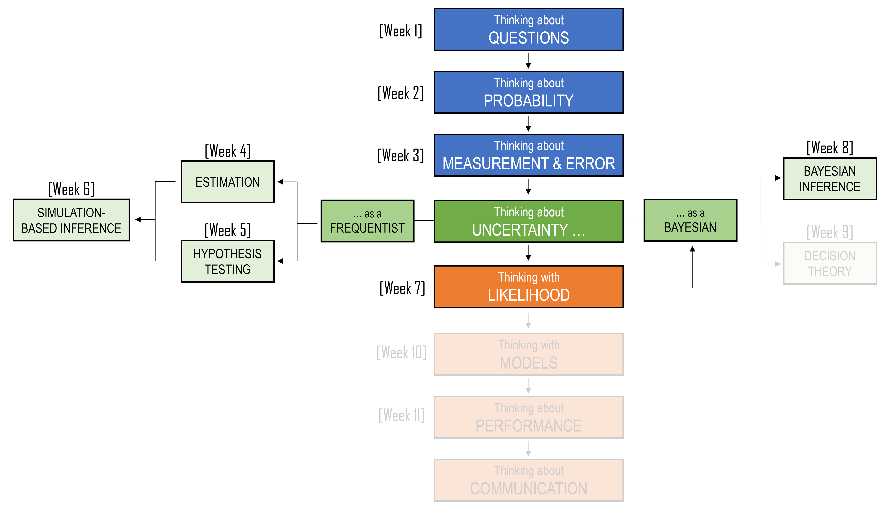
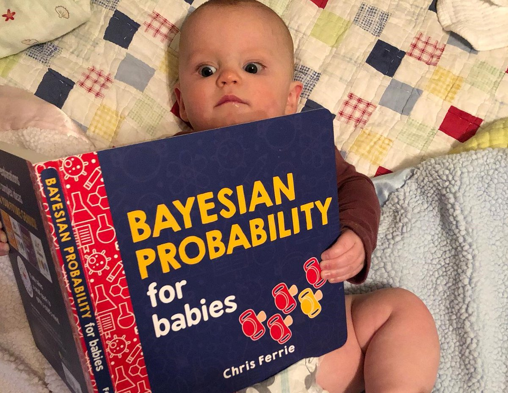
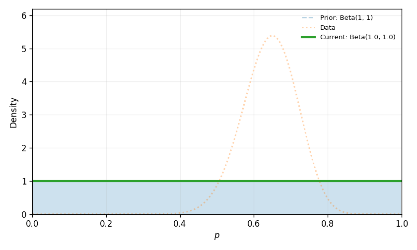
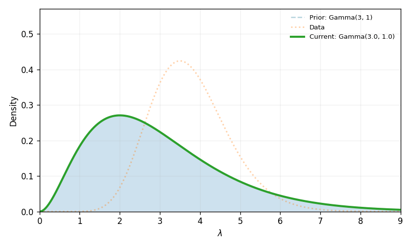
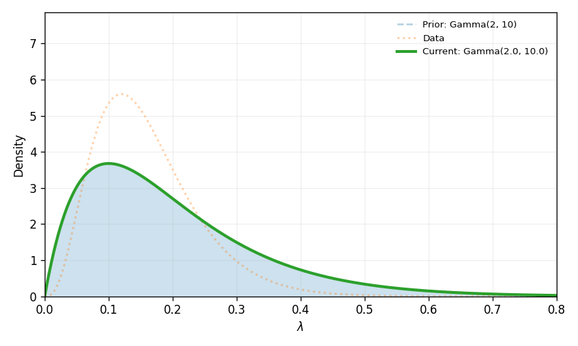
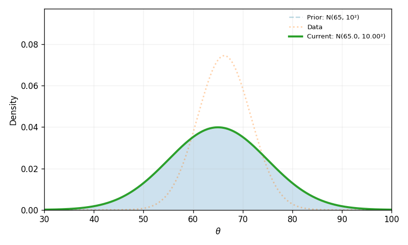

```{r, include=FALSE}
library(tidyverse)
library(flextable)
library(webexercises)
library(gt)
library(scales)
library(MASS)

set.seed(2420)
```

::: callout-note
## Learning Objectives

By the end of this chapter, you should be able to:

1.  Explain the difference between frequentist and Bayesian interpretations of probability.
2.  Use conditional probability to describe how evidence narrows the sample space.
3.  Distinguish between $P(A \mid B)$ and $P(B \mid A)$, and explain why confusing them can lead to errors.
4.  Apply Bayes' theorem to update the probability of a hypothesis after observing evidence.
5.  Identify the roles of the prior, likelihood, evidence, and posterior in Bayesian inference.
6.  Explain why base rates matter when interpreting evidence such as test results or descriptions.
7.  Use likelihood ratios to describe how strongly evidence supports one explanation over another.
8.  Recognise common Bayesian reasoning errors, including the base-rate fallacy and the prosecutor's fallacy.
9.  Apply Bayesian inference to an unknown proportion using a beta prior and binomial likelihood.
10. Summarise and interpret a posterior distribution using posterior means, credible intervals, posterior probabilities, and prior sensitivity.
:::

<center>

```{r, echo=FALSE}
#| classes: .enlarge-image

```

</center>

<br>

## A puzzle about Minh

The Nobel Prize-winning psychologist Daniel Kahneman often used a simple puzzle to show how easily our statistical intuition can be led astray.

Consider the following description (updated to for this unit):

> Minh is very shy and withdrawn, invariably helpful, but with very little interest in people or in the world of reality. A meek and tidy soul, he has a need for order and structure, and a passion for detail.

Now suppose Minh has been chosen at random from a group of people. The question is: Which is more likely?

> Is Minh a librarian; or is Minh a farmer?

<center>

```{r, echo=FALSE}

```

</center>

<br>

Have a think about what your answer might be.

For now, we will leave Minh’s story unresolved. We will come back to it at the end of the chapter, once we have developed the tools needed to think about this question more carefully.

## Two ways to think about probability

Before we begin Bayesian inference, it is useful to pause and think about what probability means.

In many of the examples we have covered thus far, probability describes what happens in the long run. If we roll a fair six-sided die again and again, we expect each face to appear about one-sixth of the time. We may not know what will happen on the next roll, but we can imagine the roll being repeated many times under the same conditions.

```{r}
#| echo: false
#| message: false
#| warning: false

rolls <- c(10, 100, 1000, 10000)

dice_rolls <- map_dfr(
  rolls,
  \(n_rolls) {
    tibble(
      n_rolls = n_rolls,
      roll = sample(1:6, size = n_rolls, replace = TRUE)
    )
  }
)

dice_rolls |>
  count(n_rolls, roll) |>
  complete(n_rolls, roll = 1:6, fill = list(n = 0)) |>
  mutate(n_rolls = paste0(n_rolls, " rolls")) |>
  ggplot(aes(x = factor(roll), y = n)) +
  geom_col() +
  facet_wrap(~ n_rolls, scales = "free_y") +
  labs(
    x = "Face of the die",
    y = "Frequency",
    title = "As the number of rolls increases, the frequencies become more stable"
  )
```

In this way of thinking, probability is connected to repeated trials. The probability of rolling a six is not just about one particular roll. It is about what would happen across a very large number of similar rolls. As we saw in Chapters 4-6, this is often called a **Frequentist** view of probability.

But not every uncertain question feels like a dice roll. Sometimes we face uncertainty about something that has already happened, something that will happen only once, or something that cannot be repeated under identical conditions.

> What is the probability that a particular historical claim is true?

> What is the probability that a patient has a disease after receiving a positive test result?

> What is the probability that a newly discovered skeleton belongs to a particular king?

> What is the probability that Minh will be announced Supreme Ruler of Earth in 2026?

These questions are not naturally answered by imagining an infinite sequence of identical repetitions. The uncertainty is not only in the world. It is also in our knowledge of the world. Bayesian probability treats probability as a way of describing uncertainty, given what we currently know. As new information arrives, that uncertainty can change.

This chapter introduces Bayesian inference: a way of updating uncertainty when we observe evidence.

```{r}
#| echo: false
#| message: false
#| warning: false

probability_views <- tibble(
  `View of probability` = c("Frequentist", "Bayesian"),
  `Probability describes` = c(
    "Long-run behaviour across repeated trials",
    "Uncertainty given current information"
  ),
  `Natural examples` = c(
    "Dice rolls, repeated samples, repeated measurements",
    "Medical diagnosis, historical claims, unknown parameters"
  ),
  `Typical question` = c(
    "What would happen if we repeated this process many times?",
    "What should we believe now that we have this evidence?"
  )
)

probability_views |>
  gt() |>
  tab_options(table.width = pct(100))
```

### From likelihood to Bayesian inference

In the previous chapter, we introduced likelihood. We used likelihood to compare different parameter values or explanations by asking how well each one predicted the data we observed.

The likelihood question was:

$$P(\text{data} \mid \theta)$$

That is, if this parameter value were true, how likely would the observed data be?

Bayesian inference asks a related but different question:

$$P(\theta \mid \text{data})$$

That is, after seeing the data, how plausible is this parameter value?

Those two expressions look similar, but they are not the same. The vertical bar points in a different direction. In Chapter 7, the parameter value was treated as the input to the probability model. In this chapter, the parameter value becomes the thing we are uncertain about.

The basic structure of Bayesian inference is:

$$\text{posterior} \propto \text{prior} \times \text{likelihood}$$

The likelihood is the part we already met in Chapter 7. The new ingredient is the **prior**, which represents uncertainty before seeing the current data. The result is the **posterior**, which represents uncertainty after seeing the data.

Before we use this formula, we will build it slowly from conditional probability.

## Conditional probability as narrowing the world

### Recap

In Chapter 2, we saw that probability begins with a sample space: the set of possible outcomes. We also saw that new information can change the sample space we should use.

For example, the question

> A family has two children. What is the probability that both are girls?

is different from the question

> A family has two children. At least one is a girl. What is the probability that both are girls?

The second question gives us extra information. Once we know that at least one child is a girl, some outcomes from the original sample space are no longer possible. Conditional probability gives us a formal way to handle this kind of situation.

When we write

$$P(H \mid E)$$

we are asking for the probability of (H), given that (E) has happened. The vertical line means “given”, or “conditional on”.

The key idea is simple:

> Once we know that the evidence (E) happened, we restrict attention to the part of the sample space where (E) is true.

Within that reduced world, we then ask how often (H) is also true. This gives us the conditional probability formula:

$$ 
P(H \mid E) =
\frac{P(H \cap E)}{P(E)}
$$

In words:

$$ 
P(H \mid E) =
\frac{\text{probability that both }H\text{ and }E\text{ happen}}
{\text{probability that }E\text{ happens}} 
$$

The denominator, $P(E)$, is the probability of the evidence. It defines the smaller world we are now working inside. The numerator, $P(H \cap E$, is the probability that both the evidence and the thing we care about are true.

### An example of conditional probability

Suppose we have a small class of 20 students. Some students drink coffee before class, and some students have completed the weekly quiz.

```{r}
#| echo: false
#| message: false
#| warning: false

student_table <- tibble(
  `Student type` = c(
    "Drinks coffee and completed the quiz",
    "Drinks coffee and did not complete the quiz",
    "Does not drink coffee and completed the quiz",
    "Does not drink coffee and did not complete the quiz"
  ),
  `Number of students` = c(7, 3, 6, 4)
)

student_table |>
  gt()
```

Let

$$H = \text{completed the quiz}$$

and let

$$E = \text{drinks coffee}$$

We want:

$$P(H \mid E)$$

That is, among students who drink coffee, what proportion completed the quiz?

From the table, 10 students drink coffee:

$$7 + 3 = 10$$

Of those 10 students, 7 completed the quiz. So:

$$P(\text{completed quiz} \mid \text{drinks coffee})
=\frac{7}{10}
=
0.70$$

We can also calculate the same probability using the formal rule. In the full class of 20 students:

$$P(H \cap E) =\frac{7}{20}$$

and:

$$P(E)=\frac{10}{20}$$

Therefore:

$$P(H \mid E)
=\frac{P(H \cap E)}{P(E)}
=\frac{7/20}{10/20}
=\frac{7}{10}
=0.70$$

The formula is just a compact way of saying:

> Among the cases where the evidence is true, how many also have the thing we are interested in?

The formula

$$\frac{P(H \cap E)}{P(E)}$$

is already enough to solve many conditional probability problems. But it has one limitation: it requires us to know $P(H \cap E)$, the probability that both $H$ and $E$ happen together.

Sometimes we do know that joint probability directly. In the coffee and quiz example, the table told us that 7 out of 20 students both drank coffee and completed the quiz. But in many problems, the information is given in a different form. Instead of being told $P(H \cap E)$, we are often told:

-   how common $H$ is
-   how likely the evidence $E$ is if $H$ is true

That is, we are given $P(H)$ and $P(E \mid H)$. This is where the next version of the formula becomes useful. Since

$$P(H \cap E)=P(H)P(E \mid H)$$

we can rewrite conditional probability as:

$$\frac{P(H)P(E \mid H)}{P(E)}$$

This is the beginning of Bayes’ theorem. For now, we will call it Baby Bayes because it is the smaller, simpler idea that Bayes’ theorem grows out of.

Baby Bayes is really just conditional probability. It asks:

> Out of all the times the evidence happens, how often does the hypothesis happen too?

In symbols, this is:

$$
P(H \mid E) = \frac{P(H \cap E)}{P(E)}
$$

The top part, $P(H \cap E)$, means the probability that the hypothesis and the evidence are both true. The bottom part, $P(E)$, means the overall probability of seeing the evidence.

So Baby Bayes says: once we know the evidence happened, we narrow our attention to only the cases where the evidence is present, and then ask what fraction of those cases also include the hypothesis. We call it Baby Bayes because it has the same basic structure as Bayes’ theorem: we are updating what we believe about a hypothesis after seeing some evidence. Later, we will rewrite the top part, $P(H \cap E)$, in a more useful way. That gives us the full version of Bayes’ theorem.

As a side note, there is a real book called **Bayesian Probability for babies**, although this is not where the term baby bayes come from:

<center>

```{r, echo=FALSE}
#| fig-cap: "Image Source: https://x.com/beth_fossen/status/1227244290763563008"

```

</center>

<br>

## Baby Bayes

The formula for conditional probability is compact:

$$\frac{P(H \cap E)}{P(E)}$$

But formulas are not always the easiest place to start. Conditional probability problems can be solved in several different ways, depending on how the information is given.

In this section, we will use three representations:

-   Venn diagrams
-   Tree diagrams
-   Continuous distributions

These methods may look different, but they are all doing the same thing: We condition on the evidence, then ask what proportion of that reduced world belongs to the event or explanation we care about.

### Baby Bayes with a Venn diagram

Suppose we have two soccer players, Amy and Jody. Across many matches:

-   70% of the time, neither Amy nor Jody scores a goal
-   Amy scores a goal 20% of the time
-   Jody scores a goal 25% of the time

On a particular match day, Jody scored a goal. What is the probability that Amy also scored a goal?

Let

$$H = \text{Amy scored}$$

and let

$$E = \text{Jody scored}$$

We want to calculate

$$P(H \mid E)$$

That is, given that Jody scored, what is the probability that Amy also scored?

We are told that neither player scores 70% of the time. This means at least one of them scores 30% of the time:

$$1 - 0.70 = 0.30$$

We also know that Amy scores 20% of the time and Jody scores 25% of the time. To make these numbers fit together, Amy and Jody must both score in some matches.

Let (x) be the probability that both Amy and Jody score. Then:

$$0.20 + 0.25 - x = 0.30$$

Solving for (x):

$$x = 0.15$$

So Amy and Jody both score in 15% of matches.

This gives us the following probabilities:

```{r}
#| echo: false
#| message: false
#| warning: false

amy_jody_table <- tibble(
  `Match outcome` = c(
    "Amy scores and Jody scores",
    "Amy scores and Jody does not score",
    "Amy does not score and Jody scores",
    "Neither Amy nor Jody scores"
  ),
  `Probability` = c(0.15, 0.05, 0.10, 0.70)
)

amy_jody_table |>
  gt() |>
  fmt_number(columns = `Probability`, decimals = 2)
```

We can show the same information using a Venn diagram.

```{r}
#| echo: false
#| message: false
#| warning: false
#| fig-width: 7
#| fig-height: 4.8

make_circle <- function(center_x, center_y, radius, group, n = 200) {
  tibble(
    angle = seq(0, 2 * pi, length.out = n),
    x = center_x + radius * cos(angle),
    y = center_y + radius * sin(angle),
    group = group
  )
}

circle_amy <- make_circle(0, 0, 1.25, "Amy")
circle_jody <- make_circle(1.15, 0, 1.25, "Jody")

venn_regions <- tibble(
  x = c(-0.55, 0.58, 1.70, 2.95),
  y = c(0, 0, 0, -1.35),
  label = c("0.05", "0.15", "0.10", "0.70")
)

venn_labels <- tibble(
  x = c(-0.60, 1.75),
  y = c(1.35, 1.35),
  label = c("Amy scores", "Jody scores")
)

ggplot() +
  geom_polygon(
    data = circle_amy,
    aes(x = x, y = y),
    fill = "grey80",
    alpha = 0.45,
    linewidth = 0.8
  ) +
  geom_polygon(
    data = circle_jody,
    aes(x = x, y = y),
    fill = "grey70",
    alpha = 0.45,
    linewidth = 0.8
  ) +
  geom_text(
    data = venn_regions,
    aes(x = x, y = y, label = label),
    size = 5
  ) +
  geom_text(
    data = venn_labels,
    aes(x = x, y = y, label = label),
    size = 4,
    fontface = "bold"
  ) +
  coord_equal(xlim = c(-1.7, 3.2), ylim = c(-1.8, 1.8)) +
  theme_void()
```

The evidence is that Jody scored. So we restrict attention to the Jody circle.

Inside the Jody circle, there are two possibilities:

-   Amy also scored
-   Amy did not score

The total probability inside the Jody circle is:

$$P(E) = 0.15 + 0.10 = 0.25$$

The part of the Jody circle where Amy also scored is:

$$P(H \cap E) = 0.15$$

Therefore:

$$\begin{aligned}
P(H \mid E)
&=
\frac{P(H \cap E)}{P(E)} \
&=
\frac{0.15}{0.25} \
&=
0.60
\end{aligned}$$

So, given that Jody scored, the probability that Amy also scored is 0.60.

The Venn diagram shows conditional probability as narrowing the world. We begin with all matches, but once we know that Jody scored, we only look inside the Jody circle. Then we ask what proportion of that circle is also inside the Amy circle.

Venn diagrams are useful when we know the overlap directly. But many Bayesian problems are not given to us in this form. Instead, we are often told how likely the evidence is under different possible explanations.

For that kind of problem, a tree diagram is usually more useful.

### Baby Bayes with a tree diagram

Suppose the Monash DataNerds football team has a star player named Minh.

-   In any given match, there is a 10% chance that Minh is injured
-   If Minh is injured, there is a 40% chance that the team loses
-   If Minh is not injured, there is a 5% chance that the team loses
-   In the most recent match, the team lost

What is the probability that Minh was injured?

Let

$$H = \text{Minh was injured}$$

and let

$$E = \text{the team lost}$$

We want to calculate

$$P(H \mid E)$$

That is, given that the team lost, what is the probability that Minh was injured?

The tree begins with the two possible injury states.

```{r}
#| echo: false
#| message: false
#| warning: false
#| fig-width: 7
#| fig-height: 3.8

tree_prior_segments <- tibble(
  x = c(0, 0),
  y = c(0, 0),
  xend = c(1, 1),
  yend = c(0.7, -0.7)
)

tree_prior_nodes <- tibble(
  x = c(1.08, 1.08),
  y = c(0.7, -0.7),
  label = c("Injured", "Not injured")
)

tree_prior_branches <- tibble(
  x = c(0.42, 0.42),
  y = c(0.46, -0.46),
  label = c("P(H) = 0.10", "P(H^c) = 0.90")
)

ggplot() +
  geom_segment(
    data = tree_prior_segments,
    aes(x = x, y = y, xend = xend, yend = yend),
    linewidth = 0.8
  ) +
  geom_point(aes(x = 0, y = 0), size = 2) +
  geom_point(
    data = tree_prior_segments,
    aes(x = xend, y = yend),
    size = 2
  ) +
  geom_text(
    data = tree_prior_nodes,
    aes(x = x, y = y, label = label),
    hjust = 0,
    size = 4
  ) +
  geom_label(
    data = tree_prior_branches,
    aes(x = x, y = y, label = label),
    hjust = 0,
    size = 3.8,
    label.size = 0,
    fill = "white"
  ) +
  coord_cartesian(xlim = c(-0.1, 2.2), ylim = c(-1.1, 1.1)) +
  theme_void()
```

These first branches are the **prior probabilities**. They describe how likely injury and no injury were before we were told the team lost.

Now we add the evidence. The probability that the team loses depends on whether Minh was injured.

```{r}
#| echo: false
#| message: false
#| warning: false
#| fig-width: 8
#| fig-height: 4.8

tree_segments <- tibble(
  x = c(0, 0, 1, 1, 1, 1),
  y = c(0, 0, 0.8, 0.8, -0.8, -0.8),
  xend = c(1, 1, 2, 2, 2, 2),
  yend = c(0.8, -0.8, 1.2, 0.4, -0.4, -1.2)
)

tree_nodes <- tibble(
  x = c(1.08, 1.08, 2.08, 2.08, 2.08, 2.08),
  y = c(0.8, -0.8, 1.2, 0.4, -0.4, -1.2),
  label = c(
    "Injured",
    "Not injured",
    "Lost",
    "Did not lose",
    "Lost",
    "Did not lose"
  )
)

tree_branches <- tibble(
  x = c(0.42, 0.42, 1.42, 1.42, 1.42, 1.42),
  y = c(0.50, -0.50, 1.02, 0.55, -0.55, -1.02),
  label = c(
    "P(H) = 0.10",
    "P(H^c) = 0.90",
    "P(E | H) = 0.40",
    "P(E^c | H) = 0.60",
    "P(E | H^c) = 0.05",
    "P(E^c | H^c) = 0.95"
  )
)

ggplot() +
  geom_segment(
    data = tree_segments,
    aes(x = x, y = y, xend = xend, yend = yend),
    linewidth = 0.8
  ) +
  geom_point(aes(x = 0, y = 0), size = 2) +
  geom_point(
    data = tree_segments,
    aes(x = xend, y = yend),
    size = 2
  ) +
  geom_text(
    data = tree_nodes,
    aes(x = x, y = y, label = label),
    hjust = 0,
    size = 3.7
  ) +
  geom_label(
    data = tree_branches,
    aes(x = x, y = y, label = label),
    hjust = 0,
    size = 3.4,
    label.size = 0,
    fill = "white"
  ) +
  coord_cartesian(xlim = c(-0.1, 3.2), ylim = c(-1.55, 1.6)) +
  theme_void()
```

Each complete path through the tree represents a joint event. To find the probability of a path, we multiply along the branches.

For the injured-and-lost path:

$$\begin{aligned}
P(H \cap E)
&=
P(H)P(E \mid H) \
&=
0.10 \times 0.40 \
&=
0.04
\end{aligned}$$

For the not-injured-and-lost path:

$$\begin{aligned}
P(H^c \cap E)
&=
P(H^c)P(E \mid H^c) \
&=
0.90 \times 0.05 \
&=
0.045
\end{aligned}$$

The team lost in two possible ways: Minh was injured and the team lost, or Minh was not injured and the team lost.

So the overall probability that the team loses is:

$$\begin{aligned}
P(E)
&=
P(H \cap E) + P(H^c \cap E) \
&=
0.04 + 0.045 \
&=
0.085
\end{aligned}$$

Now we can calculate the probability that Minh was injured, given that the team lost:

$$\begin{aligned}
P(H \mid E)
&=
\frac{P(H \cap E)}{P(E)} \
&=
\frac{0.04}{0.085} \
&=
0.471
\end{aligned}$$

So, after observing that the team lost, the probability that Minh was injured is about 0.47.

This is Baby Bayes in action:

$$
P(H \mid E) =
\frac{P(H)P(E \mid H)}
{P(H)P(E \mid H)+P(H^{c})P(E \mid H^{c})}
$$

For this example:

$$\begin{aligned}
P(H \mid E)
&=
\frac{0.10 \times 0.40}
{0.10 \times 0.40 + 0.90 \times 0.05} =
\frac{0.04}{0.085} = 0.471
\end{aligned}$$

The tree diagram shows why the formula works. We multiply along the branches to get the probabilities of each path. Then we focus only on the paths that produced the evidence.

In words:

> Among all the ways the team could have lost, what proportion involved Minh being injured?

### Conditional probability with continuous evidence

So far, our examples have involved categories: Amy scored or did not score, Jody scored or did not score, Minh was injured or not injured, the team lost or did not lose. But conditional probability is not limited to categories. It also works with continuous quantities.

Suppose a school running team requires students to run 100 metres in less than 14 seconds. Minh is in the school running team.

What is the probability that Minh can run 100 metres in less than 13.5 seconds?

Let

$$T = \text{Minh's 100 metre time}$$

Suppose 100 metre times follow a normal distribution:

$$T \sim N(15, 1.5^2)$$

The evidence is that Minh is in the running team. That means Minh can run 100 metres in less than 14 seconds.

Let

$$E = {T < 14}$$

The event we care about is that Minh can run 100 metres in less than 13.5 seconds:

$$H = {T < 13.5}$$

We want:

$$P(T < 13.5 \mid T < 14)$$

Because anyone who runs under 13.5 seconds also runs under 14 seconds, the event (T \< 13.5) is inside the event (T \< 14). So:

$$
P(T < 13.5 \cap T < 14) =
P(T < 13.5)
$$

Therefore:

$$
P(T < 13.5 \mid T < 14) =
\frac{P(T < 13.5)}{P(T < 14)}
$$

We can calculate these probabilities using the normal distribution.

```{r}
#| echo: false
#| message: false
#| warning: false

p_under_13_5 <- pnorm(13.5, mean = 15, sd = 1.5)
p_under_14 <- pnorm(14, mean = 15, sd = 1.5)
p_under_13_5_given_under_14 <- p_under_13_5 / p_under_14

running_table <- tibble(
  `Quantity` = c(
    "P(T < 13.5)",
    "P(T < 14)",
    "P(T < 13.5 | T < 14)"
  ),
  `Value` = c(
    p_under_13_5,
    p_under_14,
    p_under_13_5_given_under_14
  )
)

running_table |>
  gt() |>
  fmt_number(columns = `Value`, decimals = 3)
```

```{r}
#| echo: false
#| message: false
#| warning: false
#| fig-cap: "The evidence T < 14 narrows attention to the left tail of the distribution. Within that region, we ask what proportion is below 13.5."
#| fig-width: 7
#| fig-height: 4.5

running_density <- tibble(
  time = seq(9, 21, length.out = 1000),
  density = dnorm(time, mean = 15, sd = 1.5)
) |>
  mutate(
    region = case_when(
      time < 13.5 ~ "Under 13.5",
      time < 14 ~ "13.5 to 14",
      TRUE ~ "Not in running team"
    )
  )

ggplot(running_density, aes(x = time, y = density)) +
  geom_area(
    data = running_density |> filter(time < 14),
    aes(group = region),
    alpha = 0.55
  ) +
  geom_line(linewidth = 0.8) +
  geom_vline(xintercept = 13.5, linetype = "dashed") +
  geom_vline(xintercept = 14, linetype = "dashed") +
  annotate("text", x = 13.5, y = 0.10, label = "13.5s", hjust = 1.1) +
  annotate("text", x = 14, y = 0.16, label = "14s", hjust = -0.1) +
  labs(
    x = "100 metre time",
    y = "Density"
  ) +
  theme_minimal()
```

Numerically:

$$\begin{aligned}
P(T < 13.5 \mid T < 14)=
\frac{P(T < 13.5)}{P(T < 14)}=
\frac{0.159}{0.252}=
0.631
\end{aligned}$$

So, among students fast enough to make the running team, about 63% are fast enough to run under 13.5 seconds.

The logic is the same as before. The evidence narrows the world. Instead of looking at everyone, we look only at people with (T \< 14). Then we ask what proportion of that reduced group also has (T \< 13.5).

::: callout-note
### A thought experiment

Now let us use the same conditional probability logic in a more Bayesian direction.

Suppose there is a fitness test that gives each person a score. Higher scores mean greater fitness. In the general population, suppose scores are normally distributed with mean 100 and standard deviation 15:

$$\text{Fitness score} \sim N(100, 15^2)$$

Now suppose that to become a professional athlete, a person needs an extremely high fitness score. Let us say the threshold is 171 or above.

That is a very high threshold. Under the general population distribution, the probability of scoring 171 or above is tiny.

```{r}
#| echo: true
#| message: false
#| warning: false

1 - pnorm(171, mean = 100, sd = 15)
```

Now imagine there is a pill that children can take. The pill shifts the average fitness score upward by 2 points. So children who take the pill later have fitness scores distributed as:

$$\text{Fitness score} \mid \text{pill}
\sim
N(102, 15^2)$$

At first, a two-point shift might not seem very important. Moving the average from 100 to 102 sounds small. It feels as though it should not make a large difference to whether someone becomes a professional athlete.

But this intuition can be misleading, especially when we are looking at the extreme tail of a distribution.

Imagine the following thought experiment. We recruit many thousands of children at age five. Half are randomly given the pill and half are not. We then wait until they grow up and record who becomes a professional athlete.

Let

$$H = \text{took the pill as a child}$$

and let

$$E = \text{became a professional athlete}$$

Because half the children were given the pill:

$$P(H) = 0.50$$

and

$$P(H^c) = 0.50$$

For children who took the pill, the probability of reaching the professional-athlete threshold is:

$$P(E \mid H)=
P(\text{Fitness score} \ge 171 \mid \text{pill})$$

For children who did not take the pill, the probability is:

$$P(E \mid H^c)
=
P(\text{Fitness score} \ge 171 \mid \text{no pill})$$

We can calculate both probabilities using `pnorm()`:

```{r}
#| echo: true
#| message: false
#| warning: false

p_pro_pill <- 1 - pnorm(171, mean = 102, sd = 15)
p_pro_no_pill <- 1 - pnorm(171, mean = 100, sd = 15)
```

```{r}
#| echo: false
#| message: false
#| warning: false

fitness_prob_table <- tibble(
  `Group` = c("Took pill", "Did not take pill"),
  `Fitness distribution` = c("N(102, 15²)", "N(100, 15²)"),
  `P(score >= 171)` = c(p_pro_pill, p_pro_no_pill)
)

fitness_prob_table |>
  gt() |>
  fmt_number(columns = `P(score >= 171)`, decimals = 7)
```

Now we ask a Bayesian question:

> Among the people who became professional athletes, what proportion took the pill?

In notation, we want:

$$P(H \mid E)$$

Using Baby Bayes:

$$P(H \mid E)=
\frac{P(H)P(E \mid H)}
{P(H)P(E \mid H)+P(H^c)P(E \mid H^c)}$$

Substituting the numbers:

```{r}
#| echo: false
#| message: false
#| warning: false

posterior_pill <- (0.5 * p_pro_pill) /
  ((0.5 * p_pro_pill) + (0.5 * p_pro_no_pill))

posterior_pill
```

So, even though the pill only shifted the mean by 2 points, about 66% of the professional athletes in this thought experiment would come from the pill group. At extreme thresholds, small shifts in a distribution can have a much larger effect than our intuition expects.

Now consider a different version of the thought experiment. Suppose the pill does not increase the average score. Instead, it increases variation. The average remains 100, but the standard deviation increases from 15 to 20:

$$\text{Fitness score} \mid \text{pill}
\sim
N(100, 20^2)$$

This means the pill does not make the average child fitter. But it does create more extreme outcomes in both directions.

For the professional-athlete threshold, the right tail becomes much larger.

```{r}
#| echo: false
#| message: false
#| warning: false

p_pro_pill_sd <- 1 - pnorm(171, mean = 100, sd = 20)

posterior_pill_sd <- (0.5 * p_pro_pill_sd) /
  ((0.5 * p_pro_pill_sd) + (0.5 * p_pro_no_pill))

fitness_sd_table <- tibble(
  `Group` = c("Took pill", "Did not take pill"),
  `Fitness distribution` = c("N(100, 20²)", "N(100, 15²)"),
  `P(score >= 171)` = c(p_pro_pill_sd, p_pro_no_pill)
)

fitness_sd_table |>
  gt() |>
  fmt_number(columns = `P(score >= 171)`, decimals = 7)
```

Using Baby Bayes again:

$$P(H \mid E)
=
\frac{0.50P(E \mid H)}
{0.50P(E \mid H)+0.50P(E \mid H^c)}
=
.9943$$

In this version, among the professional athletes, about 99.4% would have taken the pill. This is a striking result. The pill did not raise the average score at all. But by increasing variation, it created many more people in the extreme right tail.

The key lesson is that conditional probability depends on the group we condition on. Professional athletes are not a random sample of all children. They are selected from the far right tail of the fitness distribution.

Once we condition on being in that extreme group, small differences in the underlying distribution can become very large.

This example also moves us closer to Bayesian inference.

We began with a hypothesis:

$$H = \text{took the pill}$$

and evidence:

$$E = \text{became a professional athlete}$$

Then we asked:

$$P(H \mid E)$$

The evidence changed our uncertainty about the hypothesis. That is the central movement in Bayes' theorem.
:::

## The prior, likelihood, and posterior

So far, we have used Baby Bayes to solve several conditional probability problems. In each case, the structure was the same. We began with a possible explanation, observed some evidence, and then asked how the evidence should change our view of the explanation.

For the football example, the explanation was:

$$H = \text{Minh was injured}$$

and the evidence was:

$$E = \text{the team lost}$$

Before we knew the result of the match, the probability that Minh was injured was:

$$P(H) = 0.10$$

After learning that the team lost, the probability that Minh was injured became:

$$P(H \mid E) = 0.471$$

This is the central movement in Bayesian reasoning. We begin with uncertainty, observe evidence, and update our uncertainty.

Bayesian statistics gives names to the pieces in this update.

```{r}
#| echo: false
#| message: false
#| warning: false

bayes_terms <- tibble(
  `Symbol` = c(
    "$P(H)$",
    "$P(E \\mid H)$",
    "$P(H \\mid E)$",
    "$P(E)$"
  ),
  `Name` = c(
    "Prior",
    "Likelihood",
    "Posterior",
    "Evidence"
  ),
  `Meaning` = c(
    "What we believed about the hypothesis before seeing the evidence",
    "How likely the evidence is if the hypothesis is true",
    "What we believe about the hypothesis after seeing the evidence",
    "The overall probability of seeing the evidence"
  )
)

bayes_terms |>
  gt() |>
  fmt_markdown(columns = everything()) |>
  tab_options(table.width = pct(100))
```

The **prior** is the probability of the hypothesis before seeing the evidence.

In the football example:

$$P(H) = 0.10$$

This means that, before knowing the result of the match, there was a 10% chance that Minh was injured.

The **likelihood** is the probability of the evidence under a particular hypothesis.

In the same example:

$$P(E \mid H) = 0.40$$

This means that if Minh was injured, the probability that the team loses is 40%.

The **posterior** is the probability of the hypothesis after seeing the evidence.

In the example:

$$P(H \mid E) = 0.471$$

This means that after learning that the team lost, the probability that Minh was injured is about 47%.

The word **posterior** may sound technical, but the idea is simple. It is the updated probability. It is what we believe after the evidence has been taken into account.

Bayes' theorem puts these pieces together:

$$P(H \mid E)
=
\frac{P(H)P(E \mid H)}{P(E)}$$

In words:

$$\text{posterior}
=
\frac{\text{prior} \times \text{likelihood}}
{\text{evidence}}$$

The denominator, $P(E)$, is sometimes called the **evidence**, the **marginal likelihood**, or the **normalising constant**. For now, the most important thing is what it does. It makes sure the updated probabilities are properly scaled.

In the two-hypothesis case, where the hypothesis is either true or not true, the denominator can be written as:

$$P(E)
=
P(H)P(E \mid H)
+
P(H^c)P(E \mid H^c)$$

That is, the evidence could have happened in two ways:

1.  the hypothesis was true and the evidence occurred
2.  the hypothesis was false and the evidence occurred

So Baby Bayes becomes:

$$P(H \mid E)
=
\frac{P(H)P(E \mid H)}
{P(H)P(E \mid H)+P(H^c)P(E \mid H^c)}$$

This version is useful because it shows the comparison directly. We do not only ask whether the evidence is likely if (H) is true. We also ask whether the evidence is likely if (H) is not true.

> Evidence supports a hypothesis when it is more likely under that hypothesis than under its alternatives.

For the football example, the team losing was more likely if Minh was injured:

$$P(E \mid H) = 0.40$$

than if Minh was not injured:

$$P(E \mid H^c) = 0.05$$

So the loss increased the probability that Minh was injured. But it did not make injury certain, because injury was not very common to begin with. This is why the prior matters. The evidence pushed us from 10% to about 47%, but not to 100%.

A compact way to remember Bayes' theorem is:

$$\text{posterior}
\propto
\text{prior} \times \text{likelihood}$$

The symbol $\propto$ means “is proportional to”. It reminds us that the posterior is built by multiplying the prior by the likelihood, and then re-scaling so that the probabilities add up to 1.

This connects directly to the previous chapter. In Chapter 7, we focused on likelihood: how well different explanations predict the data. Bayesian inference adds one more ingredient. It combines the likelihood with a prior, then turns the result into a posterior. In short:

> Likelihood tells us how well each explanation predicts the evidence. Bayes tells us how plausible each explanation is after seeing the evidence.

### A positive test is not the same as being positive

One of the most common places where Bayes' theorem matters is medical testing. Here is a simplified version of a classic Bayesian medical-testing problem:

::: callout-note
#### Disease X

Suppose there is a disease called Disease X, and a test has been developed for the disease.

The test is reasonably accurate:

-   If someone has Disease X, the test returns positive 80% of the time
-   If someone does not have Disease X, the test returns negative 80% of the time

Equivalently, among people who do not have the disease, the test gives a false positive 20% of the time.

Now suppose Disease X affects 10% of the population. Minh takes the test and receives a positive result.

**What is the probability that Minh actually has Disease X?**
:::

At first, it is tempting to say 80%. After all, the test is correct 80% of the time. But that is not the right conditional probability.

The test accuracy tells us something like:

$$P(\text{positive test} \mid \text{has disease})$$

But the question asks for:

$$P(\text{has disease} \mid \text{positive test})$$

These are not the same.

Let

$$H = \text{person has Disease X}$$

and let

$$E = \text{person tests positive}$$

We want:

$$P(H \mid E)$$

Using Baby Bayes:

$$P(H \mid E)
=
\frac{P(H)P(E \mid H)}
{P(H)P(E \mid H)+P(H^c)P(E \mid H^c)}$$

In this example:

$$P(H) = 0.10$$

$$P(H^c) = 0.90$$

$$P(E \mid H) = 0.80$$

$$P(E \mid H^c) = 0.20$$

Substituting these into the formula gives:

$$\begin{aligned}
P(H \mid E)
&=
\frac{0.10 \times 0.80}
{0.10 \times 0.80 + 0.90 \times 0.20} \\
&=
\frac{0.08}
{0.08 + 0.18} \\
&=
\frac{0.08}{0.26} \\
&=
0.308
\end{aligned}$$

So, after a positive test, the probability that the person has Disease X is about 31%.

This can feel surprising. The test is correct 80% of the time, but a positive result does not mean there is an 80% chance of having the disease.

A natural frequency table makes the calculation easier to see. Imagine 100 people from this population.

```{r}
#| echo: false
#| message: false
#| warning: false

disease_table <- tibble(
  `True status` = c(
    "Has Disease X",
    "Does not have Disease X"
  ),
  `Number of people` = c(10, 90),
  `Positive test rate` = c("80%", "20%"),
  `Number testing positive` = c(8, 18)
)

disease_table |>
  gt() |>
  tab_options(table.width = pct(100))
```

Out of 100 people:

-   10 have Disease X
-   90 do not have Disease X
-   8 people with the disease test positive
-   18 people without the disease also test positive

So there are:

$$8 + 18 = 26$$

positive tests in total.

Of these 26 positive tests, only 8 are true positives. Therefore:

$$P(\text{has disease} \mid \text{positive test})
=\frac{8}{26}
=0.308$$

The natural frequency version and the Baby Bayes formula give the same answer. The table often feels more intuitive because it shows where the positive tests come from.

There are two ways to receive a positive result:

1.  you have the disease and the test correctly detects it
2.  you do not have the disease and the test gives a false positive

Bayes' theorem forces us to consider both paths. The strength of a positive test depends on the accuracy of the test and on how common the disease was before testing. That starting probability is the prior.

This is the same structure as the football example. A team loss made injury more plausible, but not certain. A positive test makes disease more plausible, but not certain.

## From Baby Bayes to Bayes' theorem

Up to this point, we have called the formula **Baby Bayes** because we have been using it in simple two-hypothesis settings.

In each example, there were two possible explanations:

-   Minh was injured or not injured
-   Minh had Disease X or did not have Disease X
-   someone took the pill or did not take the pill

For these examples, the formula was:

$$P(H \mid E)
=
\frac{P(H)P(E \mid H)}
{P(H)P(E \mid H)+P(H^c)P(E \mid H^c)}$$

This version is useful because it makes the comparison explicit. The evidence can happen in two ways: either (H) is true and the evidence occurs, or (H\^c) is true and the evidence occurs.

But this is not a separate theorem. It is Bayes' theorem written out for the case where there are only two possibilities.

The general version of Bayes' theorem is:

$$P(H \mid E)
=
\frac{P(E \mid H)P(H)}{P(E)}$$

This is the same idea, written more compactly.

The numerator has two parts:

$$P(E \mid H)P(H)$$

This is the probability that (H) is true and the evidence (E) occurs. In other words:

$$P(E \mid H)P(H)
=
P(H \cap E)$$

The denominator is:

$$P(E)$$

This is the overall probability of seeing the evidence.

When there are only two possibilities, (H) and (H\^c), the denominator can be expanded as:

$$P(E)
=
P(E \mid H)P(H)
+
P(E \mid H^c)P(H^c)$$

That is exactly what we were using in Baby Bayes.

So the move from Baby Bayes to Bayes' theorem is not a change in logic. It is a change in notation.

Bayes' theorem says:

$$\text{posterior}
=
\frac{\text{likelihood} \times \text{prior}}
{\text{evidence}}$$

Or, more compactly:

$$\text{posterior}
\propto
\text{prior} \times \text{likelihood}$$

The proportional version is often the most useful way to remember the idea. It says that the posterior is built by taking the prior and reweighting it by the likelihood.

Values of (H) that made the evidence more likely receive more weight. Values of (H) that made the evidence less likely receive less weight.

This connects directly to the previous chapter. In Chapter 7, likelihood measured how well each possible explanation predicted the observed data. Bayes' theorem uses that likelihood to update our uncertainty.

Likelihood asks:

> How well would this explanation predict the evidence?

Bayes asks:

> After seeing the evidence, how plausible is this explanation?

### Base rates matter

The medical-testing example shows why the starting point matters.

Minh tested positive. That positive result was evidence for Disease X. It increased the probability that Minh had the disease. But it did not make the probability 80%, because we also had to account for the base rate: only 10% of people had the disease before testing.

The **base rate** is the background rate of something in the population. In Bayesian language, it plays the role of the prior.

In the Disease X example:

$$P(H) = 0.10$$

This means that before Minh took the test, the probability that Minh had Disease X was 10%.

The test result then updated this probability:

$$P(H \mid E) = 0.308$$

So the positive result raised the probability from 10% to about 31%. That is a meaningful increase. But it is not certainty. To see how much base rates matter, imagine the same test is used for a much rarer disease.

Suppose Disease Y affects only 1 in 1000 people. The test behaves the same way:

-   If someone has the disease, the test returns positive 80% of the time
-   If someone does not have the disease, the test gives a false positive 20% of the time

Now imagine testing 1000 people.

```{r}
#| echo: false
#| message: false
#| warning: false

rare_disease_table <- tibble(
  `True status` = c(
    "Has Disease Y",
    "Does not have Disease Y"
  ),
  `Number of people` = c(1, 999),
  `Positive test rate` = c("80%", "20%"),
  `Expected number testing positive` = c(0.8, 199.8)
)

rare_disease_table |>
  gt() |>
  fmt_number(columns = `Expected number testing positive`, decimals = 1) |>
  tab_options(table.width = pct(100))
```

Among 1000 people, we expect:

$$0.8 + 199.8 = 200.6 \text{ positive tests}$$

But only 0.8 of these are expected to come from people who actually have the disease. So:

$$\begin{aligned}
P(\text{has Disease Y} \mid \text{positive test})
&=
\frac{0.8}{200.6}=
0.004
\end{aligned}$$

That is less than 1%.

This example is deliberately extreme because the false positive rate is high. But it makes the lesson clear. When a condition is rare, false positives can easily outnumber true positives, even when the test has some ability to detect the disease.

Now compare this with a more common disease. Suppose Disease Z affects 50% of the population, and the test behaves in the same way.

```{r}
#| echo: false
#| message: false
#| warning: false

common_disease_table <- tibble(
  `True status` = c(
    "Has Disease Z",
    "Does not have Disease Z"
  ),
  `Number of people` = c(500, 500),
  `Positive test rate` = c("80%", "20%"),
  `Expected number testing positive` = c(400, 100)
)

common_disease_table |>
  gt() |>
  fmt_number(columns = `Expected number testing positive`, decimals = 1) |>
  tab_options(table.width = pct(100))
```

Among 1000 people, we expect:

$$400 + 100 = 500 \text{ positive tests}$$

Of these, 400 are expected to come from people who actually have the disease. So:

$$\begin{aligned}
P(\text{has Disease Z} \mid \text{positive test})
&=
\frac{400}{500}
=
0.800
\end{aligned}$$

The test is identical in both examples. The evidence is the same kind of evidence: a positive result. But the meaning of the evidence changes because the base rate changes.

When the disease is rare, a positive test may still leave a low probability of disease. When the disease is common, the same positive test may imply a much higher probability of disease. Ignoring the base rate is called the **base-rate fallacy**. It happens when we focus on the evidence but forget how common the explanation was before the evidence appeared.

Bayes' theorem protects us from this mistake by forcing both pieces into the calculation:

$$\text{posterior}
\propto
\text{prior} \times \text{likelihood}$$

The likelihood tells us how strongly the evidence points toward the hypothesis. The prior tells us how plausible the hypothesis was before seeing the evidence. We need both.

### Likelihood ratios: evidence as a multiplier

Bayes' theorem tells us that evidence must be interpreted against a starting point. The starting point is the prior. The evidence then shifts us from the prior to the posterior.

Another way to describe this shift is with a **likelihood ratio**.

A likelihood ratio compares how likely the evidence is under two different explanations. For a hypothesis (H) and its alternative (H\^c), the likelihood ratio is:

$$\text{LR}
=
\frac{P(E \mid H)}{P(E \mid H^c)}$$

The numerator asks:

> How likely is the evidence if the hypothesis is true?

The denominator asks:

> How likely is the evidence if the hypothesis is not true?

If the likelihood ratio is greater than 1, the evidence is more likely under (H) than under (H\^c). That means the evidence supports (H).

If the likelihood ratio is less than 1, the evidence is less likely under (H) than under (H\^c). That means the evidence points away from (H).

If the likelihood ratio is close to 1, the evidence does not strongly distinguish between the two explanations.

::: callout-note
#### A doping-test example

Suppose a sporting competition uses a test for a banned substance.

Assume:

-   10% of athletes have used the banned substance
-   If an athlete used the substance, the test returns positive 50% of the time
-   If an athlete did not use the substance, the test returns positive 1% of the time

Minh is an athlete and receives a positive test.

What is the probability that Minh used the banned substance?

Let

$$H = \text{Minh used the banned substance}$$

and let

$$E = \text{Minh tests positive}$$

The prior probability is:

$$P(H) = 0.10$$

The likelihood of the evidence if Minh used the substance is:

$$P(E \mid H) = 0.50$$

The likelihood of the evidence if Minh did not use the substance is:

$$P(E \mid H^c) = 0.01$$

So the likelihood ratio is:

$$\begin{aligned}
\text{LR}
&=
\frac{P(E \mid H)}{P(E \mid H^c)} \\
&=
\frac{0.50}{0.01} \\
&=
50
\end{aligned}$$

The positive test is 50 times more likely if Minh used the substance than if Minh did not use the substance. That is strong evidence.

But strong evidence is not the same as certainty. We still need to combine the evidence with the prior.

Using Bayes' theorem:

$$P(H \mid E)
=
\frac{P(H)P(E \mid H)}
{P(H)P(E \mid H)+P(H^c)P(E \mid H^c)}$$

Substituting the numbers:

$$\begin{aligned}
P(H \mid E)
&=
\frac{0.10 \times 0.50}
{0.10 \times 0.50 + 0.90 \times 0.01} \\
&=
\frac{0.05}
{0.05 + 0.009} \\
&=
\frac{0.05}{0.059} \\
&=
0.847
\end{aligned}$$

So after the positive test, the probability that Minh used the banned substance is about 85%. That is much higher than the prior probability of 10%. The evidence has shifted our uncertainty a lot. But it is not 99%.

This is the important point. A 1% false positive rate does not mean there is a 99% chance that Minh is guilty. It means:

$$P(\text{positive test} \mid \text{did not use substance}) = 0.01$$

That is not the same as:

$$P(\text{did not use substance} \mid \text{positive test})$$

The first probability conditions on innocence. The second probability conditions on the evidence.
:::

### Evidence changes odds

Likelihood ratios are especially useful when we think in terms of odds.

Bayes' theorem can be written as:

$$\text{posterior odds}
=
\text{prior odds}
\times
\text{likelihood ratio}$$

For the doping example, the prior probability of using the substance is 0.10. So the prior odds are:

$$\begin{aligned}
\text{prior odds}
&=
\frac{0.10}{0.90} \\
&=
\frac{1}{9}
\end{aligned}$$

The likelihood ratio is 50. Therefore:

$$\begin{aligned}
\text{posterior odds}
&=
\frac{1}{9} \times 50 \\
&=
\frac{50}{9}
\end{aligned}$$

These odds correspond to the same posterior probability:

$$\begin{aligned}
P(H \mid E)
&=
\frac{50}{50 + 9} \\
&=
\frac{50}{59} \\
&=
0.847
\end{aligned}$$

The odds form makes the role of evidence especially clear.

The prior odds tell us where we started. The likelihood ratio tells us how strongly the evidence shifts us. The posterior odds tell us where we end up.

So another way to remember Bayes' theorem is:

> Evidence acts as a multiplier on prior odds.

This is why likelihood ratios are useful. They separate the strength of the evidence from the starting probability. A test result may be strong evidence, but its final meaning still depends on what was plausible before the test.

### The prosecutor's fallacy

The examples in this chapter have all pointed to the same warning:

$$P(A \mid B)
\ne
P(B \mid A)$$

This mistake appears in many settings, but it is especially serious when probabilities are used in court.

A tragic example is the case of Sally Clark in the United Kingdom.

<center>

```{r, echo=FALSE}
#| classes: .enlarge-image

```

</center>

<br>

Clark’s first baby died suddenly at 11 weeks. The death was recorded as sudden infant death syndrome, usually abbreviated as SIDS. SIDS is a diagnosis used when a baby dies unexpectedly and no clear cause is found after investigation. Clark later had a second baby, who also died suddenly, this time at 8 weeks. After the second death, Clark was accused of murdering both children.

At the trial, the prosecution called an expert witness who gave evidence about how rare SIDS was. He estimated that the probability of one SIDS death in a family like Clark’s was about 1 in 8,543. He then multiplied this probability by itself to estimate the probability of two SIDS deaths:

$$\begin{aligned}
P(\text{two SIDS deaths})
&\approx
\frac{1}{8543}
\times
\frac{1}{8543} \\
&\approx
\frac{1}{73000000}
\end{aligned}$$

This produced the famous figure of about 1 in 73 million. The number sounded overwhelming. If two SIDS deaths were that unlikely, it might seem natural to conclude that murder was the more likely explanation. But that reasoning contains two statistical problems.

The first problem is about independence. Multiplying the two probabilities assumes that the two deaths were independent. But this assumption is doubtful. If one baby in a family has died of SIDS, genetic, environmental, or other family-level factors may affect the risk for another baby in the same family. So the multiplication itself is questionable.

The second problem is the prosecutor’s fallacy. The calculation focused on something like:

$$P(\text{two deaths} \mid \text{SIDS explanation})$$

But the court needed to reason about something closer to:

$$P(\text{SIDS explanation} \mid \text{two deaths})$$

These are not the same.

The rarity of two SIDS deaths does not, by itself, tell us the probability that the deaths were not due to SIDS. To make that judgement, we also need to compare the evidence under the competing explanation. In this case, the competing explanations were roughly:

$$H_1 = \text{the deaths were due to SIDS or natural causes}$$

and

$$H_2 = \text{the deaths were due to murder}$$

Both explanations are rare. Two babies dying of SIDS in the same family is rare. But a mother murdering two of her babies is also rare.

So the relevant question is not simply:

> How unlikely are two SIDS deaths?

A better question is:

> Are the two deaths more likely under the SIDS explanation, or under the murder explanation?

That is a likelihood-ratio question:

$$\text{LR}
=
\frac{
P(\text{two deaths} \mid H_2)
}{
P(\text{two deaths} \mid H_1)
}$$

The Royal Statistical Society later criticised the reasoning in the case, saying that the jury needed to compare the competing explanations rather than focus only on how unlikely the SIDS explanation was. Clark’s conviction was eventually quashed after further medical evidence came to light, and she was released after nearly three and a half years in prison.

The lesson is not that rare events should be ignored. Rare events matter. But rarity alone is not enough.

$$P(\text{evidence} \mid \text{innocence})
\text{ is very small}$$

therefore

$$P(\text{innocence} \mid \text{evidence})
\text{ is very small}$$

That conclusion does not follow.

Bayesian reasoning asks us to keep the direction of the conditional probability clear:

-   $P(\text{evidence} \mid \text{hypothesis})$ is a likelihood.
-   $P(\text{hypothesis} \mid \text{evidence})$ is a posterior probability.

They are connected by Bayes' theorem, but they are not interchangeable.

## From hypotheses to parameters

The examples so far have been useful because they were small enough to see clearly. There was a hypothesis (H), some evidence (E), and we used Bayes' theorem to update $P(H)$ into $P(H \mid E)$.

But statistical inference often asks a different kind of question. Instead of asking whether a single hypothesis is true, we often want to learn about an unknown quantity. For example, we might want to know:

-   the proportion of voters who support a policy
-   the average income in a population
-   the probability that a customer clicks on an advertisement
-   the infection rate in a community
-   the difference between two treatment effects

These unknown quantities are called **parameters**.

In Chapter 7, we used the symbol $\theta$ for a general unknown parameter. The parameter might be a mean, a standard deviation, a rate, or a probability. The exact meaning depends on the statistical model.

Suppose we are interested in the proportion of residents who support a new local policy.

Let

$$\theta = \text{proportion of residents who support the policy}$$

Because $\theta$ is a proportion, it must lie between 0 and 1:

$$0 \leq \theta \leq 1$$

Now suppose we survey (n) residents and count how many support the policy. Let

$$X = \text{number of surveyed residents who support the policy}$$

If each person independently supports the policy with probability $\theta$, then a simple model is:

$$X \mid \theta \sim \text{Binomial}(n, \theta)$$

This notation says:

> If the true support rate were $\theta$, then the number of supporters in a sample of size $n$ would follow a binomial distribution.

In Chapter 7, this gave us a likelihood. If we observed $X = x$, then the likelihood was:

$$P(X = x \mid \theta)$$

The likelihood asks:

> For each possible value of $\theta$, how well would that value predict the data we observed?

Bayesian inference asks the inverse question:

$$p(\theta \mid X = x)$$

This asks:

> After observing the data, how plausible is each possible value of $\theta$?

The move is the same as before. Earlier, Bayes' theorem helped us move from the likelihood of evidence under a hypothesis,

$$P(E \mid H)$$

to the posterior probability of the hypothesis after evidence,

$$P(H \mid E)$$

Now the hypothesis is no longer just true or false. It is a parameter that can take many possible values. We move from the likelihood of the data under a parameter value, $P(\text{data} \mid \theta)$ to a posterior distribution over the parameter, $P(\theta \mid \text{data})$.

The notation changes slightly because $\theta$ may be continuous. If $\theta$ can take any value between 0 and 1, then we use a density, written with a lowercase (p), rather than a probability mass. But the idea is the same. The prior describes our uncertainty about the parameter before seeing the data. The likelihood describes how well each parameter value predicts the data. The posterior describes our uncertainty about the parameter after seeing the data.

### Bayes' theorem for parameters

Once the unknown quantity is a parameter, Bayes' theorem has the same structure as before, but the notation changes slightly.

For a hypothesis (H) and evidence (E), we wrote:

$$P(H \mid E)
=
\frac{P(E \mid H)P(H)}{P(E)}$$

For a parameter $\theta$ and observed data (D), we write:

$$p(\theta \mid D)
=
\frac{p(D \mid \theta)p(\theta)}{p(D)}$$

The symbols look a little different, but the roles are the same.

```{r}
#| echo: false
#| message: false
#| warning: false

parameter_bayes_terms <- tibble(
  `Symbol` = c(
    "$\\theta$",
    "$D$",
    "$p(\\theta)$",
    "$p(D \\mid \\theta)$",
    "$p(\\theta \\mid D)$",
    "$p(D)$"
  ),
  `Name` = c(
    "Parameter",
    "Data",
    "Prior distribution",
    "Likelihood",
    "Posterior distribution",
    "Normalising constant"
  ),
  `Meaning` = c(
    "The unknown quantity we want to learn about",
    "The information we observed",
    "Our uncertainty about the parameter before seeing the data",
    "How well each parameter value predicts the observed data",
    "Our uncertainty about the parameter after seeing the data",
    "The quantity that makes the posterior distribution integrate to 1"
  )
)

parameter_bayes_terms |>
  gt() |>
  fmt_markdown(columns = everything()) |>
  tab_options(table.width = pct(100))
```

The prior distribution, $p(\theta)$, describes what we think about the parameter before seeing the data. The likelihood, $p(D \mid \theta)$, describes how well each possible value of $\theta$ predicts the data we observed.

The posterior distribution, $p(\theta \mid D)$, describes what we think about the parameter after seeing the data. The denominator, $p(D)$, makes sure that the posterior distribution is a proper probability distribution. When $\theta$ is continuous, this denominator is found by adding up, or integrating, the prior times the likelihood across all possible values of $\theta$:

$$p(D)
=
\int p(D \mid \theta)p(\theta),d\theta$$

This expression can look intimidating, but its job is simple. It re-scales the posterior so that the total area under the posterior curve is 1.

For many Bayesian analyses, the most important part to remember is the proportional form:

$$p(\theta \mid D)
\propto
p(\theta)p(D \mid \theta)$$

In words:

$$\text{posterior}
\propto
\text{prior}
\times
\text{likelihood}$$

This is the same idea we have been using throughout the chapter. Values of $\theta$ that had higher prior probability and predicted the data well receive more posterior weight. Values of $\theta$ that had low prior probability or predicted the data poorly receive less posterior weight.

### A proportion example

Suppose a local council is considering a new late-night bus service. The council wants to know what proportion of residents would use the service.

Let

$$\theta = \text{proportion of residents who would use the late-night bus}$$

The council surveys 40 residents and finds that 26 say they would use the service.

Let

$$X = \text{number of surveyed residents who say yes}$$

The observed data are:

$$X = 26$$

out of:

$$n = 40$$

A simple model is:

$$X \mid \theta \sim \text{Binomial}(40, \theta)$$

The likelihood is:

$$P(X = 26 \mid \theta)
=
\binom{40}{26}\theta^{26}(1-\theta)^{14}$$

This likelihood tells us how compatible each possible value of $\theta$ is with the observed result: 26 yes responses out of 40. But likelihood alone is not yet a posterior distribution. To do Bayesian inference, we also need a prior distribution for $\theta$.

That is where the beta distribution becomes useful.

## The beta distribution

In the previous chapter, we met several probability distributions. Each distribution was useful for modelling a different kind of data.

For example, we used the binomial distribution for counts out of a fixed number of trials, the Poisson distribution for counts over time or space, the exponential distribution for waiting times, and the normal distribution for measurements that vary around a centre.

That same idea applies in Bayesian inference.

In the late-night bus example, the unknown parameter is:

$$\theta = \text{proportion of residents who would use the late-night bus}$$

Because $\theta$ is a proportion, it must lie between 0 and 1:

$$0 \leq \theta \leq 1$$

So if we want to describe our prior uncertainty about $\theta$, we need a distribution that also lives between 0 and 1.

The normal distribution is not ideal here because it can place probability below 0 or above 1. A proportion cannot be negative, and it cannot be greater than 1.

A more natural choice is the **beta distribution**.

We write:

$$\theta \sim \text{Beta}(\alpha, \beta)$$

The beta distribution is a family of distributions on the interval from 0 to 1. By changing the values of $\alpha$ and $\beta$, we can create many different shapes. Play with the app below to see what the beta distribution looks like when you change the parameters:

<iframe src="interactive/beta_distribution_slider_app.html" width="100%" height="650" style="border: none;">

</iframe>

Each curve describes a different kind of prior belief about $\theta$. For example:

```{r}
#| echo: false
#| message: false
#| warning: false

beta_prior_table <- tibble(
  `Prior` = c(
    "$\\text{Beta}(1,1)$",
    "$\\text{Beta}(2,2)$",
    "$\\text{Beta}(8,2)$",
    "$\\text{Beta}(2,8)$"
  ),
  `Interpretation` = c(
    "Flat across the interval from 0 to 1",
    "Centred around 0.5, but still quite spread out",
    "Places more weight on larger values of $\\theta$",
    "Places more weight on smaller values of $\\theta$"
  )
)

beta_prior_table |>
  gt() |>
  fmt_markdown(columns = everything()) |>
  tab_options(table.width = pct(100))
```

The beta distribution has two shape parameters, $\alpha$ and $\beta$. These parameters control where the distribution places its mass. One useful summary is the mean:

$$E(\theta)
=
\frac{\alpha}{\alpha + \beta}$$

For example, if:

$$\theta \sim \text{Beta}(8,2)$$

then:

$$\begin{aligned}
E(\theta)
&=
\frac{8}{8 + 2} \\
&=
0.80
\end{aligned}$$

This prior is centred around larger values of $\theta$. It would be appropriate if, before seeing the survey data, we expected a high proportion of residents to support the late-night bus.

If instead:

$$\theta \sim \text{Beta}(2,8)$$

then:

$$\begin{aligned}
E(\theta)
&=
\frac{2}{2 + 8} \\
&=
0.20
\end{aligned}$$

This prior is centred around smaller values of $\theta$. It would be appropriate if we were sceptical that many residents would use the service.

The beta distribution is especially useful for unknown proportions because it has the right support and flexible shapes. It can represent weak information, strong information, optimism, scepticism, or something close to neutrality.

A common starting point is:

$$\theta \sim \text{Beta}(1,1)$$

This distribution is flat between 0 and 1. It gives the same density to all possible values of $\theta$, from 0 to 1.

In the late-night bus example, using a $\text{Beta}(1,1)$ prior means that, before seeing the survey, we are not strongly favouring one value of $\theta$ over another.

Once we combine this prior with the binomial likelihood, we get a posterior distribution for $\theta$. That posterior tells us what values of $\theta$ are plausible after observing 26 yes responses out of 40.

## Conjugate priors

The beta distribution is especially useful with binomial data because it is **conjugate** to the binomial likelihood. A prior is conjugate to a likelihood when the posterior distribution belongs to the same family as the prior. That sounds technical, but the idea is simple. Some prior and likelihood pairs fit together neatly. When they do, Bayes' theorem produces a posterior with the same general shape as the prior, but with updated parameters.

Different data types have different likelihoods, and those likelihoods have different conjugate priors. This connects back to the previous chapter. We do not use the same probability model for every kind of data. A proportion, a count, a waiting time, and a measurement are different kinds of quantities. They need different distributions. The same is true for priors.

```{r}
#| echo: false
#| message: false
#| warning: false

other_conjugate_priors <- tibble(
  `Data type` = c(
    "Successes out of trials",
    "Counts over time or space",
    "Waiting times",
    "Measurements around a mean"
  ),
  `Likelihood` = c(
    "$X \\mid p \\sim \\text{Binomial}(n,p)$",
    "$Y_i \\mid \\lambda \\sim \\text{Poisson}(\\lambda)$",
    "$Y_i \\mid \\lambda \\sim \\text{Exponential}(\\lambda)$",
    "$Y_i \\mid \\mu \\sim N(\\mu, \\sigma^2)$"
  ),
  `Conjugate prior` = c(
    "$p \\sim \\text{Beta}(\\alpha,\\beta)$",
    "$\\lambda \\sim \\text{Gamma}(\\alpha,\\beta)$",
    "$\\lambda \\sim \\text{Gamma}(\\alpha,\\beta)$",
    "$\\mu \\sim N(\\mu_0,\\tau_0^2)$"
  ),
  `Posterior family` = c(
    "Beta",
    "Gamma",
    "Gamma",
    "Normal"
  ),
  `Example question` = c(
    "What proportion of residents support a policy?",
    "What is the average number of help-desk calls per hour?",
    "What is the rate at which buses arrive?",
    "What is the average exam mark in a population?"
  )
)

other_conjugate_priors |>
  gt() |>
  fmt_markdown(columns = everything()) |>
  tab_options(table.width = pct(100))
```

### Beta-binomial

For binomial data:

$$X \mid p \sim \text{Binomial}(n,p)$$

If the prior is:

$$p \sim \text{Beta}(\alpha,\beta)$$

then after observing $x$ successes out of $n$ trials, the posterior is:

$$p \mid X=x \sim \text{Beta}(\alpha + x,\beta + n - x)$$

The data add $x$ successes and $n-x$ failures to the prior.

```{r}
#| echo: false
#| message: false
#| warning: false

conjugate_table <- tibble(
  `Quantity` = c("Prior", "Data", "Posterior"),
  `Expression` = c(
    "$p \\sim \\text{Beta}(\\alpha, \\beta)$",
    "$X \\mid p \\sim \\text{Binomial}(n,p)$ and $X=x$",
    "$p \\mid X=x \\sim \\text{Beta}(\\alpha+x, \\beta+n-x)$"
  ),
  `Interpretation` = c(
    "Initial uncertainty about the unknown proportion",
    "Observed successes and failures",
    "Updated uncertainty after adding the data to the prior"
  )
)

conjugate_table |>
  gt() |>
  fmt_markdown(columns = everything()) |>
  tab_options(table.width = pct(100))
```

Suppose a local council is considering whether to introduce a late-night bus service. A survey of 40 residents asks whether they would use the service. In the survey, 26 people say yes.

Let:

$$p = \text{the proportion of residents who would use the service}$$

The data are:

$$x = 26, \qquad n = 40$$

The likelihood comes from the binomial model:

$$X \mid p \sim \text{Binomial}(40,p)$$

If we used maximum likelihood, the estimate would be:

$$\hat{p} = \frac{26}{40} = 0.65$$

A Bayesian analysis asks for a posterior distribution for $p$.

Start with a uniform prior:

$$p \sim \text{Beta}(1,1)$$

Using beta-binomial conjugacy:

$$p \mid X=26 \sim \text{Beta}(1+26,1+40-26)$$

So:

$$p \mid X=26 \sim \text{Beta}(27,15)$$

<center>

```{r, echo=FALSE}

```

</center>

The posterior distribution is more concentrated than the prior because the data have given us information. It is centred near the observed proportion, but it still shows uncertainty about the true value of $p$.

### Poisson-gamma

Suppose a library wants to estimate the average number of people arriving at the front desk each hour.

Let

$$\lambda = \text{average number of arrivals per hour}$$

A natural model for hourly counts is the Poisson distribution:

$$Y_i \mid \lambda \sim \text{Poisson}(\lambda)$$

A common conjugate prior for the Poisson rate is the gamma distribution:

$$\lambda \sim \text{Gamma}(\alpha,\beta)$$

Here we are using the shape-rate version of the gamma distribution. The first parameter, $\alpha$, is the shape. The second parameter, $\beta$, is the rate.

If we observe counts from $n$ hours:

$$y_1, y_2, \ldots, y_n$$

then the posterior is:

$$\lambda \mid y_1,\ldots,y_n
\sim
\text{Gamma}\left(\alpha + \sum_{i=1}^n y_i,\ \beta + n\right)$$

This update has the same flavour as the beta-binomial update. The data add information to the prior. For the Poisson-gamma model, the total count, $\sum_{i=1}^n y_i$, updates the shape parameter, and the number of observed time periods, $n$, updates the rate parameter.

For example, suppose the prior is:

$$\lambda \sim \text{Gamma}(3,1)$$

This prior has mean:

$$\frac{3}{1}=3$$

So before collecting new data, the library expects about 3 arrivals per hour.

Now suppose the library observes arrivals over 4 hours:

$$2,\ 5,\ 4,\ 3$$

The total number of arrivals is:

$$2 + 5 + 4 + 3 = 14$$

So the posterior is:

$$\begin{aligned}
\lambda \mid \text{data}
&\sim
\text{Gamma}(3 + 14,\ 1 + 4) \\
&\sim
\text{Gamma}(17,5)
\end{aligned}$$

The posterior mean is:

$$\frac{17}{5}=3.4$$

The data have shifted the estimated arrival rate from 3 arrivals per hour to about 3.4 arrivals per hour.

<center>

```{r, echo=FALSE}

```

</center>

The posterior is narrower than the prior because the four hours of data have reduced our uncertainty about the arrival rate.

### Exponential-gamma

The gamma distribution is also conjugate for the rate of an exponential distribution.

Suppose we are studying the time between bus arrivals at a stop. Let

$$\lambda = \text{arrival rate of buses per minute}$$

If buses arrive according to a constant rate, then waiting times can be modelled using an exponential distribution:

$$Y_i \mid \lambda \sim \text{Exponential}(\lambda)$$

Again, a conjugate prior is:

$$\lambda \sim \text{Gamma}(\alpha,\beta)$$

If we observe waiting times:

$$y_1, y_2, \ldots, y_n$$

then the posterior is:

$$\lambda \mid y_1,\ldots,y_n
\sim
\text{Gamma}\left(\alpha + n,\ \beta + \sum_{i=1}^n y_i\right)$$

Here the number of waiting times, $n$, updates the shape parameter, while the total waiting time, $\sum_{i=1}^n y_i$, updates the rate parameter.

For example, suppose:

$$\lambda \sim \text{Gamma}(2,10)$$

This prior has mean:

$$\frac{2}{10}=0.20$$

So before seeing the new data, the expected arrival rate is 0.20 buses per minute, or about one bus every 5 minutes.

Now suppose we observe three waiting times, in minutes:

$$6,\ 8,\ 11$$

The total waiting time is:

$$6 + 8 + 11 = 25$$

So the posterior is:

$$\begin{aligned}
\lambda \mid \text{data}
&\sim
\text{Gamma}(2 + 3,\ 10 + 25) \\
&\sim
\text{Gamma}(5,35)
\end{aligned}$$

The posterior mean is:

$$\frac{5}{35}=0.143$$

This corresponds to an average waiting time of about:

$$\frac{1}{0.143}=7.0 \text{ minutes}$$

<center>

```{r, echo=FALSE}

```

</center>

The observed waiting times were longer than the prior expectation. As a result, the posterior shifts toward a lower arrival rate.

### Normal-normal

For measurements, the normal distribution often appears again.

Suppose a researcher wants to estimate the average mark on a difficult exam. Let

$$\mu = \text{average mark in the population}$$

Assume individual marks follow a normal distribution with known standard deviation $\sigma$:

$$Y_i \mid \mu \sim N(\mu,\sigma^2)$$

A conjugate prior for $\mu$ is also normal:

$$\mu \sim N(\mu_0,\tau_0^2)$$

After observing data, the posterior distribution for $\mu$ is still normal. The formula is a little more complicated than the beta-binomial case, but the idea is the same. The posterior mean is a weighted average of the prior mean and the sample mean.

For example, suppose the prior is:

$$\mu \sim N(65,10^2)$$

This prior says that, before seeing the new exam results, the average mark is expected to be around 65, but there is still uncertainty.

Suppose the known standard deviation of individual marks is:

$$\sigma = 12$$

Now suppose we observe five marks:

$$58,\ 62,\ 71,\ 67,\ 74$$

The sample mean is:

$$\bar{y}=66.4$$

For the normal-normal model, the posterior variance is:

$$\tau_n^2
=
\frac{1}
{\frac{1}{\tau_0^2}+\frac{n}{\sigma^2}}$$

and the posterior mean is:

$$\mu_n
=
\tau_n^2
\left(
\frac{\mu_0}{\tau_0^2}
+
\frac{n\bar{y}}{\sigma^2}
\right)$$

Using these values, the posterior distribution is approximately:

$$\mu \mid \text{data} \sim N(66.0,4.72^2)$$

<center>

```{r, echo=FALSE}

```

</center>

The posterior is centred close to the sample mean, but it is still influenced by the prior. It is also narrower than the prior because the data have reduced our uncertainty about $\mu$.

This is a useful way to understand conjugacy more generally:

> A conjugate prior gives us an update rule that keeps the posterior in the same distribution family as the prior.

::: callout-important
### Conjugacy is a shortcut, not the whole idea

Conjugacy is not what makes inference Bayesian. It is a mathematical convenience. The core Bayesian idea is still:

$$\text{posterior} \propto \text{prior} \times \text{likelihood}$$

Conjugate priors are useful because they make the update easy to calculate and easy to explain. But many useful Bayesian models are not conjugate. When the posterior does not have a neat formula, we can still do Bayesian inference using computation.

For this chapter, we will continue with the beta-binomial model because it is simple, visual, and directly connected to proportions.
:::

## Summarising the posterior

The posterior distribution contains our updated uncertainty about $\theta$. In the late-night bus example, after observing 26 yes responses out of 40, we found:

$$\theta \mid X = 26
\sim
\text{Beta}(27,15)$$

This posterior distribution is the full Bayesian answer. It tells us which values of $\theta$ are more plausible and which values are less plausible after seeing the data.

However, it is often useful to summarise the posterior with a few numbers. For example, we might want to know:

-   What is the centre of the posterior?
-   What range of values contains most of the posterior probability?
-   What is the probability that (\theta) is above some meaningful threshold?

For the late-night bus example, a meaningful threshold might be:

$$\theta > 0.50$$

That is, more than half of residents would use the service.

We can calculate several posterior summaries using the beta distribution.

```{r}
#| echo: false
#| message: false
#| warning: false

posterior_alpha <- 27
posterior_beta <- 15

posterior_mean <- posterior_alpha / (posterior_alpha + posterior_beta)
posterior_median <- qbeta(0.5, posterior_alpha, posterior_beta)
posterior_interval <- qbeta(c(0.025, 0.975), posterior_alpha, posterior_beta)
posterior_prob_majority <- 1 - pbeta(0.5, posterior_alpha, posterior_beta)

posterior_summary <- tibble(
  `Posterior summary` = c(
    "Posterior mean",
    "Posterior median",
    "95% credible interval: lower end",
    "95% credible interval: upper end",
    "$P(\\theta > 0.50 \\mid X = 26)$"
  ),
  `Value` = c(
    posterior_mean,
    posterior_median,
    posterior_interval[1],
    posterior_interval[2],
    posterior_prob_majority
  )
)

posterior_summary |>
  gt() |>
  fmt_markdown(columns = `Posterior summary`) |>
  fmt_number(columns = `Value`, decimals = 3) |>
  tab_options(table.width = pct(100))
```

The posterior mean is the average value of $\theta$ under the posterior distribution. For a beta distribution, the mean is:

$$E(\theta \mid X = 26)
=
\frac{27}{27 + 15}$$

So:

$$\begin{aligned}
E(\theta \mid X = 26)
&=
\frac{27}{42} \\
&=
0.643
\end{aligned}$$

This is close to the observed sample proportion:

$$\frac{26}{40} = 0.65$$

The small difference comes from the prior. A $\text{Beta}(1,1)$ prior acts as though we began with one prior yes and one prior no, then added the observed data.

The 95% credible interval gives a range of values containing 95% of the posterior probability.

In this example, the interval is approximately:

$$0.489 \text{ to } 0.782$$

This means that, under the model and prior, there is 95% posterior probability that the true proportion of residents who would use the late-night bus lies between about 0.49 and 0.78. This interpretation is direct. We are making a probability statement about the parameter, conditional on the model, prior, and observed data.

Finally, we can calculate the posterior probability that a majority of residents would use the service:

$$P(\theta > 0.50 \mid X = 26)=0.970$$

In this example, this probability is high. The data provide evidence that support may be above 50%, although there is still uncertainty.

## Prior sensitivity

The late-night bus example used a flat prior:

$$\theta \sim \text{Beta}(1,1)$$

After observing 26 yes responses out of 40, the posterior was:

$$\theta \mid X=26
\sim
\text{Beta}(27,15)$$

But this was not the only possible prior. Another analyst might begin with a different starting point. For example, suppose the council has tried similar services before and is sceptical that many residents will use the late-night bus. A sceptical prior might place more weight on smaller values of $\theta$:

$$\theta \sim \text{Beta}(4,8)$$

This prior has mean:

$$\begin{aligned}
E(\theta)
&=
\frac{4}{4 + 8} \\
&=
0.333
\end{aligned}$$

Another analyst might be more optimistic. Perhaps previous community meetings suggested strong demand for the service. An optimistic prior might place more weight on larger values of $\theta$:

$$\theta \sim \text{Beta}(8,4)$$

This prior has mean:

$$\begin{aligned}
E(\theta)
&=
\frac{8}{8 + 4} \\
&=
0.667
\end{aligned}$$

The data are the same in all three analyses:

$$x = 26$$

yes responses out of

$$n = 40$$

Using the beta-binomial update rule:

$$\theta \mid X=x
\sim
\text{Beta}(\alpha + x,\ \beta + n - x)$$

we get the following posteriors.

```{r}
#| echo: false
#| message: false
#| warning: false

prior_sensitivity <- tibble(
  prior = c(
    "$\\text{Beta}(1,1)$",
    "$\\text{Beta}(4,8)$",
    "$\\text{Beta}(8,4)$"
  ),
  interpretation = c(
    "Flat prior",
    "Sceptical prior",
    "Optimistic prior"
  ),
  alpha = c(1, 4, 8),
  beta = c(1, 8, 4)
) |>
  mutate(
    x = 26,
    n = 40,
    posterior_alpha = alpha + x,
    posterior_beta = beta + n - x,
    posterior_mean = posterior_alpha / (posterior_alpha + posterior_beta),
    posterior_lower = qbeta(0.025, posterior_alpha, posterior_beta),
    posterior_upper = qbeta(0.975, posterior_alpha, posterior_beta),
    posterior_prob_majority = 1 - pbeta(0.5, posterior_alpha, posterior_beta)
  )

prior_sensitivity |>
  transmute(
    `Prior` = prior,
    `Interpretation` = interpretation,
    `Posterior` = paste0(
      "$\\text{Beta}(",
      posterior_alpha,
      ",",
      posterior_beta,
      ")$"
    ),
    `Posterior mean` = posterior_mean,
    `95% credible interval` = paste0(
      "[",
      round(posterior_lower, 3),
      ", ",
      round(posterior_upper, 3),
      "]"
    ),
    prob_majority = posterior_prob_majority
  ) |>
  gt() |>
  fmt_markdown(columns = c(`Prior`, `Posterior`)) |>
  fmt_number(
    columns = c(`Posterior mean`, prob_majority),
    decimals = 3
  ) |>
  cols_label(
    prob_majority = md("$P(\\theta > 0.50 \\mid X = 26)$")
  ) |>
  tab_options(table.width = pct(100))
```

The same data lead to slightly different posteriors because the starting points were different.

We can see this more clearly in a plot.

```{r}
#| echo: false
#| message: false
#| warning: false
#| fig-cap: "Different priors lead to different posterior distributions, even after seeing the same data."
#| fig-width: 7
#| fig-height: 4.5

prior_sensitivity_plot <- prior_sensitivity |>
  dplyr::select(interpretation, posterior_alpha, posterior_beta) |>
  crossing(theta = seq(0.001, 0.999, length.out = 1000)) |>
  mutate(
    density = dbeta(theta, posterior_alpha, posterior_beta)
  )

ggplot(
  prior_sensitivity_plot,
  aes(x = theta, y = density, linetype = interpretation, color = interpretation)
) +
  geom_line(linewidth = 0.8) +
  geom_vline(xintercept = 26 / 40, linetype = "dashed") +
  annotate(
    "text",
    x = 26 / 40,
    y = 4.2,
    label = "Observed proportion = 26/40",
    hjust = -0.05
  ) +
  labs(
    x = expression(theta),
    y = "Density"
  ) +
  theme_minimal()
```

The three posterior distributions are similar, but not identical. The sceptical prior pulls the posterior slightly downward. The optimistic prior pulls the posterior slightly upward.

This is not a flaw in Bayesian inference. It is part of the method. Bayesian analysis makes the starting assumptions visible.

The important habit is to ask:

> Would our main conclusion change if we used a reasonable alternative prior?

This is called **prior sensitivity analysis**.

In this example, all three priors still lead to substantial posterior probability that more than half of residents would use the late-night bus. The details change, but the broad conclusion is fairly stable.

That gives us more confidence than if the conclusion depended heavily on one particular prior.

### What happens when we collect more data?

Priors matter most when the data are limited. To see this, suppose the council runs a much larger survey. Instead of surveying 40 residents, it surveys 400 residents.

Suppose the observed proportion is the same as before:

$$\frac{260}{400} = 0.65$$

So the data are now:

$$x = 260$$

yes responses out of

$$n = 400$$

We can repeat the same prior sensitivity analysis using the three priors from the previous section.

```{r}
#| echo: false
#| message: false
#| warning: false

large_prior_sensitivity <- tibble(
  prior = c(
    "$\\text{Beta}(1,1)$",
    "$\\text{Beta}(4,8)$",
    "$\\text{Beta}(8,4)$"
  ),
  interpretation = c(
    "Flat prior",
    "Sceptical prior",
    "Optimistic prior"
  ),
  alpha = c(1, 4, 8),
  beta = c(1, 8, 4)
) |>
  mutate(
    x = 260,
    n = 400,
    posterior_alpha = alpha + x,
    posterior_beta = beta + n - x,
    posterior_mean = posterior_alpha / (posterior_alpha + posterior_beta),
    posterior_lower = qbeta(0.025, posterior_alpha, posterior_beta),
    posterior_upper = qbeta(0.975, posterior_alpha, posterior_beta),
    posterior_prob_majority = 1 - pbeta(0.5, posterior_alpha, posterior_beta)
  )

large_prior_sensitivity |>
  transmute(
    `Prior` = prior,
    `Interpretation` = interpretation,
    `Posterior` = paste0(
      "$\\text{Beta}(",
      posterior_alpha,
      ",",
      posterior_beta,
      ")$"
    ),
    `Posterior mean` = posterior_mean,
    `95% credible interval` = paste0(
      "[",
      round(posterior_lower, 3),
      ", ",
      round(posterior_upper, 3),
      "]"
    ),
    prob_majority = if_else(
      posterior_prob_majority > 0.999,
      "> 0.999",
      as.character(round(posterior_prob_majority, 3))
    )
  ) |>
  gt() |>
  fmt_markdown(columns = c(`Prior`, `Posterior`)) |>
  fmt_number(
    columns = `Posterior mean`,
    decimals = 3
  ) |>
  cols_label(
    prob_majority = md("$P(\\theta > 0.50 \\mid X = 260)$")
  ) |>
  tab_options(table.width = pct(100)) |> 
  cols_align(
    align = "right",
    columns = prob_majority
  ) |>
  tab_options(table.width = pct(100))
```

Now the posterior distributions are much closer together.

```{r}
#| echo: false
#| message: false
#| warning: false
#| fig-width: 7
#| fig-height: 4.5

large_prior_sensitivity_plot <- large_prior_sensitivity |>
  dplyr::select(interpretation, posterior_alpha, posterior_beta) |>
  crossing(theta = seq(0.001, 0.999, length.out = 1000)) |>
  mutate(
    density = dbeta(theta, posterior_alpha, posterior_beta)
  )

ggplot(
  large_prior_sensitivity_plot,
  aes(x = theta, y = density, linetype = interpretation, color = interpretation)
) +
  geom_line(linewidth = 0.8) +
  geom_vline(xintercept = 260 / 400, linetype = "dashed") +
  annotate(
    "text",
    x = 260 / 400,
    y = 12,
    label = "Observed proportion = 260/400",
    hjust = -0.05
  ) +
  labs(
    x = expression(theta),
    y = "Density",
  ) +
  theme_minimal()
```

This illustrates an important feature of Bayesian inference. When the data are weak, the prior can have a noticeable influence on the posterior. When the data are strong, the likelihood usually has more influence.

That does not mean the prior disappears. It means the posterior is shaped by both the prior and the data, and the balance depends on how much information the data contain. In practice, this is why prior sensitivity is useful. It helps us see whether our conclusions are robust to different reasonable starting points.

## Returning to Minh

At the beginning of the chapter, we met Minh. As a reminder:

> Minh is very shy and withdrawn, invariably helpful, but with very little interest in people or in the world of reality. A meek and tidy soul, he has a need for order and structure, and a passion for detail.
>
> The question is:
>
> Which is more likely?
>
> -   Minh is a librarian or;
> -   Minh is a farmer.

Many people are drawn toward the librarian answer. The description feels like it fits a librarian. But Bayes' theorem reminds us that fit is not the only thing that matters.

We need two ingredients:

1.  the base rates
2.  the likelihood of the description under each possibility

Let

$$H = \text{Minh is a librarian}$$

and let

$$E = \text{Minh fits the description}$$

Suppose, for illustration, that Minh was chosen from a group where 10% of people are librarians and 90% are farmers:

$$P(H) = 0.10$$

and

$$P(H^c) = 0.90$$

Now suppose the description is much more common among librarians than farmers:

$$P(E \mid H) = 0.90$$

and

$$P(E \mid H^c) = 0.30$$

So the description is evidence for Minh being a librarian. It is three times more likely under the librarian hypothesis than under the farmer hypothesis:

$$\begin{aligned}
\text{LR}
&=
\frac{P(E \mid H)}{P(E \mid H^c)} \\
&=
\frac{0.90}{0.30} \\
&=
3
\end{aligned}$$

But the base rates point in the other direction. Farmers are much more common in the starting population. Using Bayes' theorem:

$$P(H \mid E)
=
\frac{P(H)P(E \mid H)}
{P(H)P(E \mid H)+P(H^c)P(E \mid H^c)}$$

Substituting the numbers:

$$\begin{aligned}
P(H \mid E)
&=
\frac{0.10 \times 0.90}
{0.10 \times 0.90 + 0.90 \times 0.30} \\
&=
\frac{0.09}{0.09 + 0.27} \\
&=
\frac{0.09}{0.36} \\
&=
0.25
\end{aligned}$$

So, under these assumptions, the probability that Minh is a librarian is 25%.

That may feel surprising. The description really does favour the librarian explanation. But it does not favour it enough to overcome the base rate.

The description is the likelihood. The base rate is the prior. The posterior depends on both. This is the same lesson we saw in the medical-test example. A positive test may be evidence for disease, but it does not tell the whole story. We also need to know how common the disease was before the test.

Minh's story is useful because it shows how easily our intuition can focus on resemblance and forget base rates. Bayes' theorem gives us a way to slow down.

Instead of asking only:

> Does Minh sound like a librarian?

we ask:

> How common are librarians and farmers, and how likely is this description under each possibility?

That is Bayesian thinking.

## Exercises

These exercises practice the main ideas from this chapter: conditional probability, Bayes' theorem, base rates, likelihood ratios, posterior distributions, and prior sensitivity.

:::: callout-note
## Question 1

A university club surveys 80 students about whether they attended a welcome event and whether they later joined the club.

The results are:

| Student type                               | Number of students |
|--------------------------------------------|-------------------:|
| Attended event and joined club             |                 24 |
| Attended event and did not join club       |                 16 |
| Did not attend event and joined club       |                 12 |
| Did not attend event and did not join club |                 28 |

Let

$$H = \text{student joined the club}$$

and let

$$E = \text{student attended the welcome event}$$

Calculate:

1.  $P(H)$
2.  $P(E)$
3.  $P(H \cap E)$
4.  $P(H \mid E)$

Interpret $P(H \mid E)$ in words.

::: {.callout-important collapse="true"}
## Click for Solutions

There are 80 students in total.

The number who joined the club is:

$$24 + 12 = 36$$

So:

$$P(H)
=
\frac{36}{80}
=
0.45$$

The number who attended the welcome event is:

$$24 + 16 = 40$$

So:

$$P(E)
=
\frac{40}{80}
=
0.50$$

The number who both attended the event and joined the club is 24. So:

$$P(H \cap E)
=
\frac{24}{80}
=
0.30$$

The conditional probability is:

$$\begin{aligned}
P(H \mid E)
&=
\frac{P(H \cap E)}{P(E)} \\
&=
\frac{0.30}{0.50} \\
&=
0.60
\end{aligned}$$

So, among students who attended the welcome event, 60% joined the club.
:::
::::

:::: callout-note
## Question 2

A streaming service recommends a new show. Suppose:

-   40% of users watch the trailer
-   Among users who watch the trailer, 30% watch the full show
-   Among users who do not watch the trailer, 10% watch the full show

A randomly selected user watched the full show.

Let

$$H = \text{user watched the trailer}$$

and let

$$E = \text{user watched the full show}$$

Calculate:

$$P(H \mid E)$$

::: {.callout-important collapse="true"}
## Click for Solutions

We are given:

$$P(H) = 0.40$$

$$P(H^c) = 0.60$$

$$P(E \mid H) = 0.30$$

$$P(E \mid H^c) = 0.10$$

Using Bayes' theorem:

$$P(H \mid E)
=
\frac{P(H)P(E \mid H)}
{P(H)P(E \mid H)+P(H^c)P(E \mid H^c)}$$

Substitute the values:

$$\begin{aligned}
P(H \mid E)
&=
\frac{0.40 \times 0.30}
{0.40 \times 0.30 + 0.60 \times 0.10} \\
&=
\frac{0.12}{0.12 + 0.06} \\
&=
\frac{0.12}{0.18} \\
&=
0.667
\end{aligned}$$

So, given that the user watched the full show, the probability that they watched the trailer is about 0.67.
:::
::::

:::: callout-note
## Question 3

A workplace uses a screening test for a rare allergy. Suppose:

-   2% of employees have the allergy
-   If an employee has the allergy, the test returns positive 90% of the time
-   If an employee does not have the allergy, the test returns positive 5% of the time

Sam tests positive.

Let

$$H = \text{Sam has the allergy}$$

and let

$$E = \text{Sam tests positive}$$

Calculate the probability that Sam has the allergy given the positive test.

::: {.callout-important collapse="true"}
## Click for Solutions

We are given:

$$P(H) = 0.02$$

$$P(H^c) = 0.98$$

$$P(E \mid H) = 0.90$$

$$P(E \mid H^c) = 0.05$$

Using Bayes' theorem:

$$\begin{aligned}
P(H \mid E)
&=
\frac{0.02 \times 0.90}
{0.02 \times 0.90 + 0.98 \times 0.05} \\
&=
\frac{0.018}{0.018 + 0.049} \\
&=
\frac{0.018}{0.067} \\
&=
0.269
\end{aligned}$$

So, after a positive test, the probability that Sam has the allergy is about 27%.

This is much lower than 90% because the allergy is rare and false positives occur.
:::
::::

:::: callout-note
## Question 4

Explain, in your own words, why the following statement is incorrect:

> The test has a false positive rate of 5%, so if Sam tests positive, there is a 95% chance that Sam has the allergy.

Use conditional probability notation in your answer.

::: {.callout-important collapse="true"}
## Click for Solutions

The statement confuses two different conditional probabilities.

A false positive rate of 5% means:

$$P(\text{positive test} \mid \text{no allergy})
=
0.05$$

It does not mean:

$$P(\text{no allergy} \mid \text{positive test})
=
0.05$$

The first probability conditions on Sam not having the allergy. The second conditions on Sam having received a positive test result.

These probabilities are not the same:

$$P(A \mid B)
\ne
P(B \mid A)$$

To find the probability that Sam has the allergy after a positive test, we need Bayes' theorem. We need both the test accuracy and the base rate of the allergy.
:::
::::

:::: callout-note
## Question 5

A fraud detection system flags transactions as suspicious.

Suppose:

-   3% of transactions are fraudulent
-   If a transaction is fraudulent, the system flags it 70% of the time
-   If a transaction is not fraudulent, the system flags it 4% of the time

A transaction is flagged.

Calculate the likelihood ratio:

$$\text{LR}
=
\frac{P(E \mid H)}{P(E \mid H^c)}$$

where:

$$H = \text{transaction is fraudulent}$$

and

$$E = \text{transaction is flagged}$$

Then calculate $P(H \mid E)$.

::: {.callout-important collapse="true"}
## Click for Solutions

The likelihood ratio is:

$$\begin{aligned}
\text{LR}
&=
\frac{P(E \mid H)}{P(E \mid H^c)} \\
&=
\frac{0.70}{0.04} \\
&=
17.5
\end{aligned}$$

The evidence is 17.5 times more likely if the transaction is fraudulent than if it is not fraudulent.

Now use Bayes' theorem.

We are given:

$$P(H) = 0.03$$

$$P(H^c) = 0.97$$

$$P(E \mid H) = 0.70$$

$$P(E \mid H^c) = 0.04$$

Therefore:

$$\begin{aligned}
P(H \mid E)
&=
\frac{0.03 \times 0.70}
{0.03 \times 0.70 + 0.97 \times 0.04} \\
&=
\frac{0.021}{0.021 + 0.0388} \\
&=
\frac{0.021}{0.0598} \\
&=
0.351
\end{aligned}$$

So, given that the transaction was flagged, the probability that it is fraudulent is about 35%.
:::
::::

:::: callout-note
## Question 6

A report says:

> Only 1 in 500 honest applicants would produce a document pattern like this. Therefore, there is only a 1 in 500 chance that the applicant is honest.

What statistical mistake is being made?

Explain using the distinction between:

$$P(\text{evidence} \mid \text{honest})$$

and

$$P(\text{honest} \mid \text{evidence})$$

::: {.callout-important collapse="true"}
## Click for Solutions

The report is making a version of the prosecutor's fallacy.

The statement “only 1 in 500 honest applicants would produce this document pattern” is about:

$$P(\text{evidence} \mid \text{honest})$$

But the conclusion “there is only a 1 in 500 chance that the applicant is honest” is about:

$$P(\text{honest} \mid \text{evidence})$$

These are not the same.

To determine the probability that the applicant is honest given the evidence, we also need to know how likely the evidence is under other explanations, such as fraud or administrative error. We also need the prior probability of those explanations.

Rare evidence under honesty may be important, but it is not automatically proof of dishonesty.
:::
::::

:::: callout-note
## Question 7

A council is studying whether residents support building a new community garden.

Let

$$\theta = \text{proportion of residents who support the community garden}$$

The council surveys 30 residents, and 21 say they support the proposal.

Suppose the prior is:

$$\theta \sim \text{Beta}(2,2)$$

Use the beta-binomial update rule to find the posterior distribution.

::: {.callout-important collapse="true"}
## Click for Solutions

We are given:

$$\theta \sim \text{Beta}(2,2)$$

The data are:

$$x = 21$$

and:

$$n = 30$$

For a beta prior and binomial likelihood:

$$\theta \mid X=x
\sim
\text{Beta}(\alpha + x,\ \beta + n - x)$$

Substitute the values:

$$\begin{aligned}
\theta \mid X=21
&\sim
\text{Beta}(2 + 21,\ 2 + 30 - 21) \\
&\sim
\text{Beta}(23,\ 11)
\end{aligned}$$

So the posterior distribution is:

$$\theta \mid X=21
\sim
\text{Beta}(23,11)$$
:::
::::

:::: callout-note
## Question 8

Using the posterior from Question 7:

$$\theta \mid X=21
\sim
\text{Beta}(23,11)$$

Calculate the posterior mean.

Then interpret it in words.

::: {.callout-important collapse="true"}
## Click for Solutions

For a beta distribution:

$$E(\theta)
=
\frac{\alpha}{\alpha + \beta}$$

Here:

$$\alpha = 23$$

and:

$$\beta = 11$$

So:

$$\begin{aligned}
E(\theta \mid X=21)
&=
\frac{23}{23 + 11} \\
&=
\frac{23}{34} \\
&=
0.676
\end{aligned}$$

The posterior mean is about 0.676.

This means that, after combining the prior with the survey data, the average value of $\theta$ under the posterior distribution is about 0.68. In context, the posterior centre suggests that around 68% of residents may support the community garden, under the model and prior.
:::
::::

:::: callout-note
## Question 9

Suppose a researcher uses a different prior for the community garden example:

$$\theta \sim \text{Beta}(8,4)$$

The data are still:

$$x = 21$$

supporters out of:

$$n = 30$$

Find the posterior distribution and posterior mean.

How does this compare with the posterior mean from Question 8?

::: {.callout-important collapse="true"}
## Click for Solutions

The prior is:

$$\theta \sim \text{Beta}(8,4)$$

The data are:

$$x = 21$$

and:

$$n = 30$$

Using the beta-binomial update rule:

$$\begin{aligned}
\theta \mid X=21
&\sim
\text{Beta}(8 + 21,\ 4 + 30 - 21) \\
&\sim
\text{Beta}(29,\ 13)
\end{aligned}$$

The posterior mean is:

$$\begin{aligned}
E(\theta \mid X=21)
&=
\frac{29}{29 + 13} \\
&=
\frac{29}{42} \\
&=
0.690
\end{aligned}$$

In Question 8, the posterior mean using a $\text{Beta}(2,2)$ prior was about 0.676.

The $\text{Beta}(8,4)$ prior is more optimistic because it places more weight on larger values of $\theta$. As a result, the posterior mean is slightly higher.

The data are the same, but the starting point is different. This is prior sensitivity.
:::
::::

:::: callout-note
## Question 10

A survey asks 12 people whether they support a new recycling program. Eight say yes.

A researcher uses the prior:

$$\theta \sim \text{Beta}(1,1)$$

1.  Find the posterior distribution.
2.  Explain why the prior may matter more in this example than in a survey of 1200 people with 800 yes responses.

::: {.callout-important collapse="true"}
## Click for Solutions

The prior is:

$$\theta \sim \text{Beta}(1,1)$$

The data are:

$$x = 8$$

and:

$$n = 12$$

Using the beta-binomial update rule:

$$\begin{aligned}
\theta \mid X=8
&\sim
\text{Beta}(1 + 8,\ 1 + 12 - 8) \\
&\sim
\text{Beta}(9,\ 5)
\end{aligned}$$

So the posterior is:

$$\theta \mid X=8
\sim
\text{Beta}(9,5)$$

The prior may matter more here because the sample size is small. With only 12 observations, the likelihood contains limited information.

If the survey had 1200 people with 800 yes responses, the observed proportion would still be:

$$\frac{800}{1200}
=
0.667$$

But the data would contain much more information. In that case, the likelihood would usually dominate the prior more strongly, and different reasonable priors would lead to more similar posteriors.
:::
::::

:::: callout-note
## Question 11

A machine-learning model classifies emails as spam or not spam.

Suppose:

-   20% of emails are spam
-   If an email is spam, the model flags it 95% of the time
-   If an email is not spam, the model flags it 10% of the time

An email is flagged.

1.  Calculate the probability that the email is spam.
2.  Explain why this is not simply 95%.

::: {.callout-important collapse="true"}
## Click for Solutions

Let:

$$H = \text{email is spam}$$

and:

$$E = \text{email is flagged}$$

We are given:

$$P(H) = 0.20$$

$$P(H^c) = 0.80$$

$$P(E \mid H) = 0.95$$

$$P(E \mid H^c) = 0.10$$

Using Bayes' theorem:

$$\begin{aligned}
P(H \mid E)
&=
\frac{0.20 \times 0.95}
{0.20 \times 0.95 + 0.80 \times 0.10} \\
&=
\frac{0.19}{0.19 + 0.08} \\
&=
\frac{0.19}{0.27} \\
&=
0.704
\end{aligned}$$

So, given that the email was flagged, the probability that it is spam is about 70%.

This is not simply 95% because 95% is:

$$P(\text{flagged} \mid \text{spam})$$

The question asks for:

$$P(\text{spam} \mid \text{flagged})$$

These are different conditional probabilities. We also need the base rate of spam and the false positive rate.
:::
::::

:::: callout-note
## Question 12

Return to the Minh-style reasoning from the end of the chapter, but use a new example.

Suppose Taylor is described as careful, quiet, organised, and very interested in fine details.

Taylor has been chosen at random from a group containing:

-   30 architects
-   270 sales managers

Suppose:

-   80% of architects fit the description
-   20% of sales managers fit the description

Let

$$H = \text{Taylor is an architect}$$

and let

$$E = \text{Taylor fits the description}$$

Calculate:

$$P(H \mid E)$$

Then explain why the answer is not simply 80%.

::: {.callout-important collapse="true"}
## Click for Solutions

First calculate the base rates.

There are:

$$30 + 270 = 300$$

people in total.

So:

$$P(H)
=
\frac{30}{300}
=
0.10$$

and:

$$P(H^c)
=
\frac{270}{300}
=
0.90$$

The likelihoods are:

$$P(E \mid H) = 0.80$$

and:

$$P(E \mid H^c) = 0.20$$

Using Bayes' theorem:

$$\begin{aligned}
P(H \mid E)
&=
\frac{0.10 \times 0.80}
{0.10 \times 0.80 + 0.90 \times 0.20} \\
&=
\frac{0.08}{0.08 + 0.18} \\
&=
\frac{0.08}{0.26} \\
&=
0.308
\end{aligned}$$

So, given the description, the probability that Taylor is an architect is about 31%.

The answer is not 80% because 80% is:

$$P(\text{fits description} \mid \text{architect})$$

But the question asks for:

$$P(\text{architect} \mid \text{fits description})$$

The base rates matter. Sales managers are much more common in the starting group, so some people who fit the description will still be sales managers.
:::
::::
