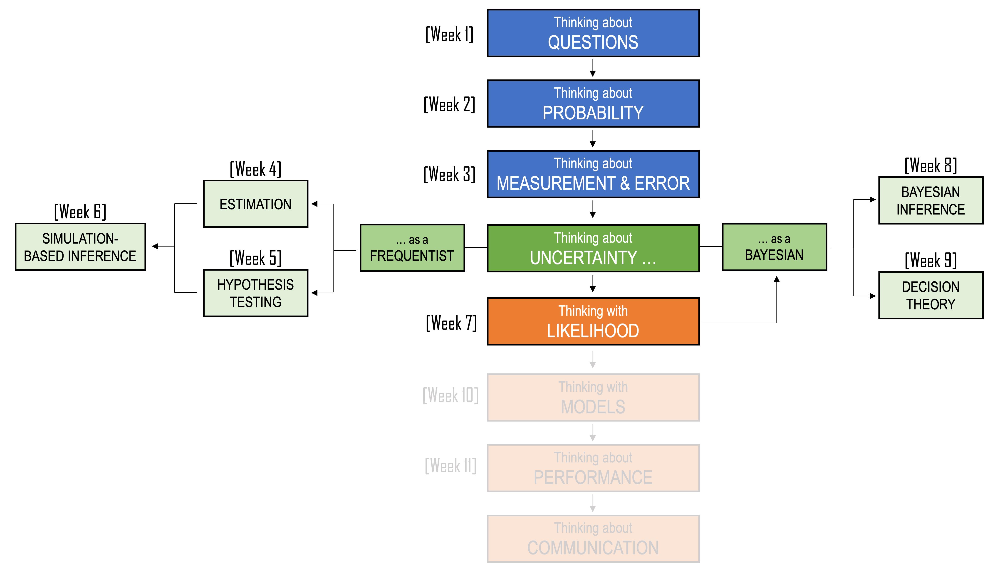

```{r, include=FALSE}
library(tidyverse)
library(gt)
library(scales)
library(patchwork)
library(webexercises)

set.seed(2420)
```

::: callout-note
## Learning Objectives

By the end of this chapter, you should be able to:

1.  Explain why simulation is useful in Bayesian inference.
2.  Describe posterior draws as simulated plausible values of an unknown parameter.
3.  Use posterior draws to calculate posterior means, medians, credible intervals, and posterior probabilities.
4.  Explain the difference between simulating repeated datasets and simulating from a posterior distribution.
5.  Use grid approximation to approximate a posterior distribution.
6.  Explain why grid approximation becomes difficult in larger models.
7.  Describe the basic idea of Markov chain Monte Carlo, especially the Metropolis algorithm.
8.  Use trace plots and posterior density plots to diagnose whether a simulated chain is behaving sensibly.
9.  Explain how different loss functions lead to different Bayesian point estimates.
10. Use posterior simulation to compare possible decisions under uncertainty.
:::

<center>
```{r, echo=FALSE}
#| classes: .enlarge-image

```
</center>

<br>

## Recap

So far, we have seen Bayesian examples where the posterior could be written down exactly. For example, when we combined a beta prior with binomial data, the posterior was also beta. This is called a **conjugate** model. As a reminder, this is one of the examples from the previous chapter:

::: callout-note

### Late night bus service

A simple example from the previous chapter was the late-night bus problem.

Suppose a local council is considering whether to introduce a late-night bus service. A survey of 40 residents asks whether they would use the service. In the survey, 26 people say yes.

Let:

$$
\begin{aligned}
p
&= \text{the proportion of residents who would use the service}
\end{aligned}
$$

The data are:

$$
\begin{aligned}
x &= 26 \\
n &= 40
\end{aligned}
$$

The likelihood comes from the binomial model:

$$
\begin{aligned}
X \mid p
&\sim \text{Binomial}(40,p)
\end{aligned}
$$

If we used maximum likelihood, the estimate would be the observed sample proportion:

$$
\begin{aligned}
\hat{p}
&= \frac{26}{40} \\
&= 0.65
\end{aligned}
$$

A Bayesian analysis asks for a posterior distribution for $p$. If we start with a uniform prior,

$$
\begin{aligned}
p
&\sim \text{Beta}(1,1),
\end{aligned}
$$

then beta-binomial conjugacy gives:

$$
\begin{aligned}
p \mid X = 26
&\sim \text{Beta}(1 + 26,\ 1 + 40 - 26) \\
&\sim \text{Beta}(27,15).
\end{aligned}
$$

```{r, echo=FALSE}
knitr::include_graphics("images/chapter8/beta.gif")
```

:::

In the above example, the prior and posterior were from the sample family, which makes the posterior easy to write down:

$$\begin{aligned}
\text{Beta prior} + \text{Binomial likelihood}
&\rightarrow \text{Beta posterior}
\end{aligned}$$

However, not every Bayesian model works this neatly. Sometimes the prior is easy to describe in words but does not combine with the likelihood to produce a simple named posterior distribution. This chapter will explore methods for dealing with such situations.

## A non-conjugate example

Suppose a student food delivery service claims that its average delivery time is about 25 minutes. In this example, we will estimate the average delivery time for this service.

$$\begin{aligned}
\text{Let } \mu
&= \text{the average delivery time in minutes}.
\end{aligned}$$

Our goal is to learn about $\mu$ using a small amount of data and some prior information. Suppose we collect delivery times for 12 recent orders:

```{r, echo=FALSE}
delivery_times <- c(18, 22, 25, 27, 29, 31, 24, 26, 30, 28, 35, 21)

delivery_df <- tibble(
  order = 1:length(delivery_times),
  delivery_time = delivery_times
)

delivery_df |> 
  gt() |> 
  cols_label(
    order = "Order",
    delivery_time = "Delivery time (mins)"
  )
```

Here, the sample mean is:

$$\begin{aligned}
\bar{x}
&= \text{the average delivery time in our sample} \\
&= 26.33
\end{aligned}$$

```{r, echo=FALSE}
x_bar <- mean(delivery_times)
n <- length(delivery_times)
sigma <- 6

```

For this example, we will assume that the population standard deviation is known: $\sigma = 6$. This keeps the example simple because we only need to estimate one unknown parameter: $\mu$. In real applications, we might also estimate $\sigma$. However, that would give us two unknown parameters instead of one.

### Plotting the raw data

Before building the model, it is useful to look at the observed delivery times.

```{r, warning=FALSE, message=FALSE, echo=FALSE}
mean_delivery <- mean(delivery_df$delivery_time)
ggplot(delivery_df, aes(x = order, y = delivery_time)) +
  geom_segment(
    aes(
      x = order,
      xend = order,
      y = mean_delivery,
      yend = delivery_time
    ),
    linetype = "dashed",
    alpha = 0.5
  ) +
  geom_point(size = 2) +
  geom_hline(
    yintercept = mean_delivery,
    linetype = "dashed"
  ) +
  labs(
    x = "Order number",
    y = "Delivery time in minutes"
  ) +
  theme_minimal()
```

The horizontal dashed line shows the sample mean. This is the average delivery time in the sample (26.33), but it is not necessarily the true average delivery time for all deliveries. Because we only observed 12 orders, there is still uncertainty about $\mu$. The vertical dashed lines represent the deviations from each observation to the sample mean.

### The likelihood

We now need to decide what statistical model to use for the data. The individual delivery times may not be perfectly normally distributed. Some deliveries may be unusually fast, and some may be unusually slow. However, when we take an average over several deliveries, the sample mean tends to behave more regularly. By the Central Limit Theorem, the sampling distribution of the sample mean is often approximately normal, especially when the sample size is not extremely small and the data are not wildly irregular.

For that reason, we will use a normal model for the sample mean.

$$\begin{aligned}
\bar{x} \mid \mu
&\sim N\left(\mu, \frac{\sigma^2}{n}\right)
\end{aligned}$$

This says that the sample mean $\bar{x}$ is likely to be close to the true mean $\mu$, but not exactly equal to it. As we have seen in previous chapters, the standard deviation of the sample mean is called the standard error:

$$\begin{aligned}
\text{standard error}
&= \frac{\sigma}{\sqrt{n}}
\end{aligned}$$

```{r, echo=FALSE, include=FALSE}
standard_error <- sigma / sqrt(n)
```

So our likelihood is:

$$\begin{aligned}
\bar{x} \mid \mu
&\sim N\left(\mu, \frac{6}{\sqrt{12}}\right)
\end{aligned}$$

Equivalently, we can write:

$$\begin{aligned}
\bar{x} \mid \mu
&\sim N\left(\mu, 1.73^2\right)
\end{aligned}$$

The likelihood asks:

> If a particular value of $\mu$ were true, how likely would it be to observe the sample mean we observed?

We can plot the likelihood over a range of possible values for $\mu$:

```{r, warning=FALSE, message=FALSE, echo=FALSE}
mu_grid <- seq(10, 60, length.out = 1000)

likelihood_df <- tibble(
  mu = mu_grid,
  likelihood = dnorm(x_bar, mean = mu, sd = standard_error)
)

ggplot(likelihood_df, aes(x = mu, y = likelihood)) +
  geom_line(linewidth = 1) +
  geom_vline(
    xintercept = x_bar,
    linetype = "dashed"
  ) +
  labs(
    x = expression(mu),
    y = "Likelihood"
  ) +
  theme_minimal()
```

The likelihood is highest near the sample mean. This makes sense: values of $\mu$ close to the observed sample mean make the data more likely.

### The prior

Now we need a prior for $\mu$. A normal prior would be mathematically convenient. However, suppose we want a prior that is easy to describe in plain language.

Suppose we **know** the following: (1) the earliest the food can be delivered is 10mins (factoring packing and driving time) and (2) cannot be more than 60 minutes, or else the customer doesn't have to pay. Therefore, before we see the data, we might have the following beliefs:

| Quantity | Value | Meaning |
|----------------------|---------------------------:|----------------------|
| Minimum plausible average | 10 minutes | It would be surprising if the true average were below this |
| Most plausible average | 25 minutes | This is the delivery service's claim |
| Maximum plausible average | 60 minutes | It would be surprising if the true average were above this |

This suggests a **triangular prior**. A triangular prior is defined using three values:

$$\begin{aligned}
a &= \text{minimum plausible value} \\
m &= \text{most plausible value} \\
b &= \text{maximum plausible value}.
\end{aligned}$$

For this example:

$$\begin{aligned}
a &= 10 \\
m &= 25 \\
b &= 60
\end{aligned}$$

The prior density increases from 10 to 25, then decreases from 25 to 60. Visually:

```{r, echo=FALSE}
triangular_density <- function(mu, a = 10, m = 25, b = 60) {
  case_when(
    mu < a ~ 0,
    mu >= a & mu <= m ~ 2 * (mu - a) / ((b - a) * (m - a)),
    mu > m & mu <= b ~ 2 * (b - mu) / ((b - a) * (b - m)),
    mu > b ~ 0
  )
}
```

```{r, warning=FALSE, message=FALSE, echo=FALSE}
prior_df <- tibble(
  mu = mu_grid,
  prior = triangular_density(mu)
)

ggplot(prior_df, aes(x = mu, y = prior)) +
  geom_line(linewidth = 1) +
  geom_vline(
    xintercept = 25,
    linetype = "dashed"
  ) +
  scale_x_continuous(
    limits = c(0,60),
    breaks = seq(0,60, 10)) +
  labs(
    x = expression(mu),
    y = "Prior density"
  ) +
  theme_minimal()
```

The prior peaks at 25 minutes. This means that before seeing the data, we thought values near 25 minutes were most plausible. Values near 10 or 60 minutes were possible, but less plausible.

::: callout-caution
### Why this is not a conjugate model

In the beta-binomial example, the prior and posterior were from the same family:

$$\begin{aligned}
\text{Beta prior} + \text{Binomial likelihood}
&\rightarrow \text{Beta posterior}
\end{aligned}$$

That made the posterior easy to write down.

Now, we have:

$$\begin{aligned}
\text{Triangular prior} + \text{Normal likelihood}
&\rightarrow \text{posterior}
\end{aligned}$$

The posterior exists, but it is not a standard distribution with a simple name. That means we cannot simply write something like:

$$\begin{aligned}
\mu \mid \bar{x}
&\sim \text{some known distribution}
\end{aligned}$$

Instead, we use the general Bayesian rule:

$$\begin{aligned}
p(\mu \mid \bar{x})
&\propto p(\bar{x} \mid \mu)p(\mu)
\end{aligned}$$

Or in words:

$$\begin{aligned}
\text{posterior}
&\propto \text{likelihood} \times \text{prior}
\end{aligned}$$

This is the target distribution we want to approximate.
:::

## Calculating the posterior on a grid

We now have two ingredients:

1.  a **prior**, which describes what values of $\mu$ seemed plausible before seeing the data
2.  a **likelihood**, which describes which values of $\mu$ are supported by the observed sample mean

The next step is to combine them to form a **posterior**.

Before using MCMC, we will do this in a more direct way using a **grid**. A grid is just a list of possible values. In this example, we make a long list of possible values for the true mean delivery time $\mu$. For each value of $\mu$ in the grid, we calculate:

- the prior density at that value
- the likelihood at that value
- the product of the prior and likelihood

This gives us an approximate posterior distribution. This is a simple method that works well here because we only have one unknown parameter, $\mu$. It is useful because it lets us see clearly what the posterior should look like before we move to a more general computational method.

First, we will create the grid of possible values for $\mu$. In this example, $\mu$ represents the true average delivery time. Since the delivery times are measured in minutes, we need to choose a reasonable range of possible values. Here, we will consider values of $\mu$ from 10 minutes to 60 minutes. The argument `length.out = 1000` means that R will create 1000 evenly spaced values between 10 and 60.

```{r}
mu_grid <- seq(10, 60, length.out = 1000)
```

Next, we calculate the width of each small interval in the grid. Because `mu_grid` is made up of evenly spaced values, the distance between the first value and the second value tells us the spacing for the whole grid. This value is small because we used 1000 grid points. We will use grid_width later when we convert densities into approximate probabilities. The idea is that each grid point represents a small interval of possible values for $\mu$. The width of that interval is approximately grid_width.

```{r}
grid_width <- mu_grid[2] - mu_grid[1]
```

Next, we can create the table that stores the prior, likelihood, and posterior calculations for each grid value. The column `mu` contains the grid values. The column `prior` gives the prior density at each value of $\mu$. The column `likelihood` gives the likelihood at each value of $\mu$. This tells us how plausible the observed sample mean would be if that grid value were the true mean. The column `unnormalised_posterior` multiplies the prior and likelihood together. This gives us the shape of the posterior distribution, but it is not yet scaled so that the total area under the curve equals 1.

```{r}
triangular_density <- function(mu, a = 10, m = 25, b = 60) {
  case_when(
    mu < a ~ 0,
    mu >= a & mu <= m ~ 2 * (mu - a) / ((b - a) * (m - a)),
    mu > m & mu <= b ~ 2 * (b - mu) / ((b - a) * (b - m)),
    mu > b ~ 0
  )
}

posterior_grid <- tibble(
  mu = mu_grid,
  prior = triangular_density(mu),
  likelihood = dnorm(x_bar, mean = mu, sd = standard_error),
  unnormalised_posterior = prior * likelihood
)
```

Next, we rescale the unnormalised posterior so that it becomes a proper posterior density. At the moment, `unnormalised_posterior` has the right shape, but the total area under it is not necessarily equal to 1. A probability density needs to have total area 1, so we need to rescale it. The final column, `posterior_probability,` gives the approximate posterior probability attached to each small interval in the grid. This is found by multiplying the posterior density by the grid width.

```{r}
posterior_grid <- posterior_grid |>
  mutate(
    posterior_density = unnormalised_posterior /
      sum(unnormalised_posterior * grid_width),
    posterior_probability = posterior_density * grid_width
  )
```

Let's now plot the posterior density:

```{r}
ggplot(posterior_grid, aes(x = mu, y = posterior_density)) +
  geom_line(linewidth = 1) +
  labs(
    x = expression(mu),
    y = "Posterior density"
  ) +
  theme_minimal()
```

#### Summarising the posterior

The posterior plot gives us the full shape of the posterior distribution. However, we often also want to summarise the posterior using a few numbers. Two useful summaries are:

- the **posterior mean**
- a **95% credible interval**

The posterior mean gives a single summary value for $\mu$. The 95% credible interval gives a range of plausible values for $\mu$ after combining the prior with the data. Because we calculated the posterior on a grid, we can calculate these summaries by adding up the posterior probabilities across the grid.

##### Posterior mean

The posterior mean is a weighted average of the possible values of $\mu$. Each grid value is weighted by its posterior probability. Values of $\mu$ with higher posterior probability contribute more to the posterior mean.

```{r}
posterior_mean <- posterior_grid |>
  summarise(
    posterior_mean = sum(mu * posterior_probability)
  )

posterior_mean
```

#### 95% credible interval

Next, we calculate a 95% credible interval. A 95% credible interval is an interval that contains 95% of the posterior probability. To calculate this from the grid, we first calculate the cumulative posterior probability. This tells us how much posterior probability has accumulated as we move from smaller to larger values of $\mu$.

```{r}
posterior_grid <- posterior_grid |>
  mutate(
    cumulative_probability = cumsum(posterior_probability)
  )
```

The lower endpoint of the interval is the value of $\mu$ where the cumulative probability first reaches 2.5%. The upper endpoint is the value of $\mu$ where the cumulative probability first reaches 97.5%.

```{r}
credible_interval <- posterior_grid |>
  summarise(
    lower = min(mu[cumulative_probability >= 0.025]),
    upper = min(mu[cumulative_probability >= 0.975])
  )

credible_interval
```

This interval is called an **equal-tailed credible interval** because it leaves 2.5% of the posterior probability in the lower tail and 2.5% in the upper tail.

In words, we can say:

> Based on the prior and the observed data, there is a 95% posterior probability that the true average delivery time $\mu$ lies between 23.0 minutes and 29.7 minutes.

## Markov Chain Monte Carlo (MCMC)

The grid method is useful because it makes the posterior calculation very explicit. We created many possible values of $\mu$, calculated the prior and likelihood at each value, multiplied them together, and then rescaled the result to get a posterior distribution. This works well in this example because we only have one unknown parameter: the true average delivery time $\mu$.

However, grid methods become difficult when models become more complicated. For example, suppose we had several unknown parameters instead of one. We might want to estimate:

- the true mean delivery time
- the standard deviation of delivery times
- the effect of day of the week
- the effect of distance
- the effect of order size

If we tried to create a grid for all of these unknown quantities at once, the number of combinations would grow very quickly.

::: callout-note
For example, suppose we used 1000 grid points for each unknown quantity. With one unknown parameter, we need:

$$1000 \text{ grid points}$$

With two unknown parameters, we need:

$$1000 \times 1000 = 1{,}000{,}000 \text{ grid combinations}$$

With five unknown parameters, we need:

$$1000^5 = 1{,}000{,}000{,}000{,}000{,}000 \text{ grid combinations}$$

So the problem grows very quickly. This is sometimes called the **curse of dimensionality**. Even though a grid is easy to understand, it becomes impractical once we have several unknown parameters.
:::

### Understanding MCMC in three parts

The phrase **Markov Chain Monte Carlo** can sound intimidating, but the name contains the three ideas we need. Note: the **Metropolis-Hasting** part is popular method

| Part | Meaning | In this example |
|------------------------|------------------------|------------------------|
| Monte Carlo | Use random simulation | Draw possible values of $\mu$ |
| Markov chain | Each step depends on the current value | Propose the next $\mu$ near the current $\mu$ |
| MCMC Algorithm | Decide whether to accept or reject a proposal | Use an algorithm such as Metropolis–Hastings, Gibbs sampling, or Hamiltonian Monte Carlo to decide how the chain moves |

#### Part 1: Monte Carlo

The **Monte Carlo** part simply means that we use random simulation. Instead of calculating everything exactly, we generate random values and use them to approximate a distribution. In this example, a simulated value such as:

$$\begin{aligned}
\mu &= 28.4
\end{aligned}$$

means that one possible value of the true average delivery time is 28.4 minutes.

```{=html}
<iframe src="interactive/mcmc1.html" width="100%" height="470px" style="border: none;"></iframe>
```

The app above is not doing Bayesian inference yet. It is only showing the simulation idea. We generate possible values, then use those simulated values to learn about a distribution.

#### Part 2: Markov chain

The **Markov chain** part means that the next value depends on the current value. Suppose the current value is $\mu_{t-1}$. A simple way to propose the next value is:

$$\begin{aligned}
\mu^\star
&\sim N(\mu_{t-1}, s^2)
\end{aligned}$$

where $s$ controls how large the proposed jumps tend to be.

For example, if the current value is 26 minutes, the next proposal might be 27.1 minutes or 24.8 minutes. It is usually nearby, because the proposal distribution is centred on the current value.

```{=html}
<iframe src="interactive/mcmc2.html" width="100%" height="490px" style="border: none;"></iframe>
```

Notice in the app above that the chain can wander randomly, moving quite far away from the proposed distribution. This is sometimes refered to as a random walk.

#### Part 3: Movement Algorithm

We do not want to wander randomly forever. We want the chain to spend more time in values of $\mu$ with high posterior density and less time in values with low posterior density.

There are many different MCMC algorithms that we can use to decide how the chain moves. In this example we will learn about the **Metropolis-Hastings** method.

At each step we compare:

- the posterior target at the proposed value, $\mu^\star$
- the posterior target at the current value, $\mu_{t-1}$

The ratio is:

$$\begin{aligned}
r
&= \frac{p(\bar{x} \mid \mu^\star)p(\mu^\star)}
        {p(\bar{x} \mid \mu_{t-1})p(\mu_{t-1})}
\end{aligned}$$

Then the acceptance probability is:

$$\begin{aligned}
\alpha
&= \min(1,r)
\end{aligned}$$

This gives the following rule:

| Situation | Meaning | Decision |
|------------------------|------------------------|------------------------|
| $r > 1$ | The proposed value has higher posterior support | Accept it |
| $r < 1$ | The proposed value has lower posterior support | Accept it with probability $r$ |
| Proposal rejected | The proposed value is not stored | Store the current value again |

This last point is important. If a proposal is rejected, the chain does not disappear. It records the previous value again.

```{=html}
<iframe src="interactive/mcmc3.html" width="100%" height="700px" style="border: none;"></iframe>
```


### Writing the posterior target in R

To run the algorithm, we first need a function for the unnormalised posterior. This is the target distribution for MCMC.

$$\begin{aligned}
p(\mu \mid \bar{x})
&\propto p(\bar{x} \mid \mu)p(\mu)
\end{aligned}$$

In R, this is:

```{r}
posterior_target <- function(mu) {
  prior <- triangular_density(mu)
  likelihood <- dnorm(x_bar, mean = mu, sd = standard_error)
  prior * likelihood
}
```

This function gives the prior times the likelihood. It does not calculate the normalising constant. That is okay because the normalising constant cancels out in the Metropolis-Hastings ratio.

### Running the Metropolis-Hastings algorithm

Now we can write the algorithm.

```{r}
set.seed(123)

n_iter <- 10000
proposal_sd <- 2

mu_chain <- numeric(n_iter)
mu_chain[1] <- 25

accepted <- logical(n_iter)

for (t in 2:n_iter) {
  
  current_mu <- mu_chain[t - 1]
  
  proposed_mu <- rnorm(
    n = 1,
    mean = current_mu,
    sd = proposal_sd
  )
  
  current_density <- posterior_target(current_mu)
  proposed_density <- posterior_target(proposed_mu)
  
  r <- proposed_density / current_density
  alpha <- min(1, r)
  
  u <- runif(1)
  
  if (u < alpha) {
    mu_chain[t] <- proposed_mu
    accepted[t] <- TRUE
  } else {
    mu_chain[t] <- current_mu
    accepted[t] <- FALSE
  }
}

mcmc_df <- tibble(
  iteration = 1:n_iter,
  mu = mu_chain,
  accepted = accepted
)
```

The object `mu_chain` contains the MCMC sample. Each value is one possible value of $\mu$.

### Looking at the first few iterations

It is useful to inspect the first few values in the chain.

```{r}
mcmc_df |>
  slice(1:10) |>
  gt() |>
  cols_label(
    iteration = "Iteration",
    mu = "Value of mu",
    accepted = "Accepted?"
  ) |>
  fmt_number(
    columns = mu,
    decimals = 2
  ) |>
  cols_align(
    align = "center",
    columns = everything()
  )
```

Some values may repeat. This happens when a proposal is rejected and the previous value is stored again.

### Acceptance rate

The **acceptance rate** is the proportion of proposed moves that were accepted.

```{r}
acceptance_rate <- mean(accepted[-1])
acceptance_rate
```

If the acceptance rate is very low, the proposal jumps may be too large. The chain proposes values far away from the current value, and many of them are rejected.

If the acceptance rate is very high, the proposal jumps may be too small. The chain accepts most proposals, but it may move around the posterior very slowly.

For this example, we are using MCMC for teaching, so we do not need to tune the proposal perfectly.

### Trace plot

A **trace plot** shows the value of $\mu$ at each iteration.

```{r, warning=FALSE, message=FALSE}
ggplot(mcmc_df, aes(x = iteration, y = mu)) +
  geom_line(linewidth = 0.35, alpha = 0.8) +
  labs(
    x = "Iteration",
    y = expression(mu)
  ) +
  theme_minimal()
```

The trace should move around the high posterior region. It should not drift endlessly upward or downward, and it should not get stuck at one value for a long time.

### Burn-in

The beginning of the chain can be influenced by the starting value. It is common to discard some early draws. This is called **burn-in**.

```{r}
burn_in <- 1000

mcmc_post_burn <- mcmc_df |>
  filter(iteration > burn_in)
```

::: callout-note
### What is burn-in?

Burn-in is the early part of the chain that we remove before summarising the posterior.

The idea is that the chain may need some time to move from its starting value into the main region of the posterior distribution.
:::

### MCMC posterior draws

After removing burn-in, we can plot the remaining MCMC draws.

```{r, warning=FALSE, message=FALSE}
ggplot(mcmc_post_burn, aes(x = mu)) +
  geom_histogram(
    aes(y = after_stat(density)),
    bins = 40,
    fill = "grey80",
    color = "white"
  ) +
  labs(
    x = expression(mu),
    y = "Density"
  ) +
  theme_minimal()
```

This histogram is an approximation to the posterior distribution. The tallest part of the histogram shows the most plausible values of the average delivery time after combining the prior and the data.

### Comparing MCMC with the grid posterior

Because this example has only one unknown parameter, we can compare the MCMC result to the grid approximation from earlier.

```{r, warning=FALSE, message=FALSE}
ggplot() +
  geom_histogram(
    data = mcmc_post_burn,
    aes(x = mu, y = after_stat(density)),
    bins = 40,
    fill = "grey80",
    color = "white"
  ) +
  geom_line(
    data = posterior_grid,
    aes(x = mu, y = posterior_density),
    linewidth = 1,
    color = "purple"
  ) +
  labs(
    x = expression(mu),
    y = "Posterior density"
  ) +
  theme_minimal()
```

The grey histogram comes from MCMC. The purple curve comes from the grid approximation. If the algorithm is working well, the histogram should roughly follow the purple curve.

This comparison is useful because the grid result acts like an answer key. In more complicated models, we may not have such a simple grid approximation available.

### Summarising the MCMC posterior

Once we have posterior draws, we can summarise them just like any other simulated distribution.

```{r}
mcmc_summary <- mcmc_post_burn |>
  summarise(
    posterior_mean = mean(mu),
    posterior_median = median(mu),
    lower_95 = quantile(mu, 0.025),
    upper_95 = quantile(mu, 0.975)
  )

mcmc_summary |>
  gt() |>
  cols_label(
    posterior_mean = "Posterior mean",
    posterior_median = "Posterior median",
    lower_95 = "Lower 95%",
    upper_95 = "Upper 95%"
  ) |>
  fmt_number(
    columns = everything(),
    decimals = 2
  ) |>
  cols_align(
    align = "center",
    columns = everything()
  )
```

The posterior mean gives a single-number estimate of the average delivery time. The 95% credible interval gives a range of plausible values for $\mu$ after combining the prior with the data.

### A posterior probability statement

One advantage of Bayesian inference is that we can answer probability questions directly.

For example, suppose the delivery service wants to know whether the true average delivery time is likely to be under 30 minutes.

We want:

$$\begin{aligned}
P(\mu < 30 \mid \bar{x})
\end{aligned}$$

Using MCMC, this is just the proportion of posterior draws below 30.

```{r}
mcmc_post_burn |>
  summarise(
    probability_under_30 = mean(mu < 30)
  ) |>
  gt() |>
  cols_label(
    probability_under_30 = "Posterior probability that mu is below 30"
  ) |>
  fmt_number(
    columns = probability_under_30,
    decimals = 3
  ) |>
  cols_align(
    align = "center",
    columns = everything()
  )
```

We can show this visually by adding a vertical line at 30 minutes.

```{r, warning=FALSE, message=FALSE}
ggplot(mcmc_post_burn, aes(x = mu)) +
  geom_histogram(
    aes(y = after_stat(density)),
    bins = 40,
    fill = "grey80",
    color = "white"
  ) +
  geom_vline(
    xintercept = 30,
    linetype = "dashed"
  ) +
  labs(
    x = expression(mu),
    y = "Density"
  ) +
  theme_minimal()
```

The area to the left of 30 represents the posterior probability that the true average delivery time is below 30 minutes.

## Using the posterior to make decisions

So far, we have used MCMC to approximate the posterior distribution for the true average delivery time, $\mu$. The posterior tells us which values of $\mu$ are plausible after combining the prior with the data.

However, in many real problems, estimating the posterior is not the final step. We often want to use the posterior to make a decision.

For example, suppose the delivery company wants to decide whether it should advertise the following claim:

> Average delivery time is under 30 minutes.

This is now a decision problem. The posterior distribution can tell us how likely the claim is to be true, but the final decision also depends on the consequences of being wrong.

### The decision problem

There are two possible actions:

| Action | Meaning |
|------------------------------------|------------------------------------|
| Advertise | The company advertises that the average delivery time is under 30 minutes |
| Do not advertise | The company does not make this advertising claim |

There are also two possible true situations:

| True situation | Meaning                                                |
|----------------|--------------------------------------------------------|
| $\mu < 30$     | The true average delivery time is under 30 minutes     |
| $\mu \geq 30$  | The true average delivery time is 30 minutes or higher |

### Loss functions

A **loss function** assigns a cost to each combination of an action and a true situation. The loss does not come from the statistical model. It represents the consequences of different decisions. In this example, we will use simple unitless loss points.

Suppose the company uses the following loss function:

| Action           | If $\mu < 30$ | If $\mu \geq 30$ |
|------------------|--------------:|-----------------:|
| Advertise        |             0 |               10 |
| Do not advertise |             2 |                0 |

This table says:

- if the company advertises and the claim is true, there is no loss;
- if the company advertises and the claim is false, the loss is 10;
- if the company does not advertise and the claim is true, the loss is 2;
- if the company does not advertise and the claim is false, there is no loss.

The numbers are not minutes, dollars, or probabilities. They are **unitless loss points**. They encode the relative seriousness of the possible mistakes. In this loss function, advertising a false claim has loss 10, while missing a true advertising opportunity has loss 2. So the false advertising mistake is treated as five times worse than the missed opportunity.

$$\begin{aligned}
\frac{10}{2}
&= 5 \text{ times worse}
\end{aligned}$$

::: callout-tip
## Where do the loss numbers come from?

The loss numbers are chosen by the decision maker. They reflect judgement about the consequences of each outcome. In a real business setting, these losses could be based on dollars. For example, false advertising might lead to refunds, complaints, reputational damage, or legal risk. Missing an advertising opportunity might lead to lower sales.
:::

### Expected loss

A decision should account for both:

1.  how likely each situation is; and
2.  how costly each outcome would be.

This is done using **expected loss**. The expected loss of an action is the average loss we would expect if we repeated the decision many times under the posterior probabilities.

Suppose we used MCMC and found:

```{r, warning=FALSE, message=FALSE, echo=FALSE}
# Calculate posterior probabilities from the MCMC draws
p_under_30 <- mean(mcmc_post_burn$mu < 30)
p_30_or_higher <- mean(mcmc_post_burn$mu >= 30)

# Create a smoother density estimate from the MCMC draws
density_estimate <- density(
  mcmc_post_burn$mu,
  adjust = 1.8,
  n = 2048
)

density_df <- tibble(
  mu = density_estimate$x,
  density = density_estimate$y,
  situation = if_else(
    mu < 30,
    "Average under 30 minutes",
    "Average 30 minutes or higher"
  )
)

max_density <- max(density_df$density)

ggplot(density_df, aes(x = mu, y = density)) +
  geom_area(
    aes(fill = situation),
    alpha = 0.6
  ) +
  geom_line(linewidth = 1) +
  geom_vline(
    xintercept = 30,
    linetype = "dashed",
    linewidth = 1
  ) +
  annotate(
    "text",
    x = 22,
    y = max_density * 0.90,
    label = "P(mu < 30 ~ '|' ~ data)",
    parse = TRUE,
    hjust = 0,
    size = 4
  ) +
  annotate(
    "segment",
    x = 23.5,
    xend = 26,
    y = max_density * 0.84,
    yend = max_density * 0.55,
    arrow = arrow(length = unit(0.18, "cm"))
  ) +
  annotate(
  "text",
  x = 30.6,
  y = max_density * 0.42,
  label = "P(mu >= 30 ~ '|' ~ data)",
  parse = TRUE,
  hjust = 0,
  size = 4
) +
  annotate(
    "segment",
    x = 31.2,
    xend = 30.7,
    y = max_density * 0.36,
    yend = max_density * 0.08,
    arrow = arrow(length = unit(0.18, "cm"))
  ) +
  scale_fill_manual(
    values = c(
      "Average under 30 minutes" = "turquoise3",
      "Average 30 minutes or higher" = "salmon"
    )
  ) +
  labs(
    x = expression(mu),
    y = "Posterior density",
    fill = NULL
  ) +
  theme_minimal() +
  theme(legend.position = "none")
```

```{r, warning=FALSE, message=FALSE, echo=FALSE, include=FALSE}
mcmc_decision_df <- mcmc_post_burn |>
  mutate(
    situation = if_else(
      mu < 30,
      "Average under 30 minutes",
      "Average 30 minutes or higher"
    )
  )

posterior_decision_probs <- mcmc_decision_df |>
  summarise(
    p_under_30 = mean(mu < 30),
    p_30_or_higher = mean(mu >= 30)
  )

posterior_decision_probs
```

$$\begin{aligned}
P(\mu < 30 \mid \text{data})
&\approx \frac{\text{number of posterior draws below 30}}{\text{total number of posterior draws}} \approx 0.93
\end{aligned}$$

$$\begin{aligned}
P(\mu \geq 30 \mid \text{data})
&\approx \frac{\text{number of posterior draws at or above 30}}{\text{total number of posterior draws}} \approx 0.07
\end{aligned}$$

#### Expected loss of advertising

If the company advertises, there is no loss if the claim is true, but there is loss 10 if the claim is false.

$$\begin{aligned}
E[\text{loss from advertising}]
&= 0 \times P(\mu < 30 \mid \text{data})
   + 10 \times P(\mu \geq 30 \mid \text{data}) \\
&= 0 \times 0.93 + 10 \times 0.07 \\
&= 0 + 0.70 \\
&= 0.70
\end{aligned}$$

#### Expected loss of not advertising

If the company does not advertise, there is loss 2 if the claim would have been true, because the company missed an advertising opportunity. There is no loss if the claim would have been false.

$$\begin{aligned}
E[\text{loss from not advertising}]
&= 2 \times P(\mu < 30 \mid \text{data})
   + 0 \times P(\mu \geq 30 \mid \text{data}) \\
&= 2 \times 0.93 + 0 \times 0.07 \\
&= 1.86 + 0 \\
&= 1.86
\end{aligned}$$

Since advertising has the lower expected loss (0.70 \< 1.86), the decision with the lower expected loss is to advertise.

### Different losses can lead to different decisions

The same posterior can lead to different decisions if the loss function changes. For example, suppose the company becomes more cautious. It now treats false advertising as much more serious. Instead of assigning loss 10 to false advertising, it assigns loss 30.

The new loss function is:

| Action           | If $\mu < 30$ | If $\mu \geq 30$ |
|------------------|--------------:|-----------------:|
| Advertise        |             0 |               30 |
| Do not advertise |             2 |                0 |

Now the expected loss of advertising becomes:

$$\begin{aligned}
E[\text{loss from advertising}]
&= 0 \times P(\mu < 30 \mid \text{data})
   + 30 \times P(\mu \geq 30 \mid \text{data}) \\
&= 0 \times 0.93 + 30 \times 0.07 \\
&= 2.10
\end{aligned}$$

The expected loss of not advertising remains:

$$\begin{aligned}
E[\text{loss from not advertising}]
&= 2 \times P(\mu < 30 \mid \text{data})
   + 0 \times P(\mu \geq 30 \mid \text{data}) \\
&= 2 \times 0.93 + 0 \times 0.07 \\
&= 1.86
\end{aligned}$$

Now the expected loss of not advertising is lower. So a more cautious company may decide not to advertise, even with the same posterior distribution.

```{r}
expected_loss_sensitivity_df <- tibble(
  false_advertising_loss = c(10, 30),
  expected_loss_advertise = false_advertising_loss * p_30_or_higher,
  expected_loss_not_advertise = 2 * p_under_30
) |>
  pivot_longer(
    cols = c(expected_loss_advertise, expected_loss_not_advertise),
    names_to = "action",
    values_to = "expected_loss"
  ) |>
  mutate(
    action = recode(
      action,
      expected_loss_advertise = "Advertise",
      expected_loss_not_advertise = "Do not advertise"
    )
  )

expected_loss_sensitivity_df
```

```{r, warning=FALSE, message=FALSE}
ggplot(
  expected_loss_sensitivity_df,
  aes(x = factor(false_advertising_loss), y = expected_loss, fill = action)
) +
  geom_col(position = "dodge", width = 0.65, alpha = 0.8) +
  labs(
    x = "Loss from false advertising",
    y = "Expected loss",
    fill = NULL
  ) +
  theme_minimal()
```

This shows an important lesson: the posterior distribution does not make the decision by itself. The posterior tells us what is uncertain. The loss function tells us what matters.

### A threshold view of the decision

In this example, the decision depends on whether the posterior probability of being under 30 minutes is large enough.

Let:

$$\begin{aligned}
p &= P(\mu < 30 \mid \text{data}).
\end{aligned}$$

Then:

$$\begin{aligned}
P(\mu \geq 30 \mid \text{data}) &= 1 - p.
\end{aligned}$$

Using the original loss function, the expected loss of advertising is:

$$\begin{aligned}
E[\text{loss from advertising}]
&= 10(1-p).
\end{aligned}$$

The expected loss of not advertising is:

$$\begin{aligned}
E[\text{loss from not advertising}]
&= 2p.
\end{aligned}$$

We should advertise when:

$$\begin{aligned}
10(1-p) &< 2p \\
10 - 10p &< 2p \\
10 &< 12p \\
\frac{10}{12} &< p \\
p &> 0.833.
\end{aligned}$$

So under this loss function, the company should advertise only if the posterior probability that $\mu < 30$ is greater than about 83.3%.

::: callout-note
## Why this threshold matters

The threshold is not always 50%.

If the cost of a false claim is much larger than the cost of a missed opportunity, then we need stronger posterior evidence before advertising.
:::

We can plot the two expected-loss curves as a function of $p$.

```{r, warning=FALSE, message=FALSE}
threshold_df <- tibble(
  p = seq(0, 1, length.out = 1000),
  expected_loss_advertise = 10 * (1 - p),
  expected_loss_not_advertise = 2 * p
) |>
  pivot_longer(
    cols = c(expected_loss_advertise, expected_loss_not_advertise),
    names_to = "action",
    values_to = "expected_loss"
  ) |>
  mutate(
    action = recode(
      action,
      expected_loss_advertise = "Advertise",
      expected_loss_not_advertise = "Do not advertise"
    )
  )

threshold_value <- 10 / 12

ggplot(threshold_df, aes(x = p, y = expected_loss, color = action)) +
  geom_line(linewidth = 1) +
  geom_vline(
    xintercept = threshold_value,
    linetype = "dashed"
  ) +
  scale_x_continuous(labels = scales::percent_format()) +
  labs(
    x = expression(P(mu < 30 ~ "|" ~ data)),
    y = "Expected loss",
    color = NULL
  ) +
  theme_minimal()
```

To the left of the dashed line, not advertising has lower expected loss. To the right of the dashed line, advertising has lower expected loss.

## Bayesian simulation as a workflow

The examples in this chapter all follow a similar pattern.

```{r}
#| echo: false
#| message: false
#| warning: false

workflow_table <- tibble(
  Step = 1:7,
  `Bayesian workflow` = c(
    "State the question clearly",
    "Choose a probability model for the data",
    "Choose a prior distribution",
    "Combine prior and likelihood to define the posterior",
    "Simulate from the posterior",
    "Summarise posterior and predictive uncertainty",
    "Use the posterior to inform decisions"
  ),
  `Bus example` = c(
    "Would enough students use the late-night bus?",
    "Survey yes-count follows a binomial distribution",
    "Use a beta prior for the unknown proportion",
    "Posterior is proportional to prior times likelihood",
    "Draw plausible values of theta",
    "Calculate credible intervals and P(theta > 0.60)",
    "Compare the net value of running or not running the service"
  )
)

workflow_table |>
  gt() |>
  tab_options(table.width = pct(100))
```

The main conceptual shift is this:

> We do not need to reduce the posterior to one number too quickly.

A posterior distribution can be carried through the analysis. We can transform posterior draws, use them to predict future observations, and compare decisions.

## Exercises

Short questions and longer applied questions are included below. Some questions ask for calculations; others ask you to explain concepts in words.

:::: callout-note
## Question 1

A small survey asks $30$ students whether they would use a new weekend study shuttle. Of the $30$ students, $18$ say yes.

Assume:

$$\begin{aligned}
X \mid \theta
&\sim \text{Binomial}(30, \theta), \\
\theta
&\sim \text{Beta}(3, 3).
\end{aligned}$$

1.  Find the posterior distribution for $\theta$.
2.  Calculate the posterior mean.
3.  Interpret the posterior mean in context.

::: {.callout-important collapse="true"}
## Click for Solutions

The posterior is:

$$\begin{aligned}
\theta \mid X = 18
&\sim \text{Beta}(3 + 18,\ 3 + 30 - 18) \\
&\sim \text{Beta}(21,\ 15).
\end{aligned}$$

The posterior mean is:

$$\begin{aligned}
E(\theta \mid X = 18)
&= \frac{21}{21 + 15} \\
&= \frac{21}{36} \\
&= 0.583.
\end{aligned}$$

After combining the prior and the survey data, the estimated proportion of students who would use the weekend shuttle is about $0.583$, or $58.3\%$.
:::
::::

:::: callout-note
## Question 2

Explain the difference between a bootstrap distribution and a Bayesian posterior distribution.

In your answer, describe what is being simulated in each case.

::: {.callout-important collapse="true"}
## Click for Solutions

A bootstrap distribution is created by resampling from the observed data. It describes how a statistic might vary across repeated samples similar to the one observed.

A Bayesian posterior distribution describes uncertainty about an unknown parameter after combining prior information with the likelihood from the observed data.

In the bootstrap, we simulate possible datasets or statistics. In Bayesian posterior simulation, we simulate plausible parameter values.
:::
::::

:::: callout-note
## Question 3

Suppose you have $5000$ posterior draws for a parameter $\theta$. Of these draws, $3920$ are greater than $0.7$.

Estimate:

$$P(\theta > 0.7 \mid \text{data}).$$

Interpret the result.

::: {.callout-important collapse="true"}
## Click for Solutions

The simulation estimate is:

$$\begin{aligned}
P(\theta > 0.7 \mid \text{data})
&\approx \frac{3920}{5000} \\
&= 0.784.
\end{aligned}$$

The interpretation is that, given the prior and the observed data, the posterior probability that $\theta$ is greater than $0.7$ is approximately $0.784$.
:::
::::

:::: callout-note
## Question 4

A researcher uses grid approximation for a proportion $\theta$. They create the following unnormalised posterior weights:

```{r}
#| echo: false
#| message: false
#| warning: false

q4_grid <- tibble(
  theta = c(0.1, 0.2, 0.3, 0.4, 0.5),
  unnormalised_weight = c(0.02, 0.10, 0.24, 0.12, 0.02)
)

q4_grid |>
  gt() |>
  tab_options(table.width = pct(60))
```

1.  Normalise the weights.
2.  Which value of $\theta$ has the highest posterior weight?
3.  Estimate the posterior mean using this grid.

::: {.callout-important collapse="true"}
## Click for Solutions

The sum of the unnormalised weights is:

$$\begin{aligned}
0.02 + 0.10 + 0.24 + 0.12 + 0.02
&= 0.50.
\end{aligned}$$

The normalised weights are:

```{r}
#| echo: false
#| message: false
#| warning: false

q4_grid |>
  mutate(posterior_weight = unnormalised_weight / sum(unnormalised_weight)) |>
  gt() |>
  tab_options(table.width = pct(70))
```

The highest posterior weight is at $\theta = 0.3$.

The posterior mean estimate is:

$$\begin{aligned}
E(\theta \mid \text{data})
&\approx 0.1(0.04) + 0.2(0.20) + 0.3(0.48) + 0.4(0.24) + 0.5(0.04) \\
&= 0.004 + 0.040 + 0.144 + 0.096 + 0.020 \\
&= 0.304.
\end{aligned}$$
:::
::::

:::: callout-note
## Question 5

A Metropolis chain is used to simulate from a posterior distribution. The trace plot shows that the chain stays at exactly the same value for long periods, with only occasional jumps.

What might be going wrong? What could be adjusted?

::: {.callout-important collapse="true"}
## Click for Solutions

The proposal steps may be too large. If proposed values are usually in low-posterior regions, they will often be rejected, causing the chain to remain at the same value for long stretches.

One possible adjustment is to reduce the proposal standard deviation so the chain proposes smaller, more acceptable moves.

However, proposal steps that are too small can also be a problem because the chain may move too slowly. The goal is to find a proposal size that allows the chain to explore the posterior without being rejected too often.
:::
::::

:::: callout-note
## Question 6

A clinic records the number of urgent phone calls received over $10$ evenings:

$$14,\ 17,\ 15,\ 19,\ 18,\ 16,\ 20,\ 13,\ 17,\ 18.$$

Assume:

$$\begin{aligned}
X_i \mid \lambda
&\sim \text{Poisson}(\lambda), \\
\lambda
&\sim \text{Gamma}(12, 1),
\end{aligned}$$

using the shape-rate parameterisation.

1.  Find the posterior distribution for $\lambda$.
2.  Calculate the posterior mean.
3.  Interpret the result.

::: {.callout-important collapse="true"}
## Click for Solutions

The total number of calls is:

$$\begin{aligned}
14 + 17 + 15 + 19 + 18 + 16 + 20 + 13 + 17 + 18
&= 167.
\end{aligned}$$

There are $n = 10$ evenings.

For a gamma prior and Poisson likelihood:

$$\begin{aligned}
\lambda \mid x_1, \ldots, x_n
&\sim \text{Gamma}\left(\alpha + \sum_{i = 1}^{n}x_i,\ \beta + n\right).
\end{aligned}$$

Therefore:

$$\begin{aligned}
\lambda \mid \text{data}
&\sim \text{Gamma}(12 + 167,\ 1 + 10) \\
&\sim \text{Gamma}(179,\ 11).
\end{aligned}$$

The posterior mean is:

$$\begin{aligned}
E(\lambda \mid \text{data})
&= \frac{179}{11} \\
&= 16.27.
\end{aligned}$$

After combining the prior with the observed call counts, the estimated average number of urgent calls per evening is about $16.27$.
:::
::::

:::: callout-note
## Question 7

Under squared-error loss, what posterior summary is used as the Bayes estimator?

Under absolute-error loss, what posterior summary is used as the Bayes estimator?

::: {.callout-important collapse="true"}
## Click for Solutions

Under squared-error loss, the Bayes estimator is the posterior mean.

Under absolute-error loss, the Bayes estimator is the posterior median.

This shows that the best point estimate depends on how we define loss.
:::
::::

:::: callout-note
## Question 8

A council is deciding whether to run a weekend community shuttle.

Posterior predictive simulation gives $8000$ draws of the number of weekly users. For each draw, the council calculates the net value of running the service. The results are:

- mean net value: $\$4200$;
- median net value: $\$3900$;
- proportion of draws with net value above $0$: $0.87$;
- proportion of draws with net value below $-5000$: $0.04$.

Write a short paragraph explaining what these results suggest.

::: {.callout-important collapse="true"}
## Click for Solutions

The posterior predictive simulation suggests that running the shuttle is likely to have positive net value. The mean net value is $\$4200$ and the median is $\$3900$, so the typical simulated outcome is favourable. About $87\%$ of simulated outcomes have net value above zero, meaning the service is more likely than not to be beneficial under the assumptions of the model. There is still some downside risk, with about $4\%$ of simulations producing a loss worse than $\$5000$. A reasonable conclusion is that the shuttle looks promising, but the decision should also consider whether the council is comfortable with the remaining downside risk and whether the cost and value assumptions are credible.
:::
::::

:::: callout-note
## Question 9

A posterior distribution is highly skewed to the right.

Would you expect the posterior mean and posterior median to be identical? Which one would usually be larger?

::: {.callout-important collapse="true"}
## Click for Solutions

They would usually not be identical.

For a distribution skewed to the right, the long right tail pulls the mean upward. Therefore, the posterior mean would usually be larger than the posterior median.
:::
::::

:::: callout-note
## Question 10

A student says:

> MCMC is just a complicated version of the bootstrap.

Explain why this statement is misleading.

::: {.callout-important collapse="true"}
## Click for Solutions

The statement is misleading because MCMC and the bootstrap simulate different things for different purposes.

The bootstrap resamples from the observed data to approximate the sampling distribution of a statistic. It is usually used to understand how a statistic might vary across repeated samples.

MCMC constructs a dependent sequence of parameter values whose long-run distribution approximates a posterior distribution. It is used in Bayesian inference when the posterior is difficult to sample from directly.

Both involve simulation, but they are not the same method and they answer different questions.
:::
::::
