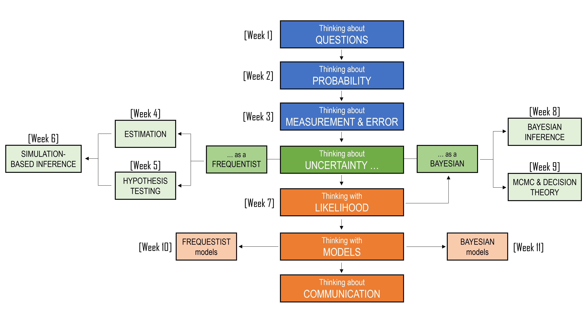

## Preface {.unnumbered}

Statistics begins with a simple problem: the world is messy, and we rarely get to see the whole picture. We measure things imperfectly. We work with samples instead of populations. We make decisions with incomplete information. We try to find patterns in data that are noisy, uncertain, and sometimes misleading. This is what makes statistics both difficult and useful.

This unit is about learning how to reason in that uncertainty. ETC2420 / ETC5242 begins with the foundations of statistical thinking: how we measure the world, how samples differ from populations, and how estimates can vary from one dataset to another. From there, we build toward the central ideas of inference: using data to learn about something we cannot observe directly. Along the way, we study confidence intervals, hypothesis tests, simulation, resampling, regression, likelihood, and Bayesian methods. Some of these ideas may feel familiar. Others may feel new. But the aim is the same throughout: to understand how statistical methods help us move from data to evidence, and from evidence to careful conclusions.

<center>

```{r, echo=FALSE}
#| classes: .enlarge-image

```

</center>

By the end of the unit, you should be more confident not only in doing statistical analysis, but in explaining what it means. You should be able to recognise uncertainty, communicate it clearly, and use statistical models thoughtfully. 

ETC2420/5242 has evolved over many years with input from hundreds of students and teaching staff. Their curiosity, feedback, and creativity have shaped the examples, visuals, and teaching strategies in these pages. My hope is that this book helps you develop that habit of mind: curious, careful, sceptical, and evidence-based.
